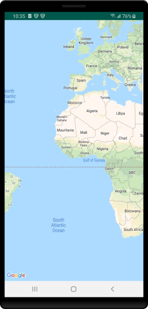
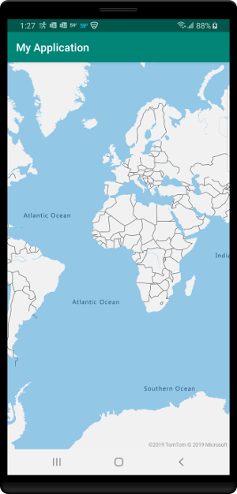
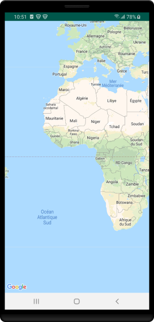
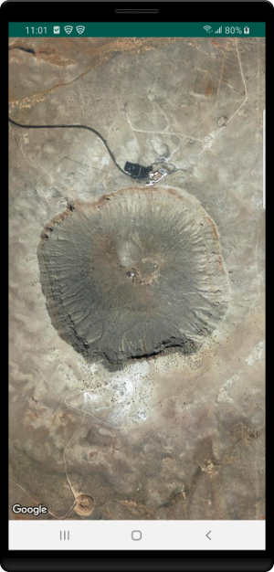
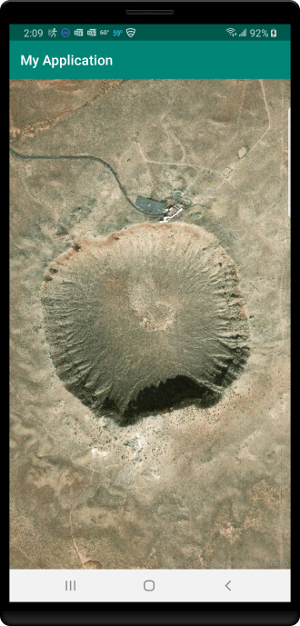
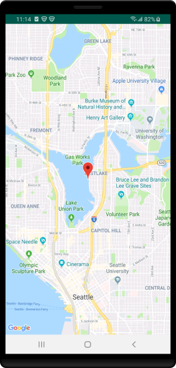
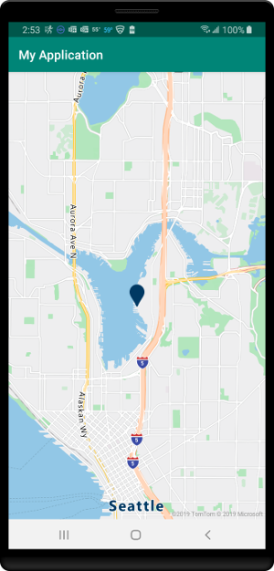
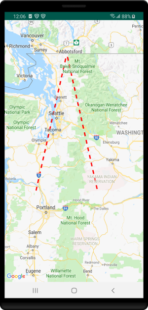
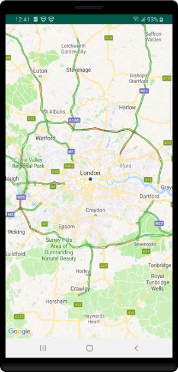

# Tutorial - Migrate an Android app from Google Maps

The Azure Maps Android SDK has an API interface that is similar to the Web SDK. If you've developed with one of these SDKs, many of the same concepts, best practices, and architectures apply.

The Azure Maps Android SDK supports a minimum Android version of API 21: Android 5.0.0 (Lollipop).

All examples are provided in Java; however, you can use Kotlin with the Azure Maps Android SDK.

For more information on developing with the Android SDK by Azure Maps, see the [How-to guides for the Azure Maps Android SDK](how-to-use-android-map-control-library.md).

## Load a map

Loading a map in an Android app using Google or Azure Maps consists of similar steps. When using either SDK, you must:

* Get an API or subscription key to access either platform.
* Add some XML to an Activity to specify where the map should be rendered and how it should be laid out.
* Override all the life-cycle methods from the Activity containing the map view to the corresponding methods in the map class. In particular, you must override the following methods:
    * `onCreate(Bundle)`
    * `onStart()`
    * `onResume()`
    * `onPause()`
    * `onStop()`
    * `onDestroy()`
    * `onSaveInstanceState(Bundle)`
    * `onLowMemory()`
* Wait for the map to be ready before trying to access and program it.

### Before: Google Maps

To display a map using the Google Maps SDK for Android, the following steps would be done:

1. Ensure Google Play services is installed.
2. Add a dependency for the Google Maps service to the module's
    **gradle.build** file:

    `implementation 'com.google.android.gms:play-services-maps:17.0.0'`

3. Add a Google Maps API key inside the application section of the  **google\_maps\_api.xml** file:

    ```xml
    <meta-data android:name="com.google.android.geo.API_KEY" android:value="YOUR_GOOGLE_MAPS_KEY"/>
    ```

4. Add a map fragment to the main activity:

    ```xml
    <com.google.android.gms.maps.MapView
            android:id="@+id/myMap"
            android:layout_width="match_parent"
            android:layout_height="match_parent"/>
    ```

5. In the **MainActivity.java** file, you will need to import the Google Maps SDK. Forward all the life-cycle methods from the activity containing the map view to the corresponding ones in map class. Retrieve a `MapView` instance from the map fragment using the `getMapAsync(OnMapReadyCallback)` method. The `MapView` automatically initializes the maps system and the view. Edit the **MainActivity.java** file as follows:

    ```java
    import com.google.android.gms.maps.GoogleMap;
    import com.google.android.gms.maps.MapView;
    import com.google.android.gms.maps.OnMapReadyCallback;
 
    import android.support.v7.app.AppCompatActivity;
    import android.os.Bundle;
    
    public class MainActivity extends AppCompatActivity implements OnMapReadyCallback {
    
        MapView mapView;
    
        @Override
        protected void onCreate(Bundle savedInstanceState) {
            super.onCreate(savedInstanceState);
            setContentView(R.layout.activity_main);
    
            mapView = findViewById(R.id.myMap);
    
            mapView.onCreate(savedInstanceState);
            mapView.getMapAsync(this);
        }
    
        @Override
    
        public void onMapReady(GoogleMap map) {
            //Add your post map load code here.
        }
    
        @Override
        public void onResume() {
            super.onResume();
            mapView.onResume();
        }
    
        @Override
        protected void onStart(){
            super.onStart();
            mapView.onStart();
        }
    
        @Override
        public void onPause() {
            super.onPause();
            mapView.onPause();
        }
    
        @Override
        public void onStop() {
            super.onStop();
            mapView.onStop();
        }
    
        @Override
        public void onLowMemory() {
            super.onLowMemory();
            mapView.onLowMemory();
        }
    
        @Override
        protected void onDestroy() {
            super.onDestroy();
            mapView.onDestroy();
        }
    
        @Override
        protected void onSaveInstanceState(Bundle outState) {
            super.onSaveInstanceState(outState);
            mapView.onSaveInstanceState(outState);
        }
    }
    ```

When you run an application, the map control loads as in the following image.



### After: Azure Maps

To display a map using the Azure Maps SDK for Android, the following steps need to be done:

1. Open the top-level **build.gradle** file and add the following code to the **all projects** block section:

    ```JAVA
    maven {
            url "https://atlas.microsoft.com/sdk/android"
    }
    ```

2. Update your **app/build.gradle** and add the following code to it:

    1. Make sure that your project's **minSdkVersion** is at API 21 or higher.

    2. Add the following code to the Android section:

        ```java
        compileOptions {
            sourceCompatibility JavaVersion.VERSION_1_8
            targetCompatibility JavaVersion.VERSION_1_8
        }
        ```

    3. Update your dependencies block. Add a new implementation dependency line for the latest Azure Maps Android SDK:

        ```java
        implementation "com.microsoft.azure.maps:mapcontrol:0.2"
        ```

        > [!Note]
        > The Azure Maps Android SDK is regularly upgraded and enhanced. You can see the [Getting started with Android map control](how-to-use-android-map-control-library.md) to get the latest Azure Maps version number. Also, you can set the version number from "0.2" to "0+" to have your code always point to the latest version.

    4. Go to **File** in the toolbar and then click on **Sync Project with Gradle Files**.

3. Add a map fragment to the main activity (resources pwd\> layout \> activity\_main.xml):

    ```XML
    <?xml version="1.0" encoding="utf-8"?>
    <FrameLayout
        xmlns:android="http://schemas.android.com/apk/res/android"
        xmlns:app="http://schemas.android.com/apk/res-auto"
        android:layout_width="match_parent"
        android:layout_height="match_parent"
        >

        <com.microsoft.azure.maps.mapcontrol.MapControl
            android:id="@+id/mapcontrol"
            android:layout_width="match_parent"
            android:layout_height="match_parent"
            />
    </FrameLayout>
    ```

4. In the **MainActivity.java** file you'll need to:

    * Imports the Azure Maps SDK
    * Set your Azure Maps authentication information
    * Get the map control instance in the **onCreate** method

     Set the authentication information in the `AzureMaps` class using the `setSubscriptionKey` or `setAadProperties` methods. This global update, ensure that you add your authentication information to every view.

    The map control contains its own lifecycle methods for managing Android's OpenGL lifecycle. These methods must be called directly from the contained Activity. To correctly call the map control's lifecycle methods, you must override the following lifecycle methods in the Activity that contains the map control. Call the respective map control method.

    * `onCreate(Bundle)` 
    * `onStart()` 
    * `onResume()` 
    * `onPause()` 
    * `onStop()` 
    * `onDestroy()` 
    * `onSaveInstanceState(Bundle)` 
    * `onLowMemory()`

    Edit the **MainActivity.java** file as follows:

    ```java
    package com.example.myapplication;

    import android.support.v7.app.AppCompatActivity;
    import android.os.Bundle;
    import com.microsoft.azure.maps.mapcontrol.AzureMaps;
    import com.microsoft.azure.maps.mapcontrol.MapControl;
    import com.microsoft.azure.maps.mapcontrol.layer.SymbolLayer;
    import com.microsoft.azure.maps.mapcontrol.options.MapStyle;
    import com.microsoft.azure.maps.mapcontrol.source.DataSource;

    public class MainActivity extends AppCompatActivity {
     
        static {
            AzureMaps.setSubscriptionKey("<Your Azure Maps subscription key>");
        }

        MapControl mapControl;

        @Override
        protected void onCreate(Bundle savedInstanceState) {
            super.onCreate(savedInstanceState);
            setContentView(R.layout.activity_main);

            mapControl = findViewById(R.id.mapcontrol);

            mapControl.onCreate(savedInstanceState);
    
            //Wait until the map resources are ready.
            mapControl.onReady(map -> {
                //Add your post map load code here.
    
            });
        }

        @Override
        public void onResume() {
            super.onResume();
            mapControl.onResume();
        }

        @Override
        protected void onStart(){
            super.onStart();
            mapControl.onStart();
        }

        @Override
        public void onPause() {
            super.onPause();
            mapControl.onPause();
        }

        @Override
        public void onStop() {
            super.onStop();
            mapControl.onStop();
        }

        @Override
        public void onLowMemory() {
            super.onLowMemory();
            mapControl.onLowMemory();
        }

        @Override
        protected void onDestroy() {
            super.onDestroy();
            mapControl.onDestroy();
        }

        @Override
        protected void onSaveInstanceState(Bundle outState) {
            super.onSaveInstanceState(outState);
            mapControl.onSaveInstanceState(outState);
        }
    }
    ```

If you run your application, the map control will load as in the following image.




Notice that the Azure Maps control supports zooming out more and provides more of a world view.

> [!TIP]
> If you are using an Android emulator on a Windows machine, the map may not render due to conflicts with OpenGL and software accelerated graphics rendering. The following has worked, for some people, to resolve this issue. Open the AVD Manager and select the virtual device to edit. Scroll down in the **Verify Configuration** panel. In the **Emulated Performance** section, set the **Graphics** option to **Hardware**.

## Localizing the map

Localization is important if your audience is spread across multiple countries/regions or speak different languages.

### Before: Google Maps

Add the following code to the `onCreate` method to set the language of the map. The code must be added before setting the context view of the map. The "fr" language code limits the language to French.

```java
String languageToLoad = "fr";
Locale locale = new Locale(languageToLoad);
Locale.setDefault(locale);
Configuration config = new Configuration();
config.locale = locale;
getBaseContext().getResources().updateConfiguration(config,
        getBaseContext().getResources().getDisplayMetrics());
```

Here is an example of Google Maps with the language set to "fr".



### After: Azure Maps

Azure Maps provides three different ways to set the language and the regional view of the map. The first option is to pass the language and regional view information to the `AzureMaps` class. This option uses the static `setLanguage` and `setView` methods globally. Meaning, the default language and regional view are set across all Azure Maps controls loaded in your app. This example sets French using the "fr-FR" language code.

```java
static {
    //Set your Azure Maps Key.
    AzureMaps.setSubscriptionKey("<Your Azure Maps Key>");

    //Set the language to be used by Azure Maps.
    AzureMaps.setLanguage("fr-FR");

    //Set the regional view to be used by Azure Maps.
    AzureMaps.setView("auto");
}
```

The second option is to pass the language and view information to the map control XML code.

```xml
<com.microsoft.azure.maps.mapcontrol.MapControl
    android:id="@+id/myMap"
    android:layout_width="match_parent"
    android:layout_height="match_parent"
    app:mapcontrol_language="fr-FR"
    app:mapcontrol_view="auto"
    />
```

The third option is to program the language and regional map view using the maps `setStyle` method. This option updates the language and regional view anytime the code executes.

```java
mapControl.onReady(map -> {
    map.setStyle(StyleOptions.language("fr-FR"));
    map.setStyle(StyleOptions.view("auto"));
});
```

Here is an example of Azure Maps with the language set to "fr-FR".


Review the complete list of [Supported languages](supported-languages.md).

## Setting the map view

Dynamic maps in both Azure Maps and Google Maps can be programmatically moved to new geographic locations by calling the appropriate methods. Let's make the map display satellite aerial imagery, center the map over a location with coordinates, and change the zoom level. For this example, we'll use latitude: 35.0272, longitude: -111.0225, and zoom level of 15.

### Before: Google Maps

The camera of Google Maps map control can be programmatically moved using the `moveCamera` method. The `moveCamera` method allows you to specify the center of the map and a zoom level. The `setMapType` method changes the type of map to displayed.

```java
@Override
public void onMapReady(GoogleMap googleMap) {
    mapView = googleMap;

    mapView.moveCamera(CameraUpdateFactory.newLatLngZoom(new LatLng(35.0272, -111.0225), 15));
    mapView.setMapType(GoogleMap.MAP_TYPE_SATELLITE);
}
```



> [!NOTE]
> Google Maps uses tiles that are 256 pixels in dimensions while Azure Maps uses a larger 512 pixel tile. This reduces the number of network requests needed by Azure Maps to load the same map area as Google Maps. To achieve that same viewable area as a map in Google Maps, you need to subtract the zoom level used in Google Maps by one when using Azure Maps.

### After: Azure Maps

As noted previously, to achieve the same viewable area in Azure Maps subtract the zoom level used in Google Maps by one. In this case, use a zoom level of 14.

The initial map view can be set in XML attributes on the map control.

```xml
<com.microsoft.azure.maps.mapcontrol.MapControl
    android:id="@+id/myMap"
    android:layout_width="match_parent"
    android:layout_height="match_parent"
    app:mapcontrol_cameraLat="35.0272"
    app:mapcontrol_cameraLng="-111.0225"
    app:mapcontrol_zoom="14"
    app:mapcontrol_style="satellite"
    />
```

The map view can be programmed using the maps `setCamera`
and `setStyle` methods.

```java
mapControl.onReady(map -> {
    //Set the camera of the map.
    map.setCamera(center(35.0272, -111.0225), zoom(14));

    //Set the style of the map.
    map.setStyle(style(MapStyle.SATELLITE));
});
```



**Additional resources:**

* [Supported map styles](supported-map-styles.md)

## Adding a marker

Point data is often rendered using an image on the map. These images are referred to as markers, pushpins, pins, or symbols. The following examples render point data as markers on the map at latitude: 51.5, longitude: -0.2.

### Before: Google Maps

With Google Maps, markers are added using the maps `addMarker` method.

```java
@Override
public void onMapReady(GoogleMap googleMap) {
    mapView = googleMap;

    mapView.addMarker(new MarkerOptions().position(new LatLng(47.64, -122.33)));
}
```



### After: Azure Maps

In Azure Maps, render point data on the map by first adding the data to a data source. Then, connecting that data source to a symbol layer. The data source optimizes the management of spatial data in the map control. The symbol layer specifies how to render point data using as an image or text.

```java
mapControl.onReady(map -> {
    //Create a data source and add it to the map.
    DataSource dataSource = new DataSource();
    map.sources.add(dataSource);

    //Create a point feature and add it to the data source.
    dataSource.add(Feature.fromGeometry(Point.fromLngLat(-122.33, 47.64)));

    //Create a symbol layer and add it to the map.
    map.layers.add(new SymbolLayer(dataSource));
});
```



## Adding a custom marker

Custom images can be used to represent points on a map. The map in examples below uses a custom image to display a point on the map. The point is at latitude: 51.5 and longitude: -0.2. The anchor offsets the position of the marker, so that the point of the pushpin icon aligns with the correct position on the map.

<center>

<br/>
yellow-pushpin.png</center>

In both examples, the above image is added to the drawable folder of the apps resources.

### Before: Google Maps

With Google Maps, custom images can be used for markers. Load custom images using the marker's `icon` option. To align the point of the image to the coordinate, use the `anchor` option. The anchor is relative to the dimensions of the image. In this case, the anchor is 0.2 units wide, and 1 unit high.

```java
@Override
public void onMapReady(GoogleMap googleMap) {
    mapView = googleMap;

    mapView.addMarker(new MarkerOptions().position(new LatLng(47.64, -122.33))
    .icon(BitmapDescriptorFactory.fromResource(R.drawable.yellow-pushpin))
    .anchor(0.2f, 1f));
}
```


### After: Azure Maps

Symbol layers in Azure Maps support custom images, but first, the image needs to be loaded to the map resources and assigned a unique ID. Then, the symbol layer needs to reference this ID. Offset the symbol to align to the correct point on the image using the `iconOffset` option. The icon offset is in pixels. By default, the offset is relative to the bottom-center of the image, but this offset value can be adjusted using the `iconAnchor` option. This example sets the `iconAnchor` option to `"center"`. It uses an icon offset to move the image five pixels to the right and 15 pixels up to align with the point of the pushpin image.

```java
mapControl.onReady(map -> {
    //Create a data source and add it to the map.
    DataSource dataSource = new DataSource();
    map.sources.add(dataSource);

    //Create a point feature and add it to the data source.
    dataSource.add(Feature.fromGeometry(Point.fromLngLat(-122.33, 47.64)));

    //Load the custom image icon into the map resources.
    map.images.add("my-yellow-pin", R.drawable.yellow_pushpin);

    //Create a symbol that uses the custom image icon and add it to the map.
    map.layers.add(new SymbolLayer(dataSource,
        iconImage("my-yellow-pin"),
        iconAnchor(AnchorType.CENTER
        iconOffset(new Float[]{5f, -15f})));
});
```


## Adding a polyline

Polylines are used to represent a line or path on the map. The following examples show how to create a dashed polyline on the map.

### Before: Google Maps

With Google Maps, render a polyline using the `PolylineOptions` class. Add the polyline to the map using the `addPolyline` method. Set the stroke color using the `color` option. Set the stroke width using the `width` option. Add a stroke dash array using the `pattern` option.

```java
@Override
public void onMapReady(GoogleMap googleMap) {
    mapView = googleMap;

    //Create the options for the polyline.
    PolylineOptions lineOptions = new PolylineOptions()
            .add(new LatLng(46, -123))
            .add(new LatLng(49, -122))
            .add(new LatLng(46, -121))
            .color(Color.RED)
            .width(10f)
            .pattern(Arrays.<PatternItem>asList(
                    new Dash(30f), new Gap(30f)));

    //Add the polyline to the map.
    Polyline polyline = mapView.addPolyline(lineOptions);
}
```



### After: Azure Maps

In Azure Maps, polylines are called `LineString` or `MultiLineString` objects. Add these objects to a data source and render them using a line layer. Set the stroke width using the `strokeWidth` option. Add a stroke dash array using the `strokeDashArray` option.

The stroke width and the dash array "pixel" units in the Azure Maps Web SDK, is the same as in the Google Maps service. Both accept the same values to produce the same results.

```java
mapControl.onReady(map -> {
    //Create a data source and add it to the map.
    DataSource dataSource = new DataSource();
    map.sources.add(dataSource);

    //Create an array of points.
    List<Point> points = Arrays.asList(
        Point.fromLngLat(-123, 46),
        Point.fromLngLat(-122, 49),
        Point.fromLngLat(-121, 46));

    //Create a LineString feature and add it to the data source.
    dataSource.add(Feature.fromGeometry(LineString.fromLngLats(points)));

    //Create a line layer and add it to the map.
    map.layers.add(new LineLayer(dataSource,
        strokeColor("red"),
        strokeWidth(4f),
        strokeDashArray(new Float[]{3f, 3f})));
});
```


## Adding a polygon

Polygons are used to represent an area on the map. The next examples show you how to create a polygon. This polygon forms a triangle based on the center coordinate of the map.

### Before: Google Maps

With Google Maps, render a polygon using the `PolygonOptions` class. Add the polygon to the map using the `addPolygon` method. Set the fill and stroke colors using the `fillColor` and `strokeColor` options, respectively. Set the stroke width using the `strokeWidth` option.

```java
@Override
public void onMapReady(GoogleMap googleMap) {
    mapView = googleMap;

    //Create the options for the polygon.
    PolygonOptions polygonOptions = new PolygonOptions()
            .add(new LatLng(46, -123))
            .add(new LatLng(49, -122))
            .add(new LatLng(46, -121))
            .add(new LatLng(46, -123))  //Close the polygon.
            .fillColor(Color.argb(128, 0, 128, 0))
            .strokeColor(Color.RED)
            .strokeWidth(5f);

    //Add the polygon to the map.
    Polygon polygon = mapView.addPolygon(polygonOptions);
}
```


### After: Azure Maps

In Azure Maps, add `Polygon` and `MultiPolygon` objects to a data source and render them on the map using layers. Render the area of a polygon in a polygon layer. Render the outline of a polygon using a line layer. Set the stroke color and width using the `strokeColor` and `strokeWidth` options.

The stroke width and dash array "pixel" units in Azure Maps Web SDK align with the respective units in Google Maps. Both accept the same values and produce the same results.

```java
mapControl.onReady(map -> {
    //Create a data source and add it to the map.
    DataSource dataSource = new DataSource();
    map.sources.add(dataSource);

    //Create an array of point arrays to create polygon rings.
    List<List<Point>> rings = Arrays.asList(Arrays.asList(
        Point.fromLngLat(-123, 46),
        Point.fromLngLat(-122, 49),
        Point.fromLngLat(-121, 46),
        Point.fromLngLat(-123, 46)));

    //Create a Polygon feature and add it to the data source.
    dataSource.add(Feature.fromGeometry(Polygon.fromLngLats(rings)));

    //Add a polygon layer for rendering the polygon area.
    map.layers.add(new PolygonLayer(dataSource,
        fillColor("green"),
        fillOpacity(0.5f)));

    //Add a line layer for rendering the polygon outline.
    map.layers.add(new LineLayer(dataSource,
        strokeColor("red"),
        strokeWidth(2f)));
});
```


## Overlay a tile layer

 Use Tile layers to overlay layer images that have been broken up into smaller tiled images, which align with the maps tiling system. This approach is a common way of overlaying layer images or large data sets. Tile layers are known as Image overlays in Google Maps.

The following examples overlay a weather radar tile layer from Iowa Environmental Mesonet of Iowa State University. The tiles are 256 pixels in size.

### Before: Google Maps

With Google Maps, a tile layer can be overlaid on top of the map. Use the `TileOverlayOptions` class. Add the tile layer to the map using the `addTileLauer` method. To make the tiles semi-transparent, the `transparency` option is set to 0.2, or 20% transparent.

```java
@Override
public void onMapReady(GoogleMap googleMap) {
    mapView = googleMap;

    //Create the options for the tile layer.
    TileOverlayOptions tileLayer = new TileOverlayOptions()
        .tileProvider(new UrlTileProvider(256, 256) {
            @Override
            public URL getTileUrl(int x, int y, int zoom) {

                try {
                    //Define the URL pattern for the tile images.
                    return new URL(String.format("https://mesonet.agron.iastate.edu/cache/tile.py/1.0.0/nexrad-n0q-900913/%d/%d/%d.png", zoom, x, y));
                }catch (MalformedURLException e) {
                    throw new AssertionError(e);
                }
            }
        }).transparency(0.2f);

    //Add the tile layer to the map.
    mapView.addTileOverlay(tileLayer);
}
```


### After: Azure Maps

A tile layer can be added to the map in a similar way as any other layer. A formatted URL that has x, y, and zoom placeholders; `{x}`, `{y}`, `{z}` respectively is used to tell the layer where to access the tiles. Also, tile layers in Azure Maps support `{quadkey}`, `{bbox-epsg-3857}`, and `{subdomain}` placeholders. To make the tile layer semi-transparent, an opacity value of 0.8 is used. Opacity and transparency, although similar, use inverted values. To convert between both options, subtract their value from the number one.

> [!TIP]
> In Azure Maps, it's convenient to render layers below other layers, including base map layers. Also, it's often desirable to render tile layers below the map labels so that they are easy to read. The `map.layers.add` method takes a second parameter which is the id of the layer in which to insert the new layer below. To insert a tile layer below the map labels, the following code can be used:
> `map.layers.add(myTileLayer, "labels");`

```java
mapControl.onReady(map -> {
    //Add a tile layer to the map, below the map labels.
    map.layers.add(new TileLayer(
        tileUrl("https://mesonet.agron.iastate.edu/cache/tile.py/1.0.0/nexrad-n0q-900913/{z}/{x}/{y}.png"),
        opacity(0.8f),
        tileSize(256)
    ), "labels");
});
```


## Show traffic

Both Azure Maps and Google maps have options to overlay traffic data.

### Before: Google Maps

With Google Maps, traffic flow data can be overlaid on top of the map by passing true to the map's `setTrafficEnabled` method.

```java
@Override
public void onMapReady(GoogleMap googleMap) {
    mapView = googleMap;

    mapView.setTrafficEnabled(true);
}
```



### After: Azure Maps

Azure Maps provides several different options for displaying traffic. Traffic incidents, such as road closures and accidents can be displayed as icons on the map. Traffic flow and color coded roads can be overlaid on the map. The colors can be modified to appear relative to the posted speed limit, relative to the normal expected delay, or the absolute delay. Incident data in Azure Maps is updated every minute, and flow data is updated every two minutes.

```java
mapControl.onReady(map -> {
    map.setTraffic(
        incidents(true),
        flow(TrafficFlow.RELATIVE));
});
```


Learn more about the Azure Maps Android SDK.

[How to use the Android map control](how-to-use-android-map-control-library.md)