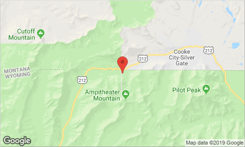
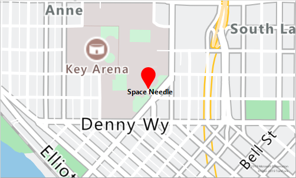
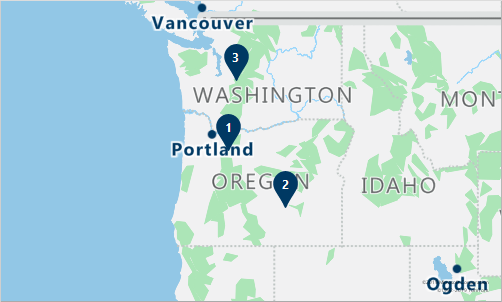
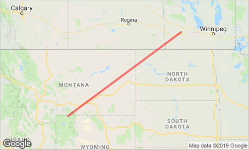
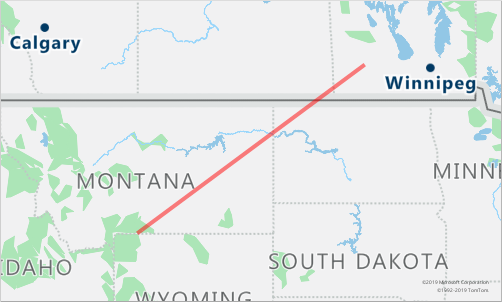

# Migrate web service from Google Maps

Both Azure and Google Maps provide access to spatial APIs through REST web services. The API interfaces of these platforms perform similar functionalities. But, they each use different naming conventions and response objects.

The table shows the Azure Maps service APIs, which have a similar functionality to the listed Google Maps service APIs.

| Google Maps service API | Azure Maps service API                                                                      |
|-------------------------|---------------------------------------------------------------------------------------------|
| Directions              | [Route](https://docs.microsoft.com/rest/api/maps/route)                                     |
| Distance Matrix         | [Route Matrix](https://docs.microsoft.com/rest/api/maps/route/postroutematrixpreview)       |
| Geocoding               | [Search](https://docs.microsoft.com/rest/api/maps/search)                                   |
| Places Search           | [Search](https://docs.microsoft.com/rest/api/maps/search)                                   |
| Place Autocomplete      | [Search](https://docs.microsoft.com/rest/api/maps/search)                                   |
| Snap to Road            | See [Calculate routes and directions](#calculate-routes-and-directions) section.            |
| Speed Limits            | See [Reverse geocode a coordinate](#reverse-geocode-a-coordinate) section.                  |
| Static Map              | [Render](https://docs.microsoft.com/rest/api/maps/render/getmapimage)                       |
| Time Zone               | [Time Zone](https://docs.microsoft.com/rest/api/maps/timezone)                              |

The following service APIs aren't currently available in Azure Maps:

- Elevation
- Geolocation
- Places details and photos - Phone numbers and website URL are available in the Azure Maps search API.
- Map URLs
- Nearest Roads - This is achievable using the Web SDK as shown [here](https://azuremapscodesamples.azurewebsites.net/index.html?sample=Basic%20snap%20to%20road%20logic
), but not available as a service currently.
- Static street view

Azure Maps has several additional REST web services that may be of interest:

- [Spatial operations](https://docs.microsoft.com/rest/api/maps/spatial): Offload complex spatial calculations and operations, such as geofencing, to a service.
- [Traffic](https://docs.microsoft.com/rest/api/maps/traffic): Access real-time traffic flow and incident data.

## Geocoding addresses

Geocoding is the process of converting an address into a coordinate. For example, "1 Microsoft way, Redmond, WA" converts to longitude: -122.1298, latitude: 47.64005. Then, Coordinates can be used for different kind of purposes, such as, positioning a centering a marker on a map.

Azure Maps provides several methods for geocoding addresses:

- [**Free-form address geocoding**](https://docs.microsoft.com/rest/api/maps/search/getsearchaddress): Specify a single address string and process the request immediately. "1 Microsoft way, Redmond, WA" is an example of a single address string. This API is recommended if you need to geocode individual addresses quickly.
- [**Structured address geocoding**](https://docs.microsoft.com/rest/api/maps/search/getsearchaddressstructured): Specify the parts of a single address, such as the street name, city, country/region, and postal code and process the request immediately. This API is recommended if you need to geocode individual addresses quickly and the data is already parsed into its individual address parts.
- [**Batch address geocoding**](https://docs.microsoft.com/rest/api/maps/search/postsearchaddressbatchpreview): Create a request containing up to 10,000 addresses and have them processed over a period of time. All the addresses will be geocoded in parallel on the server and when completed the full result set can be downloaded. This is recommended for geocoding large data sets.
- [**Fuzzy search**](https://docs.microsoft.com/rest/api/maps/search/getsearchfuzzy): This API combines address geocoding with point of interest search. This API takes in a free-form string. This string can be an address, place, landmark, point of interest, or point of interest category. This API process the request near real time. This API is recommended for applications where users search for addresses or points of interest in the same textbox.
- [**Fuzzy batch search**](https://docs.microsoft.com/rest/api/maps/search/postsearchfuzzybatchpreview): Create a request containing up to 10,000 addresses, places, landmarks, or point of interests and have them processed over a period of time. All the data will be processed in parallel on the server and when completed the full result set can be downloaded.

The following table cross-references the Google Maps API parameters with the comparable API parameters in Azure Maps.

| Google Maps API parameter | Comparable Azure Maps API parameter  |
|---------------------------|--------------------------------------|
| `address`                   | `query`                            |
| `bounds`                    | `topLeft` and `btmRight`           |
| `components`                | `streetNumber`<br/>`streetName`<br/>`crossStreet`<br/>`postalCode`<br/>`municipality` - city / town<br/>`municipalitySubdivision` – neighborhood, sub / super city<br/>`countrySubdivision` - state or province<br/>`countrySecondarySubdivision` - county<br/>`countryTertiarySubdivision` - district<br/>`countryCode` - two letter country/region code |
| `key`                       | `subscription-key` – See also the [Authentication with Azure Maps](azure-maps-authentication.md) documentation. |
| `language`                  | `language` – See [supported languages](supported-languages.md) documentation.  |
| `region`                    | `countrySet`                       |

An example of how to use the search service is documented [here](how-to-search-for-address.md). Be sure to review [best practices for search](how-to-use-best-practices-for-search.md).

> [!TIP]
> The free-form address geocoding and fuzzy search APIs can be used in autocomplete mode by adding `&typeahead=true` to the request URL. This will tell the server that the input text is likely partial, and the search will go into predictive mode.

## Reverse geocode a coordinate

Reverse geocoding is the process of converting geographic coordinates into an approximate address. Coordinates with "longitude: -122.1298, latitude: 47.64005" convert to "1 Microsoft way, Redmond, WA".

Azure Maps provides several reverse geocoding methods:

- [**Address reverse geocoder**](https://docs.microsoft.com/rest/api/maps/search/getsearchaddressreverse): Specify a single geographic coordinate to get the approximate address corresponding to this coordinate. Processes the request near real time.
- [**Cross street reverse geocoder**](https://docs.microsoft.com/rest/api/maps/search/getsearchaddressreversecrossstreet): Specify a single geographic coordinate to get nearby cross street information and process the request immediately. For example, you may receive the following cross streets 1st Ave and Main St.
- [**Batch address reverse geocoder**](https://docs.microsoft.com/rest/api/maps/search/postsearchaddressreversebatchpreview): Create a request containing up to 10,000 coordinates and have them processed over a period of time. All data will be processed in parallel on the server. When the request completes, you can download the full set of results.

This table cross-references the Google Maps API parameters with the comparable API parameters in Azure Maps.

| Google Maps API parameter   | Comparable Azure Maps API parameter   |
|-----------------------------|---------------------------------------|
| `key`                       | `subscription-key` – See also the [Authentication with Azure Maps](azure-maps-authentication.md) documentation. |
| `language`                  | `language` – See [supported languages](supported-languages.md) documentation.  |
| `latlng`                    | `query`  |
| `location_type`             | *N/A*     |
| `result_type`               | `entityType`    |

Review [best practices for search](how-to-use-best-practices-for-search.md).

The Azure Maps reverse geocoding API has some additional features, which aren't available in Google Maps. These features might be useful to integrate with your application, as you migrate your app:

- Retrieve speed limit data
- Retrieve road use information: local road, arterial, limited access, ramp, and so on
- Retrieve the side of street at which a coordinate is located

## Search for points of interest

Point of interest data can be searched in Google Maps using the Places Search API. This API provides three different ways to search for points of interest:

- **Find place from text:** Searches for a point of interest based on its name, address, or phone number.
- **Nearby Search**: Searches for points of interests that are within a certain distance of a location.
- **Text Search:** Searches for places using a free-form text, which includes point of interest and location information. For example, "pizza in New York" or "restaurants near main st".

Azure Maps provides several search APIs for points of interest:

- [**POI search**](https://docs.microsoft.com/rest/api/maps/search/getsearchpoi): Search for points of interests by name. For example, "Starbucks".
- [**POI category search**](https://docs.microsoft.com/rest/api/maps/search/getsearchpoicategory): Search for points of interests by category. For example, "restaurant".
- [**Nearby search**](https://docs.microsoft.com/rest/api/maps/search/getsearchnearby): Searches for points of interests that are within a certain distance of a location.
- [**Fuzzy search**](https://docs.microsoft.com/rest/api/maps/search/getsearchfuzzy): This API combines address geocoding with point of interest search. This API takes in a free-form string that can be an address, place, landmark, point of interest, or point of interest category. It processes the request near real time. This API is recommended for applications where users search for addresses or points of interest in the same textbox.
- [**Search within geometry**](https://docs.microsoft.com/rest/api/maps/search/postsearchinsidegeometry): Search for points of interests that are within a specified geometry. For example, search a point of interest within a polygon.
- [**Search along route**](https://docs.microsoft.com/rest/api/maps/search/postsearchalongroute): Search for points of interests that are along a specified route path.
- [**Fuzzy batch search**](https://docs.microsoft.com/rest/api/maps/search/postsearchfuzzybatchpreview): Create a request containing up to 10,000 addresses, places, landmarks, or point of interests. Processed the request over a period of time. All data will be processed in parallel on the server. When the request completes processing, you can download the full set of result.

Currently Azure Maps doesn't have a comparable API to the Text Search API in Google Maps.

> [!TIP]
> The POI search, POI category search, and fuzzy search APIs can be used in autocomplete mode by adding `&typeahead=true` to the request URL. This will tell the server that the input text is likely partial.The API will conduct the search in predictive mode.

Review the [best practices for search](how-to-use-best-practices-for-search.md) documentation.

### Find place from text

Use the Azure Maps [POI search](https://docs.microsoft.com/rest/api/maps/search/getsearchpoi) and [Fuzzy search](https://docs.microsoft.com/rest/api/maps/search/getsearchfuzzy) to search for points of interests by name or address.

The table cross-references the Google Maps API parameters with the comparable Azure Maps API parameters.

| Google Maps API parameter | Comparable Azure Maps API parameter |
|---------------------------|-------------------------------------|
| `fields`                  | *N/A*                               |
| `input`                   | `query`                             |
| `inputtype`               | *N/A*                               |
| `key`                     | `subscription-key` – See also the [Authentication with Azure Maps](azure-maps-authentication.md) documentation. |
| `language`                | `language` – See [supported languages](supported-languages.md) documentation.  |
| `locationbias`            | `lat`, `lon` and `radius`<br/>`topLeft` and `btmRight`<br/>`countrySet`  |

### Nearby search

Use the [Nearby search](https://docs.microsoft.com/rest/api/maps/search/getsearchnearby) API to retrieve nearby points of interests, in Azure Maps.

The table shows the Google Maps API parameters with the comparable Azure Maps API parameters.

| Google Maps API parameter | Comparable Azure Maps API parameter  |
|---------------------------|--------------------------------------|
| `key`                       | `subscription-key` – See also the [Authentication with Azure Maps](azure-maps-authentication.md) documentation. |
| `keyword`                   | `categorySet` and `brandSet`        |
| `language`                  | `language` – See [supported languages](supported-languages.md) documentation.  |
| `location`                  | `lat` and `lon`                     |
| `maxprice`                  | *N/A*                               |
| `minprice`                  | *N/A*                               |
| `name`                      | `categorySet` and `brandSet`        |
| `opennow`                   | *N/A*                               |
| `pagetoken`                 | `ofs` and `limit`                   |
| `radius`                    | `radius`                            |
| `rankby`                    | *N/A*                               |
| `type`                      | `categorySet –` See [supported search categories](supported-search-categories.md) documentation.   |

## Calculate routes and directions

Calculate routes and directions using Azure Maps. Azure Maps has many of the same functionalities as the Google Maps routing service, such as:

- Arrival and departure times.
- Real-time and predictive based traffic routes.
- Different modes of transportation. Such as, driving, walking, bicycling.

> [!NOTE]
> Azure Maps requires all waypoints to be coordinates. Addresses must be geocoded first.

The Azure Maps routing service provides the following APIs for calculating routes:

- [**Calculate route**](https://docs.microsoft.com/rest/api/maps/route/getroutedirections): Calculate a route and have the request processed immediately. This API supports both GET and POST requests. POST requests are recommended when specifying a large number of waypoints or when using lots of the route options to ensure that the URL request doesn't become too long and cause issues. The POST Route Direction in Azure Maps has an option can that take in thousands of [supporting points](https://docs.microsoft.com/rest/api/maps/route/postroutedirections#supportingpoints) and will use them to recreate a logical route path between them (snap to road). 
- [**Batch route**](https://docs.microsoft.com/rest/api/maps/route/postroutedirectionsbatchpreview): Create a request containing up to 1,000 route request and have them processed over a period of time. All the data will be processed in parallel on the server and when completed the full result set can be downloaded.
- [**Mobility services**](https://docs.microsoft.com/rest/api/maps/mobility): Calculate routes and directions using public transit.

The table cross-references the Google Maps API parameters with the comparable API parameters in Azure Maps.

| Google Maps API parameter    | Comparable Azure Maps API parameter  |
|------------------------------|--------------------------------------|
| `alternatives`                 | `maxAlternatives`                  |
| `arrival_time`                | `arriveAt`                          |
| `avoid`                        | `avoid`                            |
| `departure_time`              | `departAt`                          |
| `destination`                  | `query` – coordinates in the format `"lat0,lon0:lat1,lon1…."`  |
| `key`                          | `subscription-key` – See also the [Authentication with Azure Maps](azure-maps-authentication.md) documentation. |
| `language`                     | `language` – See [supported languages](supported-languages.md) documentation.   |
| `mode`                         | `travelMode`                       |
| `optimize`                     | `computeBestOrder`                 |
| `origin`                       | `query`                            |
| `region`                       | *N/A* – This feature is geocoding related. Use the *countrySet* parameter when using the Azure Maps geocoding API.  |
| `traffic_model`               | *N/A* – Can only specify if traffic data should be used with the *traffic* parameter. |
| `transit_mode`                | See [mobility services documentation](https://docs.microsoft.com/rest/api/maps/mobility) |
| `transit_routing_preference` | See [mobility services documentation](https://docs.microsoft.com/rest/api/maps/mobility) |
| `units`                        | *N/A* – Azure Maps only uses the metric system.  |
| `waypoints`                    | `query`                            |

> [!TIP]
> By default, the Azure Maps route API only returns a summary. It returns the distance and times and the coordinates for the route path. Use the `instructionsType` parameter to retrieve turn-by-turn instructions. And, use the `routeRepresentation` parameter to filter out the summary and route path.

Azure Maps routing API has additional features, that aren't available in Google Maps. When migrating your app, consider using these features, you might find them useful.

- Support for route type: shortest, fastest, trilling, and most fuel efficient.
- Support for additional travel modes: bus, motorcycle, taxi, truck, and van.
- Support for 150 waypoints.
- Compute multiple travel times in a single request; historic traffic, live traffic, no traffic.
- Avoid additional road types: carpool roads, unpaved roads, already used roads.
- Specify custom areas to avoid.
- Limit the elevation, which the route may ascend.
- Route based on engine specifications. Calculate routes for combustion or electric vehicles based on engine specifications, and the remaining fuel or charge.
- Support commercial vehicle route parameters. Such as, vehicle dimensions, weight, number of axels, and cargo type.
- Specify maximum vehicle speed.

In addition to this, the route service in Azure Maps supports [calculating routable ranges](https://docs.microsoft.com/rest/api/maps/route/getrouterange). Calculating routable ranges is also known as isochrones. It entails generating a polygon covering an area that can be traveled to in any direction from an origin point. All under a specified amount of time or amount of fuel or charge.

Review the [best practices for routing](how-to-use-best-practices-for-routing.md) documentation.

## Retrieve a map image

Azure Maps provides an API for rendering the static map images with data overlaid. The [Map image render](https://docs.microsoft.com/rest/api/maps/render/getmapimagerytile) API in Azure Maps is comparable to the static map API in Google Maps.

> [!NOTE]
> Azure Maps requires the center, all the marker, and the path locations to be coordinates in "longitude,latitude" format. Whereas, Google Maps uses the "latitude,longitude" format. Addresses will need to be geocoded first.

The table cross-references the Google Maps API parameters with the comparable API parameters in Azure Maps.

| Google Maps API parameter | Comparable Azure Maps API parameter  |
|---------------------------|--------------------------------------|
| `center`                    | `center`                           |
| `format`                    | `format` – specified as part of URL path. Currently only PNG supported. |
| `key`                       | `subscription-key` – See also the [Authentication with Azure Maps](azure-maps-authentication.md) documentation. |
| `language`                  | `language` – See [supported languages](supported-languages.md) documentation.  |
| `maptype`                   | `layer` and `style` – See [Supported map styles](supported-map-styles.md) documentation. |
| `markers`                   | `pins`                             |
| `path`                      | `path`                             |
| `region`                    | *N/A* – This is a geocoding related feature. Use the `countrySet` parameter when using the Azure Maps geocoding API.  |
| `scale`                     | *N/A*                              |
| `size`                      | `width` and `height` – can be up to 8192x8192 in size. |
| `style`                     | *N/A*                              |
| `visible`                   | *N/A*                              |
| `zoom`                      | `zoom`                             |

> [!NOTE]
> In the Azure Maps tile system, tiles are twice the size of map tiles used in Google Maps. As such the zoom level value in Azure Maps will appear one zoom level closer in Azure Maps compared to Google Maps. To compensate for this difference, decrement the zoom level in the requests you are migrating.

For more information, see the [How-to guide on the map image render API](how-to-render-custom-data.md).

In addition to being able to generate a static map image, the Azure Maps render service provides the ability to directly access map tiles in raster (PNG) and vector format:

- [**Map tile**](https://docs.microsoft.com/rest/api/maps/render/getmaptile): Retrieve raster (PNG) and vector tiles for the base maps (roads, boundaries, background).
- [**Map imagery tile**](https://docs.microsoft.com/rest/api/maps/render/getmapimagerytile): Retrieve aerial and satellite imagery tiles.

> [!TIP]
> Many Google Maps applications where switched from interactive map experiences to static map images a few years ago. This was done as a cost saving method. In Azure Maps, it is usually more cost effective to use the interactive map control in the Web SDK. The interactive map control charges based the number of tile loads. Map tiles in Azure Maps are large. Often, it takes only a few tiles to recreate the same map view as a static map. Map tiles are cached automatically by the browser. As such, the interactive map control often generates a fraction of a transaction when reproducing a static map view. Panning and zooming will load more tiles; however, there are options in the map control to disable this behavior. The interactive map control also provides a lot more visualization options than the static map services.

### Marker URL parameter format comparison

**Before: Google Maps**

Add markers using the `markers` parameter in the URL. The `markers` parameter takes in a style and a list of locations to be rendered on the map with that style as shown below:

```
&markers=markerStyles|markerLocation1|markerLocation2|...
```

To add additional styles, use the `markers` parameters
to the URL with a different style and set of locations.

Specify marker locations with the "latitude,longitude" format.

Add marker styles with the `optionName:value` format, with multiple styles separated by pipe (\|) characters like this "optionName1:value1\|optionName2:value2". Note the option names and values are separated with a colon (:). Use the following names of style option to style markers in Google Maps:

- `color` – The color of the default marker icon. Can be a 24-bit hex color (`0xrrggbb`) or one of the following values; `black`, `brown`, `green`, `purple`, `yellow`, `blue`, `gray`, `orange`, `red`, `white`.
- `label` – A single uppercase alphanumeric character to display on top of the icon.
- `size` - The size of the marker. Can be `tiny`, `mid`, or `small`.

Use the following style options names for Custom icons in Google Maps:

- `anchor` – Specifies how to align the icon image to the coordinate. Can be a pixel (x,y) value or one of the following values; `top`, `bottom`, `left`, `right`, `center`, `topleft`, `topright`, `bottomleft`, or `bottomright`.
- `icon` – A URL pointing to the icon image.

For example, let's add a red, mid-sized marker to the map at longitude: -110, latitude: 45:

```
&markers=color:red|size:mid|45,-110
```

<center>

</center>

**After: Azure Maps**

Add markers to a static map image by specifying the `pins` parameter in the URL. Like Google Maps, specify a style and a list of locations in the parameter. The `pins` parameter can be specified multiple times to support markers with different styles.

```
&pins=iconType|pinStyles||pinLocation1|pinLocation2|...
```

To use additional styles, add additional `pins` parameters to the URL with a different style and set of locations.

In Azure Maps, the pin location needs to be in the "longitude latitude" format. Google Maps uses "latitude,longitude" format. A space, not a comma, separates longitude and latitude in the Azure Maps format.

The `iconType` specifies the type of pin to create. It can have the following values:

- `default` – The default pin icon.
- `none` – No icon is displayed, only labels will be rendered.
- `custom` – Specifies a custom icon is to be used. A URL pointing to the icon image can be added to the end of the `pins` parameter after the pin location information.
- `{udid}` – A Unique Data ID (UDID) for an icon stored in the Azure
    Maps Data Storage platform.

Add pin styles with the `optionNameValue` format. Separate multiple styles with the pipe (\|) characters. For example: `iconType|optionName1Value1|optionName2Value2`. The option names and values aren't separated. Use the following style option names to style markers:

- `al` – Specifies the opacity (alpha) of the marker. Choose a number between 0 and 1.
- `an` – Specifies the pin anchor. Specify X and y pixel values in the "x y" format.
- `co` – The color of the pin. Specify a 24-bit hex color: `000000` to `FFFFFF`.
- `la` – Specifies the label anchor. Specify X and y pixel values in the "x y" format.
- `lc` – The color of the label. Specify a 24-bit hex color: `000000` to `FFFFFF`.
- `ls` – The size of the label in pixels. Choose a number greater than 0.
- `ro` – A value in degrees to rotate the icon. Choose a number between -360 and 360.
- `sc` – A scale value for the pin icon. Choose a number greater than 0.

Specify label values for each pin location. This approach is more efficient than applying a single label value to all markers in the list of locations. The label value can be a string of multiple characters. Wrap the string with single quotes to ensure that it isn't mistaken as a style or location value.

Let's add a red (`FF0000`) default icon, with the label "Space Needle", positioned below (15 50). The icon is at longitude: -122.349300, latitude: 47.620180:

```
&pins=default|coFF0000|la15 50||'Space Needle' -122.349300 47.620180
```

<center>

</center>

Add three pins with the label values '1', '2', and '3':

```
&pins=default||'1'-122 45|'2'-119.5 43.2|'3'-121.67 47.12
```

<center>

</center>

### Path URL parameter format comparison

**Before: Google Maps**

Add lines and polygon to a static map image using the `path` parameter in the URL. The `path` parameter takes in a style and a list of locations to be rendered on the map, as shown below:

```
&path=pathStyles|pathLocation1|pathLocation2|...
```

Use additional styles by adding additional `path` parameters to the URL with a different style and set of locations.

Path locations are specified with the `latitude1,longitude1|latitude2,longitude2|…` format. Paths can be encoded or contain addresses for points.

Add path styles with the `optionName:value` format, separate multiple styles by the pipe (\|) characters. And, separate option names and values with a colon (:). Like this: `optionName1:value1|optionName2:value2`. The following style option names can be used to style paths in Google Maps:

- `color` – The color of the path or polygon outline. Can be a 24-bit hex color (`0xrrggbb`), a 32-bit hex color (`0xrrggbbbaa`) or one of the following values: black, brown, green, purple, yellow, blue, gray, orange, red, white.
- `fillColor` – The color to fill the path area with (polygon). Can be a 24-bit hex color (`0xrrggbb`), a 32-bit hex color (`0xrrggbbbaa`) or one of the following values: black, brown, green, purple, yellow, blue, gray, orange, red, white.
- `geodesic` – Indicates if the path should be a line that follows the curvature of the earth.
- `weight` – The thickness of the path line in pixels.

Add a red line opacity and pixel thickness to the map between the coordinates, in the URL parameter. For the example below, the line has a 50% opacity and a thickness of four pixels. The coordinates are longitude: -110, latitude: 45 and longitude: -100, latitude: 50.

```
&path=color:0xFF000088|weight:4|45,-110|50,-100
```

<center>

</center>

**After: Azure Maps**

Add lines and polygons to a static map image by specifying the `path` parameter in the URL. Like Google Maps, specify a style and a list of locations in this parameter. Specify the `path` parameter multiple times to render multiple circles, lines, and polygons with different styles.

```
&path=pathStyles||pathLocation1|pathLocation2|...
```

When it comes to path locations, Azure Maps requires the coordinates to be in "longitude latitude" format. Google Maps uses "latitude,longitude" format. A space, not a comma, separates longitude and latitude in the Azure Maps format. Azure Maps doesn't support encoded paths or addresses for points. Upload larger data sets as a GeoJSON file into the Azure Maps Data Storage API as documented [here](how-to-render-custom-data.md#get-data-from-azure-maps-data-storage).

Add path styles with the `optionNameValue` format. Separate multiple styles by pipe (\|) characters, like this `optionName1Value1|optionName2Value2`. The option names and values aren't separated. Use the following style option names to style paths in Azure Maps:

- `fa` - The fill color opacity (alpha) used when rendering polygons. Choose a number between 0 and 1.
- `fc` - The fill color used to render the area of a polygon.
- `la` – The line color opacity (alpha) used when rendering lines and the outline of polygons. Choose a number between 0 and 1.
- `lc` – The line color used to render lines and the outline of polygons.
- `lw` – The width of the line in pixels.
- `ra` – Specifies a circles radius in meters.

Add a red line opacity and pixel thickness between the coordinates, in the URL parameter. For the example below, the line has 50% opacity and a thickness of four pixels. The coordinates have the following values: longitude: -110, latitude: 45 and longitude: -100, latitude: 50.

```
&path=lcFF0000|la.5|lw4||-110 45|-100 50
```

<center>

</center>

## Calculate a distance matrix

Azure Maps provides the distance matrix API. Use this API to calculate the travel times and the distances between a set of locations, with a distance matrix. It's comparable to the distance matrix API in Google Maps.

- [**Route matrix**](https://docs.microsoft.com/rest/api/maps/route/postroutematrixpreview): Asynchronously calculates travel times and distances for a set of origins and destinations. Supports up to 700 cells per request. That's the number of origins multiplied by the number of destinations. With that constraint in mind, examples of possible matrix dimensions are: 700x1, 50x10, 10x10, 28x25, 10x70.

> [!NOTE]
> A request to the distance matrix API can only be made using a POST request with the origin and destination information in the body of the request. Additionally, Azure Maps requires all origins and destinations to be coordinates. Addresses will need to be geocoded first.

This table cross-references the Google Maps API parameters with the comparable Azure Maps API parameters.

| Google Maps API parameter      | Comparable Azure Maps API parameter  |
|--------------------------------|--------------------------------------|
| `arrivial_time`                | `arriveAt`                           |
| `avoid`                        | `avoid`                              |
| `depature_time`                | `departAt`                           |
| `destinations`                 | `destination` – specify in the POST request body as GeoJSON. |
| `key`                          | `subscription-key` – See also the [Authentication with Azure Maps](azure-maps-authentication.md) documentation. |
| `language`                     | `language` – See [supported languages](supported-languages.md) documentation.  |
| `mode`                         | `travelMode`                         |
| `origins`                      | `origins` – specify in the POST request body as GeoJSON.  |
| `region`                       | *N/A* – This feature is geocoding related. Use the `countrySet` parameter when using the Azure Maps geocoding API. |
| `traffic_model`                | *N/A* – Can only specify if traffic data should be used with the `traffic` parameter. |
| `transit_mode`                 | *N/A* - Transit-based distance matrices aren't currently supported.  |
| `transit_routing_preference`   | *N/A* - Transit-based distance matrices aren't currently supported.  |
| `units`                        | *N/A* – Azure Maps only uses the metric system. |

> [!TIP]
> All the advanced routing options available in the Azure Maps routing API are supported in the Azure Maps distance matrix API. Advanced routing options include: truck routing, engine specifications, and so on.

Review the [best practices for routing](how-to-use-best-practices-for-routing.md) documentation.

## Get a time zone

Azure Maps provides an API for retrieving the time zone of a coordinate. The Azure Maps time zone API is comparable to the time zone API in Google Maps:

- [**Time zone by coordinate**](https://docs.microsoft.com/rest/api/maps/timezone/gettimezonebycoordinates): Specify a coordinate and receive the time zone details of the coordinate.

This table cross-references the Google Maps API parameters with the comparable API parameters in Azure Maps.

| Google Maps API parameter | Comparable Azure Maps API parameter   |
|---------------------------|---------------------------------------|
| `key`                       | `subscription-key` – See also the [Authentication with Azure Maps](azure-maps-authentication.md) documentation.       |
| `language`                  | `language` – See [supported languages](supported-languages.md) documentation.    |
| `location`                  | `query`             |
| `timestamp`                 | `timeStamp`         |

In addition to this API, Azure Maps provides a number of time zone APIs. These APIs convert the time based on the names or the IDs of the time zone:

- [**Time zone by ID**](https://docs.microsoft.com/rest/api/maps/timezone/gettimezonebyid): Returns current, historical, and future time zone information for the specified IANA time zone ID.
- [**Time zone Enum IANA**](https://docs.microsoft.com/rest/api/maps/timezone/gettimezoneenumiana): Returns a full list of IANA time zone IDs. Updates to the IANA service are reflected in the system within one day.
- [**Time zone Enum Windows**](https://docs.microsoft.com/rest/api/maps/timezone/gettimezoneenumwindows): Returns a full list of Windows Time Zone IDs.
- [**Time zone IANA version**](https://docs.microsoft.com/rest/api/maps/timezone/gettimezoneianaversion): Returns the current IANA version number used by Azure Maps.
- [**Time zone Windows to IANA**](https://docs.microsoft.com/rest/api/maps/timezone/gettimezonewindowstoiana): Returns a corresponding IANA ID, given a valid Windows Time Zone ID. Multiple IANA IDs may be returned for a single Windows ID.

## Client libraries

Azure Maps provides client libraries for the following programming languages:

- JavaScript, TypeScript, Node.js – [documentation](how-to-use-services-module.md) \| [NPM package](https://www.npmjs.com/package/azure-maps-rest)

These Open-source client libraries are for other programming languages:

- .NET Standard 2.0 – [GitHub project](https://github.com/perfahlen/AzureMapsRestServices) \| [NuGet package](https://www.nuget.org/packages/AzureMapsRestToolkit/)

## Additional resources

The following are additional documentation and resources for the Azure Maps REST services.

- [Best practices for search](how-to-use-best-practices-for-search.md)
- [Search for an address](how-to-search-for-address.md)
- [Best practices for routing](how-to-use-best-practices-for-routing.md)
- [Azure Maps REST Service API reference documentation](https://docs.microsoft.com/rest/api/maps/)

## Next steps

Learn more about the Azure Maps REST services.

> [!div class="nextstepaction"]
> [Best practices for using the search service](how-to-use-best-practices-for-search.md)

> [!div class="nextstepaction"]
> [Best practices for using the routing service](how-to-use-best-practices-for-search.md)

> [!div class="nextstepaction"]
> [How to use the services module (Web SDK)](how-to-use-best-practices-for-routing.md)

> [!div class="nextstepaction"]
> [Azure Maps REST Service API reference documentation](https://docs.microsoft.com/rest/api/maps/)

> [!div class="nextstepaction"]
> [Code samples](https://docs.microsoft.com/samples/browse/?products=azure-maps)
