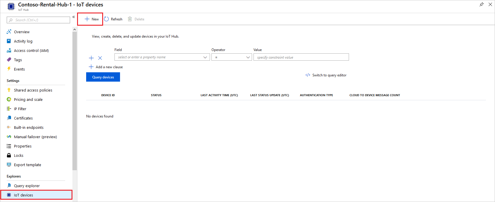
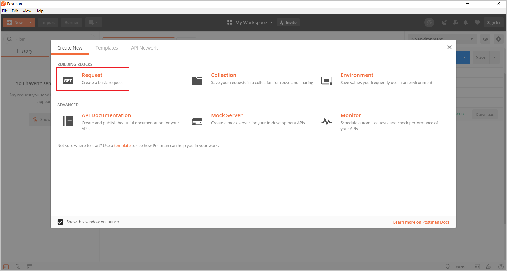
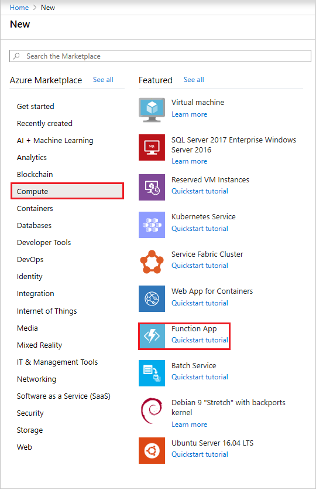
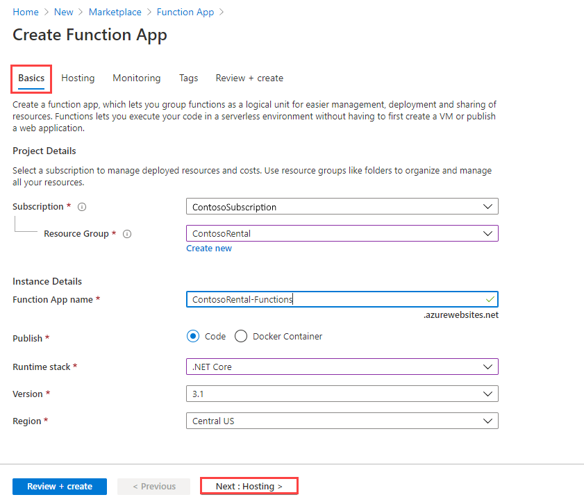
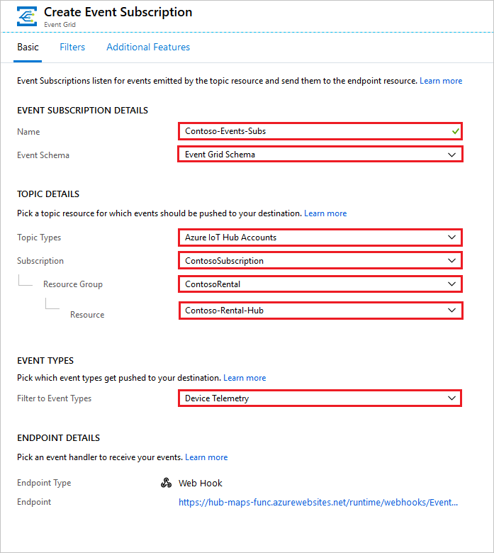
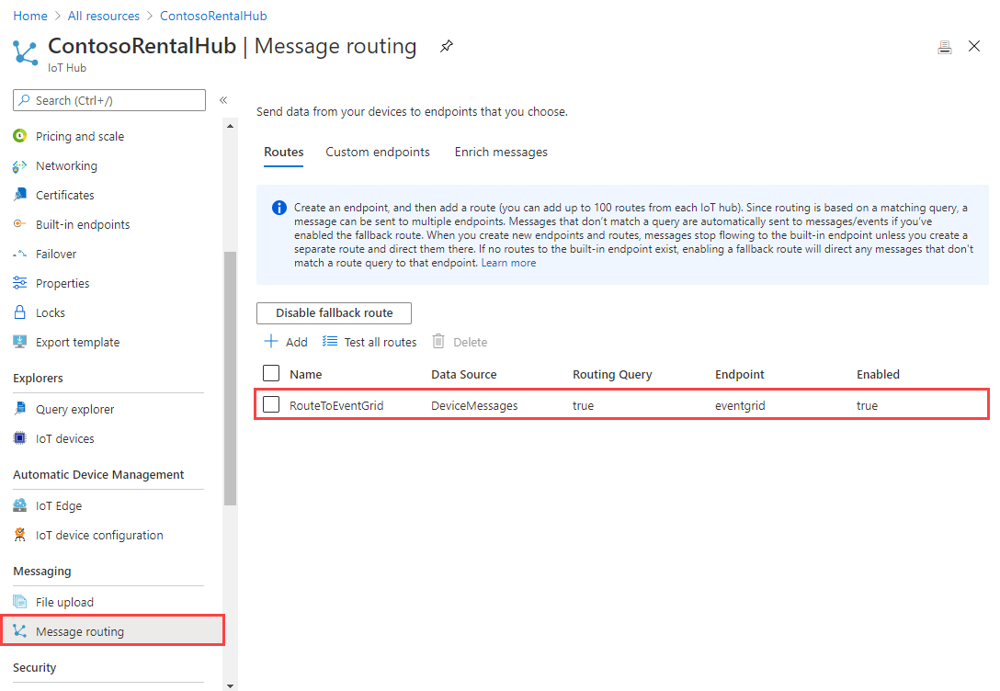
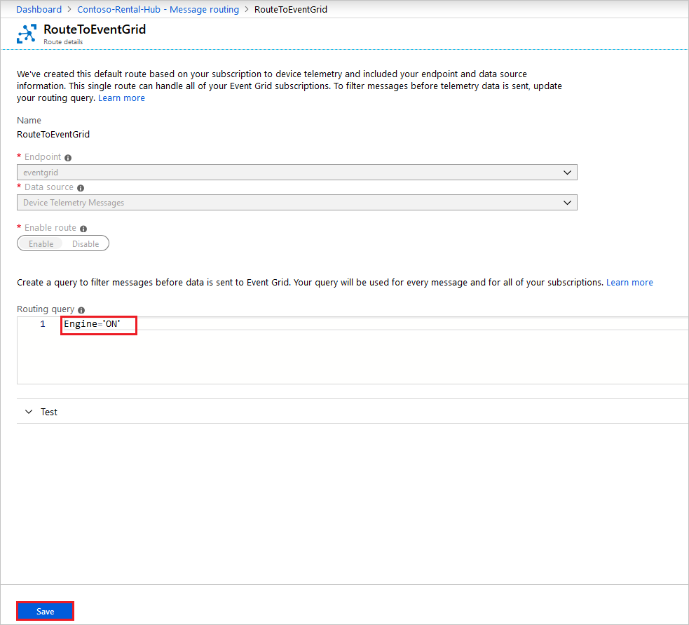
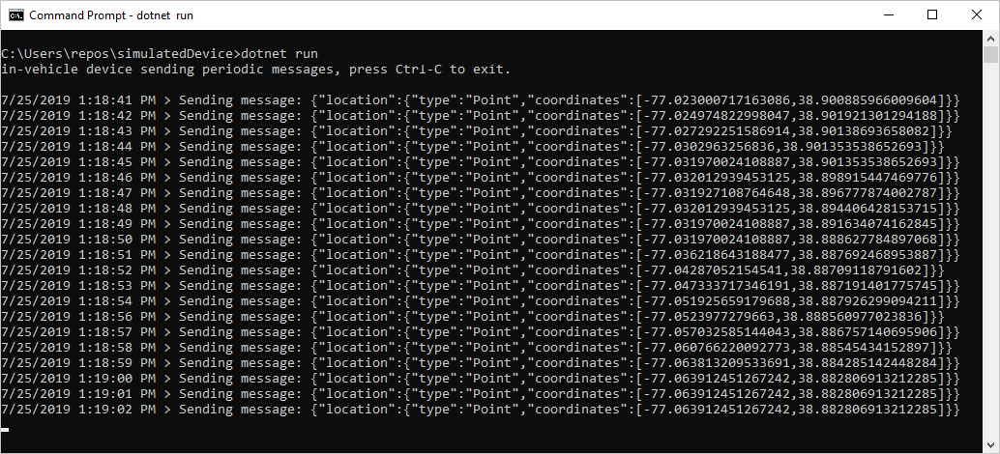
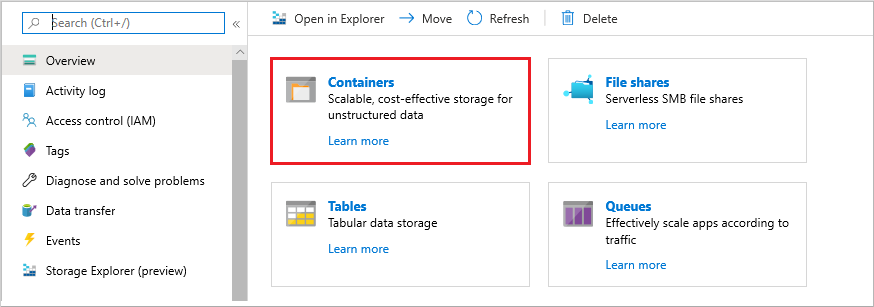

# Implement IoT spatial analytics using Azure Maps

Tracking and capturing relevant events that occur in space and time is a common IoT scenario. For example, in fleet management, asset tracking, mobility, and smart city applications. This tutorial guides you through a solution pattern for using Azure Maps APIs against relevant events captured by IoT Hub, using the event subscription model provided by Event Grid.

In this tutorial you will:

> [!div class="checklist"]
> * Create an IoT Hub.
> * Upload geofence area in the Azure Maps, Data service using the Data Upload API.
> * Create a function in Azure Functions, implementing business logic based on Azure Maps spatial analytics.
> * Subscribe to IoT device telemetry events from the Azure function via Event Grid.
> * Filter the telemetry events using IoT Hub message routing.
> * Create a storage account to store relevant event data.
> * Simulate an in-vehicle IoT device.
    

## Use case

We will exemplify the solution for a scenario where a car rental company plans to monitor and log events for its rented out cars. Often car rental companies rent out cars for a specific geographic region and need to keep track of their whereabouts while rented. Any instance, which involves a car leaving the designated geographic region needs to be logged so that policies, fees, and other business aspects can be properly handled.

In our use case, the rental cars are equipped with IoT devices that send telemetry data to Azure IoT Hub on a regular basis. The telemetry includes the current location and indicates whether the car's engine is running or not. The device location schema adheres to the IoT [Plug and Play schema for geospatial data](https://github.com/Azure/IoTPlugandPlay/blob/master/Schemas/geospatial.md). The rental car's device telemetry schema looks like:

```JSON
{
    "data": {
         "properties": {
            "Engine": "ON"
         },
         "systemProperties": {
            "iothub-content-type": "application/json",
            "iothub-content-encoding": "utf-8",
            "iothub-connection-device-id": "ContosoRentalDevice",
            "iothub-connection-auth-method": "{\"scope\":\"device\",\"type\":\"sas\",\"issuer\":\"iothub\",\"acceptingIpFilterRule\":null}",
            "iothub-connection-auth-generation-id": "636959817064335548",
            "iothub-enqueuedtime": "2019-06-18T00:17:20.608Z",
            "iothub-message-source": "Telemetry"
         },
         "body": { 
                    "location": { 
                        "type": "Point",
                        "coordinates": [ -77.025988698005662, 38.9015330523316 ]
                     } 
                 } 
    }
}
```

The in-vehicle device telemetry can be used to accomplish the goal. Our goal is to execute geofencing rules and appropriately follow-up every time an event indicating the car has moved location is received. To do so, we will subscribe to the device telemetry events from IoT Hub via Event Grid, so that the desired customer business logic can be executed only when appropriate. There are several ways to subscribe to Event Grid, in this tutorial we will make use of Azure Functions. The Azure Functions reacts to events published in Event Grid and implements car rental business logic based on Azure Maps spatial analytics. The Azure function consists of checking whether the vehicle has left the geofence and, if so, gathering additional information such as the address associated to the current location. The function also implements logic to store meaningful event data in a data blob storage that helps provide accurate description of the event circumstances to the car rental analyst as well as the rental customer.

The following diagram gives you a high-level overview of the system.

 
  <center>

  </center>

The figure below represents the geofence area highlighted in blue and rental vehicle's route as a green line.

  


## Prerequisites 

### Create a resource group

To complete the steps in this tutorial, you first need to create a resource group in the Azure portal. To create a resource group, follow the steps below:

1. Log in to the [Azure portal](https://portal.azure.com).

2. select **Resource groups**.
    
   

3. Under Resource groups, select **Add**.
    
    

4. Enter the following property values:
    * **Subscription:** Select you Azure subscription.
    * **Resource group:** Enter "ContosoRental" as the resource group name.
    * **Region:** Select a region for the resource group.  

    

    Click on **Review + create** and choose **Create** on the next page.

### Create an Azure Maps account 

In order to implement business logic based on Azure Maps spatial analytics, we need to create an Azure Maps account in the resource group we created. Follow instructions in [manage account](https://docs.microsoft.com/azure/azure-maps/how-to-manage-account-keys) to create an Azure Maps account subscription with S1 pricing tier and see [authentication details](https://docs.microsoft.com/azure/azure-maps/how-to-manage-authentication#view-authentication-details) to learn how to get your subscription key.


### Create a storage account

In order to log event data, we will create a general-purpose **v2storage** account in the "ContosoRental" resource group to store data as blobs. To create a storage account, follow instruction in [create a storage account](https://docs.microsoft.com/azure/storage/common/storage-quickstart-create-account?toc=%2Fazure%2Fstorage%2Fblobs%2Ftoc.json&tabs=azure-portal). Next we will need to create a container to store blobs. Follow the steps below to do so:

1. In your storage account, navigate to Blobs.

    

2. Click the container button at the top left and name your container "contoso-rental-logs" and click "OK".

    

3. Navigate to the **Access keys** blade in your storage account and copy the account name and access key, we will use them later.

    


Now that we have a storage account and a container to log event data, next we will create an IoT hub.

### Create an IoT Hub

An IoT Hub is a managed service in the cloud that acts as a central message hub for bi-directional communication between an IoT application and the devices that are managed by it. In order to route device telemetry messages to an Event Grid, we will create an IoT Hub within the "ContosoRental" resource group and set up a message route integration where we will filter messages based on the car's engine status and will send device telemetry messages to the Event Grid whenever the car is moving. 

> [!Note] 
> IoT Hub's functionality to publish device telemetry events on Event Grid is in Public preview. Public preview features are available in all regions except **East US, West US, West Europe, Azure Government, Azure China 21Vianet,** and **Azure Germany**. 

Create an Iot Hub by following the steps in [create an IoT Hub section](https://docs.microsoft.com/azure/iot-hub/quickstart-send-telemetry-dotnet#create-an-iot-hub).


### Register a device 

In order to connect to the IoT Hub, a device must be registered. To register a device with IoT hub, follow the steps below:

1. In your IoT Hub, click on the "IoT devices" blade and click "New".

    

2. On the create a device page, name your IoT device, and click "Save".
    
    


## Upload geofence

We will use the [Postman application](https://www.getpostman.com) to [upload the geofence](https://docs.microsoft.com/azure/azure-maps/geofence-geojson) to the Azure Maps service using the Azure Maps Data Upload API. Any event when the car is outside this geofence will be logged.

Open the Postman app and follow the steps below to upload the geofence using the Azure Maps, Data Upload API.  

1. In the Postman app, click new | Create new, and select Request. Enter a Request name for Upload geofence data, select a collection or folder to save it to, and click Save.

    

2. Select POST HTTP method on the builder tab and enter the following URL to make a POST request.

    ```HTTP
    https://atlas.microsoft.com/mapData/upload?subscription-key={subscription-key}&api-version=1.0&dataFormat=geojson
    ```
    
    The "geojson" value against the `dataFormat` parameter in the URL path represents the format of the data being uploaded.

3. Click **Params**, and enter the following Key/Value pairs to be used for the POST request URL. Replace subscription-key value with your Azure Maps subscription key.
   
    

4. Click **Body** then select **raw** input format and choose **JSON (application/text)** as the input format from the dropdown list. Open the JSON data file [here](https://raw.githubusercontent.com/Azure-Samples/iothub-to-azure-maps-geofencing/master/src/Data/geofence.json?token=AKD25BYJYKDJBJ55PT62N4C5LRNN4), and copy the Json into the body section in Postman as the data to be uploaded and click **Send**.
    
    
    
5. Review the response headers. Upon a successful request, the **Location** header will contain the status URI to check the current status of the upload request. The status URI will be of the following format. 

   ```HTTP
   https://atlas.microsoft.com/mapData/{uploadStatusId}/status?api-version=1.0
   ```

6. Copy your status URI and append a `subscription-key` parameter to it with its value being your Azure Maps account subscription key. The status URI format should be like the one below:

   ```HTTP
   https://atlas.microsoft.com/mapData/{uploadStatusId}/status?api-version=1.0&subscription-key={Subscription-key}
   ```

7. To get the, `udId` open a new tab in the Postman app and select GET HTTP method on the builder tab and make a GET request at the status URI. If your data upload was successful, you will receive a udId in the response body. Copy the udId for later use.

   ```JSON
   {
    "udid" : "{udId}"
   }
   ```


Next we will create an Azure Function within the "ContosoRental" resource group and then set up a message route in IoT Hub to filter device telemetry messages.


## Create an Azure Function and add an Event Grid subscription

Azure Functions is a serverless compute service that enables us to run code on-demand, without the need to explicitly provision or manage compute infrastructure. To learn more about Azure Functions, take a look at the [Azure functions](https://docs.microsoft.com/azure/azure-functions/functions-overview) documentation. The logic we implement in the function is using the location data coming from the in-vehicle device telemetry for assessing the geofence status. In case a given vehicle goes outside the geofence, the function will then gather more information like address of the location via [Get Search Address Reverse API](https://docs.microsoft.com/rest/api/maps/search/getsearchaddressreverse) that translates a given location coordinate into a human understandable street address. All relevant event info is then stored in the blob store. Step 5 below points to the executable code implementing such logic. Follow the steps below to create an Azure Function that sends data logs to the blob container in the storage account and add an Event Grid subscription to it.

1. In the Azure portal dashboard, select create a resource. Select **Compute** from the list of available resource types and then select **Function APP**.

    

2. On the function App creation page, name your function app, under **Resource Group** select **Use existing**, and select "ContosoRental" from the dropdown list. Select ".NET Core" as the Runtime Stack, under **Storage** select **Use existing** and select "contosorentaldata" from the dropdown and click **Create**.
    
    

3. Once the app is created, we need to add a function to it. Go to the function app and click **New function** to add a function, choose **In-Portal** as the development environment, and select **Continue**.

    

4. Choose **More templates** and click **Finish and view templates**. 

5. Select the template with an **Azure Event Grid Trigger**. Install extensions if prompted, name the function and hit **Create**.

    

6. Copy the [c# code](https://github.com/Azure-Samples/iothub-to-azure-maps-geofencing/blob/master/src/Azure%20Function/run.csx) into your function and click **Save**.
 
7. In the c# script, replace the following parameters:
    * Replace the **SUBSCRIPTION_KEY** with your Azure Maps account subscription key.
    * Replace the **UDID** with the udId of the geofence you uploaded, 
    * The **CreateBlobAsync** function in the script creates a blob per event in the data storage account. Replace the **ACCESS_KEY**, **ACCOUNT_NAME** and **STORAGE_CONTAINER_NAME** with your storage account's access key and account name and data storage container.

10. Click on **Add Event Grid subscription**.
    
    

11. Fill out subscription details, under **EVENT SUBSCRIPTION DETAILS** name your subscription and for Event Schema choose "Event Grid Schema". Under **TOPIC DETAILS** select "Azure IoT Hub Accounts" as Topic type, choose the same subscription you used for creating the resource group, select "ContosoRental" as the "Resource Group" and choose the IoT Hub you created as a "Resource". Pick **Device Telemetry** as Event Type. After choosing these options, you will see the "Topic Type" change to "IoT Hub" automatically.

    
 

## Filter events using IoT Hub message routing

After you add an Event Grid subscription to the Azure Function, you will now be able to see a default message route to Event Grid in IoT Hub's **Message Routing** blade. Message routing enables you to route different data types such as device telemetry messages, device life-cycle events, and device twin change events to various endpoints. To learn more about IoT hub message routing, see [Use IoT Hub message routing](https://docs.microsoft.com/azure/iot-hub/iot-hub-devguide-messages-d2c).



In our example scenario, we want to filter out all messages where the rental vehicle is moving. In order to publish such device telemetry events to Event Grid, we will use the routing query to filter the events where the `Engine` property is **"ON"**. There are various ways to query IoT device-to-cloud messages, to learn more about message routing syntax, see [IoT Hub message routing](https://docs.microsoft.com/azure/iot-hub/iot-hub-devguide-routing-query-syntax). To create a routing query, click on the **RouteToEventGrid** route and replace the **Routing query** with **"Engine='ON'"** and click **Save**. Now IoT hub will only publish device telemetry where the Engine is ON.




## Send telemetry data to IoT Hub

Once our Azure Function is up and running, we will now send telemetry data to the IoT Hub, which will route it to the Event Grid. We will use a c# application to simulate location data for an in-vehicle device of a rental car. To run the application, you need the .NET Core SDK 2.1.0 or greater on your development machine. Follow the steps below to send simulated telemetry data to IoT Hub.

1. Download the [rentalCarSimulation](https://github.com/Azure-Samples/iothub-to-azure-maps-geofencing/tree/master/src/rentalCarSimulation) c# project. 

2. Open the simulatedCar.cs file in a text editor of your choice and replace the value of the `connectionString` with the one you saved when you registered the device and save changes to the file.
 
3. In your local terminal window, navigate to the root folder of the C# project and run the following command to install the required packages for simulated device application:
    
    ```cmd/sh
    dotnet restore
    ```

4. In the same terminal, run the following command to build and run the rental car simulation application:

    ```cmd/sh
    dotnet run
    ```

  Your local terminal should look like the one below.

  

If you open the blob storage container now, you should be able to see four blobs for locations where the vehicle was outside the geofence.



The map below shows four points where the vehicle was outside the geofence, logged at regular time intervals.


## Next steps

To explore Azure Maps APIs used in this tutorial, see:

* [Get Search Address Reverse](https://docs.microsoft.com/rest/api/maps/search/getsearchaddressreverse)
* [Get Geofence](https://docs.microsoft.com/rest/api/maps/spatial/getgeofence)

For a complete list of Azure Maps REST APIs, see:

* [Azure Maps REST APIs](https://docs.microsoft.com/rest/api/maps/spatial/getgeofence)

To get a list of devices that are Azure certified for IoT, visit:

* [Azure certified devices](https://catalog.azureiotsolutions.com/)

To learn more about how to send device to cloud telemetry and vice versa, see:

* [Send telemetry from a device](https://docs.microsoft.com/azure/iot-hub/quickstart-send-telemetry-dotnet)
