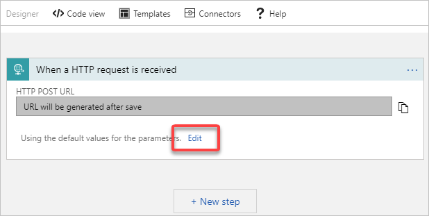
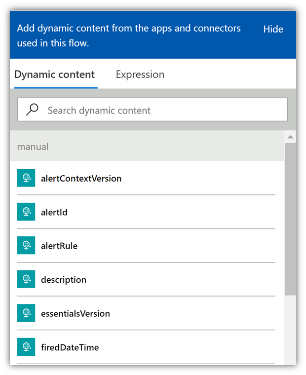
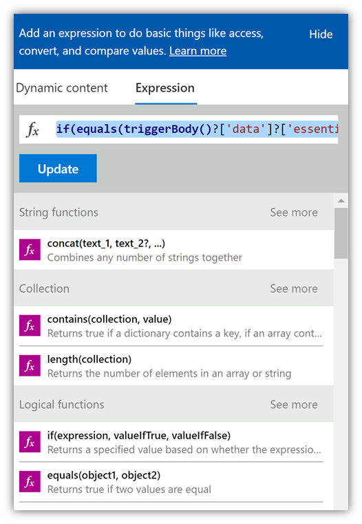

# How to integrate the common alert schema with Logic Apps

This article shows you how to create a logic app that leverages the common alert schema to handle all your alerts.

## Overview

The [common alert schema](./alerts-common-schema.md) provides a standardized and extensible JSON schema across all your different alert types. The common alert schema is most useful when leveraged programmatically – through webhooks, runbooks, and logic apps. In this article, we demonstrate how a single logic app can be authored to handle all your alerts. The same principles can be applied to other programmatic methods. The logic app described in this article creates well-defined variables for the ['essential' fields](alerts-common-schema-definitions.md#essentials), and also describes how you can handle [alert type](alerts-common-schema-definitions.md#alert-context) specific logic.


## Prerequisites 

This article assumes that the reader is familiar with 
* Setting up alert rules ([metric](../alerts/alerts-metric.md), [log](./alerts-log.md), [activity log](./alerts-activity-log.md))
* Setting up [action groups](./action-groups.md)
* Enabling the [common alert schema](./alerts-common-schema.md#how-do-i-enable-the-common-alert-schema) from within action groups

## Create a logic app leveraging the common alert schema

1. Follow the [steps outlined to create your logic app](./action-groups-logic-app.md). 

1.  Select the trigger: **When a HTTP request is received**.

    

1.  Select **Edit** to change the HTTP request trigger.

    


1.  Copy and paste the following schema:

    ```json
        {
            "type": "object",
            "properties": {
                "schemaId": {
                    "type": "string"
                },
                "data": {
                    "type": "object",
                    "properties": {
                        "essentials": {
                            "type": "object",
                            "properties": {
                                "alertId": {
                                    "type": "string"
                                },
                                "alertRule": {
                                    "type": "string"
                                },
                                "severity": {
                                    "type": "string"
                                },
                                "signalType": {
                                    "type": "string"
                                },
                                "monitorCondition": {
                                    "type": "string"
                                },
                                "monitoringService": {
                                    "type": "string"
                                },
                                "alertTargetIDs": {
                                    "type": "array",
                                    "items": {
                                        "type": "string"
                                    }
                                },
                                "originAlertId": {
                                    "type": "string"
                                },
                                "firedDateTime": {
                                    "type": "string"
                                },
                                "resolvedDateTime": {
                                    "type": "string"
                                },
                                "description": {
                                    "type": "string"
                                },
                                "essentialsVersion": {
                                    "type": "string"
                                },
                                "alertContextVersion": {
                                    "type": "string"
                                }
                            }
                        },
                        "alertContext": {
                            "type": "object",
                            "properties": {}
                        }
                    }
                }
            }
        }
    ```

1. Select **+** **New step** and then choose **Add an action**.

    

1. At this stage, you can add a variety of connectors (Microsoft Teams, Slack, Salesforce, etc.) based on your specific business requirements. You can use the 'essential fields' out-of-the-box. 

    
    
    Alternatively, you can author conditional logic based on the alert type using the 'Expression' option.

    
    
     The ['monitoringService' field](alerts-common-schema-definitions.md#alert-context) allows you to uniquely identify the alert type, based on which you can create the conditional logic.

    
    For example, the below snippet checks if the alert is a Application Insights based log alert, and if so prints the search results. Else, it prints 'NA'.

    ```text
      if(equals(triggerBody()?['data']?['essentials']?['monitoringService'],'Application Insights'),triggerBody()?['data']?['alertContext']?['SearchResults'],'NA')
    ```
    
     Learn more about [writing logic app expressions](../../logic-apps/workflow-definition-language-functions-reference.md#logical-comparison-functions).

    


## Next steps

* [Learn more about action groups](./action-groups.md).
* [Learn more about the common alert schema](./alerts-common-schema.md).