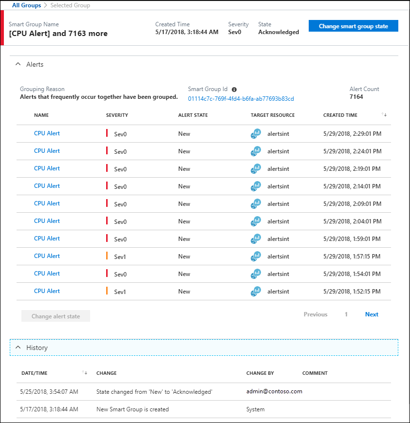

# Smart groups

A common challenge faced when dealing with alerts is sifting through the noise to find out what actually matters - smart groups are intended to be the solution to that problem.  

Smart groups are automatically created by using machine learning algorithms to combine related alerts that represent a single issue.  When an alert is created, the algorithm adds it to a new smart group or an existing smart group based on information such as historical patterns, similar properties, and similar structure. For example, if % CPU on several virtual machines in a subscription simultaneously spikes leading to many individual alerts, and if such alerts have occurred together anytime in the past, these alerts will likely be grouped into a single Smart Group, suggesting a potential common root cause. This means that for someone troubleshooting alerts, smart groups not only allows them to reduce noise by managing related alerts as a single aggregated unit, it also guides them towards possible common root causes for their alerts.

Currently, the algorithm only considers alerts from the same monitor service within a subscription. Smart groups can reduce up to 99% of alert noise through this consolidation. You can view the reason that alerts were included in a group in the smart group details page.

You can view the details of smart groups and set the state similarly to how you can with alerts. Each alert is a member of one and only one smart group. 

## Smart group state

Smart group state is a similar concept to the alert state, which allows you to manage the resolution process at the level of a smart group. Similar to the alert state, when a smart group is created, it has the **New** state, which can be changed to either **Acknowledged** or **Closed**.

The following smart group states are supported.

| State | Description |
|:---|:---|
| New | The issue has just been detected and has not yet been reviewed. |
| Acknowledged | An administrator has reviewed the smart group and started working on it. |
| Closed | The issue has been resolved. After a smart group has been closed, you can reopen it by changing it to another state. |

[Learn how to change the state of your smart group.](./alerts-managing-alert-states.md?toc=%2fazure%2fazure-monitor%2ftoc.json)

> [!NOTE]
>  Changing the state of a smart group does not change the state of the individual member alerts.

## Smart group details page

The Smart group detail page is displayed when you select a smart group. It provides details about the smart group, including the reasoning that was used to create the group, and enables you to change its state.
 

The smart group detail page includes the following sections.

| Section | Description |
|:---|:---|
| Alerts | Lists the individual alerts that are included in the smart group. Select an alert to open its alert detail page. |
| History | Lists each action taken by the smart group and any changes that are made to it. This is currently limited to state changes and alert membership changes. |

## Smart group taxonomy

The name of a smart group is the name of its first alert. You can't create or rename a smart group.

## Next steps

- [Manage smart groups](./alerts-managing-smart-groups.md?toc=%2fazure%2fazure-monitor%2ftoc.json)
- [Change your alert and smart group state](./alerts-managing-alert-states.md?toc=%2fazure%2fazure-monitor%2ftoc.json)