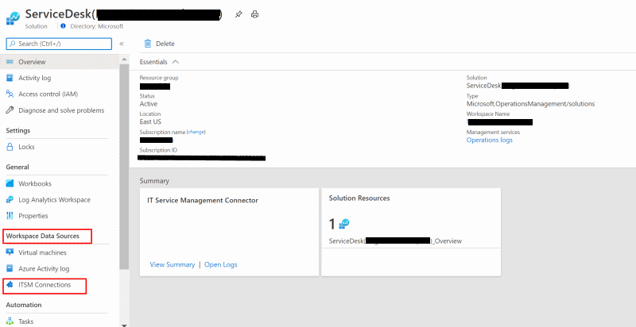
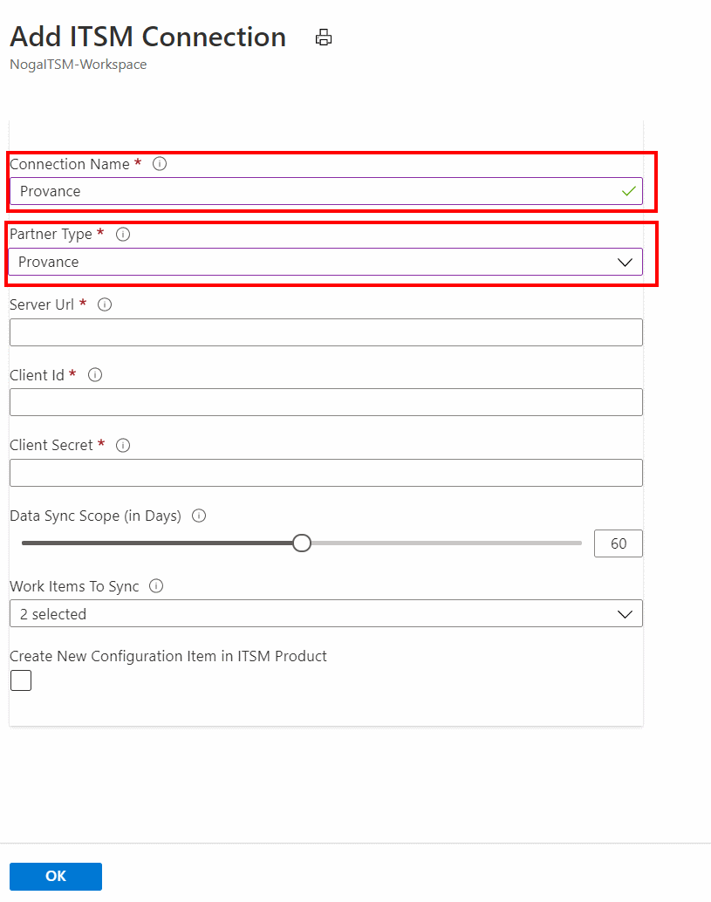

# Connect Provance with IT Service Management Connector

This article provides information about how to configure the connection between your Provance instance and the IT Service Management Connector (ITSMC) in Log Analytics to centrally manage your work items.

> [!NOTE]
> As of 1-Oct-2020 Provance ITSM integration with Azure Alert will no longer be enabled for new customers. New ITSM Connections will not be supported.
> Existing ITSM connections will be supported.

The following sections provide details about how to connect your Provance product to ITSMC in Azure.

## Prerequisites

Ensure the following prerequisites are met:

- ITSMC installed. More information: [Adding the IT Service Management Connector Solution](./itsmc-definition.md#add-it-service-management-connector).
- Provance App should be registered with Azure AD - and client ID is made available. For detailed information, see [how to configure active directory authentication](../../app-service/configure-authentication-provider-aad.md).

- User role:  Administrator.

## Connection procedure

Use the following procedure to create a Provance connection:

1. In Azure portal, go to **All Resources** and look for **ServiceDesk(YourWorkspaceName)**

2. Under **WORKSPACE DATA SOURCES** click **ITSM Connections**.
	

3. At the top of the right pane, click **Add**.

4. Provide the information as described in the following table, and click **OK** to create the connection.

> [!NOTE]
> All these parameters are mandatory.

| **Field** | **Description** |
| --- | --- |
| **Connection Name**   | Type a name for the Provance instance that you want to connect with ITSMC.  You use this name later when you configure work items in this ITSM/ view detailed log analytics. |
| **Partner type**   | Select **Provance**. |
| **Username**   | Type the user name that can connect to ITSMC.    |
| **Password**   | Type the password associated with this user name. **Note:** User name and password are used for generating authentication tokens only, and are not stored anywhere within the ITSMC service.|
| **Server URL**   | Type the URL of your Provance instance that you want to connect to ITSMC. |
| **Client ID**   | Type the client ID for authenticating this connection, which you generated in your Provance instance.  More information on client ID, see [how to configure active directory authentication](../../app-service/configure-authentication-provider-aad.md). |
| **Data Sync Scope**   | Select the Provance work items that you want to sync to Azure Log Analytics, through ITSMC.  These work items are imported into log analytics.   **Options:**   Incidents, Change Requests.|
| **Sync Data** | Type the number of past days that you want the data from. **Maximum limit**: 120 days. |
| **Create new configuration item in ITSM solution** | Select this option if you want to create the configuration items in the ITSM product. When selected, ITSMC creates the affected CIs as configuration items (in case of non-existing CIs) in the supported ITSM system. **Default**: disabled.|

**When successfully connected, and synced**:

- Selected work items from this Provance instance are imported into Azure **Log Analytics.** You can view the summary of these work items on the IT Service Management Connector tile.

- You can create incidents from Log Analytics alerts or from log records, or from Azure alerts in this Provance instance.

## Next steps

* [ITSM Connector Overview](itsmc-overview.md)
* [Create ITSM work items from Azure alerts](./itsmc-definition.md#create-itsm-work-items-from-azure-alerts)
* [Troubleshooting problems in ITSM Connector](./itsmc-resync-servicenow.md)