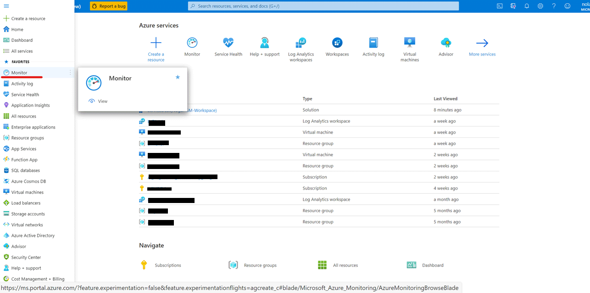
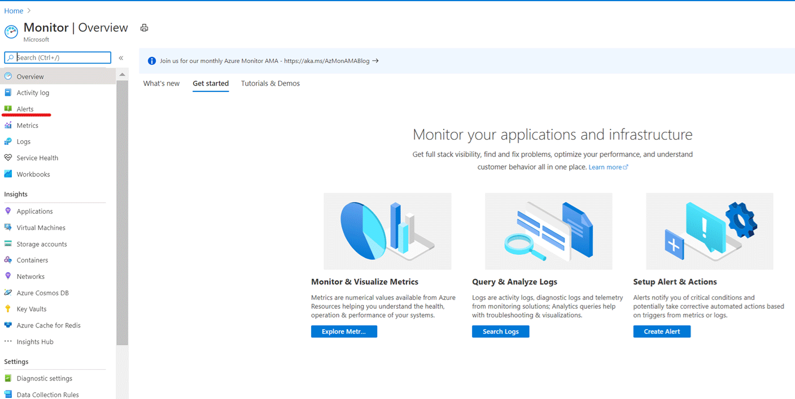
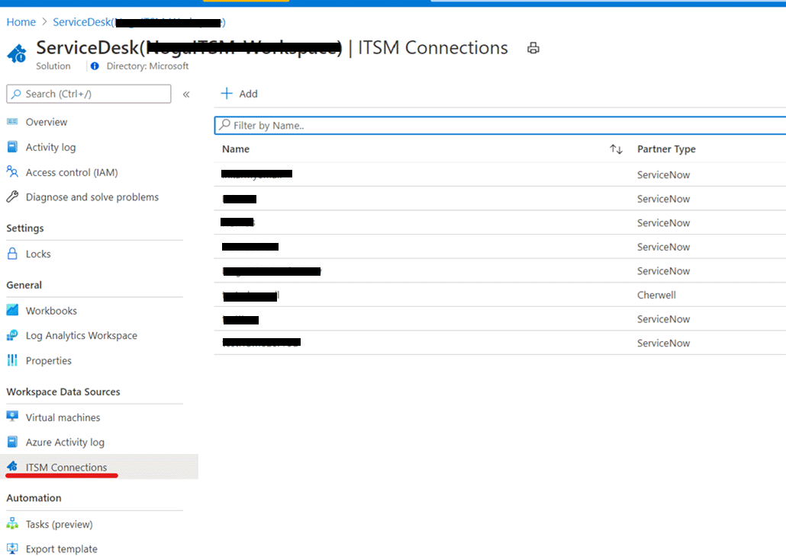
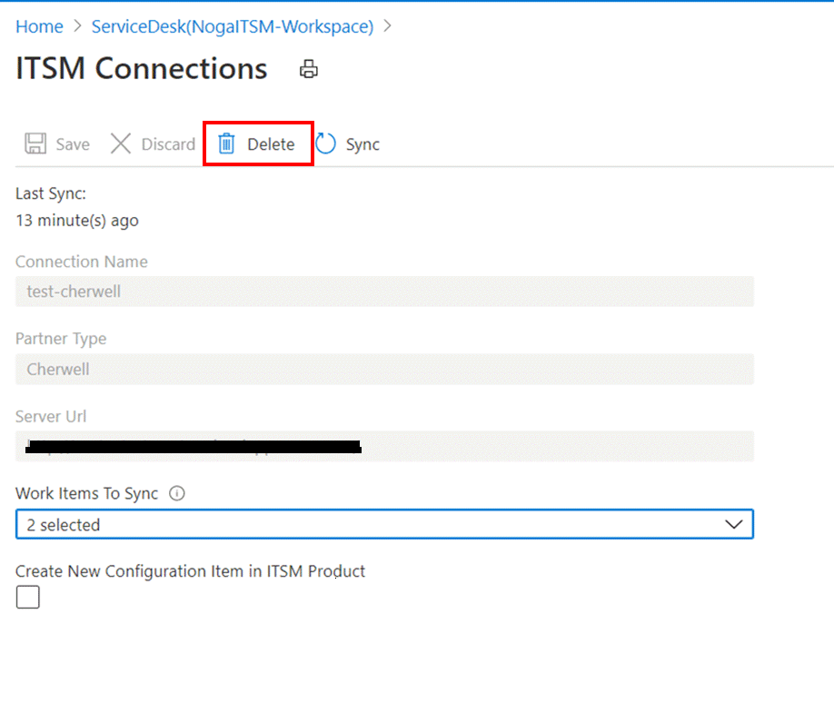

# Delete unused ITSM connectors

The process of deleting unused IT service management (ITSM) connectors has two phases. You delete all the actions that are associated with an ITSM connector, and then you delete the connector itself. You delete the actions first because actions without a connector might cause errors in your subscription.

## Delete associated actions

1. In the Azure portal, select **Monitor**.
  
    

2. Select **Alerts**.
   
    

3. Select **Manage Actions**.
   
    

4. Select an action group that's associated with the ITSM connector that you want to delete. This article uses the example of a Cherwell connector.
   
    

5. Review the information, and then select **Delete action group**.

    

## Delete the connector

1. On the search bar, search for **servicedesk**. Then select **ServiceDesk** in the list of resources.

    

2. Select **ITSM Connections**, and then select the Cherwell connector.

    

3. Select **Delete**.

    

## Next steps

* [Troubleshooting problems in an ITSM connector](./itsmc-resync-servicenow.md)
