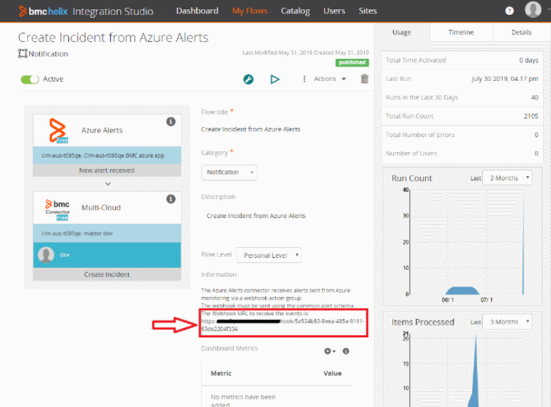

# Connect BMC Helix to Azure Monitor

The following sections provide details about how to connect your BMC Helix product and Secure Export in Azure.

## Prerequisites

Ensure that you've met the following prerequisites:

* Azure AD is registered.
* You have the supported version of BMC Helix Multi-Cloud Service Management (version 19.08 or later).

## Configure the BMC Helix connection

1. Use the following procedure in the BMC Helix environment in order to get the URI for the secure export:

   1. Log in to Integration Studio.
   1. Search for the **Create Incident from Azure Alerts** flow.
   1. Copy the webhook URL .
   
   
   
2. Follow the instructions according to the version:
   * [Enabling prebuilt integration with Azure Monitor for version 20.02](https://docs.bmc.com/docs/multicloud/enabling-prebuilt-integration-with-azure-monitor-879728195.html).
   * [Enabling prebuilt integration with Azure Monitor for version 19.11](https://docs.bmc.com/docs/multicloudprevious/enabling-prebuilt-integration-with-azure-monitor-904157623.html).

3. As a part of the configuration of the connection in BMC Helix, go into your integration BMC instance and follow these instructions:

   1. Select **catalog**.
   2. Select **Azure alerts**.
   3. Select **connectors**.
   4. Select **configuration**.
   5. Select the **add new connection** configuration.
   6. Fill in the information for the configuration section:
      - **Name**: Make up your own.
      - **Authorization type**: **NONE**
      - **Description**: Make up your own.
      - **Site**: **Cloud**
      - **Number of instances**: **2**, the default value.
      - **Check**: Selected by default to enable usage.
      - The Azure tenant ID and Azure application ID are taken from the application that you defined earlier.

