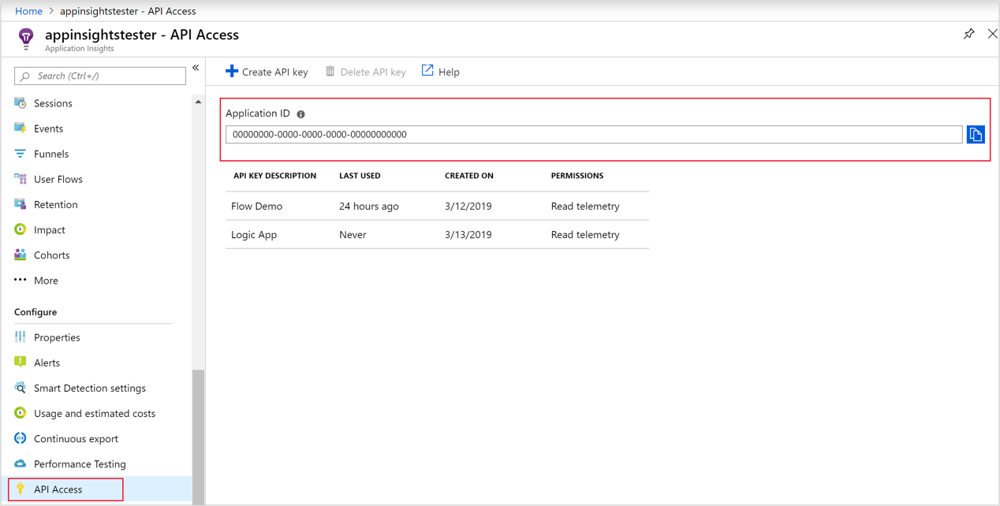
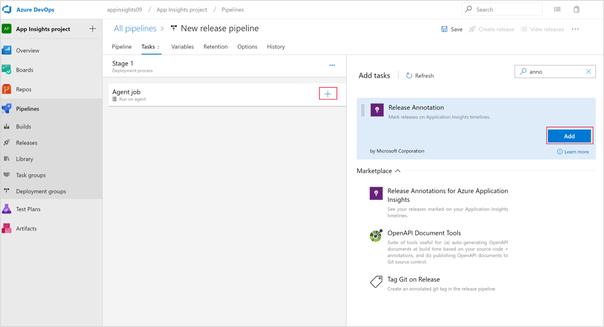
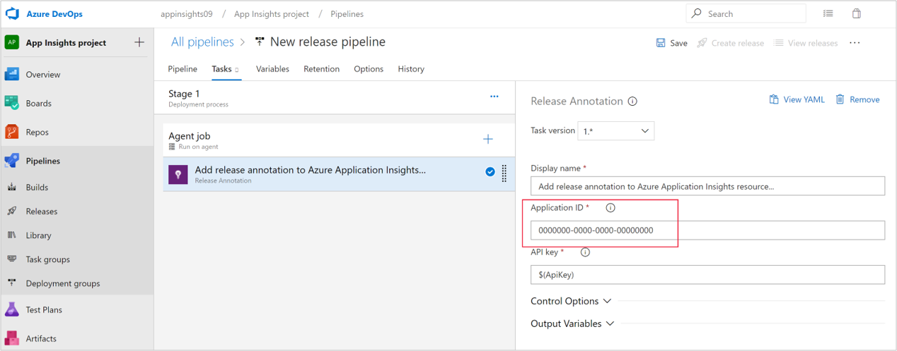
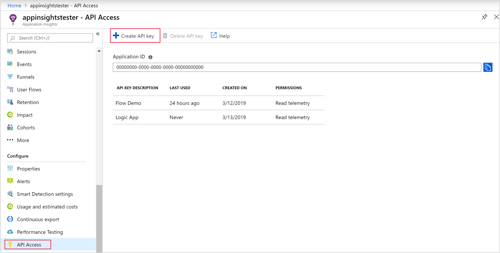
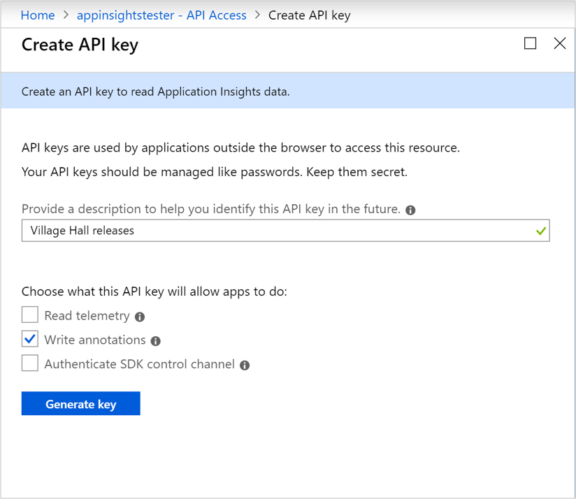

# Annotations on metric charts in Application Insights

Annotations on [Metrics Explorer](../../azure-monitor/app/metrics-explorer.md) charts show where you deployed a new build, or other significant event. They make it easy to see whether your changes had any effect on your application's performance. They can be automatically created by the [Azure DevOps Services build system](https://docs.microsoft.com/azure/devops/pipelines/tasks/). You can also create annotations to flag any event you like by creating them from PowerShell.

> [!NOTE]
> This article reflects the deprecated **classic metrics experience**. Annotations are only currently available in the classic experience and in **[workbooks](../../azure-monitor/app/usage-workbooks.md)**. To learn more about the current metrics experience, you can consult [this article](../../azure-monitor/platform/metrics-charts.md).


## Release annotations with Azure DevOps Services build

Release annotations are a feature of the cloud-based Azure Pipelines service of Azure DevOps Services.

### Install the Annotations extension (one time)
To be able to create release annotations, you'll need to install one of the many Azure DevOps Services extensions available in the Visual Studio Marketplace.

1. Sign in to your [Azure DevOps Services](https://azure.microsoft.com/services/devops/) project.
2. In Visual Studio Marketplace, [get the Release Annotations extension](https://marketplace.visualstudio.com/items/ms-appinsights.appinsightsreleaseannotations), and add it to your Azure DevOps Services organization.


You only need to do this once for your Azure DevOps Services organization. Release annotations can now be configured for any project in your organization.

### Configure release annotations

You need to get a separate API key for each Azure DevOps Services release template.

1. Sign in to the [Microsoft Azure portal](https://portal.azure.com) and open the Application Insights resource that monitors your application. (Or [create one now](../../azure-monitor/app/app-insights-overview.md), if you haven't done so yet.)
2. Open the **API Access** tab and copy the **Application Insights ID**.
   
    

4. In a separate browser window, open (or create) the release template that manages your deployments from Azure DevOps Services.
   
    Add a task, and select the Application Insights Release Annotation task from the menu.

   

    Paste the **Application ID** that you copied from the API Access tab.
   
    

5. Back in the Azure window, create a new API Key and take a copy of it.
   
    

    

6. Open the Configuration tab of the release template.
   
    Create a variable definition for `ApiKey`.
   
    Paste your API key to the ApiKey variable definition.
   
    
1. Finally, **Save** the release pipeline.


## View annotations
Now, whenever you use the release template to deploy a new release, an annotation will be sent to Application Insights. The annotations will appear on charts in Metrics Explorer.

Click on any annotation marker (light grey arrow) to open details about the release, including requestor, source control branch, release pipeline, environment, and more.


## Create custom annotations from PowerShell
You can also create annotations from any process you like (without using Azure DevOps Services). 


1. Make a local copy of the [Powershell script from GitHub](https://github.com/Microsoft/ApplicationInsights-Home/blob/master/API/CreateReleaseAnnotation.ps1).

2. Get the Application ID and create an API key from the API Access tab.

3. Call the script like this:

```PS

     .\CreateReleaseAnnotation.ps1 `
      -applicationId "<applicationId>" `
      -apiKey "<apiKey>" `
      -releaseName "<myReleaseName>" `
      -releaseProperties @{
          "ReleaseDescription"="a description";
          "TriggerBy"="My Name" }
```

It's easy to modify the script, for example to create annotations for the past.

## Next steps

* [Create work items](../../azure-monitor/app/diagnostic-search.md#create-work-item)
* [Automation with PowerShell](../../azure-monitor/app/powershell.md)
