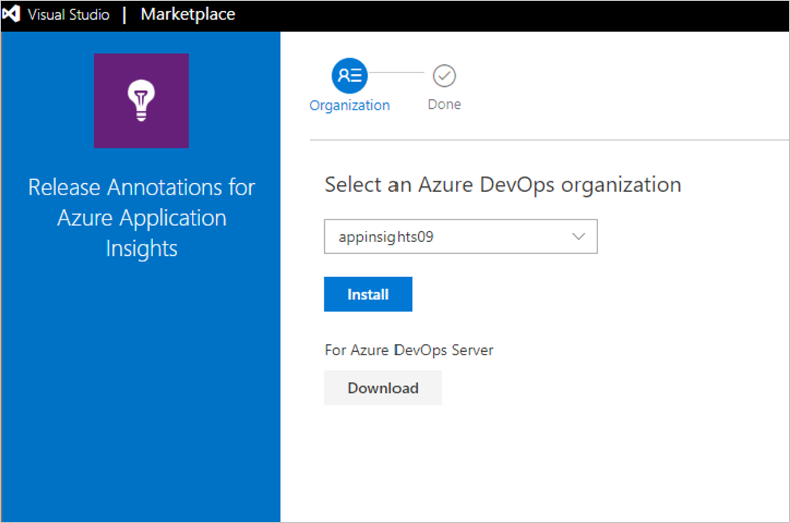
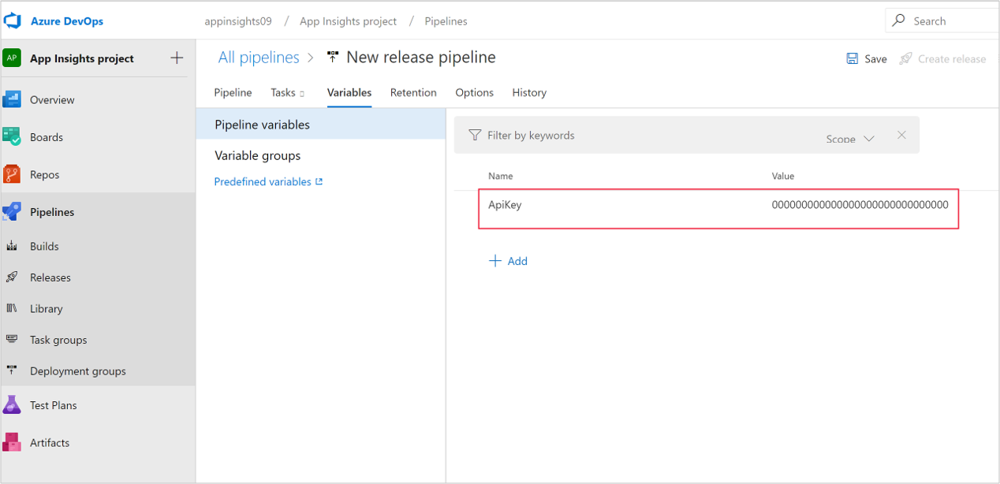
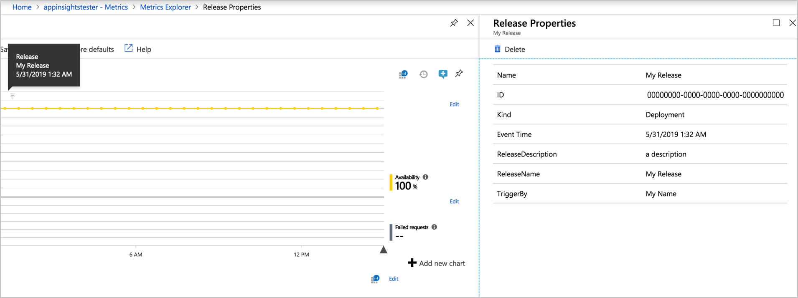

# Annotations on metric charts in Application Insights

Annotations on [Metrics Explorer](../../azure-monitor/app/metrics-explorer.md) charts show where you deployed a new build, or other significant events. Annotations make it easy to see whether your changes had any effect on your application's performance. They can be automatically created by the [Azure Pipelines](https://docs.microsoft.com/azure/devops/pipelines/tasks/) build system. You can also create annotations to flag any event you like by creating them from PowerShell.

> [!NOTE]
> This article reflects the deprecated **classic metrics experience**. Annotations are only currently available in the classic experience and in **[workbooks](../../azure-monitor/app/usage-workbooks.md)**. To learn more about the current metrics experience, see [Advanced features of Azure Metrics Explorer](../../azure-monitor/platform/metrics-charts.md).


## Release annotations with Azure Pipelines build

Release annotations are a feature of the cloud-based Azure Pipelines service of Azure DevOps.

### Install the Annotations extension (one time)
To be able to create release annotations, you'll need to install one of the many Azure DevOps extensions available in the Visual Studio Marketplace.

1. Sign in to your [Azure DevOps](https://azure.microsoft.com/services/devops/) project.
   
1. On the Visual Studio Marketplace [Release Annotations extension](https://marketplace.visualstudio.com/items/ms-appinsights.appinsightsreleaseannotations) page, select your Azure DevOps organization, and then select **Install** to add the extension to your Azure DevOps organization.
   
   
   
You only need to install the extension once for your Azure DevOps organization. You can now configure release annotations for any project in your organization.

### Configure release annotations

Create a separate API key for each of your Azure Pipelines release templates.

1. Sign in to the [Azure portal](https://portal.azure.com) and open the Application Insights resource that monitors your application. Or if you don't have one, [create a new Application Insights resource](../../azure-monitor/app/app-insights-overview.md).
   
1. Open the **API Access** tab and copy the **Application Insights ID**.
   
   

1. In a separate browser window, open or create the release template that manages your Azure Pipelines deployments.
   
1. Select **Add task**, and then select the **Application Insights Release Annotation** task from the menu.
   
   

   > [!NOTE]
   > The Release Annotation task currently supports only Windows-based agents; it won't run on Linux, macOS, or other types of agents.
   
1. Under **Application ID**, paste the Application Insights ID you copied from the **API Access** tab.
   
   
   
1. Back in the Application Insights **API Access** window, select **Create API Key**. 
   
   
   
1. In the **Create API key** window, type a description, select **Write annotations**, and then select **Generate key**. Copy the new key.
   
   
   
1. In the release template window, on the **Variables** tab, select **Add** to create a variable definition for the new API key.

1. Under **Name**, enter `ApiKey`, and under **Value**, paste the API key you copied from the **API Access** tab.
   
   
   
1. Select **Save** in the main release template window to save the template.

## View annotations
Now, whenever you use the release template to deploy a new release, an annotation is sent to Application Insights. The annotations appear on charts in **Metrics Explorer**.

Select any annotation marker (light gray arrow) to open details about the release, including requestor, source control branch, release pipeline, and environment.



## Create custom annotations from PowerShell
You can use the [CreateReleaseAnnotation](https://github.com/Microsoft/ApplicationInsights-Home/blob/master/API/CreateReleaseAnnotation.ps1) PowerShell script from GitHub to create annotations from any process you like, without using Azure DevOps. 

1. Make a local copy of [CreateReleaseAnnotation.ps1](https://github.com/Microsoft/ApplicationInsights-Home/blob/master/API/CreateReleaseAnnotation.ps1).
   
1. Use the steps in the preceding procedure to get your Application Insights ID and create an API key from your Application Insights **API Access** tab.
   
1. Call the PowerShell script with the following code, replacing the angle-bracketed placeholders with your values. The `-releaseProperties` are optional. 
   
   ```powershell
   
        .\CreateReleaseAnnotation.ps1 `
         -applicationId "<applicationId>" `
         -apiKey "<apiKey>" `
         -releaseName "<releaseName>" `
         -releaseProperties @{
             "ReleaseDescription"="<a description>";
             "TriggerBy"="<Your name>" }
   ```

You can modify the script, for example to create annotations for the past.

## Next steps

* [Create work items](../../azure-monitor/app/diagnostic-search.md#create-work-item)
* [Automation with PowerShell](../../azure-monitor/app/powershell.md)
