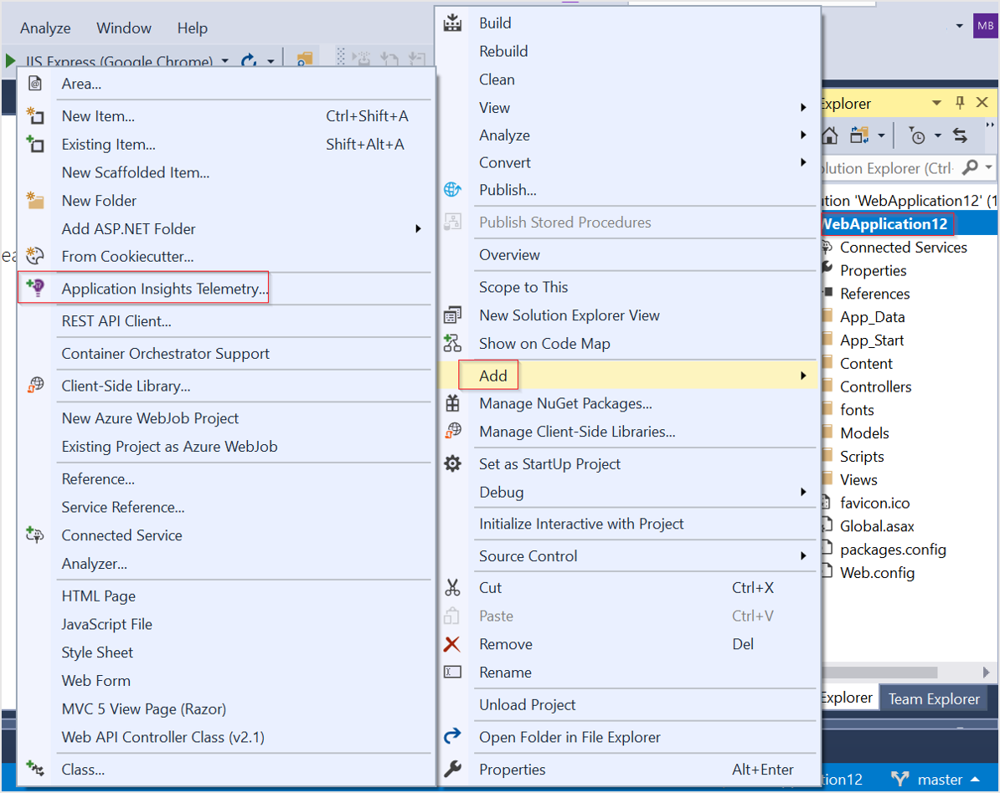
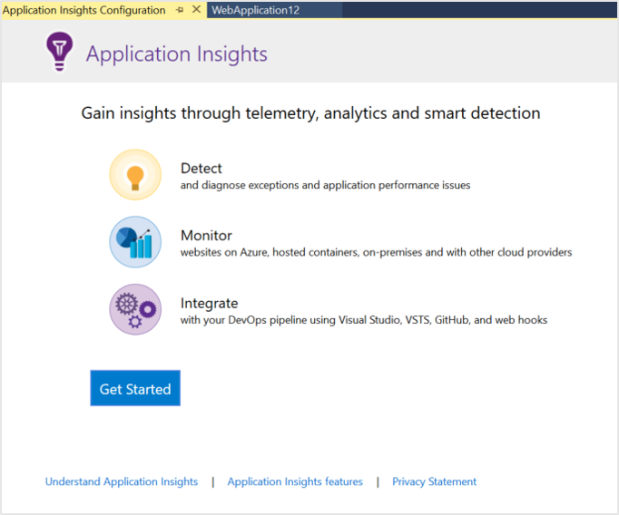
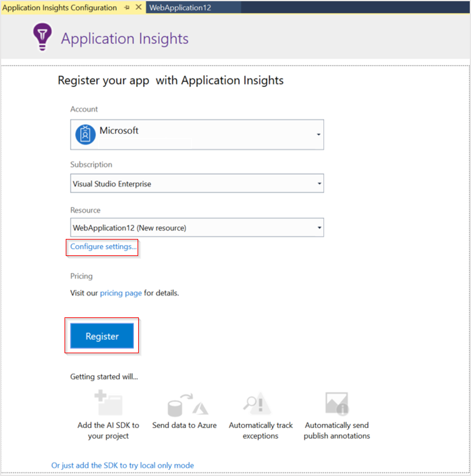
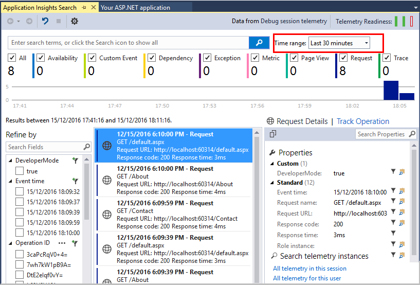
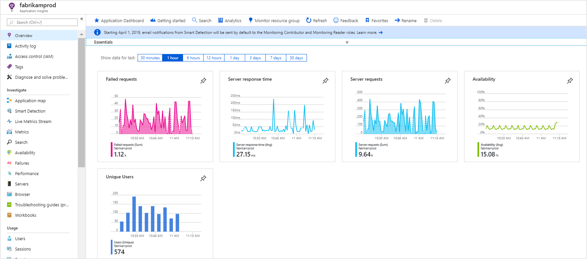

# Set up Application Insights for your ASP.NET website

This procedure configures your ASP.NET web app to send telemetry to the [Azure Application Insights](../../azure-monitor/app/app-insights-overview.md) service. It works for ASP.NET apps that are hosted either in your own IIS server on-premises or in the Cloud. You get charts and a powerful query language that help you understand the performance of your app and how people are using it, plus automatic alerts on failures or performance issues. Many developers find these features great as they are, but you can also extend and customize the telemetry if you need to.

Setup takes just a few clicks in Visual Studio. You have the option to avoid charges by limiting the volume of telemetry. This functionality allows you to experiment and debug, or to monitor a site with not many users. When you decide you want to go ahead and monitor your production site, it's easy to raise the limit later.

## Prerequisites
To add Application Insights to your ASP.NET website, you need to:

- Install [Visual Studio 2019 for Windows](https://www.visualstudio.com/downloads/) with the following workloads:
	- ASP.NET and web development (Do not uncheck the optional components)
	- Azure development

If you don't have an Azure subscription, create a [free](https://azure.microsoft.com/free/) account before you begin.

##  Step 1: Add the Application Insights SDK

> [!IMPORTANT]
> The screenshots in this example are based on Visual Studio 2017 version 15.9.9 and later. The experience to add Application Insights varies across versions of Visual Studio as well as by ASP.NET template type. Older versions may have alternate text such as "Configure Application Insights".

Right-click your web app name in the Solution Explorer, and choose **Add** > **Application Insights Telemetry**

(Depending on your Application Insights SDK version you may be prompted to upgrade to the latest SDK release. If prompted, select **Update SDK**.)

Application Insights Configuration screen:

Select **Get Started**.

If you want to set the resource group or the location where your data is stored, click **Configure settings**. Resource groups are used to control access to data. For example, if you have several apps that form part of the same system, you might put their Application Insights data in the same resource group.

 Select **Register**.

 Telemetry will be sent to the [Azure portal](https://portal.azure.com), both during debugging and after you have published your app.
> [!NOTE]
> If you don't want to send telemetry to the portal while you're debugging, just add the Application Insights SDK to your app but don't configure a resource in the portal. You are able to see telemetry in Visual Studio while you are debugging. Later, you can return to this configuration page, or you could wait until after you have deployed your app and [switch on telemetry at run time](../../azure-monitor/app/monitor-performance-live-website-now.md).

##  Step 2: Run your app
Run your app with F5. Open different pages to generate some telemetry.

In Visual Studio, you will see a count of the events that have been logged.

## Step 3: See your telemetry
You can see your telemetry either in Visual Studio or in the Application Insights web portal. Search telemetry in Visual Studio to help you debug your app. Monitor performance and usage in the web portal when your system is live. 

### See your telemetry in Visual Studio

In Visual Studio, to view Application Insights data.  Select **Solution Explorer** > **Connected Services** > right-click **Application Insights**, and then click **Search Live Telemetry**.

In the Visual Studio Application Insights Search window, you will see the data from your application for telemetry generated in the server side of your app. Experiment with the filters, and click any event to see more detail.

> [!Tip]
> If you don't see any data, make sure the time range is correct, and click the Search icon.

[Learn more about Application Insights tools in Visual Studio](../../azure-monitor/app/visual-studio.md).

### See telemetry in web portal

You can also see telemetry in the Application Insights web portal (unless you chose to install only the SDK). The portal has more charts, analytic tools, and cross-component views than Visual Studio. The portal also provides alerts.

Open your Application Insights resource. Either sign into the [Azure portal](https://portal.azure.com/) and find it there, or select **Solution Explorer** > **Connected Services** > right-click **Application Insights** > **Open Application Insights Portal** and let it take you there.

The portal opens on a view of the telemetry from your app.

In the portal, click any tile or chart to see more detail.

## Step 4: Publish your app
Publish your app to your IIS server or to Azure. Watch [Live Metrics Stream](../../azure-monitor/app/metrics-explorer.md#live-metrics-stream) to make sure everything is running smoothly.

Your telemetry builds up in the Application Insights portal, where you can monitor metrics, search your telemetry. You can also use the powerful [Kusto query language](/azure/kusto/query/) to analyze usage and performance, or to find specific events.

You can also continue to analyze your telemetry in [Visual Studio](../../azure-monitor/app/visual-studio.md), with tools such as diagnostic search and [trends](../../azure-monitor/app/visual-studio-trends.md).

> [!NOTE]
> If your app sends enough telemetry to approach the [throttling limits](../../azure-monitor/app/pricing.md#limits-summary), automatic [sampling](../../azure-monitor/app/sampling.md) switches on. Sampling reduces the quantity of telemetry sent from your app, while preserving correlated data for diagnostic purposes.
>
>

##  You're all set

Congratulations! You installed the Application Insights package in your app, and configured it to send telemetry to the Application Insights service on Azure.

The Azure resource that receives your app's telemetry is identified by an *instrumentation key*. You'll find this key in the ApplicationInsights.config file.

## Upgrade to future SDK versions
To upgrade to a [new release of the SDK](https://github.com/Microsoft/ApplicationInsights-dotnet-server/releases), open the **NuGet package manager**, and filter on installed packages. Select **Microsoft.ApplicationInsights.Web**, and choose **Upgrade**.

If you made any customizations to ApplicationInsights.config, save a copy of it before you upgrade. Then, merge your changes into the new version.

## Video

* External step-by-step video about [configuring Application Insights with a .NET application from scratch](https://www.youtube.com/watch?v=blnGAVgMAfA).

## Next steps

There are alternative topics to look at if you are interested in:

* [Instrumenting a web app at runtime](../../azure-monitor/app/monitor-performance-live-website-now.md)
* [Azure Cloud Services](../../azure-monitor/app/cloudservices.md)

### More telemetry

* **[Browser and page load data](../../azure-monitor/app/javascript.md)** - Insert a code snippet in your web pages.
* **[Get more detailed dependency and exception monitoring](../../azure-monitor/app/monitor-performance-live-website-now.md)** - Install Status Monitor on your server.
* **[Code custom events](../../azure-monitor/app/api-custom-events-metrics.md)** to count, time, or measure user actions.
* **[Get log data](../../azure-monitor/app/asp-net-trace-logs.md)** - Correlate log data with your telemetry.

### Analysis

* **[Working with Application Insights in Visual Studio](../../azure-monitor/app/visual-studio.md)** Includes information about debugging with telemetry, diagnostic search, and drill through to code.
* **[Analytics](../../azure-monitor/log-query/get-started-portal.md)** - The powerful query language.

### Alerts

* [Availability tests](../../azure-monitor/app/monitor-web-app-availability.md): Create tests to make sure your site is visible on the web.
* [Smart diagnostics](../../azure-monitor/app/proactive-diagnostics.md): These tests run automatically, so you don't have to do anything to set them up. They tell you if your app has an unusual rate of failed requests.
* [Metric alerts](../../azure-monitor/app/alerts.md): Set alerts to warn you if a metric crosses a threshold. You can set them on custom metrics that you code into your app.

### Automation

* [Automate creating an Application Insights resource](../../azure-monitor/app/powershell.md)
