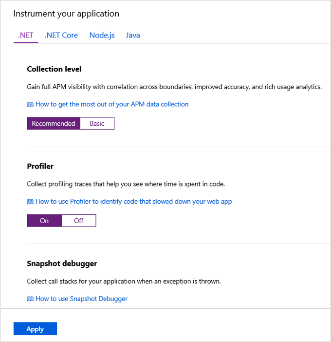
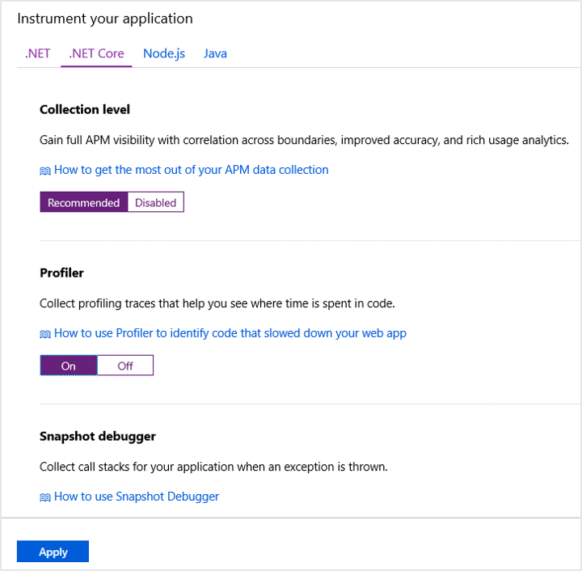
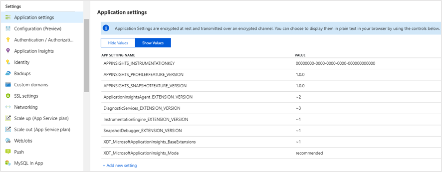
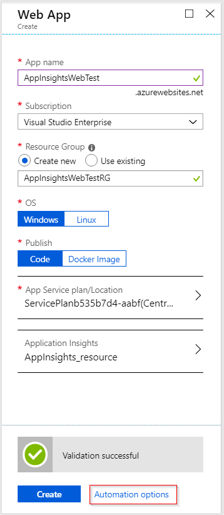
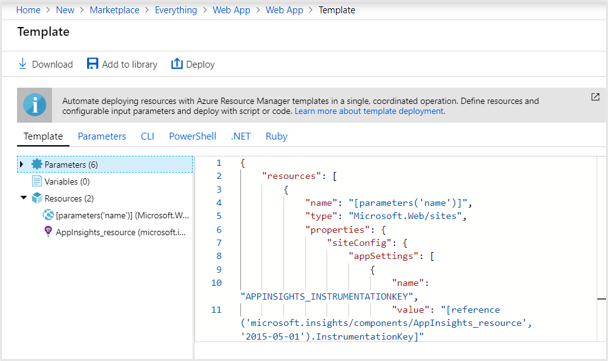
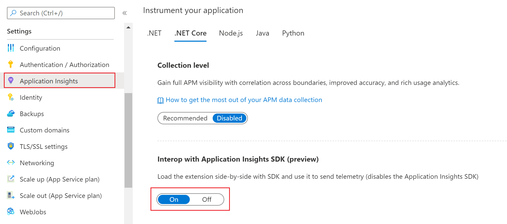

# Monitor Azure App Service performance

Enabling monitoring on your ASP.NET and ASP.NET Core based web applications running on [Azure App Services](../../app-service/index.yml) is now easier than ever. Whereas previously you needed to manually install a site extension, the latest extension/agent is now built into the app service image by default. This article will walk you through enabling Application Insights monitoring as well as provide preliminary guidance for automating the process for large-scale deployments.

> [!NOTE]
> Manually adding an Application Insights site extension via **Development Tools** > **Extensions** is deprecated. This method of extension installation was dependent on manual updates for each new version. The latest stable release of the extension is now  [preinstalled](https://github.com/projectkudu/kudu/wiki/Azure-Site-Extensions) as part of the App Service image. The files are located in `d:\Program Files (x86)\SiteExtensions\ApplicationInsightsAgent` and are automatically updated with each stable release. If you follow the agent based instructions to enable monitoring below, it will automatically remove the deprecated extension for you.

## Enable Application Insights

There are two ways to enable application monitoring for Azure App Services hosted applications:

* **Agent-based application monitoring** (ApplicationInsightsAgent).  
    * This method is the easiest to enable, and no advanced configuration is required. It is often referred to as "runtime" monitoring. For Azure App Services we recommend at a minimum enabling this level of monitoring, and then based on your specific scenario you can evaluate whether more advanced monitoring through manual instrumentation is needed.

* **Manually instrumenting the application through code** by installing the Application Insights SDK.

    * This approach is much more customizable, but it requires [adding a dependency on the Application Insights SDK NuGet packages](./asp-net.md). This method, also means you have to manage the updates to the latest version of the packages yourself.

    * If you need to make custom API calls to track events/dependencies not captured by default with agent-based monitoring, you would need to use this method. Check out the [API for custom events and metrics article](./api-custom-events-metrics.md) to learn more. This is also currently the only supported option for Linux based workloads.

> [!NOTE]
> If both agent-based monitoring and manual SDK-based instrumentation is detected, only the manual instrumentation settings will be honored. This is to prevent duplicate data from being sent. To learn more about this, check out the [troubleshooting section](#troubleshooting) below.

## Enable agent-based monitoring

# [ASP.NET](#tab/net)

> [!NOTE]
> The combination of APPINSIGHTS_JAVASCRIPT_ENABLED and urlCompression is not supported. For more info see the explanation in the [troubleshooting section](#troubleshooting).


1. **Select Application Insights** in the Azure control panel for your app service.

    

   * Choose to create a new resource, unless you already set up an Application Insights resource for this application. 

     > [!NOTE]
     > When you click **OK** to create the new resource you will be prompted to **Apply monitoring settings**. Selecting **Continue** will link your new Application Insights resource to your app service, doing so will also **trigger a restart of your app service**. 

     

2. After specifying which resource to use, you can choose how you want application insights to collect data per platform for your application. ASP.NET app monitoring is on-by-default with two different levels of collection.

    
 
 Below is a summary of data collected for each route:
        
| Data | ASP.NET Basic Collection | ASP.NET Recommended collection |
| --- | --- | --- |
| Adds CPU, memory, and I/O usage trends |Yes |Yes |
| Collects usage trends, and enables correlation from availability results to transactions | Yes |Yes |
| Collects exceptions unhandled by the host process | Yes |Yes |
| Improves APM metrics accuracy under load, when sampling is used | Yes |Yes |
| Correlates micro-services across request/dependency boundaries | No (single-instance APM capabilities only) |Yes |

3. To configure settings like sampling, which you could previously control via the applicationinsights.config file you can now interact with those same settings via Application settings with a corresponding prefix. 

    * For example, to change the initial sampling percentage, you can create an Application setting of: `MicrosoftAppInsights_AdaptiveSamplingTelemetryProcessor_InitialSamplingPercentage` and a value of `100`.

    * For the list of supported adaptive sampling telemetry processor settings, you can consult the [code](https://github.com/microsoft/ApplicationInsights-dotnet/blob/master/BASE/Test/ServerTelemetryChannel.Test/TelemetryChannel.Tests/AdaptiveSamplingTelemetryProcessorTest.cs) and [associated documentation](./sampling.md).

# [ASP.NET Core](#tab/netcore)

> [!IMPORTANT]
> The following versions of ASP.NET Core are supported: ASP.NET Core 2.1 and 3.1. Versions 2.0, 2.2, and 3.0 have been retired and are no longer supported. Please upgrade to a [supported version](https://dotnet.microsoft.com/platform/support/policy/dotnet-core) of .NET Core for auto-instrumentation to work.

Targeting the full framework from ASP.NET Core, self-contained deployment, and Linux based applications are currently **not supported** with agent/extension based monitoring. ([Manual instrumentation](./asp-net-core.md) via code will work in all of the previous scenarios.)

1. **Select Application Insights** in the Azure control panel for your app service.

    

   * Choose to create a new resource, unless you already set up an Application Insights resource for this application. 

     > [!NOTE]
     > When you click **OK** to create the new resource you will be prompted to **Apply monitoring settings**. Selecting **Continue** will link your new Application Insights resource to your app service, doing so will also **trigger a restart of your app service**. 

     

2. After specifying which resource to use, you can choose how you want Application Insights to collect data per platform for your application. ASP.NET Core offers **Recommended collection** or **Disabled** for ASP.NET Core 2.1 and 3.1.

    

# [Node.js](#tab/nodejs)

From within your App Service web app under **Settings** > **select Application Insights** > **Enable**. Node.js agent based monitoring is currently in preview.

# [Java](#tab/java)

Follow the guidelines for [Application Insights Java 3.0 agent](./java-in-process-agent.md) to enable auto-instrumentation for your Java apps without changing your code.
The automatic integration is not yet available for App Service.

# [Python](#tab/python)

Python App Service based web applications do not currently support automatic agent/extension based monitoring. To enable monitoring for your Python application, you need to [manually instrument your application](./opencensus-python.md).

---

## Enable client-side monitoring

# [ASP.NET](#tab/net)

Client-side monitoring is opt-in for ASP.NET. To enable client-side monitoring:

* **Settings** **>** **Configuration**
   * Under Application settings, create a **new application setting**:

     Name: `APPINSIGHTS_JAVASCRIPT_ENABLED`

     Value: `true`

   * **Save** the settings and **Restart** your app.

To disable client-side monitoring either remove the associated key value pair from the Application settings, or set the value to false.

# [ASP.NET Core](#tab/netcore)

Client-side monitoring is **enabled by default** for ASP.NET Core apps with **Recommended collection**, regardless of whether the app setting 'APPINSIGHTS_JAVASCRIPT_ENABLED' is present.

If for some reason you would like to disable client-side monitoring:

* **Settings** **>** **Configuration**
   * Under Application settings, create a **new application setting**:

     name: `APPINSIGHTS_JAVASCRIPT_ENABLED`

     Value: `false`

   * **Save** the settings and **Restart** your app.

# [Node.js](#tab/nodejs)

To enable client-side monitoring for your Node.js application, you need to [manually add the client-side JavaScript SDK to your application](./javascript.md).

# [Java](#tab/java)

To enable client-side monitoring for your Java application, you need to [manually add the client-side JavaScript SDK to your application](./javascript.md).

# [Python](#tab/python)

To enable client-side monitoring for your Python application, you need to [manually add the client-side JavaScript SDK to your application](./javascript.md).

---

## Automate monitoring

In order to enable telemetry collection with Application Insights, only the Application settings need to be set:

   

### Application settings definitions

|App setting name |  Definition | Value |
|-----------------|:------------|-------------:|
|ApplicationInsightsAgent_EXTENSION_VERSION | Main extension, which controls runtime monitoring. | `~2` |
|XDT_MicrosoftApplicationInsights_Mode |  In default mode only, essential features are enabled in order to insure optimal performance. | `default` or `recommended`. |
|InstrumentationEngine_EXTENSION_VERSION | Controls if the binary-rewrite engine `InstrumentationEngine` will be turned on. This setting has performance implications and impacts cold start/startup time. | `~1` |
|XDT_MicrosoftApplicationInsights_BaseExtensions | Controls if SQL & Azure table text will be captured along with the dependency calls. Performance warning: application cold start up time will be affected. This setting requires the `InstrumentationEngine`. | `~1` |

### App Service Application settings with Azure Resource Manager

Application settings for App Services can be managed and configured with [Azure Resource Manager templates](../../azure-resource-manager/templates/template-syntax.md). This method can be used when deploying new App Service resources with Azure Resource Manager automation, or for modifying the settings of existing resources.

The basic structure of the application settings JSON for an app service is below:

```JSON
      "resources": [
        {
          "name": "appsettings",
          "type": "config",
          "apiVersion": "2015-08-01",
          "dependsOn": [
            "[resourceId('Microsoft.Web/sites', variables('webSiteName'))]"
          ],
          "tags": {
            "displayName": "Application Insights Settings"
          },
          "properties": {
            "key1": "value1",
            "key2": "value2"
          }
        }
      ]
```

For an example of an Azure Resource Manager template with Application settings configured for Application Insights, this [template](https://github.com/Andrew-MSFT/BasicImageGallery) can be helpful, specifically the section starting on [line 238](https://github.com/Andrew-MSFT/BasicImageGallery/blob/c55ada54519e13ce2559823c16ca4f97ddc5c7a4/CoreImageGallery/Deploy/CoreImageGalleryARM/azuredeploy.json#L238).

### Automate the creation of an Application Insights resource and link to your newly created App Service.

To create an Azure Resource Manager template with all the default Application Insights settings configured, begin the process as if you were going to create a new Web App with Application Insights enabled.

Select **Automation options**

   

This option generates the latest Azure Resource Manager template with all required settings configured.

  

Below is a sample, replace all instances of  `AppMonitoredSite` with your site name:

```json
{
    "resources": [
        {
            "name": "[parameters('name')]",
            "type": "Microsoft.Web/sites",
            "properties": {
                "siteConfig": {
                    "appSettings": [
                        {
                            "name": "APPINSIGHTS_INSTRUMENTATIONKEY",
                            "value": "[reference('microsoft.insights/components/AppMonitoredSite', '2015-05-01').InstrumentationKey]"
                        },
                        {
                            "name": "APPLICATIONINSIGHTS_CONNECTION_STRING",
                            "value": "[reference('microsoft.insights/components/AppMonitoredSite', '2015-05-01').ConnectionString]"
                        },
                        {
                            "name": "ApplicationInsightsAgent_EXTENSION_VERSION",
                            "value": "~2"
                        }
                    ]
                },
                "name": "[parameters('name')]",
                "serverFarmId": "[concat('/subscriptions/', parameters('subscriptionId'),'/resourcegroups/', parameters('serverFarmResourceGroup'), '/providers/Microsoft.Web/serverfarms/', parameters('hostingPlanName'))]",
                "hostingEnvironment": "[parameters('hostingEnvironment')]"
            },
            "dependsOn": [
                "[concat('Microsoft.Web/serverfarms/', parameters('hostingPlanName'))]",
                "microsoft.insights/components/AppMonitoredSite"
            ],
            "apiVersion": "2016-03-01",
            "location": "[parameters('location')]"
        },
        {
            "apiVersion": "2016-09-01",
            "name": "[parameters('hostingPlanName')]",
            "type": "Microsoft.Web/serverfarms",
            "location": "[parameters('location')]",
            "properties": {
                "name": "[parameters('hostingPlanName')]",
                "workerSizeId": "[parameters('workerSize')]",
                "numberOfWorkers": "1",
                "hostingEnvironment": "[parameters('hostingEnvironment')]"
            },
            "sku": {
                "Tier": "[parameters('sku')]",
                "Name": "[parameters('skuCode')]"
            }
        },
        {
            "apiVersion": "2015-05-01",
            "name": "AppMonitoredSite",
            "type": "microsoft.insights/components",
            "location": "West US 2",
            "properties": {
                "ApplicationId": "[parameters('name')]",
                "Request_Source": "IbizaWebAppExtensionCreate"
            }
        }
    ],
    "parameters": {
        "name": {
            "type": "string"
        },
        "hostingPlanName": {
            "type": "string"
        },
        "hostingEnvironment": {
            "type": "string"
        },
        "location": {
            "type": "string"
        },
        "sku": {
            "type": "string"
        },
        "skuCode": {
            "type": "string"
        },
        "workerSize": {
            "type": "string"
        },
        "serverFarmResourceGroup": {
            "type": "string"
        },
        "subscriptionId": {
            "type": "string"
        }
    },
    "$schema": "https://schema.management.azure.com/schemas/2014-04-01-preview/deploymentTemplate.json#",
    "contentVersion": "1.0.0.0"
}
```

### Enabling through PowerShell

In order to enable the application monitoring through PowerShell, only the underlying application settings need to be changed. Below is a sample, which enables application monitoring for a website called "AppMonitoredSite" in the resource group "AppMonitoredRG", and configures data to be sent to the "012345678-abcd-ef01-2345-6789abcd" instrumentation key.

[!INCLUDE [updated-for-az](../../../includes/updated-for-az.md)]

```powershell
$app = Get-AzWebApp -ResourceGroupName "AppMonitoredRG" -Name "AppMonitoredSite" -ErrorAction Stop
$newAppSettings = @{} # case-insensitive hash map
$app.SiteConfig.AppSettings | %{$newAppSettings[$_.Name] = $_.Value} # preserve non Application Insights application settings.
$newAppSettings["APPINSIGHTS_INSTRUMENTATIONKEY"] = "012345678-abcd-ef01-2345-6789abcd"; # set the Application Insights instrumentation key
$newAppSettings["APPLICATIONINSIGHTS_CONNECTION_STRING"] = "InstrumentationKey=012345678-abcd-ef01-2345-6789abcd"; # set the Application Insights connection string
$newAppSettings["ApplicationInsightsAgent_EXTENSION_VERSION"] = "~2"; # enable the ApplicationInsightsAgent
$app = Set-AzWebApp -AppSettings $newAppSettings -ResourceGroupName $app.ResourceGroup -Name $app.Name -ErrorAction Stop
```

## Upgrade monitoring extension/agent

### Upgrading from versions 2.8.9 and up

Upgrading from version 2.8.9 happens automatically, without any additional actions. The new monitoring bits are delivered in the background to the target app service, and on application restart they will be picked up.

To check which version of the extension you are running visit `http://yoursitename.scm.azurewebsites.net/ApplicationInsights`


### Upgrade from versions 1.0.0 - 2.6.5

Starting with version 2.8.9 the pre-installed site extension is used. If you are an earlier version, you can update via one of two ways:

* [Upgrade by enabling via the portal](#enable-application-insights). (Even if you have the Application Insights extension for Azure App Service installed, the UI shows only **Enable** button. Behind the scenes, the old private site extension will be removed.)

* [Upgrade through PowerShell](#enabling-through-powershell):

    1. Set the application settings to enable the pre-installed site extension ApplicationInsightsAgent. See [Enabling through PowerShell](#enabling-through-powershell).
    2. Manually remove the private site extension named Application Insights extension for Azure App Service.

If the upgrade is done from a version prior to 2.5.1, check that the ApplicationInsigths dlls are removed from the application bin folder [see troubleshooting steps](#troubleshooting).

## Troubleshooting

Below is our step-by-step troubleshooting guide for extension/agent based monitoring for ASP.NET and ASP.NET Core based applications running on Azure App Services.

> [!NOTE]
> The recommended approach to monitor Java applications is to use the auto-instrumentation without changing the code. Please follow the guidelines for [Application Insights Java 3.0 agent](./java-in-process-agent.md).


1. Check that the application is monitored via `ApplicationInsightsAgent`.
    * Check that `ApplicationInsightsAgent_EXTENSION_VERSION` app setting is set to a value of "~2".
2. Ensure that the application meets the requirements to be monitored.
    * Browse to `https://yoursitename.scm.azurewebsites.net/ApplicationInsights`

    

    * Confirm that the `Application Insights Extension Status` is `Pre-Installed Site Extension, version 2.8.12.1527, is running.` 
    * If it is not running, follow the [enable Application Insights monitoring instructions](#enable-application-insights)

    * Confirm that the status source exists and looks like: `Status source D:\home\LogFiles\ApplicationInsights\status\status_RD0003FF0317B6_4248_1.json`
        * If a similar value is not present, it means the application is not currently running or is not supported. To ensure that the application is running, try manually visiting the application url/application endpoints, which will allow the runtime information to become available.

    * Confirm that `IKeyExists` is `true`
        * If it is `false`, add `APPINSIGHTS_INSTRUMENTATIONKEY` and `APPLICATIONINSIGHTS_CONNECTION_STRING` with your ikey guid to your application settings.

    * Confirm that there are no entries for `AppAlreadyInstrumented`, `AppContainsDiagnosticSourceAssembly`, and `AppContainsAspNetTelemetryCorrelationAssembly`.
        * If any of these entries exist, remove the following packages from your application: `Microsoft.ApplicationInsights`, `System.Diagnostics.DiagnosticSource`, and `Microsoft.AspNet.TelemetryCorrelation`.
        * For ASP.NET Core apps only: in case your application refers to any Application Insights packages, for example if you have previously instrumented (or attempted to instrument) your app with the [ASP.NET Core SDK](./asp-net-core.md), enabling the App Service integration may not take effect and the data may not appear in Application Insights. To fix the issue, in portal turn on "Interop with Application Insights SDK" and you will start seeing the data in Application Insights 
        > [!IMPORTANT]
        > This functionality is in preview 

        

        The data is now going to be sent using codeless approach even if Application Insights SDK was originally used or attempted to be used.

        > [!IMPORTANT]
        > If the application used Application Insights SDK to send any telemetry, such telemetry will be disabled – in other words, custom telemetry - if any, such as for example any Track*() methods, and any custom settings, such as sampling, will be disabled. 


### PHP and WordPress are not supported

PHP and WordPress sites are not supported. There is currently no officially supported SDK/agent for server-side monitoring of these workloads. However, manually instrumenting client-side transactions on a PHP or WordPress site by adding the client-side JavaScript to your web pages can be accomplished by using the [JavaScript SDK](./javascript.md).

The table below provides a more detailed explanation of what these values mean, their underlying causes, and recommended fixes:

|Problem Value|Explanation|Fix
|---- |----|---|
| `AppAlreadyInstrumented:true` | This value indicates that the extension detected that some aspect of the SDK is already present in the Application, and will back-off. It can be due to a reference to `System.Diagnostics.DiagnosticSource`,  `Microsoft.AspNet.TelemetryCorrelation`, or `Microsoft.ApplicationInsights`  | Remove the references. Some of these references are added by default from certain Visual Studio templates, and older versions of Visual Studio may add references to `Microsoft.ApplicationInsights`.
|`AppAlreadyInstrumented:true` | If the application is targeting ASP.NET Core 2.1 or 2.2, this value indicates that the extension detected that some aspect of the SDK is already present in the Application, and will back-off | Customers on .NET Core 2.1,2.2 are [recommended](https://github.com/aspnet/Announcements/issues/287) to use Microsoft.AspNetCore.App meta-package instead. In addition, turn on "Interop with Application Insights SDK" in portal (see the instructions above).|
|`AppAlreadyInstrumented:true` | This value can also be caused by the presence of the above dlls in the app folder from a previous deployment. | Clean the app folder to ensure that these dlls are removed. Check both your local app's bin directory, and the wwwroot directory on the App Service. (To check the wwwroot directory of your App Service web app: Advanced Tools (Kudu) > Debug console > CMD > home\site\wwwroot).
|`AppContainsAspNetTelemetryCorrelationAssembly: true` | This value indicates that extension detected references to `Microsoft.AspNet.TelemetryCorrelation` in the application, and will back-off. | Remove the reference.
|`AppContainsDiagnosticSourceAssembly**:true`|This value indicates that extension detected references to `System.Diagnostics.DiagnosticSource` in the application, and will back-off.| For ASP.NET remove the reference. 
|`IKeyExists:false`|This value indicates that the instrumentation key is not present in the AppSetting, `APPINSIGHTS_INSTRUMENTATIONKEY`. Possible causes: The values may have been accidentally removed, forgot to set the values in automation script, etc. | Make sure the setting is present in the App Service application settings.

### APPINSIGHTS_JAVASCRIPT_ENABLED and urlCompression is not supported

If you use APPINSIGHTS_JAVASCRIPT_ENABLED=true in cases where content is encoded, you might get errors like: 

- 500 URL rewrite error
- 500.53 URL rewrite module error with message Outbound rewrite rules cannot be applied when the content of the HTTP response is encoded ('gzip'). 

This is due to the APPINSIGHTS_JAVASCRIPT_ENABLED application setting being set to true and content-encoding being present at the same time. This scenario is not supported yet. The workaround is to remove APPINSIGHTS_JAVASCRIPT_ENABLED from your application settings. Unfortunately this means that if client/browser-side JavaScript instrumentation is still required, manual SDK references are needed for your webpages. Please follow the [instructions](https://github.com/Microsoft/ApplicationInsights-JS#snippet-setup-ignore-if-using-npm-setup) for manual instrumentation with the JavaScript SDK.

For the latest information on the Application Insights agent/extension, check out the [release notes](https://github.com/MohanGsk/ApplicationInsights-Home/blob/master/app-insights-web-app-extensions-releasenotes.md).

### Default website deployed with web apps does not support automatic client-side monitoring

When you create a web app with the `ASP.NET` or `ASP.NET Core` runtimes in Azure App Services it deploys a single static HTML page as a starter website. The static webpage also loads a ASP.NET managed web part in IIS. This allows for testing codeless server-side monitoring, but does not support automatic client-side monitoring.

If you wish to test out codeless server and client-side monitoring for ASP.NET or ASP.NET Core in a Azure App Services web app we recommend following the official guides for [creating a ASP.NET Core web app](../../app-service/quickstart-dotnetcore.md) and [creating an ASP.NET Framework web app](../../app-service/quickstart-dotnet-framework.md) and then use the instructions in the current article to enable monitoring.

### Connection string and instrumentation key

When codeless monitoring is being used, only the connection string is required. However, we still recommend setting the instrumentation key to preserve backwards compatibility with older versions of the SDK when manual instrumentation is being performed.

### Difference between Standard Metrics from Application Insights vs Azure App Service metrics?

Application Insights collects telemetry for those requests which made it to the application. If the failure occurred in WebApps/IIS, and the request did not reach the user application, then Application Insights will not have any telemetry about it.

The duration for `serverresponsetime` calculated by Application Insights is not necessarily matching the server response time observed by Web Apps. This is because Application Insights only counts the duration when the request actual reaches user application. If the request is stuck/queued in IIS, that waiting time will be included in the Web App metrics, but not in Application Insights metrics.

## Release notes

For the latest updates and bug fixes [consult the release notes](./web-app-extension-release-notes.md).

## Next steps
* [Run the profiler on your live app](./profiler.md).
* [Azure Functions](https://github.com/christopheranderson/azure-functions-app-insights-sample) - monitor Azure Functions with Application Insights
* [Enable Azure diagnostics](../agents/diagnostics-extension-to-application-insights.md) to be sent to Application Insights.
* [Monitor service health metrics](../data-platform.md) to make sure your service is available and responsive.
* [Receive alert notifications](../alerts/alerts-overview.md) whenever operational events happen or metrics cross a threshold.
* Use [Application Insights for JavaScript apps and web pages](javascript.md) to get client telemetry from the browsers that visit a web page.
* [Set up Availability web tests](monitor-web-app-availability.md) to be alerted if your site is down.
