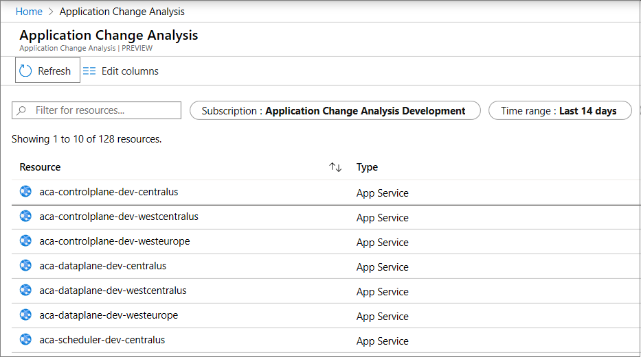
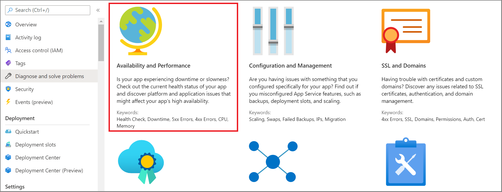

# Use Application Change Analysis (preview) in Azure Monitor

When a live site issue or outage occurs, quickly determining the root cause is critical. Standard monitoring solutions might alert you to a problem. They might even indicate which component is failing. But this alert won't always immediately explain the failure's cause. You know your site worked five minutes ago, and now it's broken. What changed in the last five minutes? This is the question that Application Change Analysis is designed to answer in Azure Monitor.

Building on the power of [Azure Resource Graph](https://docs.microsoft.com/azure/governance/resource-graph/overview), Change Analysis provides insights into your Azure application changes to increase observability and reduce MTTR (mean time to repair).

> [!IMPORTANT]
> Change Analysis is currently in preview. This preview version is provided without a service-level agreement. This version is not recommended for production workloads. Some features might not be supported or might have constrained capabilities. For more information, see [Supplemental terms of use for Microsoft Azure previews](https://azure.microsoft.com/support/legal/preview-supplemental-terms/).

## Overview

Change Analysis detects various types of changes, from the infrastructure layer all the way to application deployment. It's a subscription-level Azure resource provider that checks resource changes in the subscription. Change Analysis provides data for various diagnostic tools to help users understand what changes might have caused issues.

The following diagram illustrates the architecture of Change Analysis:


Currently Change Analysis is integrated into the **Diagnose and solve problems** experience in the App Service web app. To enable change detection and view changes in the web app, see the *Change Analysis for the Web Apps feature* section later in this article.

### Azure Resource Manager deployment changes

Using [Azure Resource Graph](https://docs.microsoft.com/azure/governance/resource-graph/overview), Change Analysis provides a historical record of how the Azure resources that host your application have changed over time. Change Analysis can detect, for example, changes in IP configuration rules, managed identities, and SSL settings. So if a tag is added to a web app, Change Analysis reflects the change. This information is available as long as the `Microsoft.ChangeAnalysis` resource provider is enabled in the Azure subscription.

### Changes in web app deployment and configuration

Change Analysis captures the deployment and configuration state of an application every 4 hours. It can detect, for example, changes in the application environment variables. The tool computes the differences and presents what has changed. Unlike Resource Manager changes, code deployment change information might not be available immediately in the tool. To view the latest changes in Change Analysis, select **Scan changes now**.



### Dependency changes

Changes to resource dependencies can also cause issues in a web app. For example, if a web app calls into a Redis cache, the Redis cache SKU could affect the web app performance. To detect changes in dependencies, Change Analysis checks the web app's DNS record. In this way, it identifies changes in all app components that could cause issues.
Currently the following dependencies are supported:
- Web Apps
- Azure Storage
- Azure SQL


## Change Analysis for the Web Apps feature

In Azure Monitor, Change Analysis is currently built into the self-service **Diagnose and solve problems** experience. Access this experience from the **Overview** page of your App Service application.


### Enable Change Analysis in the Diagnose and solve problems tool

1. Select **Availability and Performance**.

    

1. Select **Application Changes**. Not that the feature is also available in **Application Crashes**.

   

1. To enable Change Analysis, select **Enable now**.

   

1. Turn on **Change Analysis** and select **Save**.

    


1. To access Change Analysis, select **Diagnose and solve problems** > **Availability and Performance** > **Application Crashes**. You'll see a graph that summarizes the type of changes over time along with details on those changes:

     


### Enable Change Analysis at scale

If your subscription includes numerous web apps, enabling the service at the level of the web app would be inefficient. Run the following script to enable all web apps in your subscription.

Pre-requisites:
* PowerShell Az Module. Follow instructions at [Install the Azure PowerShell module](https://docs.microsoft.com/powershell/azure/install-az-ps?view=azps-2.6.0)

Run the following script:

```PowerShell
# Log in to your Azure subscription
Connect-AzAccount

# Get subscription Id
$SubscriptionId = Read-Host -Prompt 'Input your subscription Id'

# Make Feature Flag visible to the subscription
Set-AzContext -SubscriptionId $SubscriptionId

# Register resource provider
Register-AzResourceProvider -ProviderNamespace "Microsoft.ChangeAnalysis"


# Enable each web app
$webapp_list = Get-AzWebApp | Where-Object {$_.kind -eq 'app'}
foreach ($webapp in $webapp_list)
{
    $tags = $webapp.Tags
    $tags[“hidden-related:diagnostics/changeAnalysisScanEnabled”]=$true
    Set-AzResource -ResourceId $webapp.Id -Tag $tags -Force
}

```


## Next steps

- Enable Application Insights for [Azure App Services apps](azure-web-apps.md).
- Enable Application Insights for [Azure VM and Azure virtual machine scale set IIS-hosted apps](azure-vm-vmss-apps.md).
- Learn more about [Azure Resource Graph](https://docs.microsoft.com/azure/governance/resource-graph/overview), which helps power Change Analysis.
