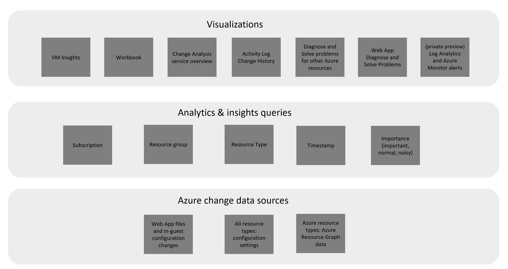
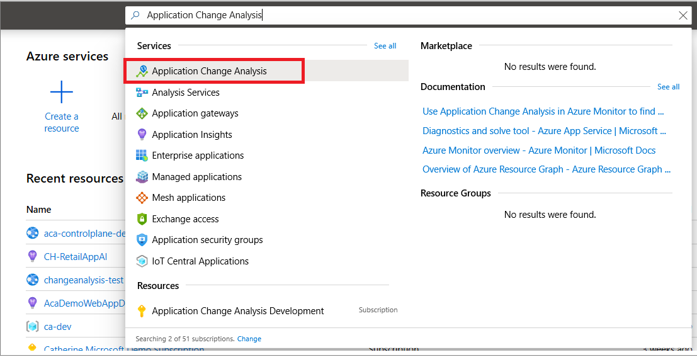
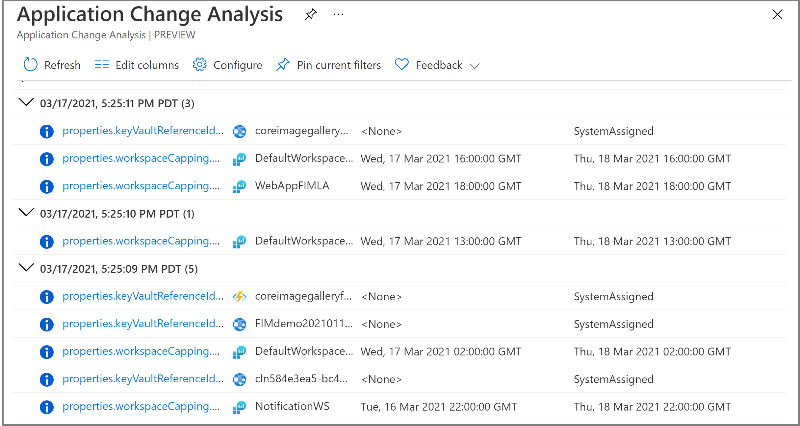

# Use Application Change Analysis (preview) in Azure Monitor

When a live site issue or outage occurs, quickly determining the root cause is critical. Standard monitoring solutions might alert you to a problem. They might even indicate which component is failing. But this alert won't always immediately explain the failure's cause. You know your site worked five minutes ago, and now it's broken. What changed in the last five minutes? This is the question that Application Change Analysis is designed to answer in Azure Monitor.

Building on the power of [Azure Resource Graph](https://docs.microsoft.com/azure/governance/resource-graph/overview), Change Analysis provides insights into your Azure application changes to increase observability and reduce MTTR (mean time to repair).

> [!IMPORTANT]
> Change Analysis is currently in preview. This preview version is provided without a service-level agreement. This version is not recommended for production workloads. Some features might not be supported or might have constrained capabilities. For more information, see [Supplemental terms of use for Microsoft Azure previews](https://azure.microsoft.com/support/legal/preview-supplemental-terms/).

## Overview

Change Analysis detects various types of changes, from the infrastructure layer all the way to application deployment. It's a subscription-level Azure resource provider that checks resource changes in the subscription. Change Analysis provides data for various diagnostic tools to help users understand what changes might have caused issues.

The following diagram illustrates the architecture of Change Analysis:



Currently Change Analysis is integrated into the **Diagnose and solve problems** experience in the App Service web app, as well as available as a standalone blade in Azure portal.
See the *Viewing changes for all resources in Azure* section to access Change Analysis blade and the *Change Analysis for the Web Apps feature* section for using it within Web App portal later in this article.

### Azure Resource Manager tracked properties changes

Using [Azure Resource Graph](https://docs.microsoft.com/azure/governance/resource-graph/overview), Change Analysis provides a historical record of how the Azure resources that host your application have changed over time. Tracked settings such as managed identities, Platform OS upgrade, and hostnames can be detected.

### Azure Resource Manager proxied setting changes
Settings such as IP Configuration rule, SSL settings and extension versions are not yet available in ARG, so Change Analysis queries and computes these changes securely to provide more details in what changed in the app. These information is not available yet in Azure Resource Graph but will be available soon.

### Changes in web app deployment and configuration (in-guest changes)

Change Analysis captures the deployment and configuration state of an application every 4 hours. It can detect, for example, changes in the application environment variables. The tool computes the differences and presents what has changed. Unlike Resource Manager changes, code deployment change information might not be available immediately in the tool. To view the latest changes in Change Analysis, select **Scan changes now**.


### Dependency changes

Changes to resource dependencies can also cause issues in a web app. For example, if a web app calls into a Redis cache, the Redis cache SKU could affect the web app performance. To detect changes in dependencies, Change Analysis checks the web app's DNS record. In this way, it identifies changes in all app components that could cause issues.
Currently the following dependencies are supported:
- Web Apps
- Azure Storage
- Azure SQL

### Enablement
"Microsoft.ChangeAnalysis" resource provider needs to be registered with a subscription for the Azure Resource Manager tracked properties and proxied settings change data to be available. As you enter the Web App diagnose and solve problems or bring up the Change Analysis standalone blade, this resource provider is automatically registered. It does not have any performance and cost implementations for your subscription.
For web app in-guest changes, separate enablement is required for scanning code files within a web app. See *Enable Change Analysis in the Diagnose and solve problems tool* section later in this article for more details.

## Viewing changes for all resources in Azure
In Azure Monitor, there is a standalone blade for Change Analysis to view all changes with insights and application dependencies resources.

Search for Change Analysis in the search bar on Azure portal to launch the blade.



Select Resource Group and resources to start viewing changes.



You can see Insights and related dependencies resources that host your application. This view is designed to be application-centric for developers to troubleshoot issues.

Currently supported resources include:
- Virtual Machines
- Virtual Machine Scale Set
- Azure Networking resources
- Web app with in-guest file tracking and environment variables changes

For any feedback, please use the send feedback button in the blade or email changeanalysisteam@microsoft.com.


## Change Analysis for the Web Apps feature

In Azure Monitor, Change Analysis is also built into the self-service **Diagnose and solve problems** experience. Access this experience from the **Overview** page of your App Service application.


### Enable Change Analysis in the Diagnose and solve problems tool

1. Select **Availability and Performance**.

    

1. Select **Application Changes**. Not that the feature is also available in **Application Crashes**.

   

1. To enable Change Analysis, select **Enable now**.

   

1. Turn on **Change Analysis** and select **Save**. The tool displays all web apps under an App Service plan. You can use the plan level switch to turn on Change Analysis for all web apps under a plan.

    


1. To access Change Analysis, select **Diagnose and solve problems** > **Availability and Performance** > **Application Crashes**. You'll see a graph that summarizes the type of changes over time along with details on those changes. By default, changes in the past 24 hours are displayed to help with immediate problems.

     


### Enable Change Analysis at scale

If your subscription includes numerous web apps, enabling the service at the level of the web app would be inefficient. Run the following script to enable all web apps in your subscription.

Pre-requisites:
* PowerShell Az Module. Follow instructions at [Install the Azure PowerShell module](https://docs.microsoft.com/powershell/azure/install-az-ps?view=azps-2.6.0)

Run the following script:

```PowerShell
# Log in to your Azure subscription
Connect-AzAccount

# Get subscription Id
$SubscriptionId = Read-Host -Prompt 'Input your subscription Id'

# Make Feature Flag visible to the subscription
Set-AzContext -SubscriptionId $SubscriptionId

# Register resource provider
Register-AzResourceProvider -ProviderNamespace "Microsoft.ChangeAnalysis"


# Enable each web app
$webapp_list = Get-AzWebApp | Where-Object {$_.kind -eq 'app'}
foreach ($webapp in $webapp_list)
{
    $tags = $webapp.Tags
    $tags[“hidden-related:diagnostics/changeAnalysisScanEnabled”]=$true
    Set-AzResource -ResourceId $webapp.Id -Tag $tags -Force
}

```


## Next steps

- Enable Application Insights for [Azure App Services apps](azure-web-apps.md).
- Enable Application Insights for [Azure VM and Azure virtual machine scale set IIS-hosted apps](azure-vm-vmss-apps.md).
- Learn more about [Azure Resource Graph](https://docs.microsoft.com/azure/governance/resource-graph/overview), which helps power Change Analysis.
