# Use Stream Analytics to process exported data from Application Insights
[Azure Stream Analytics](https://azure.microsoft.com/services/stream-analytics/) is the ideal tool for processing data [exported from Application Insights](export-telemetry.md). Stream Analytics can pull data from a variety of sources. It can transform and filter the data, and then route it to a variety of sinks.

In this example, we'll create an adaptor that takes data from Application Insights, renames and processes some of the fields, and pipes it into Power BI.

> [!WARNING]
> There are much better and easier [recommended ways to display Application Insights data in Power BI](./export-power-bi.md). The path illustrated here is just an example to illustrate how to process exported data.
> 
> 

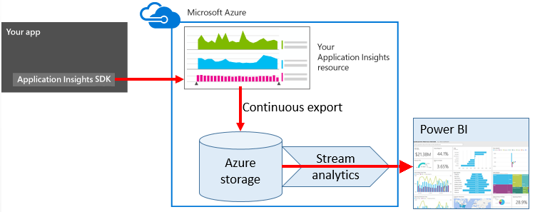

## Create storage in Azure
Continuous export always outputs data to an Azure Storage account, so you need to create the storage first.

1. Create a "classic" storage account in your subscription in the [Azure portal](https://portal.azure.com).
   
   
2. Create a container
   
    
3. Copy the storage access key
   
    You'll need it soon to set up the input to the stream analytics service.
   
    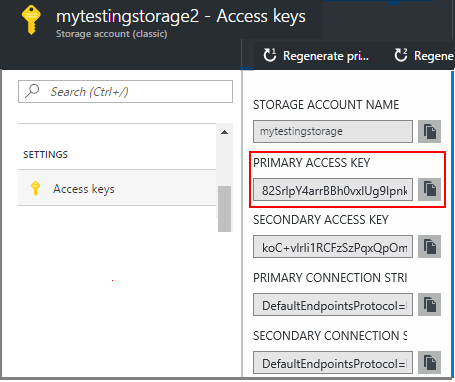

## Start continuous export to Azure storage
[Continuous export](export-telemetry.md) moves data from Application Insights into Azure storage.

1. In the Azure portal, browse to the Application Insights resource you created for your application.
   
    
2. Create a continuous export.
   
    

    Select the storage account you created earlier:

    

    Set the event types you want to see:

    

1. Let some data accumulate. Sit back and let people use your application for a while. Telemetry will come in and you'll see statistical charts in [metric explorer](../essentials/metrics-charts.md) and individual events in [diagnostic search](./diagnostic-search.md). 
   
    And also, the data will export to your storage. 
2. Inspect the exported data. In Visual Studio, choose **View / Cloud Explorer**, and open Azure / Storage. (If you don't have this menu option, you need to install the Azure SDK: Open the New Project dialog and open Visual C# / Cloud / Get Microsoft Azure SDK for .NET.)
   
    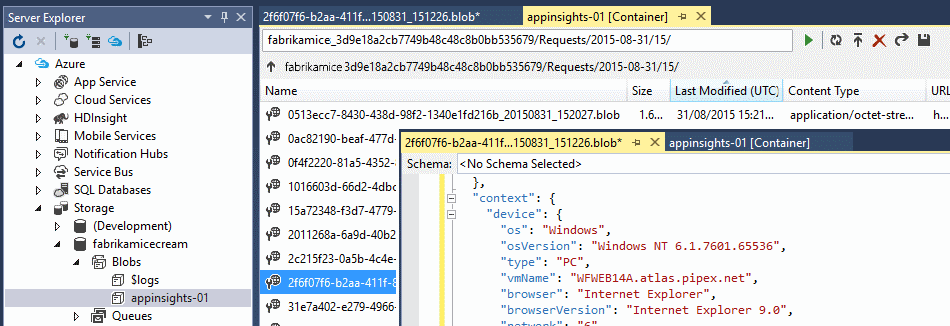
   
    Make a note of the common part of the path name, which is derived from the application name and instrumentation key. 

The events are written to blob files in JSON format. Each file may contain one or more events. So we'd like to read the event data and filter out the fields we want. There are all kinds of things we could do with the data, but our plan today is to use Stream Analytics to pipe the data to Power BI.

## Create an Azure Stream Analytics instance
From the [Azure portal](https://portal.azure.com/), select the Azure Stream Analytics service, and create a new Stream Analytics job:

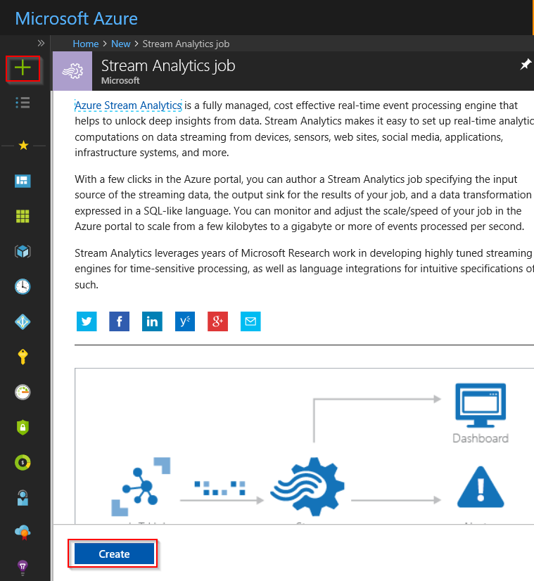

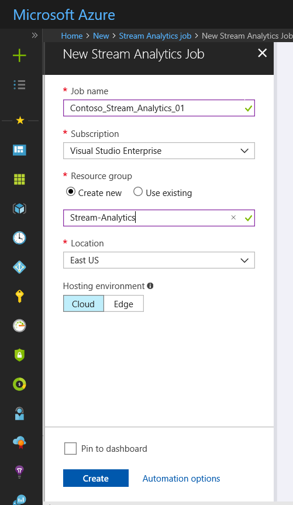

When the new job is created, select **Go to resource**.

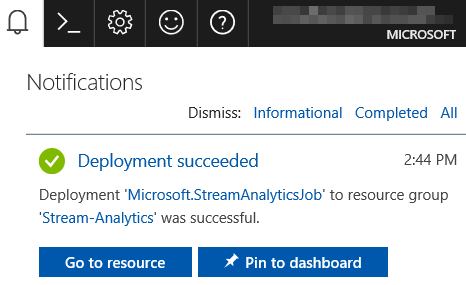

### Add a new input

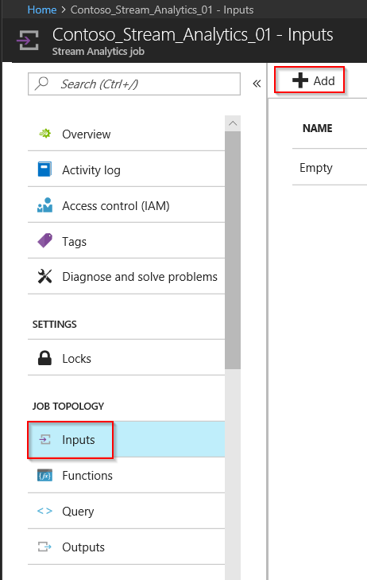

Set it to take input from your Continuous Export blob:

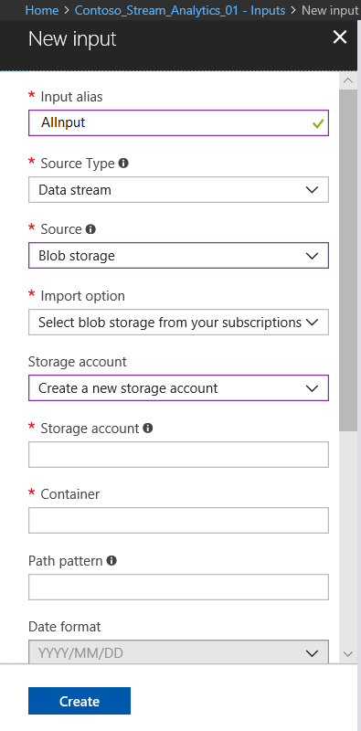

Now you'll need the Primary Access Key from your Storage Account, which you noted earlier. Set this as the Storage Account Key.

### Set path prefix pattern

**Be sure to set the Date Format to YYYY-MM-DD (with dashes).**

The Path Prefix Pattern specifies where Stream Analytics finds the input files in the storage. You need to set it to correspond to how Continuous Export stores the data. Set it like this:

`webapplication27_12345678123412341234123456789abcdef0/PageViews/{date}/{time}`

In this example:

* `webapplication27` is the name of the Application Insights resource **all lower case**.
* `1234...` is the instrumentation key of the Application Insights resource, **omitting dashes**. 
* `PageViews` is the type of data you want to analyze. The available types depend on the filter you set in Continuous Export. Examine the exported data to see the other available types, and see the [export data model](export-data-model.md).
* `/{date}/{time}` is a pattern written literally.

> [!NOTE]
> Inspect the storage to make sure you get the path right.
> 

## Add new output
Now select your job > **Outputs** > **Add**.

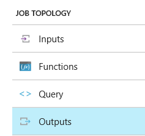


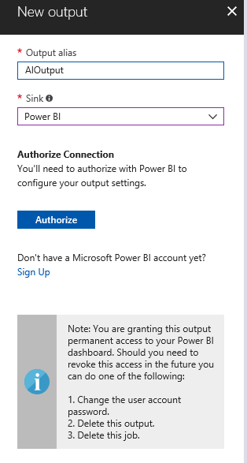

Provide your **work or school account** to authorize Stream Analytics to access your Power BI resource. Then invent a name for the output, and for the target Power BI dataset and table.

## Set the query
The query governs the translation from input to output.

Use the Test function to check that you get the right output. Give it the sample data that you took from the inputs page. 

### Query to display counts of events
Paste this query:

```SQL
SELECT
  flat.ArrayValue.name,
  count(*)
INTO
  [pbi-output]
FROM
  [export-input] A
OUTER APPLY GetElements(A.[event]) as flat
GROUP BY TumblingWindow(minute, 1), flat.ArrayValue.name
```

* export-input is the alias we gave to the stream input
* pbi-output is the output alias we defined
* We use [OUTER APPLY GetElements](/stream-analytics-query/apply-azure-stream-analytics) because the event name is in a nested JSON array. Then the Select picks the event name, together with a count of the number of instances with that name in the time period. The [Group By](/stream-analytics-query/group-by-azure-stream-analytics) clause groups the elements into time periods of one minute.

### Query to display metric values

```SQL
SELECT
  A.context.data.eventtime,
  avg(CASE WHEN flat.arrayvalue.myMetric.value IS NULL THEN 0 ELSE  flat.arrayvalue.myMetric.value END) as myValue
INTO
  [pbi-output]
FROM
  [export-input] A
OUTER APPLY GetElements(A.context.custom.metrics) as flat
GROUP BY TumblingWindow(minute, 1), A.context.data.eventtime
```

* This query drills into the metrics telemetry to get the event time and the metric value. The metric values are inside an array, so we use the OUTER APPLY GetElements pattern to extract the rows. "myMetric" is the name of the metric in this case. 

### Query to include values of dimension properties

```SQL
WITH flat AS (
SELECT
  MySource.context.data.eventTime as eventTime,
  InstanceId = MyDimension.ArrayValue.InstanceId.value,
  BusinessUnitId = MyDimension.ArrayValue.BusinessUnitId.value
FROM MySource
OUTER APPLY GetArrayElements(MySource.context.custom.dimensions) MyDimension
)
SELECT
  eventTime,
  InstanceId,
  BusinessUnitId
INTO AIOutput
FROM flat
```

* This query includes values of the dimension properties without depending on a particular dimension being at a fixed index in the dimension array.

## Run the job
You can select a date in the past to start the job from. 

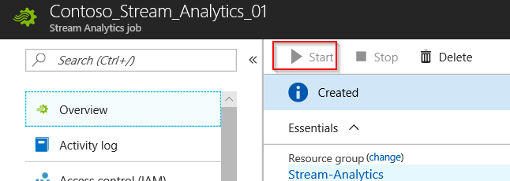

Wait until the job is Running.

## See results in Power BI
> [!WARNING]
> There are much better and easier [recommended ways to display Application Insights data in Power BI](./export-power-bi.md). The path illustrated here is just an example to illustrate how to process exported data.
> 
> 

Open Power BI with your work or school account, and select the dataset and table that you defined as the output of the Stream Analytics job.

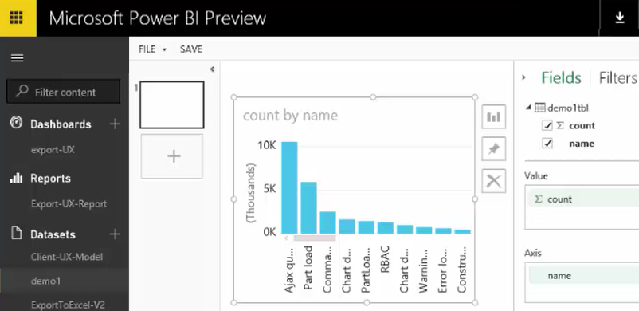

Now you can use this dataset in reports and dashboards in [Power BI](https://powerbi.microsoft.com).


## No data?
* Check that you [set the date format](#set-path-prefix-pattern) correctly to YYYY-MM-DD (with dashes).

## Video
Noam Ben Zeev shows how to process exported data using Stream Analytics.

> [!VIDEO https://channel9.msdn.com/Blogs/Azure/Export-to-Power-BI-from-Application-Insights/player]
> 
> 

## Next steps
* [Continuous export](export-telemetry.md)
* [Detailed data model reference for the property types and values.](export-data-model.md)
* [Application Insights](./app-insights-overview.md)

