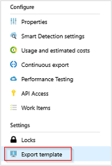
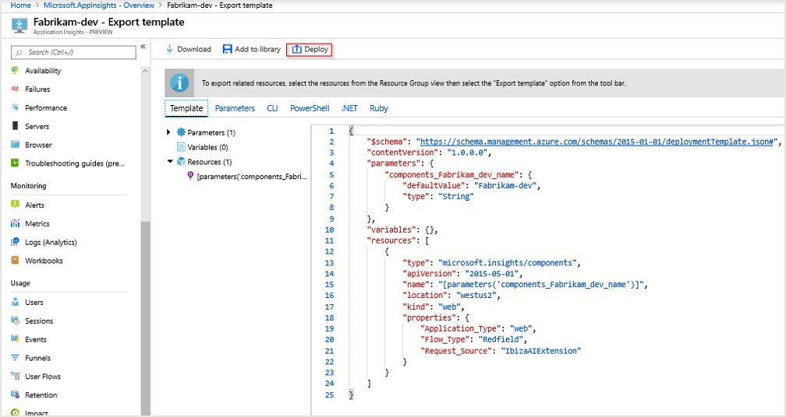
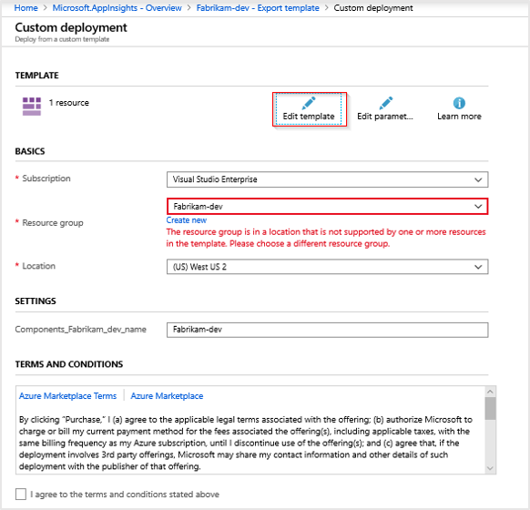
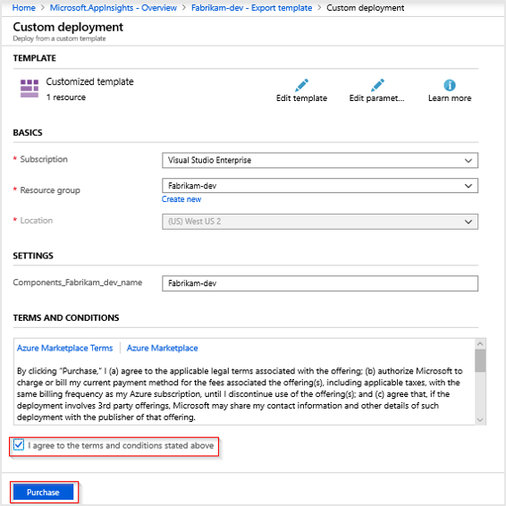

# Geolocation and IP address handling

This article explains how geolocation lookup and IP address handling work in Application Insights along with how to modify the default behavior.

## Default behavior

By default IP addresses are temporarily collected, but not stored in Application Insights. The basic process is as follows:

When telemetry is sent to Azure, the IP address is used to do a geolocation lookup using [GeoLite2 from MaxMind](https://dev.maxmind.com/geoip/geoip2/geolite2/). The results of this lookup are used to populate the fields `client_City`, `client_StateOrProvince`, and `client_CountryOrRegion`. The address is then discarded and `0.0.0.0` is written to the `client_IP` field.

* Browser telemetry: We temporarily collect the sender's IP address. IP address is calculated by the ingestion endpoint.
* Server telemetry: The Application Insights telemetry module temporarily collects the client IP address. IP address isn't collected locally when the `X-Forwarded-For` header is set.

This behavior is by design to help avoid unnecessary collection of personal data. Whenever possible, we recommend avoiding the collection of personal data. 

## Overriding default behavior

While the default is to not collect IP addresses. We still offer the flexibility to override this behavior. However, we recommend verifying that collection doesn't break any compliance requirements or local regulations. 

To learn more about personal data handling in Application Insights, consult the [guidance for personal data](../platform/personal-data-mgmt.md).

## Storing IP address data

To enable IP collection and storage, the `DisableIpMasking` property of the Application Insights component must be set to `true`. This property can be set through Azure Resource Manager templates or by calling the REST API. 

### Azure Resource Manager Template

```json
{
       "id": "/subscriptions/<subscription-id>/resourceGroups/<resource-group-name>/providers/microsoft.insights/components/<resource-name>",
       "name": "<resource-name>",
       "type": "microsoft.insights/components",
       "location": "westcentralus",
       "tags": {
              
       },
       "kind": "web",
       "properties": {
              "Application_Type": "web",
              "Flow_Type": "Redfield",
              "Request_Source": "IbizaAIExtension",
              // ...
              "DisableIpMasking": true
       }
}
```

### Portal 

If you only need to modify the behavior for a single Application Insights resource, use the Azure portal. 

1. Go your Application Insights resource > **Settings** > **Export Template** 

    

2. Select **Deploy**

    

3. Select **Edit Template**.

    

4. Make the following changes to the json for your resource and then select **Save**:

    

    > [!WARNING]
    > If you experience an error that says: **_The resource group is in a location that is not supported by one or more resources in the template. Please choose a different resource group._** Temporarily select a different resource group from the dropdown and then re-select your original resource group to resolve the error.

5. Select **I agree** > **Purchase**. 

    

    In this case, nothing new is actually being purchased. We're only updating the configuration of the existing Application Insights resource.

6. Once the deployment is complete, new telemetry data will be recorded.

    If you select and edit the template again, you'll only see the default template without the newly added property. If you aren't seeing IP address data and want to confirm that `"DisableIpMasking": true` is set, run the following PowerShell: 
    
    ```powershell
    # Replace `Fabrikam-dev` with the appropriate resource and resource group name.
    # If you aren't using the cloud shell you will need to connect to your Azure account
    # Connect-AzAccount 
    $AppInsights = Get-AzResource -Name 'Fabrikam-dev' -ResourceType 'microsoft.insights/components' -ResourceGroupName 'Fabrikam-dev'
    $AppInsights.Properties
    ```
    
    A list of properties will be returned as a result. One of the properties should read `DisableIpMasking: true`. If you run the PowerShell before deploying the new property with Azure Resource Manager, the property won't exist.

### Rest API

The [Rest API](/rest/api/azure/) payload to make the same modifications is as follows:

```
PATCH https://management.azure.com/subscriptions/<sub-id>/resourceGroups/<rg-name>/providers/microsoft.insights/components/<resource-name>?api-version=2018-05-01-preview HTTP/1.1
Host: management.azure.com
Authorization: AUTH_TOKEN
Content-Type: application/json
Content-Length: 54

{
       "location": "<resource location>",
       "kind": "web",
       "properties": {
              "Application_Type": "web",
              "DisableIpMasking": true
       }
}
```

## Telemetry initializer

If you need a more flexible alternative than `DisableIpMasking`, you can use a [telemetry initializer](./api-filtering-sampling.md#addmodify-properties-itelemetryinitializer) to copy all or part the IP address to a custom field. 

# [.NET](#tab/net)

### ASP.NET / ASP.NET Core

```csharp
using Microsoft.ApplicationInsights.Channel;
using Microsoft.ApplicationInsights.DataContracts;
using Microsoft.ApplicationInsights.Extensibility;

namespace MyWebApp
{
    public class CloneIPAddress : ITelemetryInitializer
    {
        public void Initialize(ITelemetry telemetry)
        {
            ISupportProperties propTelemetry = telemetry as ISupportProperties;

            if (propTelemetry !=null && !propTelemetry.Properties.ContainsKey("client-ip"))
            {
                string clientIPValue = telemetry.Context.Location.Ip;
                propTelemetry.Properties.Add("client-ip", clientIPValue);
            }
        }
    } 
}
```

> [!NOTE]
> If you are unable to access `ISupportProperties`, check and make sure you are running the latest stable release of the Application Insights SDK. `ISupportProperties` are intended for high cardinality values, whereas `GlobalProperties` are more appropriate for low cardinality values like region name, environment name, etc. 

### Enable telemetry initializer for ASP.NET

```csharp
using Microsoft.ApplicationInsights.Extensibility;


namespace MyWebApp
{
    public class MvcApplication : System.Web.HttpApplication
    {
        protected void Application_Start()
        {
              //Enable your telemetry initializer:
              TelemetryConfiguration.Active.TelemetryInitializers.Add(new CloneIPAddress());
        }
    }
}

```

### Enable telemetry initializer for ASP.NET Core

You can create your telemetry initializer the same way for ASP.NET Core as ASP.NET but to enable the initializer, use the following example for reference:

```csharp
 using Microsoft.ApplicationInsights.Extensibility;
 using CustomInitializer.Telemetry;
 public void ConfigureServices(IServiceCollection services)
{
    services.AddSingleton<ITelemetryInitializer, CloneIPAddress>();
}
```
# [Node.js](#tab/nodejs)

### Node.js

```javascript
appInsights.defaultClient.addTelemetryProcessor((envelope) => {
    const baseData = envelope.data.baseData;
    if (appInsights.Contracts.domainSupportsProperties(baseData)) {
        const ipAddress = envelope.tags[appInsights.defaultClient.context.keys.locationIp];
        if (ipAddress) {
            baseData.properties["client-ip"] = ipAddress;
        }
    }
});
```
# [Client-side JavaScript](#tab/javascript)

### Client-side JavaScript

Unlike the server-side SDKs, the client-side JavaScript SDK doesn't calculate IP address. By default IP address calculation for client-side telemetry occurs at the ingestion endpoint in Azure. 

If you want to calculate IP address directly on the client-side, you would need to add your own custom logic and use the result to set the `ai.location.ip` tag. When `ai.location.ip` is set, IP address calculation is not performed by the ingestion endpoint, and the provided IP address is used for the geolocation lookup. In this scenario, IP address will still be zeroed out by default. 

To keep the entire IP address calculated from your custom logic, you could use a telemetry initializer that would copy the IP address data you provided in `ai.location.ip` to a separate custom field. But again unlike the server-side SDKs, without relying on third-party libraries or your own custom collection logic the client-side SDK won't calculate the address for you.    


```javascript
appInsights.addTelemetryInitializer((item) => {
    const ipAddress = item.tags && item.tags["ai.location.ip"];
    if (ipAddress) {
        item.baseData.properties = {
            ...item.baseData.properties,
            "client-ip": ipAddress
        };
    }
});

```  

If client-side data traverses a proxy before forwarding to the ingestion endpoint, IP address calculation could show the IP address of the proxy and not the client. 

---

### View the results of your telemetry initializer

If you send new traffic to your site, and wait a few minutes. You can then run a query to confirm collection is working:

```kusto
requests
| where timestamp > ago(1h) 
| project appName, operation_Name, url, resultCode, client_IP, customDimensions.["client-ip"]
```

Newly collected IP addresses will appear in the `customDimensions_client-ip` column. The default `client-ip` column will still have all four octets either zeroed out. 

If testing from localhost, and the value for `customDimensions_client-ip` is `::1`, this value is expected behavior. `::1` represents the loopback address in IPv6. It's equivalent to `127.0.01` in IPv4.

## Next Steps

* Learn more about [personal data collection](../platform/personal-data-mgmt.md) in Application Insights.

* Learn more about how [IP address collection](https://apmtips.com/posts/2016-07-05-client-ip-address/) in Application Insights works. (This article an older external blog post written by one of our engineers. It predates the current default behavior where IP address is recorded as `0.0.0.0`, but it goes into greater depth on the mechanics of the built-in `ClientIpHeaderTelemetryInitializer`.)
