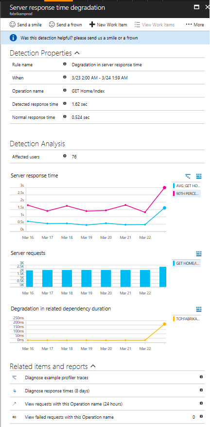
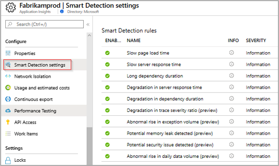
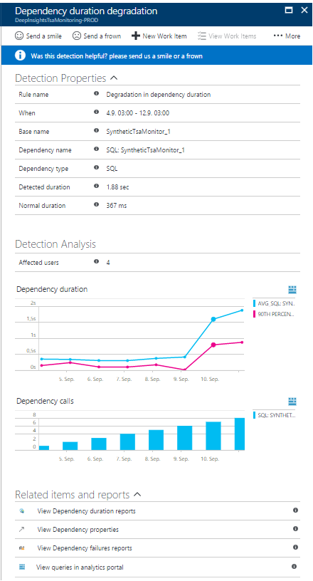
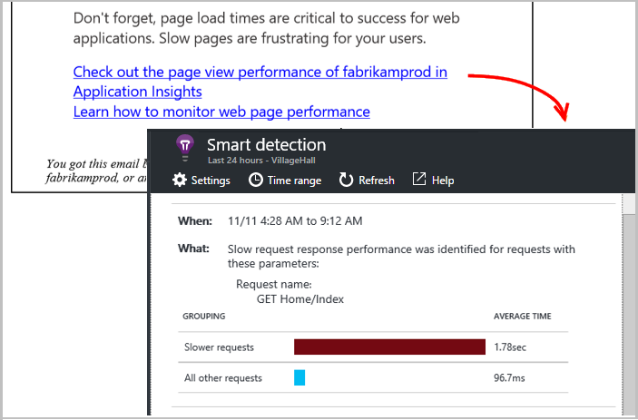

# Smart Detection - Performance Anomalies

[Application Insights](../../azure-monitor/app/app-insights-overview.md) automatically analyzes the performance of your web application, and can warn you about potential problems. You might be reading this because you received one of our smart detection notifications.

This feature requires no special setup, other than configuring your app for Application Insights (on [ASP.NET](../../azure-monitor/app/asp-net.md), [Java](../../azure-monitor/app/java-get-started.md), or [Node.js](../../azure-monitor/app/nodejs.md), and in [web page code](../../azure-monitor/app/javascript.md)). It is active when your app generates enough telemetry.

## When would I get a smart detection notification?

Application Insights has detected that the performance of your application has degraded in one of these ways:

* **Response time degradation** - Your app has started responding to requests more slowly than it used to. The change might have been rapid, for example because there was a regression in your latest deployment. Or it might have been gradual, maybe caused by a memory leak. 
* **Dependency duration degradation** - Your app makes calls to a REST API, database, or other dependency. The dependency is responding more slowly than it used to.
* **Slow performance pattern** - Your app appears to have a performance issue that is affecting only some requests. For example, pages are loading more slowly on one type of browser than others; or requests are being served more slowly from one particular server. Currently, our algorithms look at page load times, request response times, and dependency response times.  

Smart Detection requires at least 8 days of telemetry at a workable volume in order to establish a baseline of normal performance. So, after your application has been running for that period, any significant issue will result in a notification.

## Does my app definitely have a problem?

No, a notification doesn't mean that your app definitely has a problem. It's simply a suggestion about something you might want to look at more closely.

## How do I fix it?

The notifications include diagnostic information. Here's an example:

1. **Triage**. The notification shows you how many users or how many operations are affected. This can help you assign a priority to the problem.
2. **Scope**. Is the problem affecting all traffic, or just some pages? Is it restricted to particular browsers or locations? This information can be obtained from the notification.
3. **Diagnose**. Often, the diagnostic information in the notification will suggest the nature of the problem. For example, if response time slows down when request rate is high, that suggests your server or dependencies are overloaded. 

    Otherwise, open the Performance blade in Application Insights. There, you will find [Profiler](profiler.md) data. If exceptions are thrown, you can also try the [snapshot debugger](../../azure-monitor/app/snapshot-debugger.md).

## Configure Email Notifications

Smart Detection notifications are enabled by default and sent to those who have [Monitoring Reader](https://docs.microsoft.com/azure/role-based-access-control/built-in-roles#monitoring-reader) and [Monitoring Contributor](https://docs.microsoft.com/azure/role-based-access-control/built-in-roles#monitoring-contributor) access to the subscription in which the Application Insights resource resides. To change this, either click **Configure** in the email notification, or open Smart Detection settings in Application Insights. 
  
  
  
  * You can use the **unsubscribe** link in the Smart Detection email to stop receiving the email notifications.

Emails about Smart Detections performance anomalies are limited to one email per day per Application Insights resource. The email will be sent only if there is at least one new issue that was detected on that day. You won't get repeats of any message. 

## FAQ

* *So, Microsoft staff look at my data?*
  * No. The service is entirely automatic. Only you get the notifications. Your data is [private](../../azure-monitor/app/data-retention-privacy.md).
* *Do you analyze all the data collected by Application Insights?*
  * Not at present. Currently, we analyze request response time, dependency response time and page load time. Analysis of additional metrics is on our backlog looking forward.

* What types of application does this work for?
  * These degradations are detected in any application that generates the appropriate telemetry. If you installed Application Insights in your web app, then requests and dependencies are automatically tracked. But in backend services or other apps, if you inserted calls to [TrackRequest()](../../azure-monitor/app/api-custom-events-metrics.md#trackrequest) or [TrackDependency](../../azure-monitor/app/api-custom-events-metrics.md#trackdependency), then Smart Detection will work in the same way.

* *Can I create my own anomaly detection rules or customize existing rules?*

  * Not yet, but you can:
    * [Set up alerts](../../azure-monitor/app/alerts.md) that tell you when a metric crosses a threshold.
    * [Export telemetry](../../azure-monitor/app/export-telemetry.md) to a [database](../../azure-monitor/app/code-sample-export-sql-stream-analytics.md) or [to Power BI](../../azure-monitor/app/export-power-bi.md ), where you can analyze it yourself.
* *How often is the analysis performed?*

  * We run the analysis daily on the telemetry from the previous day (full day in UTC timezone).
* *So does this replace [metric alerts](../../azure-monitor/app/alerts.md)?*
  * No.  We don't commit to detecting every behavior that you might consider abnormal.

* *If I don't do anything in response to a notification, will I get a reminder?*
  * No, you get a message about each issue only once. If the issue persists it will be updated in the Smart Detection feed blade.
* *I lost the email. Where can I find the notifications in the portal?*
  * In the Application Insights overview of your app, click the **Smart Detection** tile. There you'll be able to find all notifications up to 90 days back.

## How can I improve performance?
Slow and failed responses are one of the biggest frustrations for web site users, as you know from your own experience. So, it's important to address the issues.

### Triage
First, does it matter? If a page is always slow to load, but only 1% of your site's users ever have to look at it, maybe you have more important things to think about. On the other hand, if only 1% of users open it, but it throws exceptions every time, that might be worth investigating.

Use the impact statement (affected users or % of traffic) as a general guide, but be aware that it isn't the whole story. Gather other evidence to confirm.

Consider the parameters of the issue. If it's geography-dependent, set up [availability tests](../../azure-monitor/app/monitor-web-app-availability.md) including that region: there might simply be network issues in that area.

### Diagnose slow page loads
Where is the problem? Is the server slow to respond, is the page very long, or does the browser have to do a lot of work to display it?

Open the Browsers metric blade. The segmented display of browser page load time shows where the time is going. 

* If **Send Request Time** is high, either the server is responding slowly, or the request is a post with a lot of data. Look at the [performance metrics](../../azure-monitor/app/web-monitor-performance.md#metrics) to investigate response times.
* Set up [dependency tracking](../../azure-monitor/app/asp-net-dependencies.md) to see whether the slowness is due to external services or your database.
* If **Receiving Response** is predominant, your page and its dependent parts - JavaScript, CSS, images and so on (but not asynchronously loaded data) are long. Set up an [availability test](../../azure-monitor/app/monitor-web-app-availability.md), and be sure to set the option to load dependent parts. When you get some results, open the detail of a result and expand it to see the load times of different files.
* High **Client Processing time** suggests scripts are running slowly. If the reason isn't obvious, consider adding some timing code and send the times in trackMetric calls.

### Improve slow pages
There's a web full of advice on improving your server responses and page load times, so we won't try to repeat it all here. Here are a few tips that you probably already know about, just to get you thinking:

* Slow loading because of big files: Load the scripts and other parts asynchronously. Use script bundling. Break the main page into widgets that load their data separately. Don't send plain old HTML for long tables: use a script to request the data as JSON or other compact format, then fill the table in place. There are great frameworks to help with all this. (They also entail big scripts, of course.)
* Slow server dependencies: Consider the geographical locations of your components. For example, if you're using Azure, make sure the web server and the database are in the same region. Do queries retrieve more information than they need? Would caching or batching help?
* Capacity issues: Look at the server metrics of response times and request counts. If response times peak disproportionately with peaks in request counts, it's likely that your servers are stretched.

## Server Response Time Degradation

The response time degradation notification tells you:

* The response time compared to normal response time for this operation.
* How many users are affected.
* Average response time and 90th percentile response time for this operation on the day of the detection and 7 days before. 
* Count of this operation requests on the day of the detection and 7 days before.
* Correlation between degradation in this operation and degradations in related dependencies. 
* Links to help you diagnose the problem.
  * Profiler traces to help you view where operation time is spent (the link is available if Profiler trace examples were collected for this operation during the detection period). 
  * Performance reports in Metric Explorer, where you can slice and dice time range/filters for this operation.
  * Search for this call to view specific call properties.
  * Failure reports - If count > 1 this means that there were failures in this operation that might have contributed to performance degradation.

## Dependency Duration Degradation

Modern applications more and more adopt a micro services design approach, which in many cases leads to heavy reliability on external services. For example, if your application relies on some data platform or even if you build your own bot service you will probably relay on some cognitive services provider to enable your bots to interact in more human ways and some data store service for bot to pull the answers from.  

Example dependency degradation notification:

Notice that it tells you:

* The duration compared to normal response time for this operation
* How many users are affected
* Average duration and 90th percentile duration for this dependency on the day of the detection and 7 days before
* Number of dependency calls on the day of the detection and 7 days before
* Links to help you diagnose the problem
  * Performance reports in Metric Explorer for this dependency
  * Search for this dependency calls to view calls properties
  * Failure reports - If count > 1 this means that there were failed dependency calls during the detection period that might have contributed to duration degradation. 
  * Open Analytics with queries that calculate this dependency duration and count  

## Smart Detection of slow performing patterns 

Application Insights finds performance issues that might only affect some portion of your users, or only affect users in some cases. For example, notification about pages load is slower on one type of browser than on other types of browsers, or if requests are served more slowly from a particular server. It can also discover problems associated with combinations of properties, such as slow page loads in one geographical area for clients using particular operating system.  

Anomalies like these are very hard to detect just by inspecting the data, but are more common than you might think. Often they only surface when your customers complain. By that time, it's too late: the affected users are already switching to your competitors!

Currently, our algorithms look at page load times, request response times at the server, and dependency response times.  

You don't have to set any thresholds or configure rules. Machine learning and data mining algorithms are used to detect abnormal patterns.

* **When** shows the time the issue was detected.
* **What** describes:

  * The problem that was detected;
  * The characteristics of the set of events that we found displayed the problem behavior.
* The table compares the poorly-performing set with the average behavior of all other events.

Click the links to open Metric Explorer and Search on relevant reports, filtered on the time and properties of the slow performing set.

Modify the time range and filters to explore the telemetry.

## Next steps
These diagnostic tools help you inspect the telemetry from your app:

* [Profiler](profiler.md) 
* [Snapshot debugger](../../azure-monitor/app/snapshot-debugger.md)
* [Analytics](../../azure-monitor/log-query/get-started-portal.md)
* [Analytics smart diagnostics](../../azure-monitor/app/analytics.md)

Smart detections are completely automatic. But maybe you'd like to set up some more alerts?

* [Manually configured metric alerts](../../azure-monitor/app/alerts.md)
* [Availability web tests](../../azure-monitor/app/monitor-web-app-availability.md)
