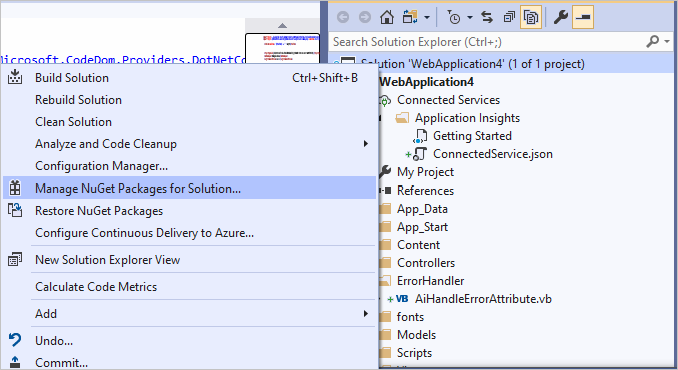
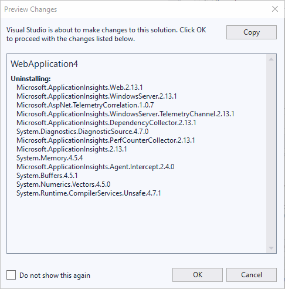
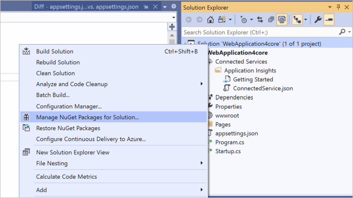

# How to remove Application Insights in Visual Studio

This article will show you how to remove the ASP.NET and ASP.NET Core Application Insights SDK in Visual Studio.

To remove Application Insights, you'll need to remove the NuGet packages and references from the API in your application. You can uninstall NuGet packages by using the Package Management Console or Manage NuGet Solution in Visual Studio. The following sections will show two ways to remove NuGet Packages and what was automatically added in your project. Be sure to confirm the files added and areas with in your own code in which you made calls to the API are removed.

## Uninstall using the Package Management Console

# [.NET](#tab/net)

1. To open the Package Management Console, in the top menu select Tools > NuGet Package Manager > Package Manager Console.
     
    

    > [!NOTE]
    > If trace collection is enabled you need to first uninstall Microsoft.ApplicationInsights.TraceListener. Enter `Uninstall-package Microsoft.ApplicationInsights.TraceListener` then follow the step below to remove Microsoft.ApplicationInsights.Web.

1. Enter the following command: `Uninstall-Package Microsoft.ApplicationInsights.Web -RemoveDependencies`

    After entering the command, the Application Insights package and all of its dependencies will be uninstalled from the project.
    
    

# [.NET Core](#tab/netcore)

1. To open the Package Management Console, in the top menu select Tools > NuGet Package Manager > Package Manager Console.

    

1. Enter the following command: ` Uninstall-Package Microsoft.ApplicationInsights.AspNetCore -RemoveDependencies`

    After entering the command, the Application Insights package and all of its dependencies will be uninstalled from the project.

---

## Uninstall using the Visual Studio NuGet UI

# [.NET](#tab/net)

1. In the *Solution Explorer* on the right, right click on **Solution** and select **Manage NuGet Packages for Solution**.

    You'll then see a screen that allows you to edit all the NuGet packages that are part of the project.
    
     

    > [!NOTE]
    > If trace collection is enabled you need to first uninstall Microsoft.ApplicationInsights.TraceListener without remove dependencies selected and then follow the steps below to uninstall Microsoft.ApplicationInsights.Web with remove dependencies selected.
    
1. Click on the "Microsoft.ApplicationInsights.Web" package. On the right, check the checkbox next to *Project* to select all projects.
    
1. To remove all dependencies when uninstalling, select the **Options** dropdown button below the section where you selected project.

    Under *Uninstall Options*, select the checkbox next to *Remove dependencies*.

1. Select **Uninstall**.
    
    

    A dialog box will display that shows all of the dependencies to be removed from the application. Select **ok** to uninstall.
    
    
    
1.  After everything is uninstalled, you may still see  "ApplicationInsights.config" and "AiHandleErrorAttribute.cs" in the *Solution Explorer*. You can delete the two files manually.

# [.NET Core](#tab/netcore)

1. In the *Solution Explorer* on the right, right click on **Solution** and select **Manage NuGet Packages for Solution**.

    You'll then see a screen that allows you to edit all the NuGet packages that are part of the project.

    

1. Click on "Microsoft.ApplicationInsights.AspNetCore" package. On the right, check the checkbox next to *Project* to select all projects then select **Uninstall**.

    

---

## What is created when you add Application Insights

When you add Application Insights to your project, it creates files and adds code to some of your files. Solely uninstalling the NuGet Packages will not always discard the files and code. To fully remove Application Insights, you should check and manually delete the added code or files along with any API calls you added in your project.

# [.NET](#tab/net)

When you add Application Insights Telemetry to a Visual Studio ASP.NET project, it adds the following files:

- ApplicationInsights.config
- AiHandleErrorAttribute.cs

The following pieces of code are added:

- [Your project's name].csproj

    ```C#
     <ApplicationInsightsResourceId>/subscriptions/00000000-0000-0000-0000-000000000000/resourcegroups/Default-ApplicationInsights-EastUS/providers/microsoft.insights/components/WebApplication4</ApplicationInsightsResourceId>
    ```

- Packages.config

    ```xml
    <packages>
    ...
    
      <package id="Microsoft.ApplicationInsights" version="2.12.0" targetFramework="net472" />
      <package id="Microsoft.ApplicationInsights.Agent.Intercept" version="2.4.0" targetFramework="net472" />
      <package id="Microsoft.ApplicationInsights.DependencyCollector" version="2.12.0" targetFramework="net472" />
      <package id="Microsoft.ApplicationInsights.PerfCounterCollector" version="2.12.0" targetFramework="net472" />
      <package id="Microsoft.ApplicationInsights.Web" version="2.12.0" targetFramework="net472" />
      <package id="Microsoft.ApplicationInsights.WindowsServer" version="2.12.0" targetFramework="net472" />
      <package id="Microsoft.ApplicationInsights.WindowsServer.TelemetryChannel" version="2.12.0" targetFramework="net472" />
    
      <package id="Microsoft.AspNet.TelemetryCorrelation" version="1.0.7" targetFramework="net472" />
    
      <package id="System.Buffers" version="4.4.0" targetFramework="net472" />
      <package id="System.Diagnostics.DiagnosticSource" version="4.6.0" targetFramework="net472" />
      <package id="System.Memory" version="4.5.3" targetFramework="net472" />
      <package id="System.Numerics.Vectors" version="4.4.0" targetFramework="net472" />
      <package id="System.Runtime.CompilerServices.Unsafe" version="4.5.2" targetFramework="net472" />
    ...
    </packages>
    ```

- Layout.cshtml

    If your project has a Layout.cshtml file the code below is added.
    
    ```html
    <head>
    ...
        <script type = 'text/javascript' >
            var appInsights=window.appInsights||function(config)
            {
                function r(config){ t[config] = function(){ var i = arguments; t.queue.push(function(){ t[config].apply(t, i)})} }
                var t = { config:config},u=document,e=window,o='script',s=u.createElement(o),i,f;for(s.src=config.url||'//az416426.vo.msecnd.net/scripts/a/ai.0.js',u.getElementsByTagName(o)[0].parentNode.appendChild(s),t.cookie=u.cookie,t.queue=[],i=['Event','Exception','Metric','PageView','Trace','Ajax'];i.length;)r('track'+i.pop());return r('setAuthenticatedUserContext'),r('clearAuthenticatedUserContext'),config.disableExceptionTracking||(i='onerror',r('_'+i),f=e[i],e[i]=function(config, r, u, e, o) { var s = f && f(config, r, u, e, o); return s !== !0 && t['_' + i](config, r, u, e, o),s}),t
            }({
                instrumentationKey:'00000000-0000-0000-0000-000000000000'
            });
            
            window.appInsights=appInsights;
            appInsights.trackPageView();
        </script>
    ...
    </head>
    ```

- ConnectedService.json

    ```json
    {
      "ProviderId": "Microsoft.ApplicationInsights.ConnectedService.ConnectedServiceProvider",
      "Version": "16.0.0.0",
      "GettingStartedDocument": {
        "Uri": "https://go.microsoft.com/fwlink/?LinkID=613413"
      }
    }
    ```

- FilterConfig.cs

    ```csharp
            public static void RegisterGlobalFilters(GlobalFilterCollection filters)
            {
                filters.Add(new ErrorHandler.AiHandleErrorAttribute());// This line was added
            }
    ```

# [.NET Core](#tab/netcore)

When you add Application Insights Telemetry to a Visual Studio ASP.NET Core template project, it adds the following code:

- [Your project's name].csproj

    ```csharp
      <PropertyGroup>
        <TargetFramework>netcoreapp3.1</TargetFramework>
        <ApplicationInsightsResourceId>/subscriptions/00000000-0000-0000-0000-000000000000/resourcegroups/Default-ApplicationInsights-EastUS/providers/microsoft.insights/components/WebApplication4core</ApplicationInsightsResourceId>
      </PropertyGroup>
    
      <ItemGroup>
        <PackageReference Include="Microsoft.ApplicationInsights.AspNetCore" Version="2.12.0" />
      </ItemGroup>
    
      <ItemGroup>
        <WCFMetadata Include="Connected Services" />
      </ItemGroup>
    ```

- Appsettings.json:

    ```json
    "ApplicationInsights": {
        "InstrumentationKey": "00000000-0000-0000-0000-000000000000"
    ```

- ConnectedService.json
    
    ```json
    {
      "ProviderId": "Microsoft.ApplicationInsights.ConnectedService.ConnectedServiceProvider",
      "Version": "16.0.0.0",
      "GettingStartedDocument": {
        "Uri": "https://go.microsoft.com/fwlink/?LinkID=798432"
      }
    }
    ```
- Startup.cs

    ```csharp
       public void ConfigureServices(IServiceCollection services)
            {
                services.AddRazorPages();
                services.AddApplicationInsightsTelemetry(); // This is added
            }
    ```

---

## Next steps

- [Azure Monitor](https://docs.microsoft.com/azure/azure-monitor/overview)