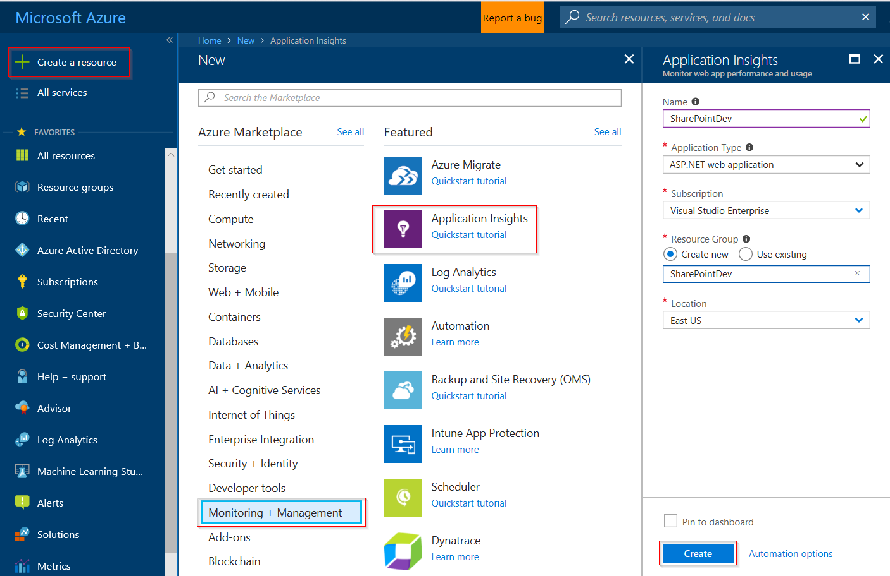
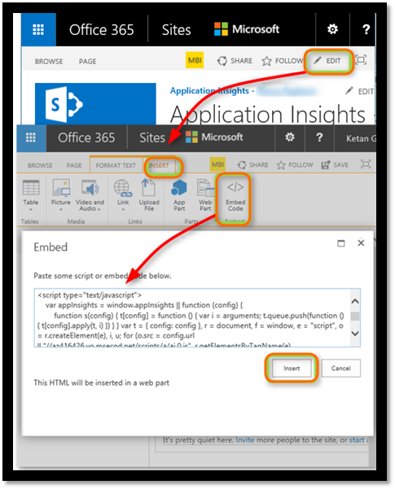
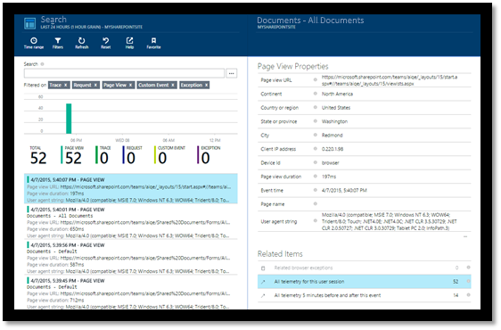
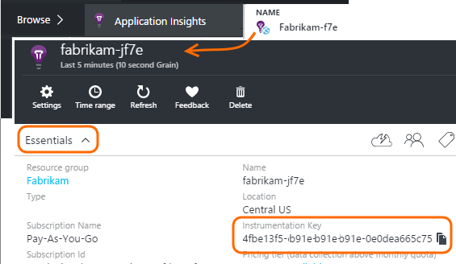

# Monitor a SharePoint site with Application Insights

Azure Application Insights monitors the availability, performance and usage of your apps. Here you'll learn how to set it up for a SharePoint site.

> [!NOTE]
> Due to security concerns, you can't directly add the script that's described in this article to your webpages in the SharePoint modern UX. As an alternative, you can use [SharePoint Framework (SPFx)](/sharepoint/dev/spfx/extensions/overview-extensions) to build a custom extension that you can use to install Application Insights on your SharePoint sites.

## Create an Application Insights resource
In the [Azure portal](https://portal.azure.com), create a new Application Insights resource. Choose ASP.NET as the application type.



The window that opens is the place where you'll see performance and usage data about your app. To get back to it next time you login to Azure, you should find a tile for it on the start screen. Alternatively click Browse to find it.

## Add the script to your web pages

The current Snippet (listed below) is version "5", the version is encoded in the snippet as sv:"#" and the [current version is also available on GitHub](https://go.microsoft.com/fwlink/?linkid=2156318).

```HTML
<!-- 
To collect user behavior analytics tools about your application, 
insert the following script into each page you want to track.
Place this code immediately before the closing </head> tag,
and before any other scripts. Your first data will appear 
automatically in just a few seconds.
-->
<script type="text/javascript">
!function(T,l,y){var S=T.location,k="script",D="instrumentationKey",C="ingestionendpoint",I="disableExceptionTracking",E="ai.device.",b="toLowerCase",w="crossOrigin",N="POST",e="appInsightsSDK",t=y.name||"appInsights";(y.name||T[e])&&(T[e]=t);var n=T[t]||function(d){var g=!1,f=!1,m={initialize:!0,queue:[],sv:"5",version:2,config:d};function v(e,t){var n={},a="Browser";return n[E+"id"]=a[b](),n[E+"type"]=a,n["ai.operation.name"]=S&&S.pathname||"_unknown_",n["ai.internal.sdkVersion"]="javascript:snippet_"+(m.sv||m.version),{time:function(){var e=new Date;function t(e){var t=""+e;return 1===t.length&&(t="0"+t),t}return e.getUTCFullYear()+"-"+t(1+e.getUTCMonth())+"-"+t(e.getUTCDate())+"T"+t(e.getUTCHours())+":"+t(e.getUTCMinutes())+":"+t(e.getUTCSeconds())+"."+((e.getUTCMilliseconds()/1e3).toFixed(3)+"").slice(2,5)+"Z"}(),iKey:e,name:"Microsoft.ApplicationInsights."+e.replace(/-/g,"")+"."+t,sampleRate:100,tags:n,data:{baseData:{ver:2}}}}var h=d.url||y.src;if(h){function a(e){var t,n,a,i,r,o,s,c,u,p,l;g=!0,m.queue=[],f||(f=!0,t=h,s=function(){var e={},t=d.connectionString;if(t)for(var n=t.split(";"),a=0;a<n.length;a++){var i=n[a].split("=");2===i.length&&(e[i[0][b]()]=i[1])}if(!e[C]){var r=e.endpointsuffix,o=r?e.location:null;e[C]="https://"+(o?o+".":"")+"dc."+(r||"services.visualstudio.com")}return e}(),c=s[D]||d[D]||"",u=s[C],p=u?u+"/v2/track":d.endpointUrl,(l=[]).push((n="SDK LOAD Failure: Failed to load Application Insights SDK script (See stack for details)",a=t,i=p,(o=(r=v(c,"Exception")).data).baseType="ExceptionData",o.baseData.exceptions=[{typeName:"SDKLoadFailed",message:n.replace(/\./g,"-"),hasFullStack:!1,stack:n+"\nSnippet failed to load ["+a+"] -- Telemetry is disabled\nHelp Link: https://go.microsoft.com/fwlink/?linkid=2128109\nHost: "+(S&&S.pathname||"_unknown_")+"\nEndpoint: "+i,parsedStack:[]}],r)),l.push(function(e,t,n,a){var i=v(c,"Message"),r=i.data;r.baseType="MessageData";var o=r.baseData;return o.message='AI (Internal): 99 message:"'+("SDK LOAD Failure: Failed to load Application Insights SDK script (See stack for details) ("+n+")").replace(/\"/g,"")+'"',o.properties={endpoint:a},i}(0,0,t,p)),function(e,t){if(JSON){var n=T.fetch;if(n&&!y.useXhr)n(t,{method:N,body:JSON.stringify(e),mode:"cors"});else if(XMLHttpRequest){var a=new XMLHttpRequest;a.open(N,t),a.setRequestHeader("Content-type","application/json"),a.send(JSON.stringify(e))}}}(l,p))}function i(e,t){f||setTimeout(function(){!t&&m.core||a()},500)}var e=function(){var n=l.createElement(k);n.src=h;var e=y[w];return!e&&""!==e||"undefined"==n[w]||(n[w]=e),n.onload=i,n.onerror=a,n.onreadystatechange=function(e,t){"loaded"!==n.readyState&&"complete"!==n.readyState||i(0,t)},n}();y.ld<0?l.getElementsByTagName("head")[0].appendChild(e):setTimeout(function(){l.getElementsByTagName(k)[0].parentNode.appendChild(e)},y.ld||0)}try{m.cookie=l.cookie}catch(p){}function t(e){for(;e.length;)!function(t){m[t]=function(){var e=arguments;g||m.queue.push(function(){m[t].apply(m,e)})}}(e.pop())}var n="track",r="TrackPage",o="TrackEvent";t([n+"Event",n+"PageView",n+"Exception",n+"Trace",n+"DependencyData",n+"Metric",n+"PageViewPerformance","start"+r,"stop"+r,"start"+o,"stop"+o,"addTelemetryInitializer","setAuthenticatedUserContext","clearAuthenticatedUserContext","flush"]),m.SeverityLevel={Verbose:0,Information:1,Warning:2,Error:3,Critical:4};var s=(d.extensionConfig||{}).ApplicationInsightsAnalytics||{};if(!0!==d[I]&&!0!==s[I]){var c="onerror";t(["_"+c]);var u=T[c];T[c]=function(e,t,n,a,i){var r=u&&u(e,t,n,a,i);return!0!==r&&m["_"+c]({message:e,url:t,lineNumber:n,columnNumber:a,error:i}),r},d.autoExceptionInstrumented=!0}return m}(y.cfg);function a(){y.onInit&&y.onInit(n)}(T[t]=n).queue&&0===n.queue.length?(n.queue.push(a),n.trackPageView({})):a()}(window,document,{
src: "https://js.monitor.azure.com/scripts/b/ai.2.gbl.min.js", // The SDK URL Source
// name: "appInsights", // Global SDK Instance name defaults to "appInsights" when not supplied
// ld: 0, // Defines the load delay (in ms) before attempting to load the sdk. -1 = block page load and add to head. (default) = 0ms load after timeout,
// useXhr: 1, // Use XHR instead of fetch to report failures (if available),
crossOrigin: "anonymous", // When supplied this will add the provided value as the cross origin attribute on the script tag
// onInit: null, // Once the application insights instance has loaded and initialized this callback function will be called with 1 argument -- the sdk instance (DO NOT ADD anything to the sdk.queue -- As they won't get called)
cfg: { // Application Insights Configuration
  instrumentationKey:"INSTRUMENTATION_KEY"
}});
</script>
```

> [!NOTE]
> The Url for SharePoint uses a different module format "...\ai.2.gbl.min.js" (note the additional **.gbl.**) this alternate module format is required to avoid an issue caused by the order that scripts are loaded, which will cause the SDK to fail to initialize and will result in the lose of telemetry events.
>
> The issue is caused by requireJS being loaded and initialized before the SDK.

Insert the script just before the &lt;/head&gt; tag of every page you want to track. If your website has a master page, you can put the script there. For example, in an ASP.NET MVC project, you'd put it in View\Shared\_Layout.cshtml

The script contains the instrumentation key that directs the telemetry to your Application Insights resource.

### Add the code to your site pages
#### On the master page
If you can edit the site's master page, that will provide monitoring for every page in the site.

Check out the master page and edit it using SharePoint Designer or any other editor.


Add the code just before the </head> tag. 


#### Or on individual pages
To monitor a limited set of pages, add the script separately to each page. 

Insert a web part and embed the code snippet in it.



## View data about your app
Redeploy your app.

Return to your application blade in the [Azure portal](https://portal.azure.com).

The first events will appear in Search. 



Click Refresh after a few seconds if you're expecting more data.

## Capturing User Id
The standard web page code snippet doesn't capture the user id from SharePoint, but you can do that with a small modification.

1. Copy your app's instrumentation key from the Essentials drop-down in Application Insights. 

    

1. Substitute the instrumentation key for 'XXXX' in the snippet below. 
2. Embed the script in your SharePoint app instead of the snippet you get from the portal.

```


<SharePoint:ScriptLink ID="ScriptLink1" name="SP.js" runat="server" localizable="false" loadafterui="true" /> 
<SharePoint:ScriptLink ID="ScriptLink2" name="SP.UserProfiles.js" runat="server" localizable="false" loadafterui="true" /> 

<script type="text/javascript"> 
var personProperties; 

// Ensure that the SP.UserProfiles.js file is loaded before the custom code runs. 
SP.SOD.executeOrDelayUntilScriptLoaded(getUserProperties, 'SP.UserProfiles.js'); 

function getUserProperties() { 
    // Get the current client context and PeopleManager instance. 
    var clientContext = new SP.ClientContext.get_current(); 
    var peopleManager = new SP.UserProfiles.PeopleManager(clientContext); 

    // Get user properties for the target user. 
    // To get the PersonProperties object for the current user, use the 
    // getMyProperties method. 

    personProperties = peopleManager.getMyProperties(); 

    // Load the PersonProperties object and send the request. 
    clientContext.load(personProperties); 
    clientContext.executeQueryAsync(onRequestSuccess, onRequestFail); 
} 

// This function runs if the executeQueryAsync call succeeds. 
function onRequestSuccess() { 
var appInsights=window.appInsights||function(config){
function s(config){t[config]=function(){var i=arguments;t.queue.push(function(){t[config].apply(t,i)})}}var t={config:config},r=document,f=window,e="script",o=r.createElement(e),i,u;for(o.src=config.url||"//az416426.vo.msecnd.net/scripts/a/ai.0.js",r.getElementsByTagName(e)[0].parentNode.appendChild(o),t.cookie=r.cookie,t.queue=[],i=["Event","Exception","Metric","PageView","Trace"];i.length;)s("track"+i.pop());return config.disableExceptionTracking||(i="onerror",s("_"+i),u=f[i],f[i]=function(config,r,f,e,o){var s=u&&u(config,r,f,e,o);return s!==!0&&t["_"+i](config,r,f,e,o),s}),t
    }({
        instrumentationKey:"XXXX"
    });
    window.appInsights=appInsights;
    appInsights.trackPageView(document.title,window.location.href, {User: personProperties.get_displayName()});
} 

// This function runs if the executeQueryAsync call fails. 
function onRequestFail(sender, args) { 
} 
</script> 


```


## Next Steps
* [Web tests](./monitor-web-app-availability.md) to monitor the availability of your site.
* [Application Insights](./app-insights-overview.md) for other types of app.

<!--Link references-->
