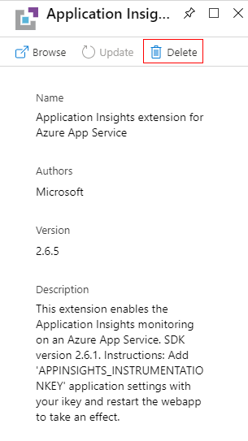
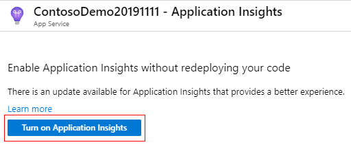
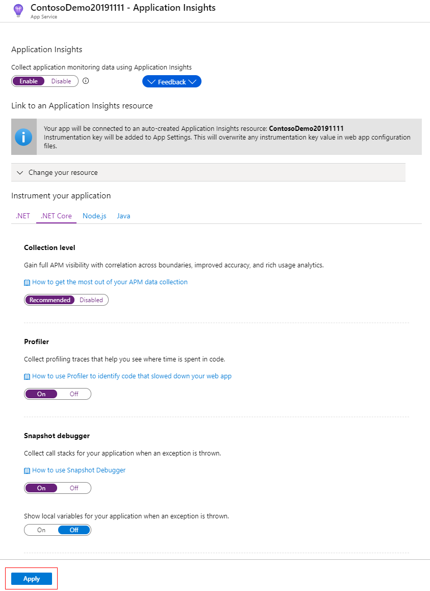

# Upgrading the Snapshot Debugger

To provide the best possible security for your data, Microsoft is moving away from TLS 1.0 and TLS 1.1, which have been shown to be vulnerable to determined attackers. If you're using an older version of the site extension, it will require an upgrade to continue working. This document outlines the steps needed to upgrade your Snapshot debugger to the latest version. 
There are two primary upgrade paths depending on if you enabled the Snapshot Debugger using a site extension or if you used an SDK/Nuget added to your application. Both upgrade paths are discussed below. 

## Upgrading the site extension

> [!IMPORTANT]
> Older versions of Application Insights used a private site extension called _Application Insights extension for Azure App Service_. The current Application Insights experience is enabled by setting App Settings to light up a pre-installed site extension.
> To avoid conflicts, which may cause your site to stop working, it is important to delete the private site extension first. See step 4 below.

If you enabled the Snapshot debugger using the site extension, you can upgrade using the following procedure:

1. Sign in to the Azure portal.
2. Navigate to your resource that has Application Insights and Snapshot debugger enabled. For example, for a Web App, navigate to the App Service resource:

   

3. Once you've navigated to your resource, click on the Extensions blade and wait for the list of extensions to populate:

   

4. If any version of _Application Insights extension for Azure App Service_ is installed, then select it and click Delete. Confirm **Yes** to delete the extension and wait for the delete to complete before moving to the next step.

   

5. Go to the Overview blade of your resource and click on Application Insights:

   

6. If this is the first time you've viewed the Application Insights blade for this App Service, you'll be prompted to turn on Application Insights. Select **Turn on Application Insights**.
 
   

7. The current Application Insights settings are displayed. Unless you want to take the opportunity to change your settings, you can leave them as is. The **Apply** button on the bottom of the blade isn't enabled by default and you'll have to toggle one of the settings to activate the button. You don’t have to change any actual settings, rather you can change the setting and then immediately change it back. We recommend toggling the Profiler setting and then selecting **Apply**.

   

8. Once you click **Apply**, you'll be asked to confirm the changes.

    > [!NOTE]
    > The site will be restarted as part of the upgrade process.

   

9. Click **Yes** to apply the changes and wait for the process to complete.

The site has now been upgraded and is ready to use.

## Upgrading Snapshot Debugger using SDK/Nuget

If the application is using a version of `Microsoft.ApplicationInsights.SnapshotCollector` below version 1.3.1, it will need to be upgraded to a [newer version](https://www.nuget.org/packages/Microsoft.ApplicationInsights.SnapshotCollector) to continue working.
