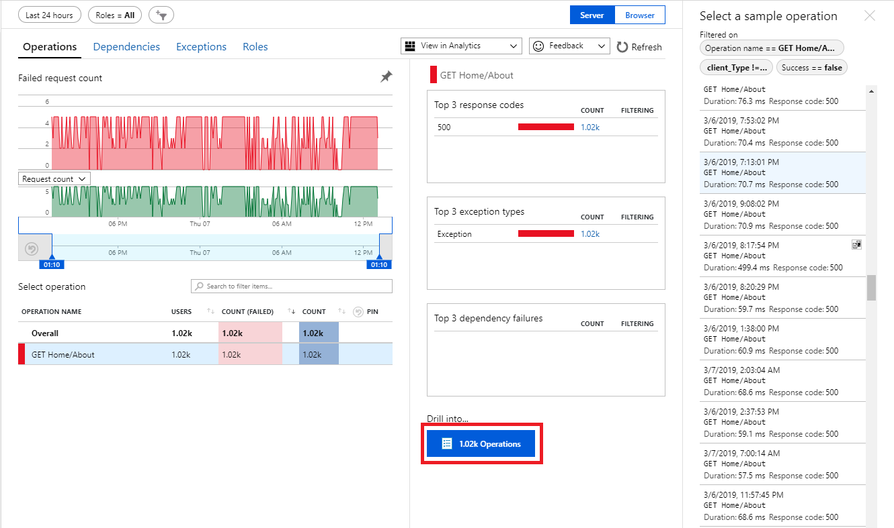
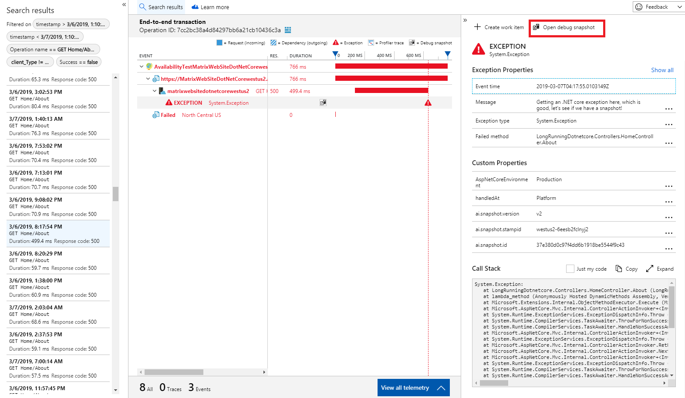
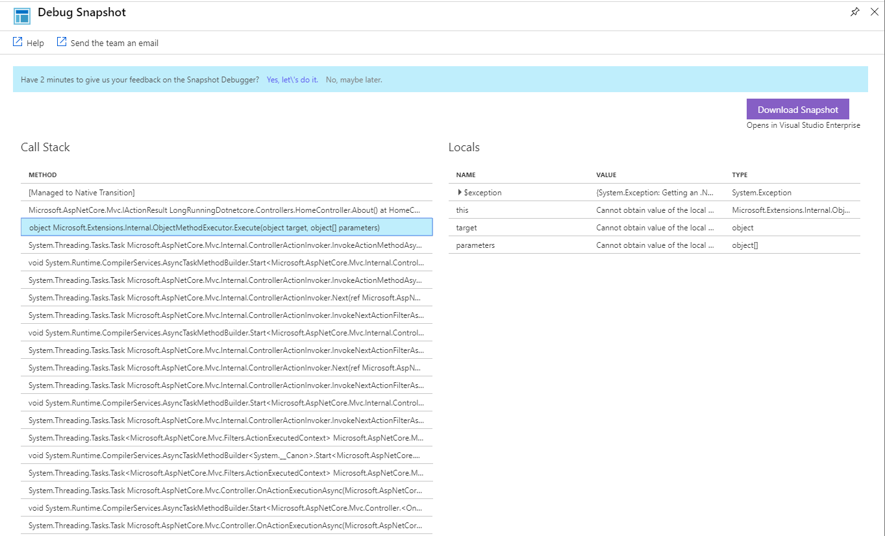
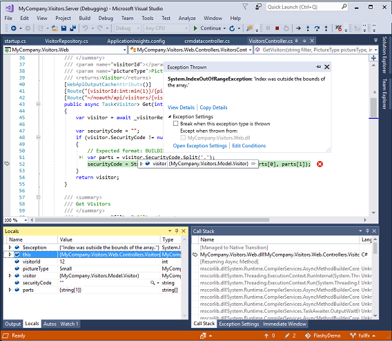

# Debug snapshots on exceptions in .NET apps
When an exception occurs, you can automatically collect a debug snapshot from your live web application. The snapshot shows the state of source code and variables at the moment the exception was thrown. The Snapshot Debugger in [Azure Application Insights](./app-insights-overview.md) monitors exception telemetry from your web app. It collects snapshots on your top-throwing exceptions so that you have the information you need to diagnose issues in production. Include the [Snapshot collector NuGet package](https://www.nuget.org/packages/Microsoft.ApplicationInsights.SnapshotCollector) in your application, and optionally configure collection parameters in [ApplicationInsights.config](./configuration-with-applicationinsights-config.md). Snapshots appear on [exceptions](./asp-net-exceptions.md) in the Application Insights portal.

You can view debug snapshots in the portal to see the call stack and inspect variables at each call stack frame. To get a more powerful debugging experience with source code, open snapshots with Visual Studio 2019 Enterprise. In Visual Studio, you can also [set Snappoints to interactively take snapshots](/visualstudio/debugger/debug-live-azure-applications) without waiting for an exception.

Debug snapshots are stored for 15 days. This retention policy is set on a per-application basis. If you need to increase this value, you can request an increase by opening a support case in the Azure portal.

## Enable Application Insights Snapshot Debugger for your application
Snapshot collection is available for:
* .NET Framework and ASP.NET applications running .NET Framework 4.5 or later.
* .NET Core and ASP.NET Core applications running .NET Core 2.1 (LTS) or 3.1 (LTS) on Windows.
* .NET 5.0 applications on Windows.

We don't recommend using .NET Core 2.0, 2.2 or 3.0 since they are out of support.

The following environments are supported:

* [Azure App Service](snapshot-debugger-appservice.md?toc=/azure/azure-monitor/toc.json)
* [Azure Function](snapshot-debugger-function-app.md?toc=/azure/azure-monitor/toc.json)
* [Azure Cloud Services](snapshot-debugger-vm.md?toc=/azure/azure-monitor/toc.json) running OS family 4 or later
* [Azure Service Fabric services](snapshot-debugger-vm.md?toc=/azure/azure-monitor/toc.json) running on Windows Server 2012 R2 or later
* [Azure Virtual Machines and virtual machine scale sets](snapshot-debugger-vm.md?toc=/azure/azure-monitor/toc.json) running Windows Server 2012 R2 or later
* [On-premises virtual or physical machines](snapshot-debugger-vm.md?toc=/azure/azure-monitor/toc.json) running Windows Server 2012 R2 or later or Windows 8.1 or later

> [!NOTE]
> Client applications (for example, WPF, Windows Forms or UWP) are not supported.

If you've enabled Snapshot Debugger but aren't seeing snapshots, check our [Troubleshooting guide](snapshot-debugger-troubleshoot.md?toc=/azure/azure-monitor/toc.json).

## Grant permissions

Access to snapshots is protected by Azure role-based access control (Azure RBAC). To inspect a snapshot, you must first be added to the necessary role by a subscription owner.

> [!NOTE]
> Owners and contributors do not automatically have this role. If they want to view snapshots, they must add themselves to the role.

Subscription owners should assign the `Application Insights Snapshot Debugger` role to users who will inspect snapshots. This role can be assigned to individual users or groups by subscription owners for the target Application Insights resource or its resource group or subscription.

1. Navigate to the Application Insights resource in the Azure portal.
1. Click **Access control (IAM)**.
1. Click the **+Add role assignment** button.
1. Select **Application Insights Snapshot Debugger** from the **Roles** drop-down list.
1. Search for and enter a name for the user to add.
1. Click the **Save** button to add the user to the role.


> [!IMPORTANT]
> Snapshots can potentially contain personal and other sensitive information in variable and parameter values.

## View Snapshots in the Portal

After an exception has occurred in your application and a snapshot has been created, you should have snapshots to view. It can take 5 to 10 minutes from an exception occurring to a snapshot ready and viewable from the portal. To view snapshots, in the **Failure** pane, select the **Operations** button when viewing the **Operations** tab, or select the **Exceptions** button when viewing the **Exceptions** tab:



Select an operation or exception in the right pane to open the **End-to-End Transaction Details** pane, then select the exception event. If a snapshot is available for the given exception, an **Open Debug Snapshot** button appears on the right pane with details for the [exception](./asp-net-exceptions.md).



In the Debug Snapshot view, you see a call stack and a variables pane. When you select frames of the call stack in the call stack pane, you can view local variables and parameters for that function call in the variables pane.



Snapshots might include sensitive information, and by default they aren't viewable. To view snapshots, you must have the `Application Insights Snapshot Debugger` role assigned to you.

## View Snapshots in Visual Studio 2017 Enterprise or above
1. Click the **Download Snapshot** button to download a `.diagsession` file, which can be opened by Visual Studio Enterprise.

2. To open the `.diagsession` file, you need to have the Snapshot Debugger Visual Studio component installed. The Snapshot Debugger component is a required component of the ASP.net workload in Visual Studio and can be selected from the Individual Component list in the Visual Studio installer. If you are using a version of Visual Studio prior to Visual Studio 2017 version 15.5, you will need to install the extension from the [Visual Studio Marketplace](https://aka.ms/snapshotdebugger).

3. After you open the snapshot file, the Minidump Debugging page in Visual Studio appears. Click **Debug Managed Code** to start debugging the snapshot. The snapshot opens to the line of code where the exception was thrown so that you can debug the current state of the process.

    

The downloaded snapshot includes any symbol files that were found on your web application server. These symbol files are required to associate snapshot data with source code. For App Service apps, make sure to enable symbol deployment when you publish your web apps.

## How snapshots work

The Snapshot Collector is implemented as an [Application Insights Telemetry Processor](./configuration-with-applicationinsights-config.md#telemetry-processors-aspnet). When your application runs, the Snapshot Collector Telemetry Processor is added to your application's telemetry pipeline.
Each time your application calls [TrackException](./asp-net-exceptions.md#exceptions), the Snapshot Collector computes a Problem ID from the type of exception being thrown and the throwing method.
Each time your application calls TrackException, a counter is incremented for the appropriate Problem ID. When the counter reaches the `ThresholdForSnapshotting` value, the Problem ID is added to a Collection Plan.

The Snapshot Collector also monitors exceptions as they're thrown by subscribing to the [AppDomain.CurrentDomain.FirstChanceException](/dotnet/api/system.appdomain.firstchanceexception) event. When that event fires, the Problem ID of the exception is computed and compared against the Problem IDs in the Collection Plan.
If there's a match, then a snapshot of the running process is created. The snapshot is assigned a unique identifier and the exception is stamped with that identifier. After the FirstChanceException handler returns, the thrown exception is processed as normal. Eventually, the exception reaches the TrackException method again where it, along with the snapshot identifier, is reported to Application Insights.

The main process continues to run and serve traffic to users with little interruption. Meanwhile, the snapshot is handed off to the Snapshot Uploader process. The Snapshot Uploader creates a minidump and uploads it to Application Insights along with any relevant symbol (.pdb) files.

> [!TIP]
> - A process snapshot is a suspended clone of the running process.
> - Creating the snapshot takes about 10 to 20 milliseconds.
> - The default value for `ThresholdForSnapshotting` is 1. This is also the minimum value. Therefore, your app has to trigger the same exception **twice** before a snapshot is created.
> - Set `IsEnabledInDeveloperMode` to true if you want to generate snapshots while debugging in Visual Studio.
> - The snapshot creation rate is limited by the `SnapshotsPerTenMinutesLimit` setting. By default, the limit is one snapshot every ten minutes.
> - No more than 50 snapshots per day may be uploaded.

## Limitations

The default data retention period is 15 days. For each Application Insights instance, a maximum number of 50 snapshots is allowed per day.

### Publish symbols
The Snapshot Debugger requires symbol files on the production server to decode variables and to provide a debugging experience in Visual Studio.
Version 15.2 (or above) of Visual Studio 2017 publishes symbols for release builds by default when it publishes to App Service. In prior versions, you need to add the following line to your publish profile `.pubxml` file so that symbols are published in release mode:

```xml
    <ExcludeGeneratedDebugSymbol>False</ExcludeGeneratedDebugSymbol>
```

For Azure Compute and other types, make sure that the symbol files are in the same folder of the main application .dll (typically, `wwwroot/bin`) or are available on the current path.

> [!NOTE]
> For more information on the different symbol options that are available consult the [Visual Studio documentation](/visualstudio/ide/reference/advanced-build-settings-dialog-box-csharp?view=vs-2019&preserve-view=true#output
). For best results, we recommend using "Full", "Portable" or "Embedded".

### Optimized builds
In some cases, local variables can't be viewed in release builds because of optimizations that are applied by the JIT compiler.
However, in Azure App Services, the Snapshot Collector can deoptimize throwing methods that are part of its Collection Plan.

> [!TIP]
> Install the Application Insights Site Extension in your App Service to get deoptimization support.

## Next steps
Enable Application Insights Snapshot Debugger for your application:

* [Azure App Service](snapshot-debugger-appservice.md?toc=/azure/azure-monitor/toc.json)
* [Azure Function](snapshot-debugger-function-app.md?toc=/azure/azure-monitor/toc.json)
* [Azure Cloud Services](snapshot-debugger-vm.md?toc=/azure/azure-monitor/toc.json)
* [Azure Service Fabric services](snapshot-debugger-vm.md?toc=/azure/azure-monitor/toc.json)
* [Azure Virtual Machines and virtual machine scale sets](snapshot-debugger-vm.md?toc=/azure/azure-monitor/toc.json)
* [On-premises virtual or physical machines](snapshot-debugger-vm.md?toc=/azure/azure-monitor/toc.json)

Beyond Application Insights Snapshot Debugger:
 
* [Set snappoints in your code](/visualstudio/debugger/debug-live-azure-applications) to get snapshots without waiting for an exception.
* [Diagnose exceptions in your web apps](./asp-net-exceptions.md) explains how to make more exceptions visible to Application Insights.
* [Smart Detection](./proactive-diagnostics.md) automatically discovers performance anomalies.