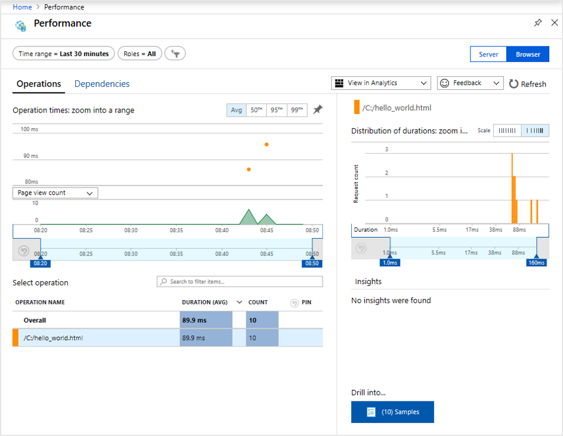
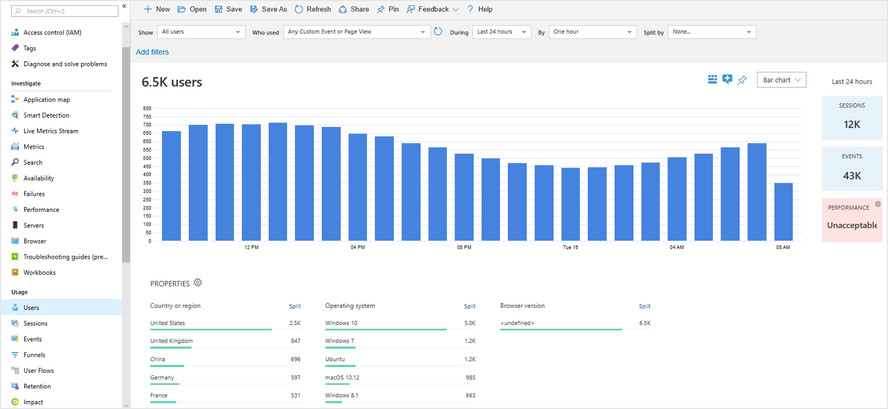
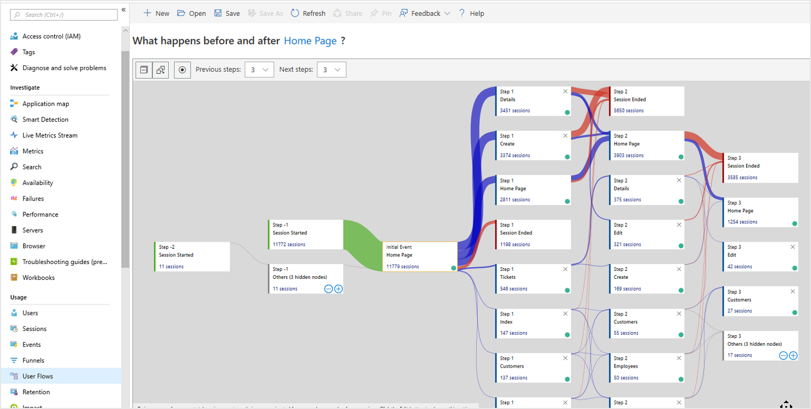

# Quickstart: Start monitoring your website with Azure Monitor Application Insights

In this quickstart, you learn to add the open-source Application Insights JavaScript SDK to your website. You also learn how to better understand the client/browser-side experience for visitors to your website.

With Azure Monitor Application Insights, you can easily monitor your website for availability, performance, and usage. You can also quickly identify and diagnose errors in your application without waiting for a user to report them. Application Insights provides both server-side monitoring and client/browser-side monitoring capabilities.

## Prerequisites

* An Azure account with an active subscription. [Create an account for free](https://azure.microsoft.com/free/?ref=microsoft.com&utm_source=microsoft.com&utm_medium=docs&utm_campaign=visualstudio).
* A website to which you can add the Application Insights JavaScript SDK.

## Enable Application Insights

Application Insights can gather telemetry data from any internet-connected application that's running on-premises or in the cloud. Use the following steps to view this data:

1. Sign in to the [Azure portal](https://portal.azure.com/).
1. Select **Create a resource** > **Management tools** > **Application Insights**.

   > [!NOTE]
   >If this is your first time creating an Application Insights resource, see [Create an Application Insights resource](./create-new-resource.md).
1. When the configuration box appears, use the following table to complete the input fields:

    | Settings        | Value           | Description  |
   | ------------- |:-------------|:-----|
   | **Name**      | Globally Unique Value | The name that identifies the app you're monitoring. |
   | **Resource Group**     | myResourceGroup      | The name for the new resource group to host Application Insights data. You can create a new resource group or use an existing one. |
   | **Location** | East US | Choose a location near you, or near where your app is hosted. |
1. Select **Create**.

## Create an HTML file

1. On your local computer, create a file called ``hello_world.html``. For this example, create the file on the root of drive C so that it looks like ``C:\hello_world.html``.
1. Copy and paste the following script into ``hello_world.html``:

    ```html
    <!DOCTYPE html>
    <html>
    <head>
    <title>Azure Monitor Application Insights</title>
    </head>
    <body>
    <h1>Azure Monitor Application Insights Hello World!</h1>
    <p>You can use the Application Insights JavaScript SDK to perform client/browser-side monitoring of your website. To learn about more advanced JavaScript SDK configurations, visit the <a href="https://github.com/Microsoft/ApplicationInsights-JS/blob/master/API-reference.md" title="API Reference">API reference</a>.</p>
    </body>
    </html>
    ```

## Configure Application Insights SDK

1. Select **Overview** > **Essentials**, and then copy your application's **Instrumentation Key**.

   

1. Add the following script to your ``hello_world.html`` file before the closing ``</head>`` tag:

    ```javascript
    <script type="text/javascript">
    !function(T,l,y){var S=T.location,u="script",k="instrumentationKey",D="ingestionendpoint",C="disableExceptionTracking",E="ai.device.",I="toLowerCase",b="crossOrigin",w="POST",e="appInsightsSDK",t=y.name||"appInsights";(y.name||T[e])&&(T[e]=t);var n=T[t]||function(d){var g=!1,f=!1,m={initialize:!0,queue:[],sv:"4",version:2,config:d};function v(e,t){var n={},a="Browser";return n[E+"id"]=a[I](),n[E+"type"]=a,n["ai.operation.name"]=S&&S.pathname||"_unknown_",n["ai.internal.sdkVersion"]="javascript:snippet_"+(m.sv||m.version),{time:function(){var e=new Date;function t(e){var t=""+e;return 1===t.length&&(t="0"+t),t}return e.getUTCFullYear()+"-"+t(1+e.getUTCMonth())+"-"+t(e.getUTCDate())+"T"+t(e.getUTCHours())+":"+t(e.getUTCMinutes())+":"+t(e.getUTCSeconds())+"."+((e.getUTCMilliseconds()/1e3).toFixed(3)+"").slice(2,5)+"Z"}(),iKey:e,name:"Microsoft.ApplicationInsights."+e.replace(/-/g,"")+"."+t,sampleRate:100,tags:n,data:{baseData:{ver:2}}}}var h=d.url||y.src;if(h){function a(e){var t,n,a,i,r,o,s,c,p,l,u;g=!0,m.queue=[],f||(f=!0,t=h,s=function(){var e={},t=d.connectionString;if(t)for(var n=t.split(";"),a=0;a<n.length;a++){var i=n[a].split("=");2===i.length&&(e[i[0][I]()]=i[1])}if(!e[D]){var r=e.endpointsuffix,o=r?e.location:null;e[D]="https://"+(o?o+".":"")+"dc."+(r||"services.visualstudio.com")}return e}(),c=s[k]||d[k]||"",p=s[D],l=p?p+"/v2/track":config.endpointUrl,(u=[]).push((n="SDK LOAD Failure: Failed to load Application Insights SDK script (See stack for details)",a=t,i=l,(o=(r=v(c,"Exception")).data).baseType="ExceptionData",o.baseData.exceptions=[{typeName:"SDKLoadFailed",message:n.replace(/\./g,"-"),hasFullStack:!1,stack:n+"\nSnippet failed to load ["+a+"] -- Telemetry is disabled\nHelp Link: https://go.microsoft.com/fwlink/?linkid=2128109\nHost: "+(S&&S.pathname||"_unknown_")+"\nEndpoint: "+i,parsedStack:[]}],r)),u.push(function(e,t,n,a){var i=v(c,"Message"),r=i.data;r.baseType="MessageData";var o=r.baseData;return o.message='AI (Internal): 99 message:"'+("SDK LOAD Failure: Failed to load Application Insights SDK script (See stack for details) ("+n+")").replace(/\"/g,"")+'"',o.properties={endpoint:a},i}(0,0,t,l)),function(e,t){if(JSON){var n=T.fetch;if(n&&!y.useXhr)n(t,{method:w,body:JSON.stringify(e),mode:"cors"});else if(XMLHttpRequest){var a=new XMLHttpRequest;a.open(w,t),a.setRequestHeader("Content-type","application/json"),a.send(JSON.stringify(e))}}}(u,l))}function i(e,t){f||setTimeout(function(){!t&&m.core||a()},500)}var e=function(){var n=l.createElement(u);n.src=h;var e=y[b];return!e&&""!==e||"undefined"==n[b]||(n[b]=e),n.onload=i,n.onerror=a,n.onreadystatechange=function(e,t){"loaded"!==n.readyState&&"complete"!==n.readyState||i(0,t)},n}();y.ld<0?l.getElementsByTagName("head")[0].appendChild(e):setTimeout(function(){l.getElementsByTagName(u)[0].parentNode.appendChild(e)},y.ld||0)}try{m.cookie=l.cookie}catch(p){}function t(e){for(;e.length;)!function(t){m[t]=function(){var e=arguments;g||m.queue.push(function(){m[t].apply(m,e)})}}(e.pop())}var n="track",r="TrackPage",o="TrackEvent";t([n+"Event",n+"PageView",n+"Exception",n+"Trace",n+"DependencyData",n+"Metric",n+"PageViewPerformance","start"+r,"stop"+r,"start"+o,"stop"+o,"addTelemetryInitializer","setAuthenticatedUserContext","clearAuthenticatedUserContext","flush"]),m.SeverityLevel={Verbose:0,Information:1,Warning:2,Error:3,Critical:4};var s=(d.extensionConfig||{}).ApplicationInsightsAnalytics||{};if(!0!==d[C]&&!0!==s[C]){method="onerror",t(["_"+method]);var c=T[method];T[method]=function(e,t,n,a,i){var r=c&&c(e,t,n,a,i);return!0!==r&&m["_"+method]({message:e,url:t,lineNumber:n,columnNumber:a,error:i}),r},d.autoExceptionInstrumented=!0}return m}(y.cfg);(T[t]=n).queue&&0===n.queue.length&&n.trackPageView({})}(window,document,{
    src: "https://az416426.vo.msecnd.net/scripts/b/ai.2.min.js", // The SDK URL Source
    //name: "appInsights", // Global SDK Instance name defaults to "appInsights" when not supplied
    //ld: 0, // Defines the load delay (in ms) before attempting to load the sdk. -1 = block page load and add to head. (default) = 0ms load after timeout,
    //useXhr: 1, // Use XHR instead of fetch to report failures (if available),
    //crossOrigin: "anonymous", // When supplied this will add the provided value as the cross origin attribute on the script tag 
    cfg: { // Application Insights Configuration
        instrumentationKey: "YOUR_INSTRUMENTATION_KEY_GOES_HERE"
        /* ...Other Configuration Options... */
    }});
    </script>
    ```
    
1. Edit ``hello_world.html`` and add your instrumentation key.

1. Open ``hello_world.html`` in a local browser session. This action creates a single page view. You can refresh your browser to generate multiple test-page views.

## Monitor your website in the Azure portal

1. Reopen the Application Insights **Overview** page in the Azure portal to view details of your currently running application. The **Overview** page is where you retrieved your instrumentation key.

   The four default charts on the overview page are scoped to server-side application data. Because we're instrumenting the client/browser-side interactions with the JavaScript SDK, this particular view doesn't apply unless we also have a server-side SDK installed.

1. Select **Analytics** .  This action opens **Analytics**, which provides a rich query language for analyzing all data collected by Application Insights. To view data related to the client-side browser requests, run the following query:

    ```kusto
    // average pageView duration by name
    let timeGrain=1s;
    let dataset=pageViews
    // additional filters can be applied here
    | where timestamp > ago(15m)
    | where client_Type == "Browser" ;
    // calculate average pageView duration for all pageViews
    dataset
    | summarize avg(duration) by bin(timestamp, timeGrain)
    | extend pageView='Overall'
    // render result in a chart
    | render timechart
    ```

   

1. Go back to the **Overview** page. Under the **Investigate** header, select **Browser**, and then select **Performance**.  Metrics related to the performance of your website appear. There's a corresponding view for analyzing failures and exceptions in your website. You can select **Samples** to access the [end-to-end transaction details](./transaction-diagnostics.md).

   

1. On the main Application Insights menu, under the **Usage** header, select [**Users**](./usage-segmentation.md) to begin exploring the [user behavior analytics tools](./usage-overview.md). Because we're testing from a single machine, we'll only see data for one user. For a live website, the distribution of users might look like this:

     

1. For a more complex website with multiple pages, you can use the [**User Flows**](./usage-flows.md) tool to track the pathway that visitors take through the various parts of your website.

   

To learn more advanced configurations for monitoring websites, see the [JavaScript SDK API reference](./javascript.md).

## Clean up resources

If you plan to continue working with additional quickstarts or tutorials, don't clean up the resources created in this quickstart. Otherwise, use the following steps to delete all resources created by this quickstart in the Azure portal.

> [!NOTE]
> If you used an existing resource group, the following instructions won't work. Instead, you can just delete the individual Application Insights resource. Keep in mind that when you delete a resource group, all underyling resources that are members of that group are deleted too.

1. On the left menu on the Azure portal, select **Resource groups**, and then select **myResourceGroup** or the name of your temporary resource group.
1. On your resource group page, select **Delete**, enter **myResourceGroup** in the text box, and then select **Delete**.

## Next steps

> [!div class="nextstepaction"]
> [Find and diagnose performance problems](../logs/log-query-overview.md)

