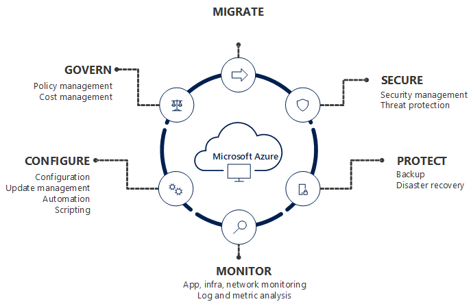

# Azure Management - Monitoring

Monitoring in Azure is one aspect of Azure Management.  This article briefly describes the different areas of management required to deploy and maintain your applications and resources in Azure with links to documentation to get you started.

## Management in Azure

Management refers to the tasks and processes required to maintain your business applications and the resources that support them.  Azure has multiple services and tools that work together to provide complete management for not only your applications running in Azure but also in other clouds and on-premises.  Understanding the different tools available and how they can be used together for a variety of management scenarios is the first step in designing a complete management environment.

The following diagram illustrates the different areas of management that are required to maintain any application or resource.  These different areas can be thought of in terms of a lifecycle where each is required in continuous succession over the lifespan of a resource.  This starts with its initial deployment, through its continued operation, and finally when it's retired.

The following sections briefly describe the different management areas and provide links to detailed content on the main Azure services intended to address them.

## Monitor
Monitoring is the act of collecting and analyzing data to determine the performance, health, and availability of your business application and the resources it depends on. An effective monitoring strategy will help you understand the detailed operation of the different components of your application and to increase your uptime by proactively notifying you of critical issues so that you can resolve them before they become problems. Monitoring in Azure is primarily provided by [Azure Monitor](../azure-monitor/overview.md) which provides common stores for storing monitoring data, multiple data sources for collecting data from the different tiers supporting your application, and features for analyzing and responding to collected data.

## Configure
Configure refers to the initial deployment and configuration of applications and resources and their ongoing maintenance with patches and updates.  Automation of these tasks through script and policy allows you to eliminate redundancy, minimizing your time and effort and increasing your accuracy and efficiency.  [Azure Automation](../automation/automation-intro.md) provides the bulk of services for automating configuration tasks.  In addition to runbooks for automating processes, it provides configuration and update management, which assist you in managing configuration through policy and in identifying and deploying updates.

## Govern
Governance provides mechanisms and processes to maintain control over your applications and resources in Azure.  It involves planning your initiatives and setting strategic priorities.  Governance in Azure is primarily implemented with two services.  [Azure Policy](../governance/policy/overview.md) allows you to create, assign and, manage policy definitions that enforce different rules and actions over your resources, so those resources stay compliant with your corporate standards and service level agreements. [Azure Cost Management by Cloudyn](../cost-management/overview.md) allows you to track cloud usage and expenditures for your Azure resources and other cloud providers including AWS and Google.

## Secure
Managing security of your applications,  resources, and data involves a combination of assessing threats, collecting and analyzing security data, and ensuring that your applications and resources are designed and configured in a secure fashion.  Security monitoring and threat analysis are provided by [Azure Security Center](../security-center/security-center-intro.md) which includes unified security management and advanced threat protection across hybrid cloud workloads.  You should also see [Introduction to Azure Security](../security/azure-security.md) for comprehensive information on security in Azure and guidance on securely configuring Azure resources.

## Protect
Protection refers to ensuring that your applications and data are always available, even in the case of outages beyond your control.  Protection in Azure is provided by two services.  [Azure Backup](../backup/backup-introduction-to-azure-backup.md) provides backup and recovery of your data, either in the cloud or on-premises.    [Azure Site Recovery](../site-recovery/site-recovery-overview.md) ensures high availability of your application by providing business continuity and immediate recovery in the case of disaster.

## Migrate 
Migration refers to transitioning workloads currently running on-premises to the Azure cloud.  [Azure Migrate](../migrate/migrate-overview.md) is a service that helps you assess the migration suitability, including performance-based sizing and cost estimates, of on-premises virtual machines to Azure.  Azure Site Recovery can help you perform the actual migration of virtual machines [from on-premises](../site-recovery/migrate-tutorial-on-premises-azure.md) or [from Amazon Web Services](../site-recovery/migrate-tutorial-aws-azure.md).  [Azure Database Migration](../dms/dms-overview.md) will assist you in migrating multiple database sources to Azure Data platforms.

