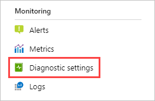
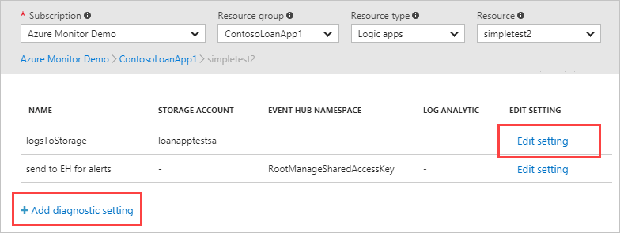
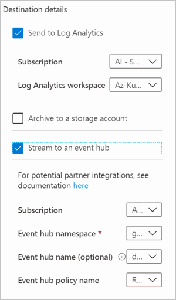
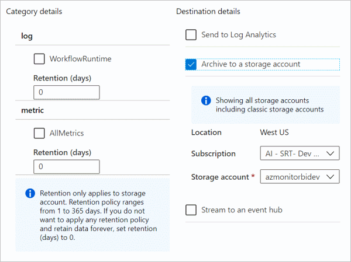

# Create diagnostic settings to send platform logs and metrics to different destinations
[Platform logs](../platform/platform-logs-overview.md) in Azure, including the Azure Activity log and resource logs, provide detailed diagnostic and auditing information for Azure resources and the Azure platform they depend on. [Platform metrics](../platform/data-platform-metrics.md) are collected by default and typically stored in the Azure Monitor metrics database. This article provides details on creating and configuring diagnostic settings to send platform metrics and platform logs to different destinations.

> [!IMPORTANT]
> Before you create a diagnostic setting for the Activity log, you should first disable any legacy configuration. See [Legacy collection methods](../essentials/activity-log.md#legacy-collection-methods) for details.

Each Azure resource requires its own diagnostic setting, which defines the following criteria:

- Categories of logs and metric data sent to the destinations defined in the setting. The available categories will vary for different resource types.
- One or more destinations to send the logs. Current destinations include Log Analytics workspace, Event Hubs, and Azure Storage.

A single diagnostic setting can define no more than one of each of the destinations. If you want to send data to more than one of a particular destination type (for example, two different Log Analytics workspaces), then create multiple settings. Each resource can have up to 5 diagnostic settings.

The following video walks you through routing platform logs with diagnostic settings.
> [!VIDEO https://www.microsoft.com/en-us/videoplayer/embed/RE4AvVO]

> [!NOTE]
> [Platform metrics](../platform/metrics-supported.md) are sent automatically to [Azure Monitor Metrics](../platform/data-platform-metrics.md). Diagnostic settings can be used to send metrics for certain Azure services into Azure Monitor Logs for analysis with other monitoring data using [log queries](../log-query/log-query-overview.md) with certain limitations. 
>  
>  
> Sending multi-dimensional metrics via diagnostic settings is not currently supported. Metrics with dimensions are exported as flattened single dimensional metrics, aggregated across dimension values. *For example*: The 'IOReadBytes' metric on a Blockchain can be explored and charted on a per node level. However, when exported via diagnostic settings, the metric exported represents as all read bytes for all nodes. In addition, due to internal limitations not all metrics are exportable to Azure Monitor Logs / Log Analytics. For more information, see the [list of exportable metrics](../platform/metrics-supported-export-diagnostic-settings.md). 
>  
>  
> To get around these limitations for specific metrics, we suggest you manually extract them using the [Metrics REST API](/rest/api/monitor/metrics/list) and import them into Azure Monitor Logs using the [Azure Monitor Data collector API](../platform/data-collector-api.md).  


## Destinations
Platform logs and metrics can be sent to the destinations in the following table. 

| Destination | Description |
|:---|:---|
| [Log Analytics workspace](../platform/design-logs-deployment.md) | Sending logs and metrics to a Log Analytics workspace allows you to analyze them with other monitoring data collected by Azure Monitor using powerful log queries and also to leverage other Azure Monitor features such as alerts and visualizations. |
| [Event hubs](../../event-hubs/index.yml) | Sending logs and metrics to Event Hubs allows you to stream data to external systems such as third-party SIEMs and other log analytics solutions.  |
| [Azure storage account](../../storage/blobs/index.yml) | Archiving logs and metrics to an Azure storage account is useful for audit, static analysis, or backup. Compared to Azure Monitor Logs and a Log Analytics workspace, Azure storage is less expensive and logs can be kept there indefinitely.  |


### Destination requirements

Any destinations for the diagnostic setting must be created before creating the diagnostic settings. The destination does not have to be in the same subscription as the resource sending logs as long as the user who configures the setting has appropriate Azure RBAC access to both subscriptions. The following table provides unique requirements for each destination including any regional restrictions.

| Destination | Requirements |
|:---|:---|
| Log Analytics workspace | The workspace does not need to be in the same region as the resource being monitored.|
| Event hubs | The shared access policy for the namespace defines the permissions that the streaming mechanism has. Streaming to Event Hubs requires Manage, Send, and Listen permissions. To update the diagnostic setting to include streaming, you must have the ListKey permission on that Event Hubs authorization rule.<br><br>The event hub namespace needs to be in the same region as the resource being monitored if the resource is regional. |
| Azure storage account | You should not use an existing storage account that has other, non-monitoring data stored in it so that you can better control access to the data. If you are archiving the Activity log and resource logs together though, you may choose to use the same storage account to keep all monitoring data in a central location.<br><br>To send the data to immutable storage, set the immutable policy for the storage account as described in [Set and manage immutability policies for Blob storage](../../storage/blobs/storage-blob-immutability-policies-manage.md). You must follow all steps in this article including enabling protected append blobs writes.<br><br>The storage account needs to be in the same region as the resource being monitored if the resource is regional. |

> [!NOTE]
> Azure Data Lake Storage Gen2 accounts are not currently supported as a destination for diagnostic settings even though they may be listed as a valid option in the Azure portal.

> [!NOTE]
> Azure Monitor (Diagnostic Settings) can't access Event Hubs resources when virtual networks are enabled. You have to enable the Allow trusted Microsoft services to bypass this firewall setting in Event Hub, so that Azure Monitor (Diagnostic Settings) service is granted access to your Event Hubs resources. 


## Create in Azure portal

You can configure diagnostic settings in the Azure portal either from the Azure Monitor menu or from the menu for the resource.

1. Where you configure diagnostic settings in the Azure portal depends on the resource.

   - For a single resource, click **Diagnostic settings** under **Monitor** in the resource's menu.

        

   - For one or more resources, click **Diagnostic settings** under **Settings** in the Azure Monitor menu and then click on the resource.

        

   - For the Activity log, click **Activity log** in the **Azure Monitor** menu and then **Diagnostic settings**. Make sure you disable any legacy configuration for the Activity log. See [Disable existing settings](./activity-log.md#legacy-collection-methods) for details.

        

2. If no settings exist on the resource you have selected, you are prompted to create a setting. Click **Add diagnostic setting**.

   

   If there are existing settings on the resource, you see a list of settings already configured. Either click **Add diagnostic setting** to add a new setting or **Edit setting** to edit an existing one. Each setting can have no more than one of each of the destination types.

   

3. Give your setting a name if it doesn't already have one.

    

4. **Category details (what to route)** - Check the box for each category of data you want to send to destinations specified later. The list of categories varies for each Azure service.

     - **AllMetrics** routes a resource's platform metrics into the Azure Logs store, but in log form. These metrics are usually sent only to the Azure Monitor metrics time-series database. Sending them to the Azure Monitor Logs store (which is searchable via Log Analytics) helps you to integrate them into queries which search across other logs. This option may not be available for all resource types. When it is supported, [Azure Monitor supported metrics](../platform/metrics-supported.md) lists what metrics are collected for what resource types.

       > [!NOTE]
       > See limitation for routing metrics to Azure Monitor Logs earlier in this article.  


     - **Logs** lists the different categories available depending on the resource type. Check any categories that you would like to route to a destination.

5. **Destination details** - Check the box for each destination. When you check each box, options appear to allow you to add additional information.

      

    1. **Log Analytics** - Enter the subscription and workspace.  If you don't have a workspace, you need to [create one before proceeding](../learn/quick-create-workspace.md).

    1. **Event hubs** - Specify the following criteria:
       - The subscription which the event hub is part of
       - The Event hub namespace - If you do not yet have one, you'll need [to create one](../../event-hubs/event-hubs-create.md)
       - An Event hub name (optional) to send all data to. If you don't specify a name, an event hub is created for each log category. If you are sending multiple categories, you may want to specify a name to limit the number of event hubs created. See [Azure Event Hubs quotas and limits](../../event-hubs/event-hubs-quotas.md) for details.
       - An Event Hub policy (optional) A policy defines the permissions that the streaming mechanism has. For more information, see [Event-hubs-features](../../event-hubs/event-hubs-features.md#publisher-policy).

    1. **Storage** - Choose the subscription, storage account, and retention policy.

        

        > [!TIP]
        > Consider setting the retention policy to 0 and manually deleting your data from storage using a scheduled job to avoid possible confusion in the future.
        >
        > First, if you are using storage for archiving, you generally want your data around for more than 365 days. Second, if you choose a retention policy that is greater than 0, the expiration date is attached to the logs at the time of storage. You can't change the date for those logs once stored.
        >
        > For example, if you set the retention policy for *WorkflowRuntime* to 180 days and then 24 hours later set it to 365 days, the logs stored during those first 24 hours will be automatically deleted after 180 days, while all subsequent logs of that type will be automatically deleted after 365 days. Changing the retention policy later doesn't make the first 24 hours of logs stay around for 365 days.

6. Click **Save**.

After a few moments, the new setting appears in your list of settings for this resource, and logs are streamed to the specified destinations as new event data is generated. It may take up to 15 minutes between when an event is emitted and when it [appears in a Log Analytics workspace](../platform/data-ingestion-time.md).

## Create using PowerShell

Use the [Set-AzDiagnosticSetting](/powershell/module/az.monitor/set-azdiagnosticsetting) cmdlet to create a diagnostic setting with [Azure PowerShell](../samples/powershell-samples.md). See the documentation for this cmdlet for descriptions of its parameters.

> [!IMPORTANT]
> You cannot use this method for the Azure Activity log. Instead, use [Create diagnostic setting in Azure Monitor using a Resource Manager template](../samples/resource-manager-diagnostic-settings.md) to create a Resource Manager template and deploy it with PowerShell.

Following is an example PowerShell cmdlet to create a diagnostic setting using all three destinations.

```powershell
Set-AzDiagnosticSetting -Name KeyVault-Diagnostics -ResourceId /subscriptions/xxxxxxxx-xxxx-xxxx-xxxx-xxxxxxxxxxxx/resourceGroups/myresourcegroup/providers/Microsoft.KeyVault/vaults/mykeyvault -Category AuditEvent -MetricCategory AllMetrics -Enabled $true -StorageAccountId /subscriptions/xxxxxxxx-xxxx-xxxx-xxxx-xxxxxxxxxxxx/resourceGroups/myresourcegroup/providers/Microsoft.Storage/storageAccounts/mystorageaccount -WorkspaceId /subscriptions/xxxxxxxx-xxxx-xxxx-xxxx-xxxxxxxxxxxx/resourcegroups/oi-default-east-us/providers/microsoft.operationalinsights/workspaces/myworkspace  -EventHubAuthorizationRuleId /subscriptions/xxxxxxxx-xxxx-xxxx-xxxx-xxxxxxxxxxxx/resourceGroups/myresourcegroup/providers/Microsoft.EventHub/namespaces/myeventhub/authorizationrules/RootManageSharedAccessKey
```

## Create using Azure CLI

Use the [az monitor diagnostic-settings create](/cli/azure/monitor/diagnostic-settings#az-monitor-diagnostic-settings-create) command to create a diagnostic setting with [Azure CLI](/cli/azure/monitor). See the documentation for this command for descriptions of its parameters.

> [!IMPORTANT]
> You cannot use this method for the Azure Activity log. Instead, use [Create diagnostic setting in Azure Monitor using a Resource Manager template](../samples/resource-manager-diagnostic-settings.md) to create a Resource Manager template and deploy it with CLI.

Following is an example CLI command to create a diagnostic setting using all three destinations.

```azurecli
az monitor diagnostic-settings create  \
--name KeyVault-Diagnostics \
--resource /subscriptions/xxxxxxxx-xxxx-xxxx-xxxx-xxxxxxxxxxxx/resourceGroups/myresourcegroup/providers/Microsoft.KeyVault/vaults/mykeyvault \
--logs    '[{"category": "AuditEvent","enabled": true}]' \
--metrics '[{"category": "AllMetrics","enabled": true}]' \
--storage-account /subscriptions/xxxxxxxx-xxxx-xxxx-xxxx-xxxxxxxxxxxx/resourceGroups/myresourcegroup/providers/Microsoft.Storage/storageAccounts/mystorageaccount \
--workspace /subscriptions/xxxxxxxx-xxxx-xxxx-xxxx-xxxxxxxxxxxx/resourcegroups/oi-default-east-us/providers/microsoft.operationalinsights/workspaces/myworkspace \
--event-hub-rule /subscriptions/xxxxxxxx-xxxx-xxxx-xxxx-xxxxxxxxxxxx/resourceGroups/myresourcegroup/providers/Microsoft.EventHub/namespaces/myeventhub/authorizationrules/RootManageSharedAccessKey
```

## Create using Resource Manager template
See [Resource Manager template samples for diagnostic settings in Azure Monitor](../samples/resource-manager-diagnostic-settings.md) to create or update diagnostic settings with a Resource Manager template.

## Create using REST API
See [Diagnostic Settings](/rest/api/monitor/diagnosticsettings) to create or update diagnostic settings using the [Azure Monitor REST API](/rest/api/monitor/).

## Create using Azure Policy
Since a diagnostic setting needs to be created for each Azure resource, Azure Policy can be used to automatically create a diagnostic setting as each resource is created. See [Deploy Azure Monitor at scale using Azure Policy](../deploy-scale.md) for details.

## Metric category is not supported error
When deploying a diagnostic setting, you receive the following error message:

   "Metric category '*xxxx*' is not supported"

For example: 

   "Metric category 'ActionsFailed' is not supported"

where previously your deployment succeeded. 

The problem occurs when using a Resource Manager template, the diagnostic settings REST API, Azure CLI or Azure PowerShell. Diagnostic settings created via the Azure portal are not affected as only the supported category names are presented.

The problem is caused by a recent change in the underlying API. Metric categories other than 'AllMetrics' are not supported and never were except for a few very specific Azure services. In the past, other category names were ignored when deploying a diagnostic setting. The Azure Monitor backend simply redirected these categories to 'AllMetrics'.  As of February 2021, the backend was updated to specifically confirm the metric category provided is accurate. This change has caused some deployments to fail.

If you receive this error, update your deployments to replace any metric category names with 'AllMetrics' to fix the issue. If the deployment was previously adding multiple categories, only one with the 'AllMetrics' reference should be kept. If you continue to have the problem, please contact Azure support through the Azure portal. 


## Next steps

- [Read more about Azure platform Logs](../platform/platform-logs-overview.md)
