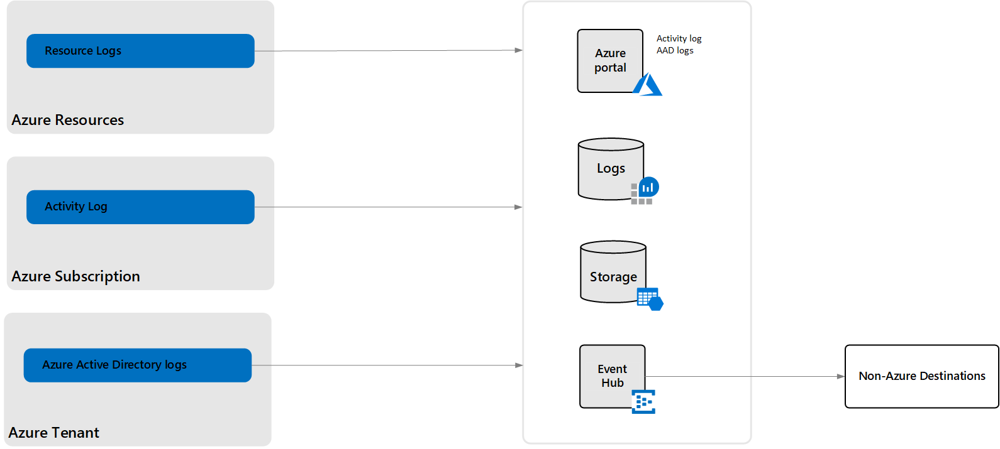

# Overview of Azure platform logs
Platform logs provide detailed diagnostic and auditing information for Azure resources and the Azure platform they depend on. They are automatically generated although you need to configure certain platform logs to be forwarded to one or more destinations to be retained. This article provides an overview of platform logs including what information they provide and how you can configure them for collection and analysis.

## Types of platform logs
The following table lists the specific platform logs that are available at different layers of Azure.

| Log | Layer | Description |
|:---|:---|:---|
| [Resource logs](./resource-logs.md) | Azure Resources | Provide insight into operations that were performed within an Azure resource (the *data plane*), for example getting a secret from a Key Vault or making a request to a database. The content of resource logs varies by the Azure service and resource type.  *Resource logs were previously referred to as diagnostic logs.*  |
| [Activity log](../essentials/activity-log.md) | Azure Subscription | Provides insight into the operations on each Azure resource in the subscription from the outside (*the management plane*) in addition to updates on Service Health events. Use the Activity Log, to determine the _what_, _who_, and _when_ for any write operations (PUT, POST, DELETE) taken on the resources in your subscription. There is a single Activity log for each Azure subscription. |
| [Azure Active Directory logs](../../active-directory/reports-monitoring/overview-reports.md) | Azure Tenant |  Contains the history of sign-in activity and audit trail of changes made in the Azure Active Directory for a particular tenant.   |

> [!NOTE]
> The Azure Activity Log is primarily for activities that occur in Azure Resource Manager. It does not track resources using the Classic/RDFE model. Some Classic resource types have a proxy resource provider in Azure Resource Manager (for example, Microsoft.ClassicCompute). If you interact with a Classic resource type through Azure Resource Manager using these proxy resource providers, the operations appear in the Activity Log. If you interact with a Classic resource type outside of the Azure Resource Manager proxies, your actions are only recorded in the Operation Log. The Operation Log can be browsed in a separate section of the portal.

## Viewing platform logs
There are different options for viewing and analyzing the different Azure platform logs.

- View the Activity log in the Azure portal and access events from PowerShell and CLI. See [View the Activity log](../essentials/activity-log.md#view-the-activity-log) for details. 
- View Azure Active Directory Security and Activity reports in the Azure portal. See [What are Azure Active Directory reports?](../../active-directory/reports-monitoring/overview-reports.md)  for details.
- Resource logs are automatically generated by supported Azure resources, but they aren't available to be viewed unless you send them to a [destination](#destinations). 

## Destinations
You can send platform logs to one or more of the destinations in the following table depending on your monitoring requirements. Configure destinations for platform logs by [creating a Diagnostic setting](../essentials/diagnostic-settings.md).

| Destination | Description |
|:---|:---|
| Log Analytics workspace | Analyze the logs of all your Azure resources together and take advantage of all the features available to [Azure Monitor Logs](../logs/data-platform-logs.md) including [log queries](../logs/log-query-overview.md) and [log alerts](../alerts/alerts-log.md). Pin the results of a log query to an Azure dashboard or include it in a workbook as part of an interactive report. |  |
| Event hub | Send platform log data outside of Azure, for example to a third-party SIEM or custom telemetry platform.
| Azure storage | Archive the logs for audit or backup. |

- For details on creating a diagnostic setting for activity log or resource logs, see [Create diagnostic settings to send platform logs and metrics to different destinations](../essentials/diagnostic-settings.md). 
- For details on creating a diagnostic setting for Azure Active Directory logs, see the following articles.
  - [Integrate Azure AD logs with Azure Monitor logs](../../active-directory/reports-monitoring/howto-integrate-activity-logs-with-log-analytics.md)
  - [Tutorial: Stream Azure Active Directory logs to an Azure event hub](../../active-directory/reports-monitoring/tutorial-azure-monitor-stream-logs-to-event-hub.md)
  - [Tutorial: Archive Azure AD logs to an Azure storage account](../../active-directory/reports-monitoring/quickstart-azure-monitor-route-logs-to-storage-account.md)

## Next steps

* [Read more details about the Activity log](../essentials/activity-log.md)
* [Read more details about resource logs](./resource-logs.md)