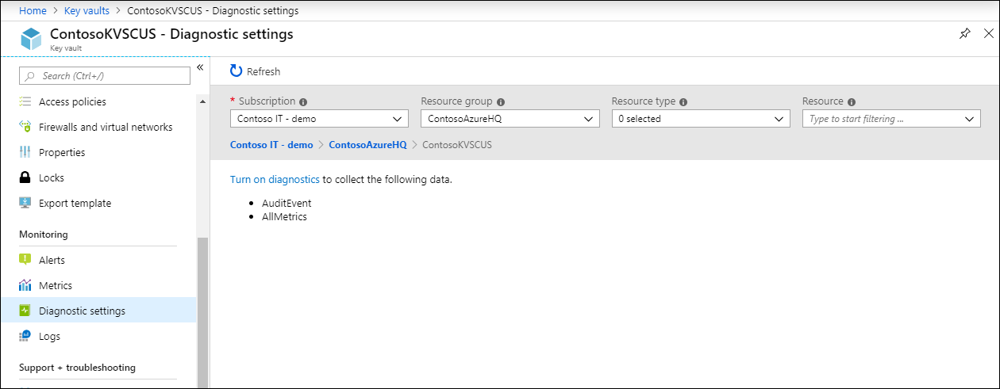
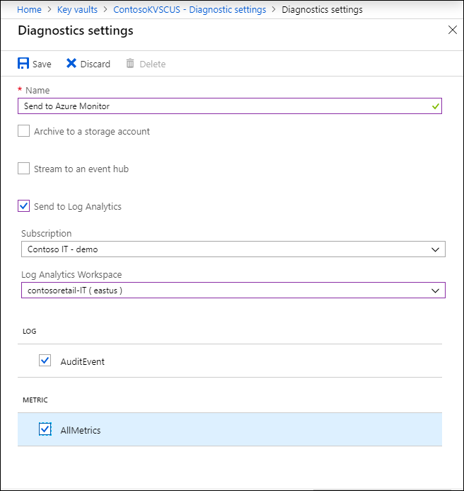
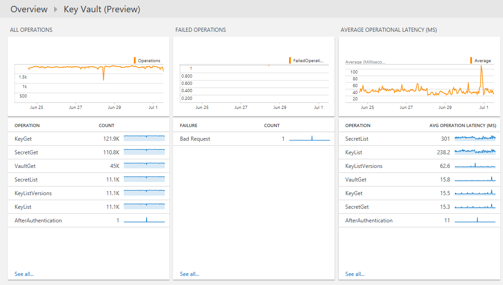

# Azure Key Vault Analytics solution in Azure Monitor


[!INCLUDE [updated-for-az](../../../includes/updated-for-az.md)]

You can use the Azure Key Vault solution in Azure Monitor to review Azure Key Vault AuditEvent logs.

To use the solution, you need to enable logging of Azure Key Vault diagnostics and direct the diagnostics to a Log Analytics workspace. It is not necessary to write the logs to Azure Blob storage.

> [!NOTE]
> In January 2017, the supported way of sending logs from Key Vault to Log Analytics changed. If the Key Vault solution you are using shows *(deprecated)* in the title, refer to [migrating from the old Key Vault solution](#migrating-from-the-old-key-vault-solution) for steps you need to follow.
>
>

## Install and configure the solution
Use the following instructions to install and configure the Azure Key Vault solution:

1. Use the process described in [Add Azure Monitor solutions from the Solutions Gallery](../../azure-monitor/insights/solutions.md) to add the Azure Key Vault solution to your Log Analytics workspace.
2. Enable diagnostics logging for the Key Vault resources to monitor, using either the [portal](#enable-key-vault-diagnostics-in-the-portal) or [PowerShell](#enable-key-vault-diagnostics-using-powershell)

### Enable Key Vault diagnostics in the portal

1. In the Azure portal, navigate to the Key Vault resource to monitor
2. Select *Diagnostics settings* to open the following page

   
3. Click *Turn on diagnostics* to open the following page

   
4. Give a name to the diagnostic setting.
5. Click the checkbox for *Send to Log Analytics*
6. Select an existing Log Analytics workspace, or create a workspace
7. To enable *AuditEvent* logs, click the checkbox under Log
8. Click *Save* to enable the logging of diagnostics to Log Analytics workspace.

### Enable Key Vault diagnostics using PowerShell
The following PowerShell script provides an example of how to use `Set-AzDiagnosticSetting` to enable diagnostic logging for Key Vault:
```
$workspaceId = "/subscriptions/d2e37fee-1234-40b2-5678-0b2199de3b50/resourcegroups/oi-default-east-us/providers/microsoft.operationalinsights/workspaces/rollingbaskets"

$kv = Get-AzKeyVault -VaultName 'ContosoKeyVault'

Set-AzDiagnosticSetting -ResourceId $kv.ResourceId  -WorkspaceId $workspaceId -Enabled $true
```


## Review Azure Key Vault data collection details
Azure Key Vault solution collects diagnostics logs directly from the Key Vault.
It is not necessary to write the logs to Azure Blob storage and no agent is required for data collection.

The following table shows data collection methods and other details about how data is collected for Azure Key Vault.

| Platform | Direct agent | Systems Center Operations Manager agent | Azure | Operations Manager required? | Operations Manager agent data sent via management group | Collection frequency |
| --- | --- | --- | --- | --- | --- | --- |
| Azure |  |  |&#8226; |  |  | on arrival |

## Use Azure Key Vault
After you [install the solution](https://azuremarketplace.microsoft.com/en-usrketplace/marketplace/apps/Microsoft.KeyVaultAnalyticsOMS?tab=Overview), view the Key Vault data by clicking the **Key Vault Analytics** tile from the Azure Monitor **Overview** page. Open this page from the **Azure Monitor** menu by clicking **More** under the **Insights** section. 


After you click the **Key Vault Analytics** tile, you can view summaries of your logs and then drill in to details for the following categories:

* Volume of all key vault operations over time
* Failed operation volumes over time
* Average operational latency by operation
* Quality of service for operations with the number of operations that take more than 1000 ms and a list of operations that take more than 1000 ms




### To view details for any operation
1. On the **Overview** page, click the **Key Vault Analytics** tile.
2. On the **Azure Key Vault** dashboard, review the summary information in one of the blades, and then click one to view detailed information about it in the log search page.

    On any of the log search pages, you can view results by time, detailed results, and your log search history. You can also filter by facets to narrow the results.

## Azure Monitor log records
The Azure Key Vault solution analyzes records that have a type of **KeyVaults** that are collected from [AuditEvent logs](../../key-vault/key-vault-logging.md) in Azure Diagnostics.  Properties for these records are in the following table:  

| Property | Description |
|:--- |:--- |
| Type |*AzureDiagnostics* |
| SourceSystem |*Azure* |
| CallerIpAddress |IP address of the client who made the request |
| Category | *AuditEvent* |
| CorrelationId |An optional GUID that the client can pass to correlate client-side logs with service-side (Key Vault) logs. |
| DurationMs |Time it took to service the REST API request, in milliseconds. This time does not include network latency, so the time that you measure on the client side might not match this time. |
| httpStatusCode_d |HTTP status code returned by the request (for example, *200*) |
| id_s |Unique ID of the request |
| identity_claim_appid_g | GUID for the application ID |
| OperationName |Name of the operation, as documented in [Azure Key Vault Logging](../../key-vault/key-vault-logging.md) |
| OperationVersion |REST API version requested by the client (for example *2015-06-01*) |
| requestUri_s |Uri of the request |
| Resource |Name of the key vault |
| ResourceGroup |Resource group of the key vault |
| ResourceId |Azure Resource Manager Resource ID. For Key Vault logs, this is the Key Vault resource ID. |
| ResourceProvider |*MICROSOFT.KEYVAULT* |
| ResourceType | *VAULTS* |
| ResultSignature |HTTP status (for example, *OK*) |
| ResultType |Result of REST API request (for example, *Success*) |
| SubscriptionId |Azure subscription ID of the subscription containing the Key Vault |

## Migrating from the old Key Vault solution
In January 2017, the supported way of sending logs from Key Vault to Log Analytics changed. These changes provide the following advantages:
+ Logs are written directly to a Log Analytics workspace without the need to use a storage account
+ Less latency from the time when logs are generated to them being available in Log Analytics
+ Fewer configuration steps
+ A common format for all types of Azure diagnostics

To use the updated solution:

1. [Configure diagnostics to be sent directly to a Log Analytics workspace from Key Vault](#enable-key-vault-diagnostics-in-the-portal)  
2. Enable the Azure Key Vault solution by using the process described in [Add Azure Monitor solutions from the Solutions Gallery](../../azure-monitor/insights/solutions.md)
3. Update any saved queries, dashboards, or alerts to use the new data type
   + Type is change from: KeyVaults to AzureDiagnostics. You can use the ResourceType to filter to Key Vault Logs.
   + Instead of: `KeyVaults`, use `AzureDiagnostics | where ResourceType'=="VAULTS"`
   + Fields: (Field names are case-sensitive)
   + For any field that has a suffix of \_s, \_d, or \_g in the name, change the first character to lower case
   + For any field that has a suffix of \_o in name, the data is split into individual fields based on the nested field names. For example, the UPN of the caller is stored in a field `identity_claim_http_schemas_xmlsoap_org_ws_2005_05_identity_claims_upn_s`
   + Field CallerIpAddress changed to CallerIPAddress
   + Field RemoteIPCountry is no longer present
4. Remove the *Key Vault Analytics (Deprecated)* solution. If you are using PowerShell, use `Set-AzureOperationalInsightsIntelligencePack -ResourceGroupName <resource group that the workspace is in> -WorkspaceName <name of the log analytics workspace> -IntelligencePackName "KeyVault" -Enabled $false`

Data collected before the change is not visible in the new solution. You can continue to query for this data using the old Type and field names.

## Troubleshooting
[!INCLUDE [log-analytics-troubleshoot-azure-diagnostics](../../../includes/log-analytics-troubleshoot-azure-diagnostics.md)]

## Next steps
* Use [Log queries in Azure Monitor](../../azure-monitor/log-query/log-query-overview.md) to view detailed Azure Key Vault data.
