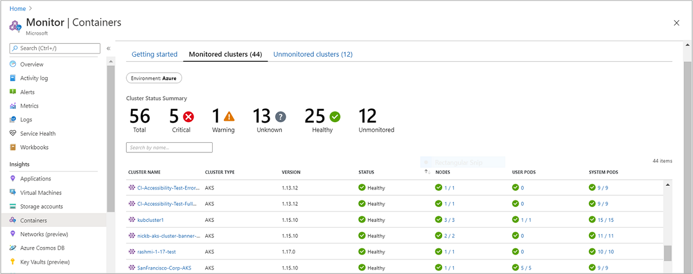
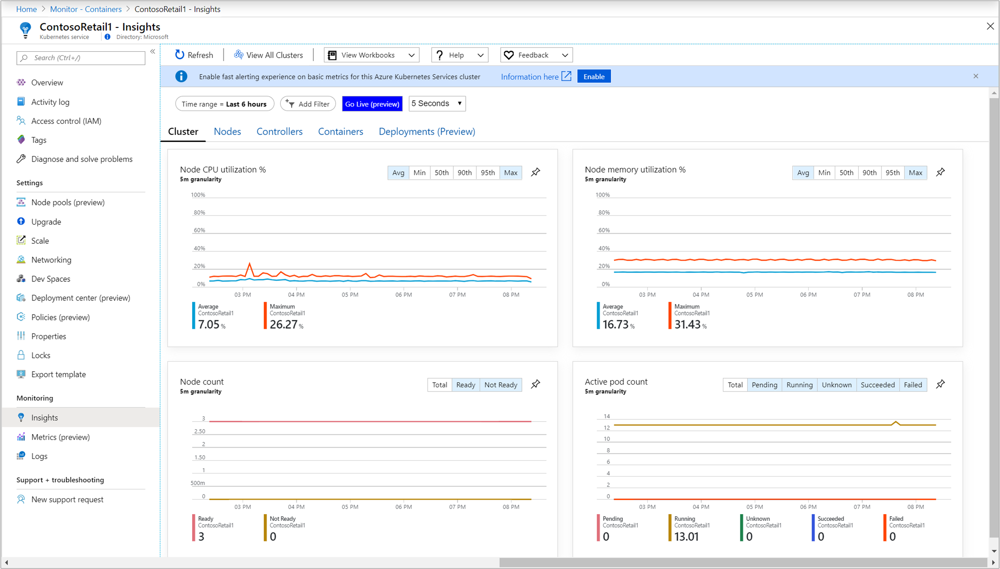
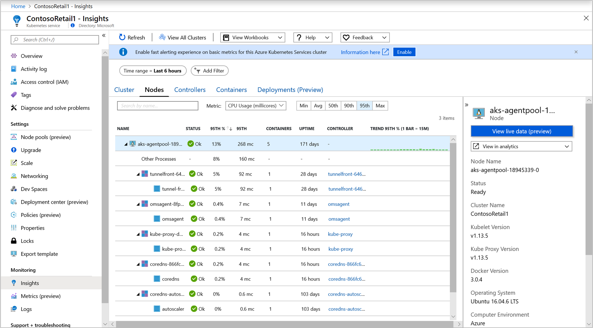
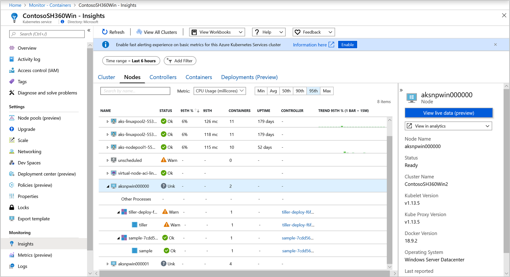
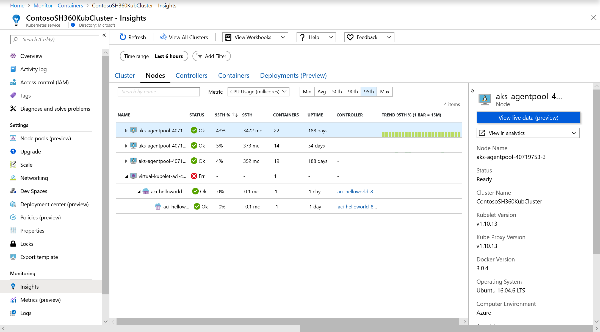
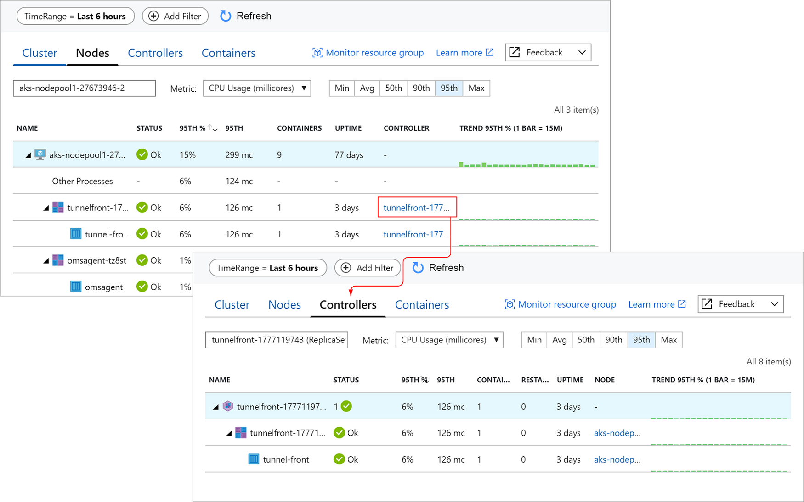
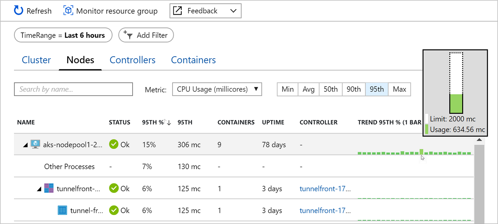
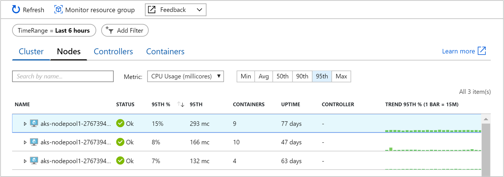
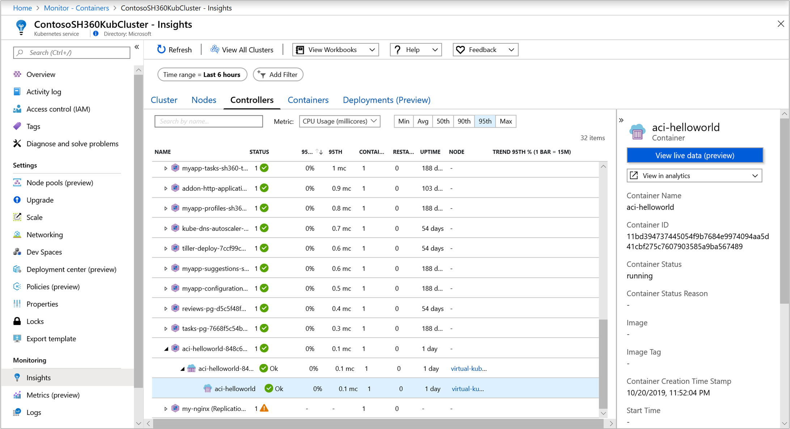
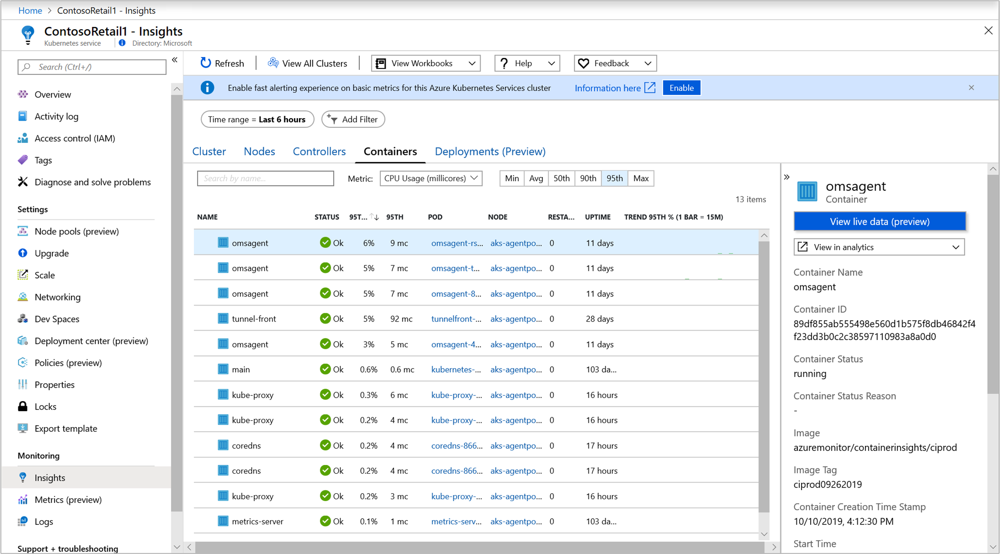

# Monitor your Kubernetes cluster performance with Azure Monitor for containers

With Azure Monitor for containers, you can use the performance charts and health status to monitor the workload of Kubernetes clusters hosted on Azure Kubernetes Service (AKS), Azure Stack, or other environment from two perspectives. You can monitor directly from the cluster, or you can view all clusters in a subscription from Azure Monitor. Viewing Azure Container Instances is also possible when monitoring a specific AKS cluster.

This article helps you understand the two perspectives, and how Azure Monitor helps you quickly assess, investigate, and resolve detected issues.

For information about how to enable Azure Monitor for containers, see [Onboard Azure Monitor for containers](container-insights-onboard.md).

Azure Monitor provides a multi-cluster view that shows the health status of all monitored Kubernetes clusters running Linux and Windows Server 2019 deployed across resource groups in your subscriptions. It shows clusters discovered across all environments that aren't monitored by the solution. You can immediately understand cluster health, and from here, you can drill down to the node and controller performance page or navigate to see performance charts for the cluster. For AKS clusters that were discovered and identified as unmonitored, you can enable monitoring for them at any time. 

The main differences in monitoring a Windows Server cluster with Azure Monitor for containers compared to a Linux cluster are the following:

- Memory RSS metric isn't available for Windows node and containers.
- Disk storage capacity information isn't available for Windows nodes.
- Live logs support is available with the exception of Windows container logs.
- Only pod environments are monitored, not Docker environments.
- With the preview release, a maximum of 30 Windows Server containers are supported. This limitation doesn't apply to Linux containers. 

## Sign in to the Azure portal

Sign in to the [Azure portal](https://portal.azure.com). 

## Multi-cluster view from Azure Monitor

To view the health status of all Kubernetes clusters deployed, select **Monitor** from the left pane in the Azure portal. Under the **Insights** section, select **Containers**. 

You can scope the results presented in the grid to show clusters that are:

* **Azure** - AKS and AKS-Engine clusters hosted in Azure Kubernetes Service
* **Azure Stack (Preview)** - AKS-Engine clusters hosted on Azure Stack
* **Non-Azure (Preview)** - Kubernetes clusters hosted on-premises
* **All** - View all the Kubernetes clusters hosted in Azure, Azure Stack, and on-premises environments that are onboarded to Azure Monitor for containers

To view clusters from a specific environment, select it from the **Environments** pill on the top-left corner of the page.

On the **Monitored clusters** tab, you learn the following:

- How many clusters are in a critical or unhealthy state, versus how many are healthy or not reporting (referred to as an Unknown state).
- Whether all of the [Azure Kubernetes Engine (AKS-engine)](https://github.com/Azure/aks-engine) deployments are healthy.
- How many nodes and user and system pods are deployed per cluster.
- How much disk space is available and if there's a capacity issue.

The health statuses included are: 

* **Healthy**: No issues are detected for the VM, and it's functioning as required. 
* **Critical**: One or more critical issues are detected that must be addressed to restore normal operational state as expected.
* **Warning**: One or more issues are detected that must be addressed or the health condition could become critical.
* **Unknown**: If the service wasn't able to make a connection with the node or pod, the status changes to an Unknown state.
* **Not found**: Either the workspace, the resource group, or subscription that contains the workspace for this solution was deleted.
* **Unauthorized**: User doesn’t have required permissions to read the data in the workspace.
* **Error**: An error occurred while attempting to read data from the workspace.
* **Misconfigured**: Azure Monitor for containers wasn't configured correctly in the specified workspace.
* **No data**: Data hasn't reported to the workspace for the last 30 minutes.

Health state calculates overall cluster status as the *worst of* the three states with one exception. If any of the three states is Unknown, the overall cluster state shows **Unknown**. 

The following table provides a breakdown of the calculation that controls the health states for a monitored cluster on the multi-cluster view.

| |Status |Availability |  
|-------|-------|-----------------|  
|**User pod**| | |  
| |Healthy |100% |  
| |Warning |90 - 99% |  
| |Critical |<90% |  
| |Unknown |If not reported in last 30 minutes |  
|**System pod**| | |  
| |Healthy |100% |
| |Warning |N/A |
| |Critical |<100% |
| |Unknown |If not reported in last 30 minutes |
|**Node** | | |
| |Healthy |>85% |
| |Warning |60 - 84% |
| |Critical |<60% |
| |Unknown |If not reported in last 30 minutes |

From the list of clusters, you can drill down to the **Cluster** page by selecting the name of the cluster. Then go to the **Nodes** performance page by selecting the rollup of nodes in the **Nodes** column for that specific cluster. Or, you can drill down to the **Controllers** performance page by selecting the rollup of the **User pods** or **System pods** column.

## View performance directly from a cluster

Access to Azure Monitor for containers is available directly from an AKS cluster by selecting **Insights** > **Cluster** from the left pane, or when you selected a cluster from the multi-cluster view. Information about your cluster is organized into four perspectives:

- Cluster
- Nodes 
- Controllers 
- Containers

>[!NOTE]
>The experience described in the remainder of this article are also applicable for viewing performance and health status of your Kubernetes clusters hosted on Azure Stack or other environment when selected from the multi-cluster view. 

The default page opens and displays four line performance charts that show key performance metrics of your cluster. 

The performance charts display four performance metrics:

- **Node CPU utilization&nbsp;%**: An aggregated perspective of CPU utilization for the entire cluster. To filter the results for the time range, select **Avg**, **Min**, **50th**, **90th**, **95th**, or **Max** in the percentiles selector above the chart. The filters can be used either individually or combined. 
- **Node memory utilization&nbsp;%**: An aggregated perspective of memory utilization for the entire cluster. To filter the results for the time range, select **Avg**, **Min**, **50th**, **90th**, **95th**, or **Max** in the percentiles selector above the chart. The filters can be used either individually or combined. 
- **Node count**: A node count and status from Kubernetes. Statuses of the cluster nodes represented are Total, Ready, and Not Ready. They can be filtered individually or combined in the selector above the chart. 
- **Active pod count**: A pod count and status from Kubernetes. Statuses of the pods represented are Total, Pending, Running, Unknown, Succeeded, or Failed. They can be filtered individually or combined in the selector above the chart. 

Use the Left and Right arrow keys to cycle through each data point on the chart. Use the Up and Down arrow keys to cycle through the percentile lines. Select the pin icon in the upper-right corner of any one of the charts to pin the selected chart to the last Azure dashboard you viewed. From the dashboard, you can resize and reposition the chart. Selecting the chart from the dashboard redirects you to Azure Monitor for containers and loads the correct scope and view.

Azure Monitor for containers also supports Azure Monitor [metrics explorer](../platform/metrics-getting-started.md), where you can create your own plot charts, correlate and investigate trends, and pin to dashboards. From metrics explorer, you also can use the criteria that you set to visualize your metrics as the basis of a [metric-based alert rule](../platform/alerts-metric.md). 

## View container metrics in metrics explorer

In metrics explorer, you can view aggregated node and pod utilization metrics from Azure Monitor for containers. The following table summarizes the details to help you understand how to use the metric charts to visualize container metrics.

|Namespace | Metric | Description | 
|----------|--------|-------------|
| insights.container/nodes | |
| | cpuUsageMillicores | Aggregated measurement of CPU utilization across the cluster. It is a CPU core split into 1000 units (milli = 1000). Used to determine the usage of cores in a container where many applications might be using one core.| 
| | cpuUsagePercentage | Aggregated average CPU utilization measured in percentage across the cluster.|
| | memoryRssBytes | Container RSS memory used in bytes.| 
| | memoryRssPercentage | Container RSS memory used in percent.|
| | memoryWorkingSetBytes | Container working set memory used.| 
| | memoryWorkingSetPercentage | Container working set memory used in percent. | 
| | nodesCount | A node count from Kubernetes.|
| insights.container/pods | |
| | PodCount | A pod count from Kubernetes.|

You can [split](../platform/metrics-charts.md#apply-splitting-to-a-chart) a metric to view it by dimension and visualize how different segments of it compare to each other. For a node, you can segment the chart by the *host* dimension. From a pod, you can segment it by the following dimensions:

* Controller
* Kubernetes namespace
* Node
* Phase

## Analyze nodes, controllers, and container health

When you switch to the **Nodes**, **Controllers**, and **Containers** tabs, a property pane automatically displays on the right side of the page. It shows the properties of the item selected, which includes the labels you defined to organize Kubernetes objects. When a Linux node is selected, the **Local Disk Capacity** section also shows the available disk space and the percentage used for each disk presented to the node. Select the **>>** link in the pane to view or hide the pane.

As you expand the objects in the hierarchy, the properties pane updates based on the object selected. From the pane, you also can view Kubernetes container logs (stdout/stderror), events, and pod metrics by selecting the **View live data (preview)** link at the top of the pane. For more information about the configuration required to grant and control access to view this data, see [Setup the Live Data (preview)](container-insights-livedata-setup.md). While you review cluster resources, you can see this data from the container in real-time. For more information about this feature, see [How to view Kubernetes logs, events, and pod metrics in real time](container-insights-livedata-overview.md). To view Kubernetes log data stored in your workspace based on pre-defined log searches, select **View container logs** from the **View in analytics** drop-down list. For additional information about this topic, see [Search logs to analyze data](container-insights-log-search.md#search-logs-to-analyze-data).

Use the **+ Add Filter** option at the top of the page to filter the results for the view by **Service**, **Node**, **Namespace**, or **Node Pool**. After you select the filter scope, select one of the values shown in the **Select value(s)** field. After the filter is configured, it's applied globally while viewing any perspective of the AKS cluster. The formula only supports the equal sign. You can add additional filters on top of the first one to further narrow your results. For example, if you specify a filter by **Node**, you can only select **Service** or **Namespace** for the second filter.

Specifying a filter in one tab continues to be applied when you select another. It's deleted after you select the **x** symbol next to the specified filter. 

Switch to the **Nodes** tab and the row hierarchy follows the Kubernetes object model, which starts with a node in your cluster. Expand the node to view one or more pods running on the node. If more than one container is grouped to a pod, they're displayed as the last row in the hierarchy. You also can view how many non-pod-related workloads are running on the host if the host has processor or memory pressure.

Windows Server containers that run the Windows Server 2019 OS are shown after all of the Linux-based nodes in the list. When you expand a Windows Server node, you can view one or more pods and containers that run on the node. After a node is selected, the properties pane shows version information. Agent information is excluded because Windows Server nodes don't have an agent installed. 

 

Azure Container Instances virtual nodes that run the Linux OS are shown after the last AKS cluster node in the list. When you expand a Container Instances virtual node, you can view one or more Container Instances pods and containers that run on the node. Metrics aren't collected and reported for nodes, only for pods.

From an expanded node, you can drill down from the pod or container that runs on the node to the controller to view performance data filtered for that controller. Select the value under the **Controller** column for the specific node.
 

Select controllers or containers at the top of the page to review the status and resource utilization for those objects. To review memory utilization, in the **Metric** drop-down list, select **Memory RSS** or **Memory working set**. **Memory RSS** is supported only for Kubernetes version 1.8 and later. Otherwise, you view values for **Min&nbsp;%** as *NaN&nbsp;%*, which is a numeric data type value that represents an undefined or unrepresentable value.

**Memory working set** shows both the resident memory and virtual memory (cache) included and is a total of what the application is using. **Memory RSS** shows only main memory (which is nothing but the resident memory in other words). This metric shows the actual capacity of available memory. What is the difference between resident memory and virtual memory?

- Resident memory or main memory, is the actual amount of machine memory available to the nodes of the cluster.

- Virtual memory is reserved hard disk space (cache) used by the operating system to swap data from memory to disk when under memory pressure, and then fetch it back to memory when needed.

By default, performance data is based on the last six hours, but you can change the window by using the **TimeRange** option at the upper left. You also can filter the results within the time range by selecting **Min**, **Avg**, **50th**, **90th**, **95th**, and **Max** in the percentile selector. 

When you hover over the bar graph under the **Trend** column, each bar shows either CPU or memory usage, depending on which metric is selected, within a sample period of 15 minutes. After you select the trend chart through a keyboard, use the Alt+Page up key or Alt+Page down key to cycle through each bar individually. You get the same details that you would if you hovered over the bar.

 

In the next example, for the first node in the list, *aks-nodepool1-*, the value for **Containers** is 9. This value is a rollup of the total number of containers deployed.

This information can help you quickly identify whether you have a proper balance of containers between nodes in your cluster. 

The information that's presented when you view the **Nodes** tab is described in the following table.

| Column | Description | 
|--------|-------------|
| Name | The name of the host. |
| Status | Kubernetes view of the node status. |
| Min&nbsp;%, Avg&nbsp;%, 50th&nbsp;%, 90th&nbsp;%, 95th&nbsp;%, Max&nbsp;%  | Average node percentage based on percentile during the selected duration. |
| Min, Avg, 50th, 90th, 95th, Max | Average nodes' actual value based on percentile during the time duration selected. The average value is measured from the CPU/Memory limit set for a node. For pods and containers, it's the average value reported by the host. |
| Containers | Number of containers. |
| Uptime | Represents the time since a node started or was rebooted. |
| Controller | Only for containers and pods. It shows which controller it resides in. Not all pods are in a controller, so some might display **N/A**. | 
| Trend Min&nbsp;%, Avg&nbsp;%, 50th&nbsp;%, 90th&nbsp;%, 95th&nbsp;%, Max&nbsp;% | Bar graph trend represents the average percentile metric percentage of the controller. |

In the selector, select **Controllers**.

Here you can view the performance health of your controllers and Container Instances virtual node controllers or virtual node pods not connected to a controller.

The row hierarchy starts with a controller. When you expand a controller, you view one or more pods. Expand a pod, and the last row displays the container grouped to the pod. From an expanded controller, you can drill down to the node it's running on to view performance data filtered for that node. Container Instances pods not connected to a controller are listed last in the list.

Select the value under the **Node** column for the specific controller.

The information that's displayed when you view controllers is described in the following table.

| Column | Description | 
|--------|-------------|
| Name | The name of the controller.|
| Status | The rollup status of the containers after it's finished running with status such as *OK*, *Terminated*, *Failed*, *Stopped*, or *Paused*. If the container is running but the status either wasn't properly displayed or wasn't picked up by the agent and hasn't responded for more than 30 minutes, the status is *Unknown*. Additional details of the status icon are provided in the following table.|
| Min&nbsp;%, Avg&nbsp;%, 50th&nbsp;%, 90th&nbsp;%, 95th&nbsp;%, Max&nbsp;%| Rollup average of the average percentage of each entity for the selected metric and percentile. |
| Min, Avg, 50th, 90th, 95th, Max  | Rollup of the average CPU millicore or memory performance of the container for the selected percentile. The average value is measured from the CPU/Memory limit set for a pod. |
| Containers | Total number of containers for the controller or pod. |
| Restarts | Rollup of the restart count from containers. |
| Uptime | Represents the time since a container started. |
| Node | Only for containers and pods. It shows which controller it resides in. | 
| Trend Min&nbsp;%, Avg&nbsp;%, 50th&nbsp;%, 90th&nbsp;%, 95th&nbsp;%, Max&nbsp;% | Bar graph trend represents the average percentile metric of the controller. |

The icons in the status field indicate the online status of the containers.
 
| Icon | Status | 
|--------|-------------|
|  | Running (Ready)|
|  | Waiting or Paused|
|  | Last reported running but hasn't responded for more than 30 minutes|
|  | Successfully stopped or failed to stop|

The status icon displays a count based on what the pod provides. It shows the worst two states, and when you hover over the status, it displays a rollup status from all pods in the container. If there isn't a ready state, the status value displays **(0)**.

In the selector, select **Containers**.

Here you can view the performance health of your Azure Kubernetes and Azure Container Instances containers. 

From a container, you can drill down to a pod or node to view performance data filtered for that object. Select the value under the **Pod** or **Node** column for the specific container.

The information that's displayed when you view containers is described in the following table.

| Column | Description | 
|--------|-------------|
| Name | The name of the controller.|
| Status | Status of the containers, if any. Additional details of the status icon are provided in the next table.|
| Min&nbsp;%, Avg&nbsp;%, 50th&nbsp;%, 90th&nbsp;%, 95th&nbsp;%, Max&nbsp;% | The rollup of the average percentage of each entity for the selected metric and percentile. |
| Min, Avg, 50th, 90th, 95th, Max | The rollup of the average CPU millicore or memory performance of the container for the selected percentile. The average value is measured from the CPU/Memory limit set for a pod. |
| Pod | Container where the pod resides.| 
| Node |  Node where the container resides. | 
| Restarts | Represents the time since a container started. |
| Uptime | Represents the time since a container was started or rebooted. |
| Trend Min&nbsp;%, Avg&nbsp;%, 50th&nbsp;%, 90th&nbsp;%, 95th&nbsp;%, Max&nbsp;% | Bar graph trend represents the average percentile metric percentage of the container. |

The icons in the status field indicate the online statuses of pods, as described in the following table.
 
| Icon | Status |  
|--------|-------------|  
|  | Running (Ready)|  
|  | Waiting or Paused|  
|  | Last reported running but hasn't responded in more than 30 minutes|  
|  | Successfully stopped or failed to stop|  
|  | Failed state |  

## Workbooks

Workbooks combine text, [log queries](../log-query/query-language.md), [metrics](../platform/data-platform-metrics.md), and parameters into rich interactive reports. Workbooks are editable by any other team members who have access to the same Azure resources.

Azure Monitor for containers includes four workbooks to get you started:

- **Disk capacity**: Presents interactive disk usage charts for each disk presented to the node within a container by the following perspectives:

    - Disk percent usage for all disks.
    - Free disk space for all disks.
    - A grid that shows each node's disk, its percentage of used space, trend of percentage of used space, free disk space (GiB), and trend of free disk space (GiB). When a row is selected in the table, the percentage of used space and free disk space (GiB) is shown underneath the row. 

- **Disk IO**: Presents interactive disk utilization charts for each disk presented to the node within a container by the following perspectives:

    - Disk I/O summarized across all disks by read bytes/sec, writes bytes/sec, and read and write bytes/sec trends.
    - Eight performance charts show key performance indicators to help measure and identify disk I/O bottlenecks.

- **Kubelet**: Includes two grids that show key node operating statistics:

    - Overview by node grid summarizes total operation, total errors, and successful operations by percent and trend for each node.
    - Overview by operation type summarizes for each operation the total operation, total errors, and successful operations by percent and trend.

- **Network**: Presents interactive network utilization charts for each node's network adapter, and a grid presents the key performance indicators to help measure the performance of your network adapters.

You access these workbooks by selecting each one from the **View Workbooks** drop-down list.

## Next steps

- Review [Create performance alerts with Azure Monitor for containers](container-insights-alerts.md) to learn how to create alerts for high CPU and memory utilization to support your DevOps or operational processes and procedures.

- View [log query examples](container-insights-log-search.md#search-logs-to-analyze-data) to see predefined queries and examples to evaluate or customize to alert, visualize, or analyze your clusters.

- View [monitor cluster health](container-insights-health.md) to learn about viewing the health status your Kubernetes cluster.
