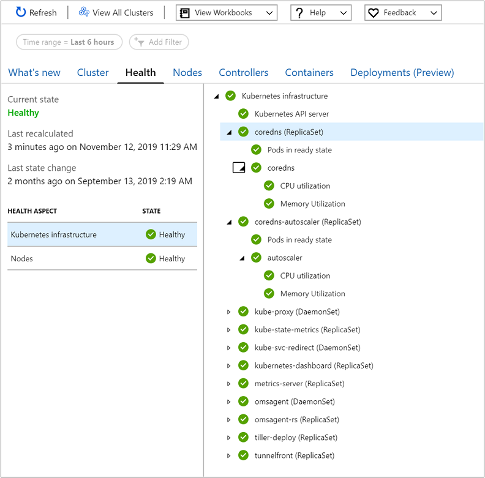
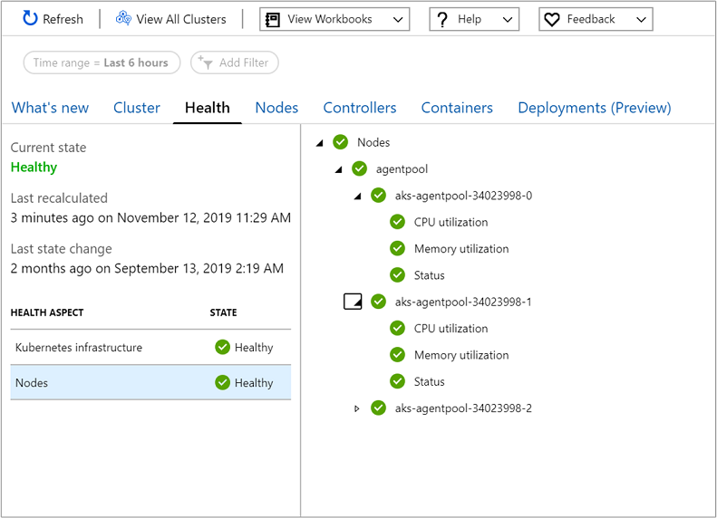
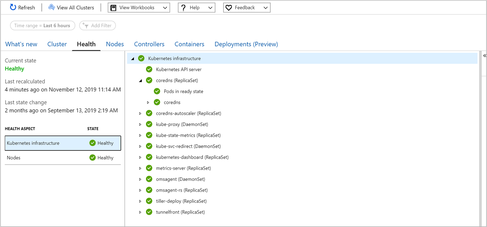
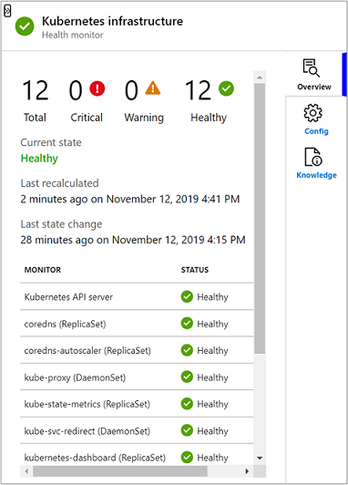
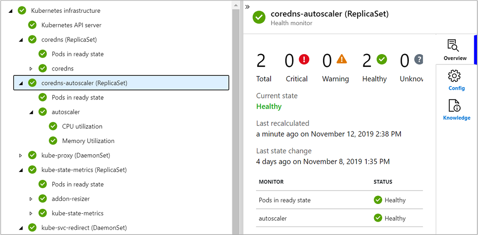
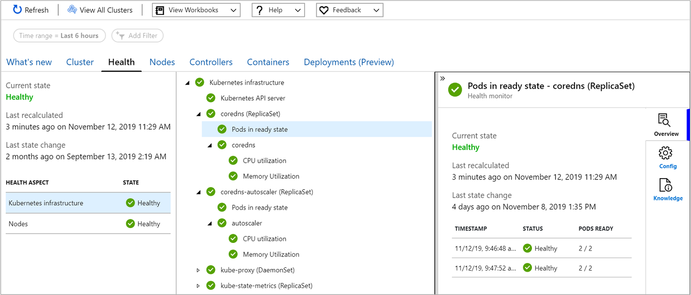

# Understand Kubernetes cluster health with Azure Monitor for containers

With Azure Monitor for containers, it monitors and reports health status of the managed infrastructure components and all nodes running on any Kubernetes cluster supported by Azure Monitor for containers. This experience extends beyond the cluster health status calculated and reported on the [multi-cluster view](container-insights-analyze.md#multi-cluster-view-from-azure-monitor), where now you can understand if one or more nodes in the cluster are resource constrained, or a node or pod is unavailable that could impact a running application in the cluster based on curated metrics.

>[!NOTE]
>The Health feature is in public preview at this time.
>

For information about how to enable Azure Monitor for containers, see [Onboard Azure Monitor for containers](container-insights-onboard.md).

>[!NOTE]
>To support AKS Engine clusters, verify it meets the following:
>- It is using the latest version of the [HELM client](https://helm.sh/docs/using_helm/).
>- The containerized agent version is *microsoft/oms:ciprod11012019*. To upgrade the agent, see [upgrading agent on Kubernetes cluster](container-insights-manage-agent.md#upgrading-agent-on-monitored-kubernetes-cluster).
>

## Overview

In Azure Monitor for containers, the Health (preview) feature provides proactive health monitoring of your Kubernetes cluster to help you identify and diagnose issues. It gives you the ability to view significant issues detected. Monitors evaluating the health of your cluster run on the containerized agent in your cluster, and the health data is written to the **KubeHealth** table in your Log Analytics workspace. 

Kubernetes cluster health is based on a number of monitoring scenarios organized by the following Kubernetes objects and abstractions:

- Kubernetes infrastructure - provides a rollup of the Kubernetes API server, ReplicaSets, and DaemonSets running on nodes deployed in your cluster by evaluating CPU and memory utilization, and a Pods availability

    

- Nodes - provides a rollup of the Node pools and state of individual Nodes in each pool, by evaluating CPU and memory utilization, and a Node's status as reported by Kubernetes.

    

Currently, only the status of a virtual kubelet is supported. The health state for CPU and memory utilization of virtual kublet nodes is reported as **Unknown**, since a signal is not received from them.

All monitors are shown in a hierarchical layout in the Health Hierarchy pane, where an aggregate monitor representing the Kubernetes object or abstraction (that is, Kubernetes infrastructure or Nodes) are the top-most monitor reflecting the combined health of all dependent child monitors. The key monitoring scenarios used to derive health are:

* Evaluate CPU utilization from the node and container.
* Evaluate memory utilization from the node and container.
* Status of Pods and Nodes based on calculation of their ready state reported by Kubernetes.

The icons used to indicate state are as follows:

|Icon|Meaning|  
|--------|-----------|  
||Success, health is OK (green)|  
||Warning (yellow)|  
||Critical (red)|  
||Unknown (gray)|  

## Monitor configuration

To understand the behavior and configuration of each monitor supporting Azure Monitor for containers Health feature, see [Health monitor configuration guide](container-insights-health-monitors-config.md).

## Sign in to the Azure portal

Sign in to the [Azure portal](https://portal.azure.com). 

## View health of an AKS or non-AKS cluster

Access to the Azure Monitor for containers Health (preview) feature is available directly from an AKS cluster by selecting **Insights** from the left pane in the Azure portal. Under the **Insights** section, select **Containers**. 

To view health from a non-AKS cluster, that is an AKS Engine cluster hosted on-premises or on Azure Stack, select **Azure Monitor** from the left pane in the Azure portal. Under the **Insights** section, select **Containers**.  On the multi-cluster page, select the non-AKS cluster from the list.

In Azure Monitor for containers, from the **Cluster** page, select **Health**.

## Review cluster health

When the Health page opens, by default **Kubernetes Infrastructure** is selected in the **Health Aspect** grid.  The grid summarizes current health rollup state of Kubernetes infrastructure and cluster nodes. Selecting either health aspect updates the results in the Health Hierarchy pane (that is, the middle-pane) and shows all child monitors in a hierarchical layout, displaying their current health state. To view more information about any dependent monitor, you can select one and a property pane automatically displays on the right side of the page. 

On the property pane, you learn the following:

- On the **Overview** tab, it shows the current state of the monitor selected, when the monitor was last calculated, and when the last state change occurred. Additional information is shown depending on the type of monitor selected in the hierarchy.

    If you select an aggregate monitor in the Health Hierarchy pane, under the **Overview** tab on the property pane it shows a rollup of the total number of child monitors in the hierarchy, and how many aggregate monitors are in a critical, warning, and healthy state. 

    

    If you select a unit monitor in the Health Hierarchy pane, it also shows under **Last state change** the previous samples calculated and reported by the containerized agent within the last four hours. This is based on the unit monitors calculation for comparing several consecutive values to determine its state. For example, if you selected the *Pod ready state* unit monitor, it shows the last two samples controlled by the parameter *ConsecutiveSamplesForStateTransition*. For more information, see the detailed description of [unit monitors](container-insights-health-monitors-config.md#unit-monitors).
    
    

    If the time reported by **Last state change** is a day or older, it is the result of no changes in state for the monitor. However, if the last sample received for a unit monitor is more than four hours old, this likely indicates the containerized agent has not been sending data. If the agent knows that a particular resource exists, for example a Node, but it hasn't received data from the Node's CPU or memory utilization monitors (as an example), then the health state of the monitor is set to **Unknown**.  

- On the**Config** tab, it shows the default configuration parameter settings (only for unit monitors, not aggregate monitors) and their values.
- On the **Knowledge** tab, it contains information explaining the behavior of the monitor and how it evaluates for the unhealthy condition.

Monitoring data on this page does not refresh automatically and you need to select **Refresh** at the top of the page to see the most recent health state received from the cluster.

## Next steps

View [log query examples](container-insights-log-search.md#search-logs-to-analyze-data) to see predefined queries and examples to evaluate or customize to alert, visualize, or analyze your clusters.
