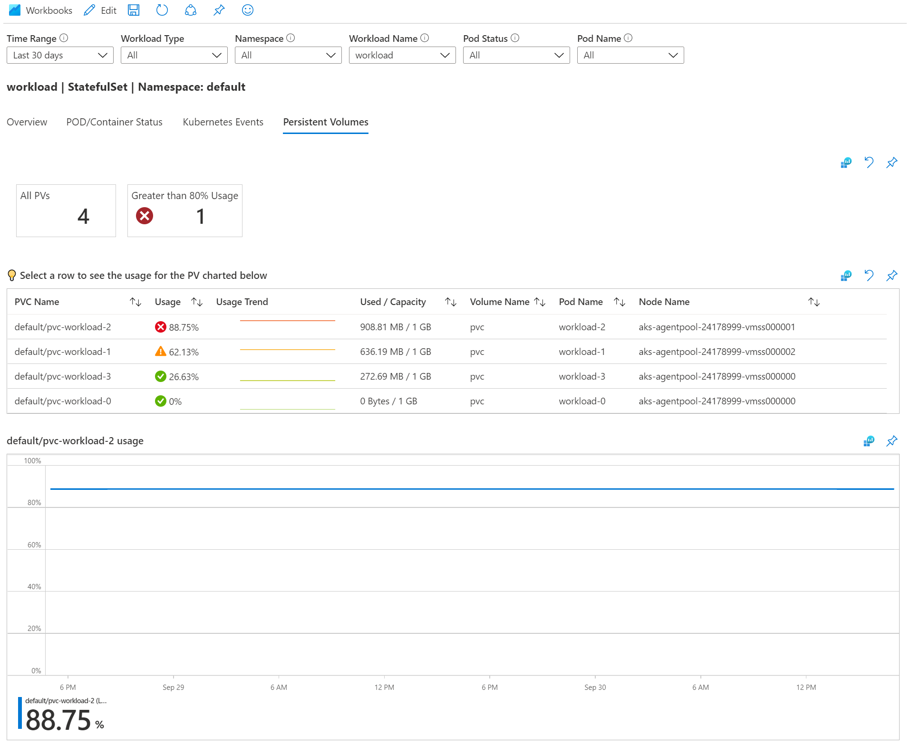

# Configure PV monitoring with Azure Monitor for containers

Starting with agent version *ciprod10052020*, Azure monitor for containers integrated agent now supports monitoring PV (persistent volume) usage.

## PV metrics

Azure Monitor for containers automatically starts monitoring PV by collecting the following metrics at 60sec intervals and storing them in the **InsightMetrics** table.

|Metric name |Metric dimension (tags) |Description |
|------------|------------------------|------------|
| `pvUsedBytes`|`container.azm.ms/pv`|Used space in bytes for a specific persistent volume with a claim used by a specific pod. `pvCapacityBytes` is folded in as a dimension in the Tags field to reduce data ingestion cost and to simplify queries.|

## Monitor Persistent Volumes

Azure Monitor for containers includes pre-configured charts for this metric in a workbook for every cluster. You can find the charts in the Persistent Volume tab of the **Workload Details** workbook directly from an AKS cluster by selecting Workbooks from the left-hand pane, and from the **View Workbooks** drop-down list in the Insight. You can also enable a recommended alert for PV usage, as well as query these metrics in Log Analytics.  

## Next steps

- Learn more about collected PV metrics [here](https://aka.ms/ci/pvconfig).
