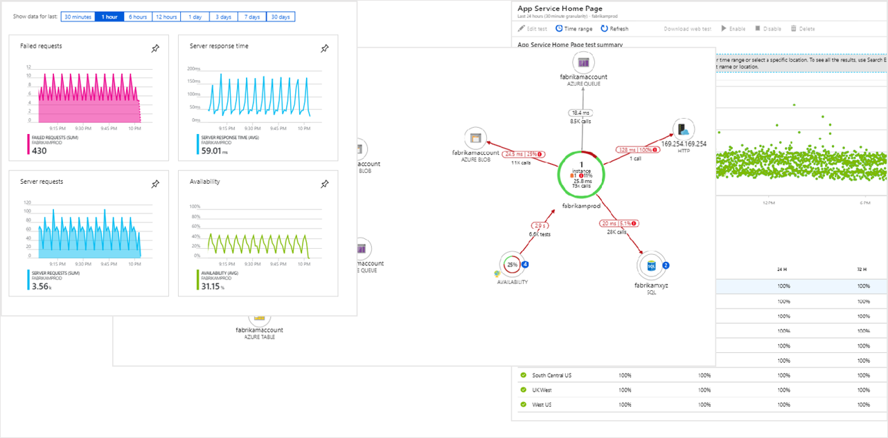
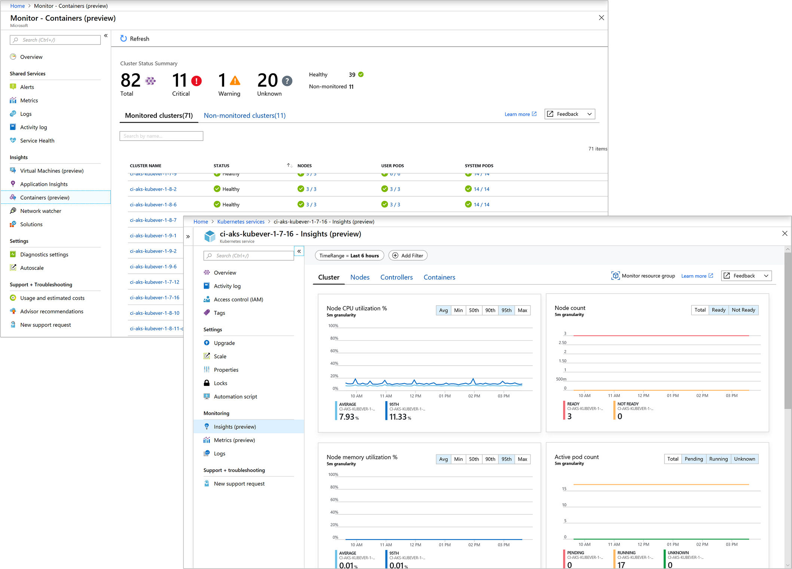
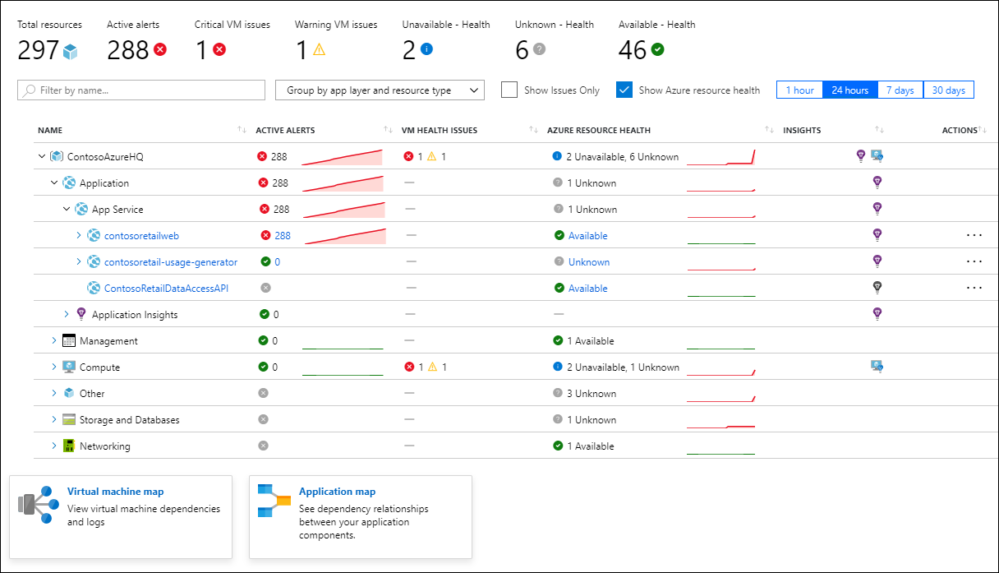
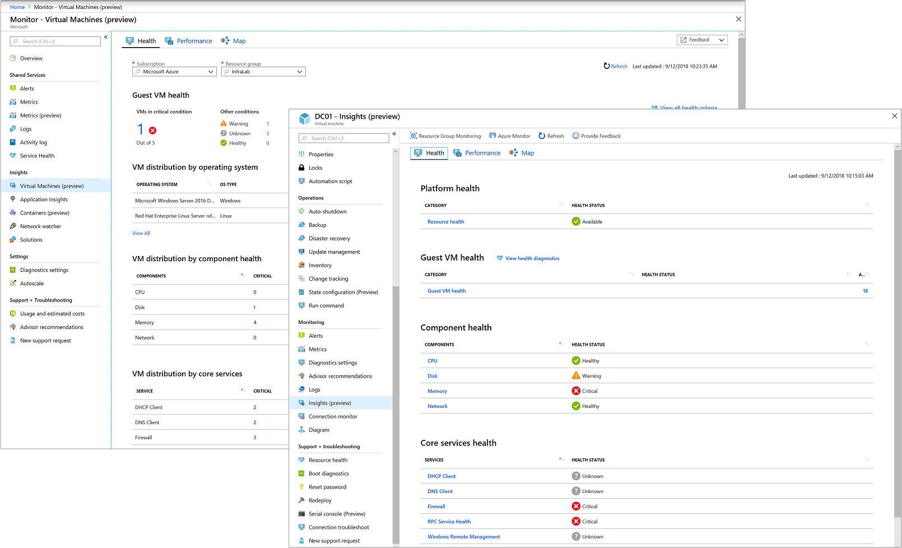
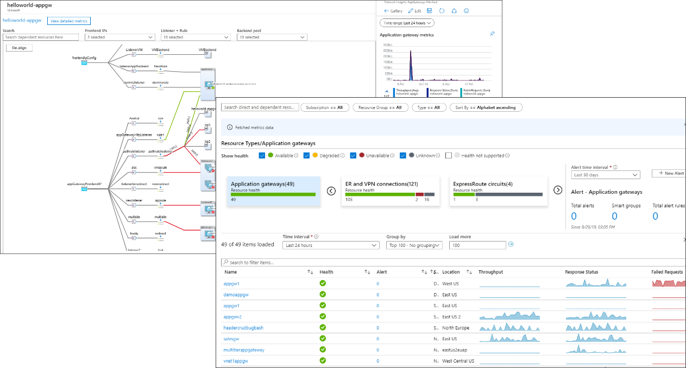

# Overview of Insights in Azure Monitor
Insights provide a customized monitoring experience for particular applications and services. They store data in the [Azure Monitor data platform](../platform/data-platform.md) and leverage other Azure Monitor features for analysis and alerting but may collect additional data and provide a unique user experience in the Azure portal. Access insights from the **Insights** section of the Azure Monitor menu in the Azure portal.

The following sections provide a brief description of the insights that are currently available in Azure Monitor. See the detailed documentation for details on each.

## Application Insights
Application Insights is an extensible Application Performance Management (APM) service for web developers on multiple platforms. Use it to monitor your live web application. It works for applications on a wide variety of platforms including .NET, Node.js and Java EE, hosted on-premises, hybrid, or any public cloud. It also integrates with your DevOps process and has connection points to a variety of development tools.

See [What is Application Insights?](../app/app-insights-overview.md).

## Azure Monitor for Containers
Azure Monitor for containers monitors the performance of container workloads deployed to either Azure Container Instances or managed Kubernetes clusters hosted on Azure Kubernetes Service (AKS). Monitoring your containers is critical, especially when you're running a production cluster, at scale, with multiple applications.

See [Azure Monitor for containers overview](../insights/container-insights-overview.md).

## Azure Monitor for Resource Groups (preview)
Azure Monitor for resource groups helps to triage and diagnose any problems your individual resources encounter, while offering context as to the health and performance of the resource group as a whole.

See [Monitor resource groups with Azure Monitor (preview)](../insights/resource-group-insights.md).

## Azure Monitor for VMs (preview)
Azure Monitor for VMs monitors your Azure virtual machines (VM) and virtual machine scale sets at scale. It analyzes the performance and health of your Windows and Linux VMs, and monitors their processes and dependencies on other resources and external processes.

See [What is Azure Monitor for VMs?](vminsights-overview.md)

## Azure Monitor for Networks (preview)
[Azure Monitor for Networks](network-insights-overview.md) provides a comprehensive view of health and metrics for all your network resource. The advanced search capability helps you identify resource dependencies, enabling scenarios like identifying resource that are hosting your website, by simply searching for your website name.

## Next steps
* Learn more about the [Azure Monitor data platform](../platform/data-platform.md) leveraged by insights.
* Learn about the different [data sources used by Azure Monitor](../platform/data-sources.md) and the different kinds of data collected by each of the insights.
