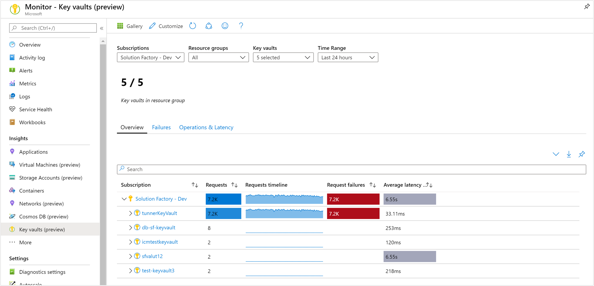
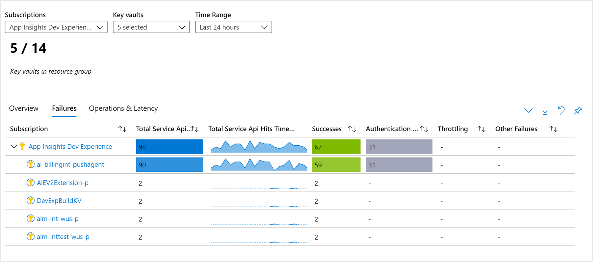
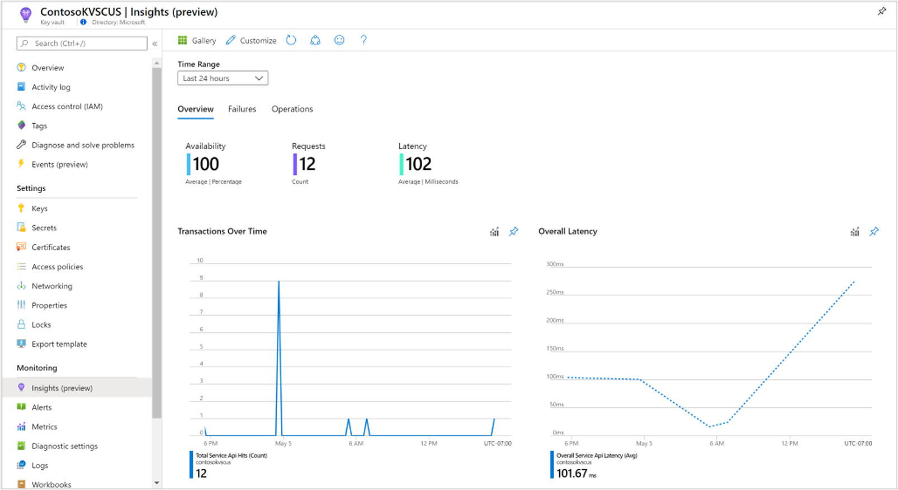
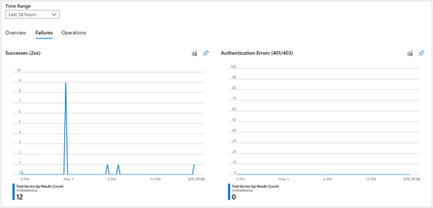
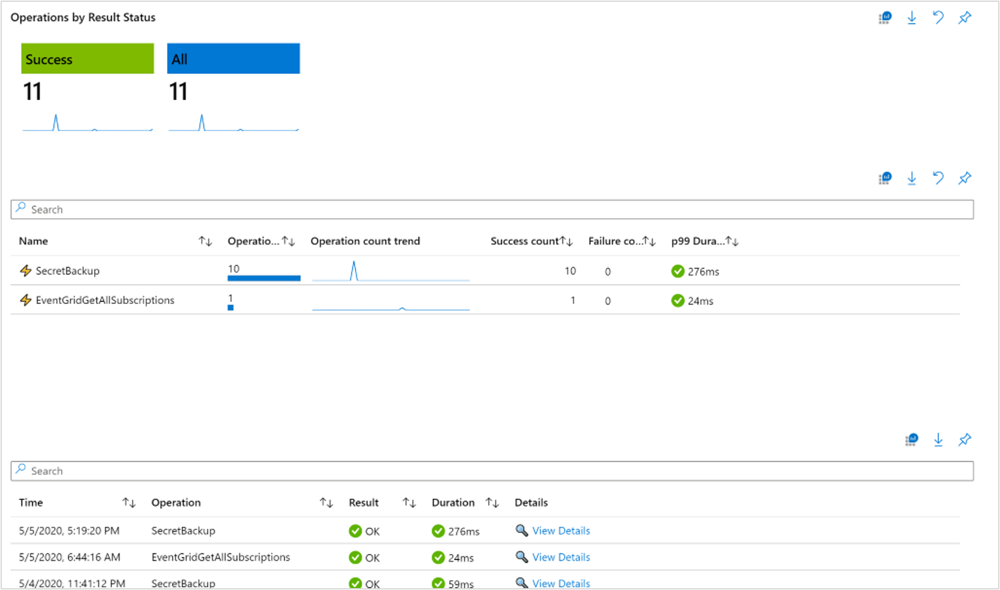
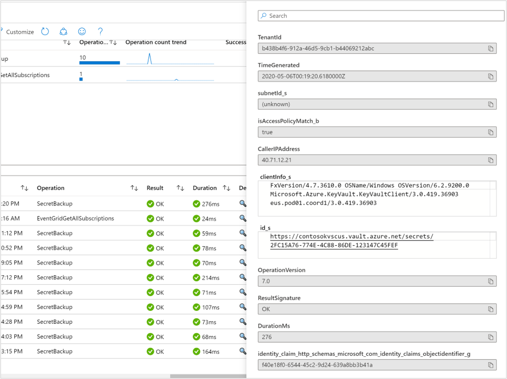
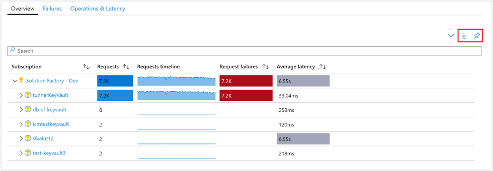

# Monitoring your key vault service with Azure Monitor for Key Vault
Azure Monitor for Key Vault provides comprehensive monitoring of your key vaults by delivering a unified view of your Key Vault requests, performance, failures, and latency.
This article will help you understand how to onboard and customize the experience of Azure Monitor for Key Vault.

## Introduction to Azure Monitor for Key Vault

Before jumping into the experience, you should understand how it presents and visualizes information.
-    **At scale perspective** showing a snapshot view of performance based on the requests, breakdown of failures, and an overview of the operations and latency.
-   **Drill down analysis** of a particular key vault to perform detailed analysis.
-    **Customizable** where you can change which metrics you want to see, modify or set thresholds that align with your limits, and save your own workbook. Charts in the workbook can be pinned to Azure dashboards.

Azure Monitor for Key Vault combines both logs and metrics to provide a global monitoring solution. All users can access the metrics-based monitoring data, however the inclusion of logs-based visualizations may require users to [enable logging of their Azure Key Vault](../../key-vault/general/logging.md).

## View from Azure Monitor

From Azure Monitor, you can view request, latency, and failure details from multiple key vaults in your subscription, and help identify performance problems and throttling scenarios.

To view the utilization and operations of your key vaults across all your subscriptions, perform the following steps:

1. Sign into the [Azure portal](https://portal.azure.com/)

2. Select **Monitor** from the left-hand pane in the Azure portal, and under the Insights section, select **Key Vaults**.

## Overview workbook

On the Overview workbook for the selected subscription, the table displays interactive key vault metrics for key vaults grouped within the subscription. You can filter results based on the options you select from the following drop-down lists:

* Subscriptions – only subscriptions that have key vaults are listed.

* Key Vaults – by default only up to 5 key vaults are pre-selected. If you select all or multiple key vaults in the scope selector, up to 200 key vaults will be returned. For example, if you had a total of 573 key vaults across three subscriptions that you've selected, only 200 vaults will be displayed.

* Time Range – by default, displays the last 24 hours of information based on the corresponding selections made.

The counter tile, under the drop-down list, rolls-up the total number of key vaults in the selected subscriptions and reflects how many are selected. There are conditional color-coded heatmaps for the columns of the workbook that report request, failures, and latency metrics. The deepest color has the highest value and a lighter color is based on the lowest values.

## Failures workbook

Select **Failures** at the top of the page and the Failures tab opens. It shows you the API hits, frequency over time, along with the amount of certain response codes.

There is conditional color-coding or heatmaps for columns in the workbook that report API hits metrics with a blue value. The deepest color has the highest value and a lighter color is based on the lowest values.

The workbook displays Successes (2xx status codes), Authentication Errors (401/403 status codes), Throttling (429 status codes), and Other Failures (4xx status codes).

To better understand what each of the status codes represent, we recommend reading through the documentation on [Azure Key Vault status and response codes](../../key-vault/general/authentication-requests-and-responses.md).

## View from a Key Vault resource

To access Azure Monitor for Key Vault directly from a key Vault:

1. In the Azure portal, select Key Vaults.

2. From the list, choose a key vault. In the monitoring section, choose Insights.

These views are also accessible by selecting the resource name of a key vault from the Azure Monitor level workbook.

On the **Overview** workbook for the key vault, it shows several performance metrics that help you quickly assess:

- Interactive performance charts showing the most essential details related to key vault transactions, latency, and availability.

- Metrics and status tiles highlighting service availability, total count of transactions to the key vault resource, and overall latency.

Selecting any of the other tabs for **Failures** or **Operations** opens the respective workbooks.

The failures workbook breakdowns the results of all key vault requests in the selected time frame, and provides categorization on Successes (2xx), Authentication Errors (401/403), Throttling (429), and other failures.

The Operations workbook allows users to deep dive into the full details of all transactions, which can be filtered by the Result Status using the top level tiles.

Users can also scope out views based on specific transaction types in the upper table, which dynamically updates the lower table, where users can view full operation details in a pop up context pane.

>[!NOTE]
> Note that users must have the diagnostic settings enabled to view this workbook. To learn more about enabling diagnostic setting, read more about [Azure Key Vault Logging](../../key-vault/general/logging.md).

## Pin and export

You can pin any one of the metric sections to an Azure dashboard by selecting the pushpin icon at the top right of the section.

The multi-subscription and key vaults overview or failures workbooks support exporting the results in Excel format by selecting the download icon to the left of the pushpin icon.

## Customize Azure Monitor for Key Vault

This section highlights common scenarios for editing the workbook to customize in support of your data analytics needs:
*  Scope the workbook to always select a particular subscription or key vault(s)
* Change metrics in the grid
* Change the requests threshold
* Change the color rendering

You can begin customizations by enabling the editing mode, by selecting the **Customize** button from the top toolbar.

Customizations are saved to a custom workbook to prevent overwriting the default configuration in our published workbook. Workbooks are saved within a resource group, either in the My Reports section that is private to you or in the Shared Reports section that's accessible to everyone with access to the resource group. After you save the custom workbook, you need to go to the workbook gallery to launch it.

### Specifying a subscription or key vault

You can configure the multi-subscription and key vault Overview or Failures workbooks to scope to a particular subscription(s) or key vault(s) on every run, by performing the following steps:

1. Select **Monitor** from the portal and then select **Key Vaults** from the left-hand pane.
2. On the **Overview** workbook, from the command bar select **Edit**.
3. Select from the **Subscriptions** drop-down list one or more subscriptions you want yo use as the default. Remember, the workbook supports selecting up to a total of 10 subscriptions.
4. Select from the **Key Vaults** drop-down list one or more accounts you want it to use as the default. Remember, the workbook supports selecting up to a total of 200 storage accounts.
5. Select **Save as** from the command bar to save a copy of the workbook with your customizations, and then click **Done editing** to return to reading mode.

## Troubleshooting

For general troubleshooting guidance, refer to the dedicated workbook-based insights [troubleshooting article](troubleshoot-workbooks.md).

This section will help you with the diagnosis and troubleshooting of some of the common issues you may encounter when using Azure Monitor for Key Vault. Use the list below to locate the information relevant to your specific issue.

### Resolving performance issues or failures

To help troubleshoot any key vault related issues you identify with Azure Monitor for Key Vault, see the [Azure Key Vault documentation](../../key-vault/index.yml).

### Why can I only see 200 key vaults

There is a limit of 200 key vaults that can be selected and viewed. Regardless of the number of selected subscriptions, the number of selected key vaults has a limit of 200.

### Why don't I see all my subscriptions in the subscription picker

We only show subscriptions that contain key vaults, chosen from the selected subscription filter, which are selected in the "Directory + Subscription" in the Azure portal header.

### I want to make changes or add additional visualizations to Key Vault Insights, how do I do so

To make changes, select the "Edit Mode" to modify the workbook, then you can save your work as a new workbook that is tied to a designated subscription and resource group.

### What is the time-grain once we pin any part of the Workbooks

We utilize the "Auto" time grain, therefore it depends on what time range is selected.

### What is the time range when any part of the workbook is pinned

The time range will depend on the dashboard settings.

### What if I want to see other data or make my own visualizations? How can I make changes to the Key Vault Insights

You can edit the existing workbook, through the use of the edit mode, and then save your work as a new workbook that will have all your new changes.

## Next steps

Learn the scenarios workbooks are designed to support, how to author new and customize existing reports, and more by reviewing [Create interactive reports with Azure Monitor workbooks](../platform/workbooks-overview.md).
