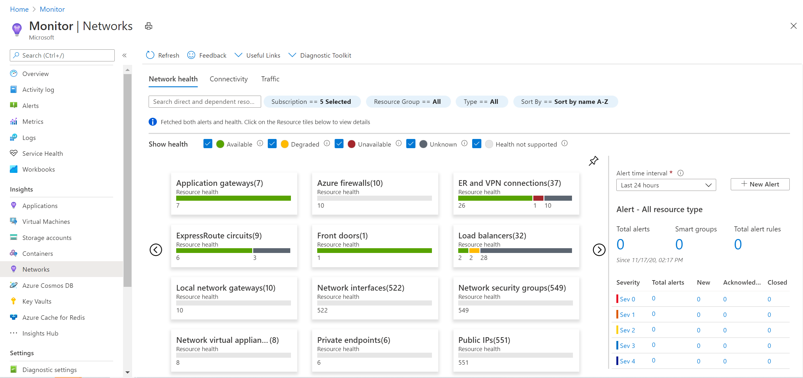
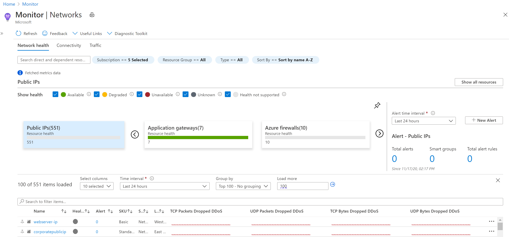
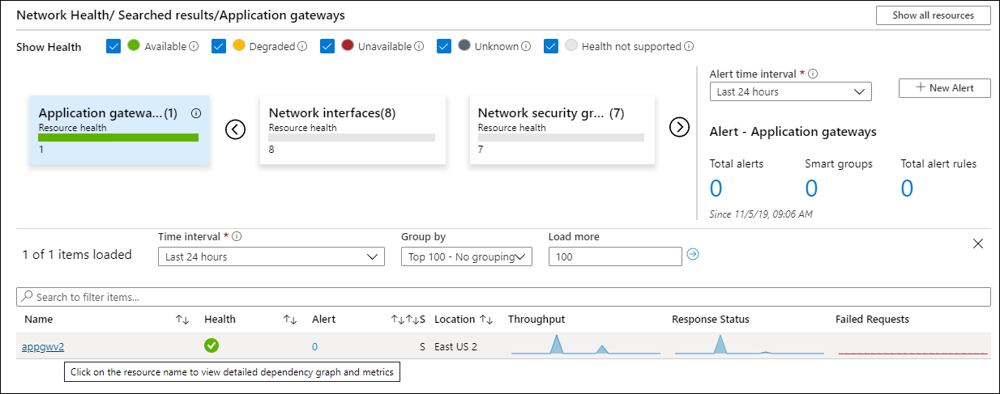
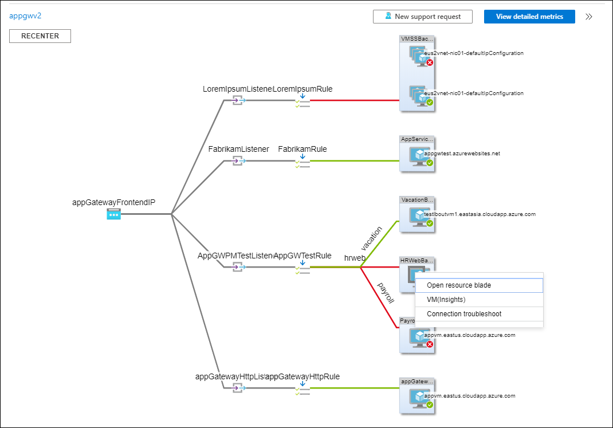

# Azure Monitor for Networks (Preview)
Azure Monitor for Network provides a comprehensive view of health and metrics for all deployed network resource without any configuration. The advanced search capability helps identify resource dependencies that enable scenarios like identifying resources that are hosting your website by searching for the hosted website name.

The Azure Monitor for Networks **Overview** page provides an effortless way to visualize the inventory of your networking resources along with resource health and alerts. It is divided into four key functional areas:

- Search and filtering
- Resource Health and Metrics
- Alerts 
- Dependency view

## Search and filtering
The resource health and alerts view can be customized using filters like **Subscription**, **Resource Group** and **Resource Type**. The search box provides the capability to search through resource properties.

The search box can be used to search for resources and associated resources. For example, a Public IP is associated to an Application Gateway. Searching for the Public IPs DNS name will identify both Public IP and the associated Application Gateway.

## Resource Health and Metric
Each tile represents a resource type, with the number of instances deployed across all subscriptions selected along with resource health status. In the example below, there are 105 ER and VPN Connections deployed, 103 are healthy, and 2 unavailable.

Clicking on the two Unavailable ER and VPN connections, launches a metric view. 

You can click on each element in the grid view. Click on the Health icon to redirect to resource health for that connection. Click on Alerts to redirect to alerts and metrics page respectively for that connection. 

## Alerts
The **Alerts** grid on the right provides a view of all the alerts generated for the selected resources across all subscriptions. Click on the alert counts to navigate to detailed alerts page.

## Dependency view
The **Dependency** view helps visualize how the resource is configured. Currently dependency view is now supported for Application Gateway, Virtual WAN, and Load Balancer. For example, in the case of Application Gateway, Dependency view can be accessed by clicking on the Application Gateway resource name from the metrics grid view. This also applies to Virtual WAN and Load Balancer. 

The **Dependency** view for Application Gateway provides a simplified view of how the front-end IPs are connected to the listeners, rules and backend pool. The connecting edges are color coded and provide additional details based on the backend pool health. The view also provides a detailed view of Application Gateway metrics and metrics for all related backend pools such as virtual machine scale set and virtual machine instances.

The dependency graph enables easy navigation to configuration settings. Right click on a back-end pool to access to other functionality. For example, if the back-end pool is a virtual machine, you can directly access virtual machine insights and the Network Watcher connection to troubleshoot and identify connectivity issues.

The search and filter bar on the dependency view provide an effortless way to search through the graph. For example, searching for *AppGWTestRule* in the example below will narrow down the graphical view to all nodes connected via *AppGWTestRule*. 

Different filters provide help to narrow down on to a specific path and state. For example, select only *Unhealthy* from the **Health Status** drop down to show all the edges where state is *Unhealthy*.

Click on **Detailed Metric View** to launch a pre-configured workbook with detailed metrics for the application gateway, all backend pool resources and front-end IPs. 

## Next steps 

- Learn more about network monitoring at What is [Azure Network Watcher?](../../network-watcher/network-watcher-monitoring-overview.md).
