# Integrate System Center Operations Manager with Azure Monitor for VMs Map feature

In Azure Monitor for VMs, you can view discovered application components on Windows and Linux virtual machines (VMs) that run in Azure or your environment. With this integration between the Map feature and System Center Operations Manager, you can automatically create distributed application diagrams in Operations Manager that are based on the dynamic dependency maps in Azure Monitor for VMs. This article describes how to configure your System Center Operations Manager management group to support this feature.

>[!NOTE]
>If you have already deployed Service Map, you can view your maps in Azure Monitor for VMs, which includes additional features to monitor VM health and performance. The Map feature of Azure Monitor for VMs is intended to replace the standalone Service Map solution. To learn more, see [Azure Monitor for VMs overview](vminsights-overview.md).

## Prerequisites

* A System Center Operations Manager management group (2012 R2 or later).
* A Log Analytics workspace configured to support Azure Monitor for VMs.
* One or more Windows and Linux virtual machines or physical computers that are monitored by Operations Manager and sending data to your Log Analytics workspace. Linux servers reporting to an Operations Manager management group need to be configured to directly connect to Azure Monitor. For more information, review the overview in [Collect log data with the Log Analytics agent](../platform/log-analytics-agent.md).
* A service principal with access to the Azure subscription that is associated with the Log Analytics workspace. For more information, go to [Create a service principal](#create-a-service-principal).

## Install the Service Map management pack

You enable the integration between Operations Manager and the Map feature by importing the Microsoft.SystemCenter.ServiceMap management pack bundle (Microsoft.SystemCenter.ServiceMap.mpb). You can download the management pack bundle from the [Microsoft Download Center](https://www.microsoft.com/download/details.aspx?id=55763). The bundle contains the following management packs:

* Microsoft Service Map Application Views
* Microsoft System Center Service Map Internal
* Microsoft System Center Service Map Overrides
* Microsoft System Center Service Map

## Configure integration

After you install the Service Map management pack, a new node, **Service Map**, is displayed under **Operations Management Suite** in the **Administration** pane of your Operations Manager Operations console.

>[!NOTE]
>[Operations Management Suite was a collection of services](../terminology.md#april-2018---retirement-of-operations-management-suite-brand) that included Log Analytics, is now part of [Azure Monitor](../overview.md).

To configure Azure Monitor for VMs Map integration, do the following:

1. To open the configuration wizard, in the **Service Map Overview** pane, click **Add workspace**.  

    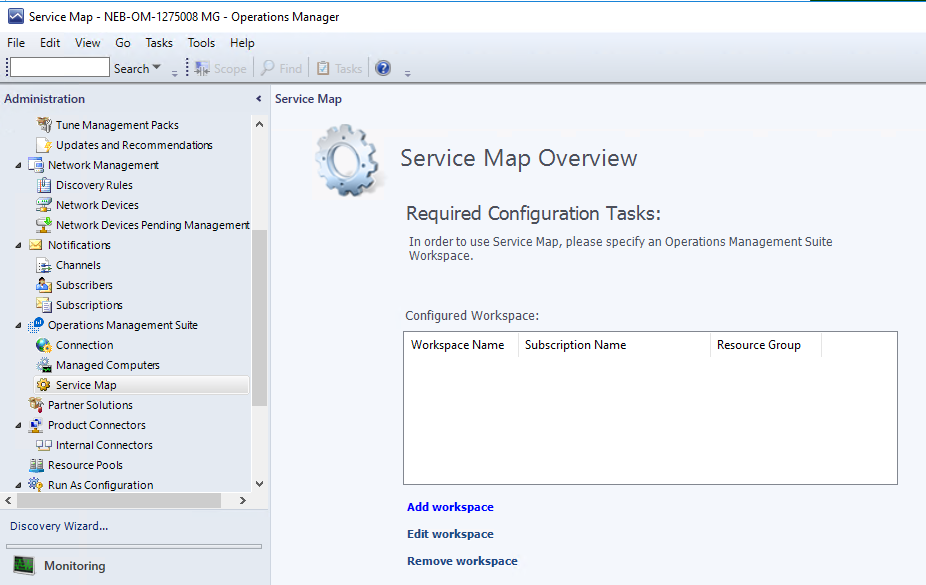

2. In the **Connection Configuration** window, enter the tenant name or ID, application ID (also known as the username or clientID), and password of the service principal, and then click **Next**. For more information, go to Create a service principal.

    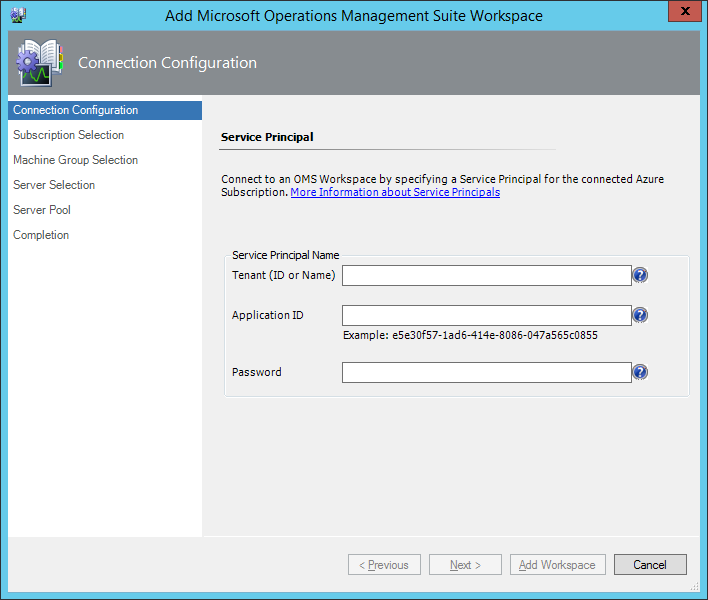

3. In the **Subscription Selection** window, select the Azure subscription, Azure resource group (the one that contains the Log Analytics workspace), and Log Analytics workspace, and then click **Next**.

    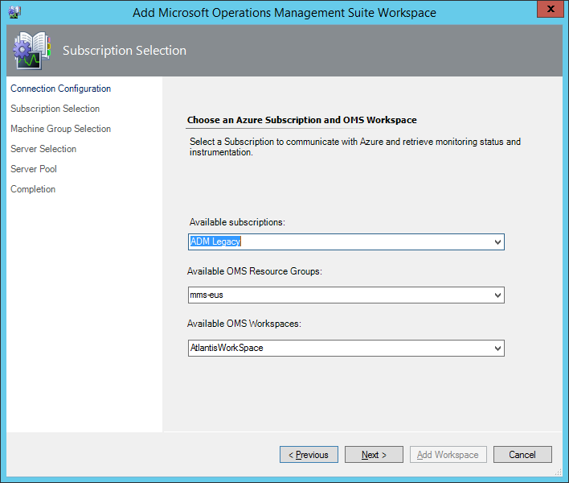

4. In the **Machine Group Selection** window, you choose which Service Map Machine Groups you want to sync to Operations Manager. Click **Add/Remove Machine Groups**, choose groups from the list of **Available Machine Groups**, and click **Add**.  When you are finished selecting groups, click **Ok** to finish.

    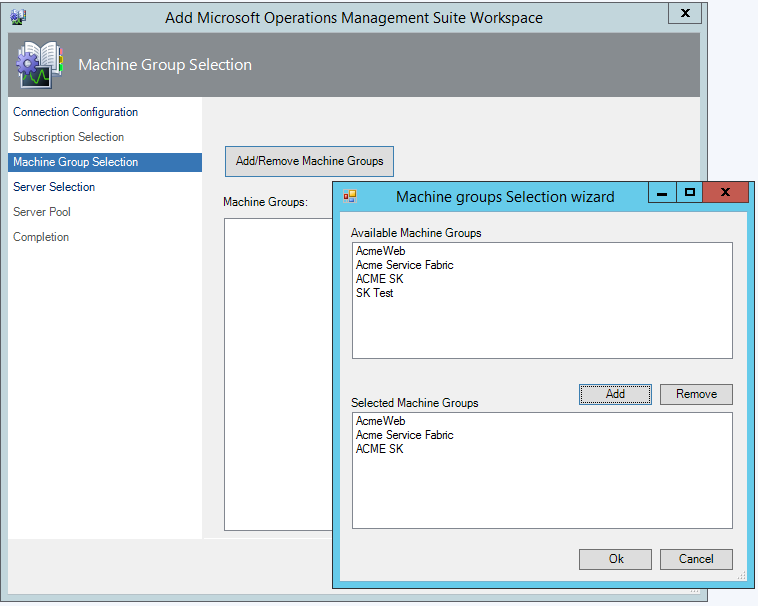

5. In the **Server Selection** window, you configure the Service Map Servers Group with the servers that you want to sync between Operations Manager and the Map feature. Click **Add/Remove Servers**.

    For the integration to build a distributed application diagram for a server, the server must be:

   * Monitored by Operations Manager
   * Configured to report to the Log Analytics workspace configured with Azure Monitor for VMs
   * Listed in the Service Map Servers Group

     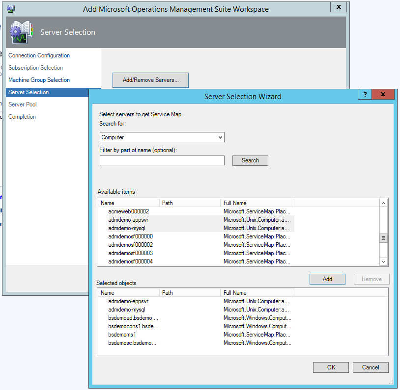

6. Optional: Select the All Management Servers Resource Pool to communicate with Log Analytics, and then click **Add Workspace**.

    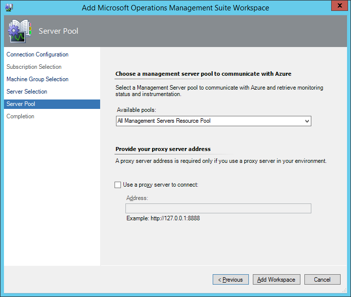

    It might take a minute to configure and register the Log Analytics workspace. After it is configured, Operations Manager initiates the first Map sync.

    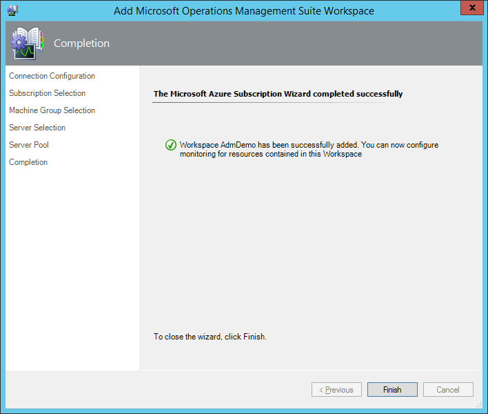

## Monitor integration

After the Log Analytics workspace is connected, a new folder, Service Map, is displayed in the **Monitoring** pane of the Operations Manager Operations console.

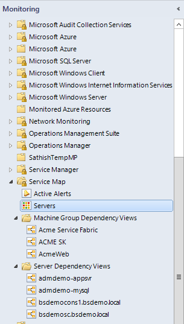

The Service Map folder has four nodes:

* **Active Alerts**: Lists all the active alerts about the communication between Operations Manager and Azure Monitor.  

  >[!NOTE]
  >These alerts are not Log Analytics alerts synced with Operations Manager, they are generated in the management group based on workflows defined in the Service Map management pack.

* **Servers**: Lists the monitored servers that are configured to sync from Azure Monitor for VMs Map feature.

    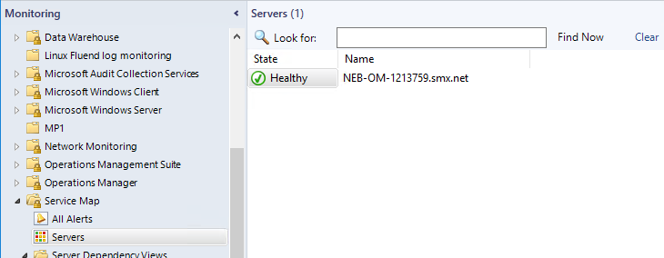

* **Machine Group Dependency Views**: Lists all machine groups that are synced from the Map feature. You can click any group to view its distributed application diagram.

    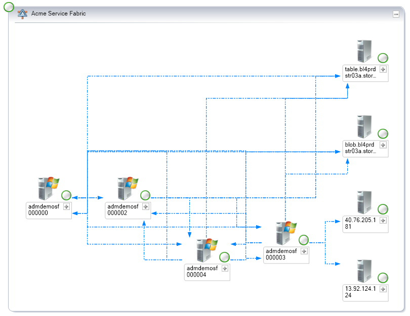

* **Server Dependency Views**: Lists all servers that are synced from the Map feature. You can click any server to view its distributed application diagram.

    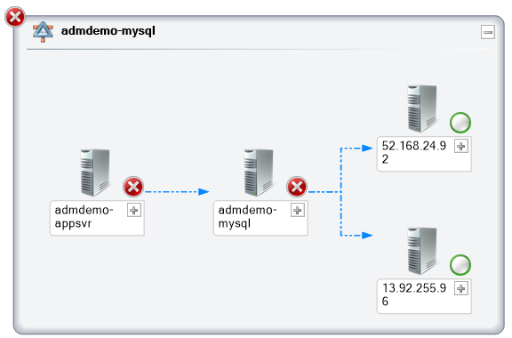

## Edit or delete the workspace

You can edit or delete the configured workspace through the **Service Map Overview** pane (**Administration** pane > **Operations Management Suite** > **Service Map**).

>[!NOTE]
>[Operations Management Suite was a collection of services](https://github.com/MicrosoftDocs/azure-docs-pr/pull/azure-monitor/azure-monitor-rebrand.md#retirement-of-operations-management-suite-brand) that included Log Analytics, which is now part of [Azure Monitor](https://github.com/MicrosoftDocs/azure-docs-pr/pull/azure-monitor/overview.md).

You can configure only one Log Analytics workspace in this current release.

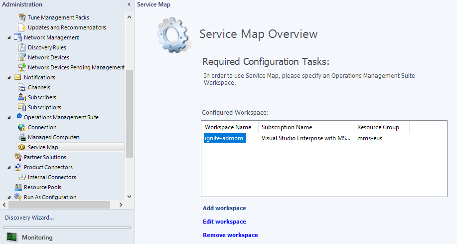

## Configure rules and overrides

A rule, *Microsoft.SystemCenter.ServiceMapImport.Rule*, periodically fetches information from Azure Monitor for VMs Map feature. To modify the synchronization interval, you can override the rule and modify the value for the parameter **IntervalMinutes**.

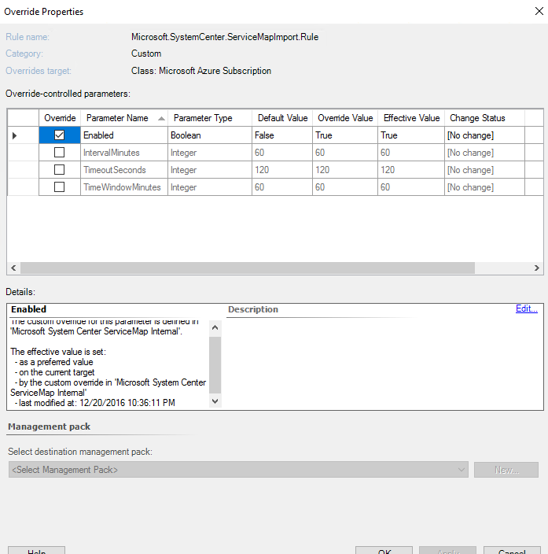

* **Enabled**: Enable or disable automatic updates.
* **IntervalMinutes**: Specifies the time between updates. The default interval is one hour. If you want to sync maps more frequently, you can change the value.
* **TimeoutSeconds**: Specifies the length of time before the request times out.
* **TimeWindowMinutes**: Specifies the time window for querying data. The default is 60 minutes, which is the maximum interval allowed.

## Known issues and limitations

The current design presents the following issues and limitations:

* You can only connect to a single Log Analytics workspace.
* Although you can add servers to the Service Map Servers Group manually through the **Authoring** pane, the maps for those servers are not synced immediately. They will be synced from Azure Monitor for VMs Map feature during the next sync cycle.
* If you make any changes to the Distributed Application Diagrams created by the management pack, those changes will likely be overwritten on the next sync with Azure Monitor for VMs.

## Create a service principal

For official Azure documentation about creating a service principal, see:

* [Create a service principal by using PowerShell](https://docs.microsoft.com/azure/azure-resource-manager/resource-group-authenticate-service-principal)
* [Create a service principal by using Azure CLI](https://docs.microsoft.com/azure/azure-resource-manager/resource-group-authenticate-service-principal-cli)
* [Create a service principal by using the Azure portal](https://docs.microsoft.com/azure/azure-resource-manager/resource-group-create-service-principal-portal)

### Feedback
Do you have any feedback for us about integration with Azure Monitor for VMs Map feature or this documentation? Visit our [User Voice page](https://feedback.azure.com/forums/267889-log-analytics/category/184492-service-map), where you can suggest features or vote on existing suggestions.
