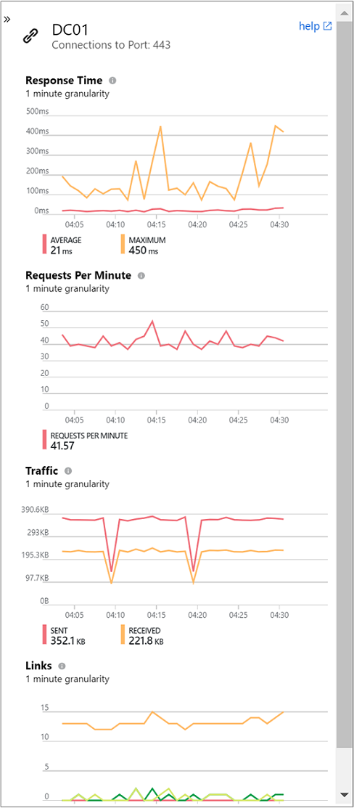
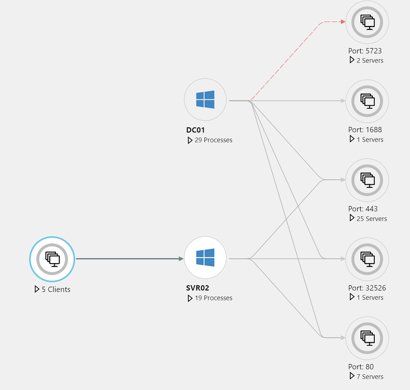
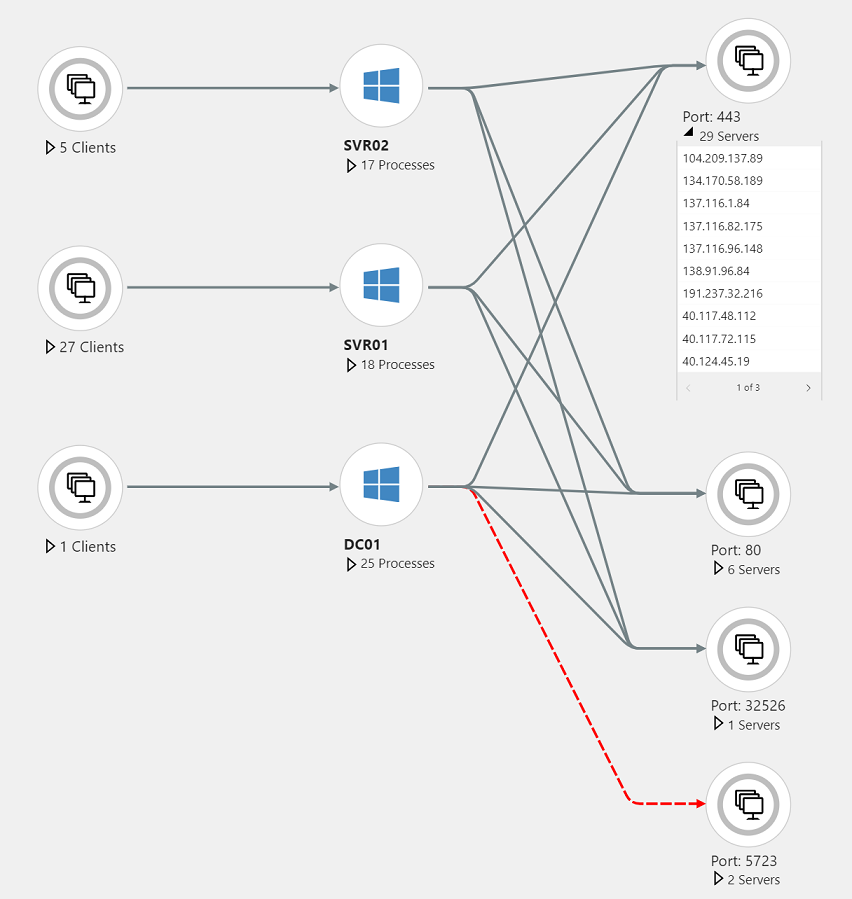
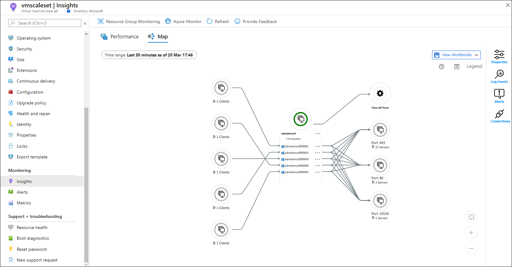

# Use the Map feature of Azure Monitor for VMs to understand application components
In Azure Monitor for VMs, you can view discovered application components on Windows and Linux virtual machines (VMs) that run in Azure or your environment. You can observe the VMs in two ways. View a map directly from a VM or view a map from Azure Monitor to see the components across groups of VMs. This article will help you understand these two viewing methods and how to use the Map feature. 

For information about configuring Azure Monitor for VMs, see [Enable Azure Monitor for VMs](vminsights-enable-overview.md).

## Sign in to Azure
Sign in to the [Azure portal](https://portal.azure.com).

## Introduction to the Map experience
Before diving into the Map experience, you should understand how it presents and visualizes information. Whether you select the Map feature directly from a VM or from Azure Monitor, the Map feature presents a consistent experience. The only difference is that from Azure Monitor, one map shows all the members of a multiple-tier application or cluster.

The Map feature visualizes the VM dependencies by discovering running processes that have: 

- Active network connections between servers.
- Inbound and outbound connection latency.
- Ports across any TCP-connected architecture over a specified time range.  
 
Expand a VM to show process details and only those processes that communicate with the VM. The client group shows the count of front-end clients that connect into the VM. The server-port groups show the count of back-end servers the VM connects to. Expand a server-port group to see the detailed list of servers that connect over that port.  

When you select the VM, the **Properties** pane on the right shows the VM's properties. Properties include system information reported by the operating system, properties of the Azure VM, and a doughnut chart that summarizes the discovered connections. 

On the right side of the pane, select **Log Events** to show a list of data that the VM has sent to Azure Monitor. This data is available for querying.  Select any record type to open the **Logs** page, where you see the results for that record type. You also see a preconfigured query that's filtered against the VM.  

Close the **Logs** page and return to the **Properties** pane. There, select **Alerts** to view VM health-criteria alerts. The Map feature integrates with Azure Alerts to show alerts for the selected server in the selected time range. The server displays an icon for current alerts, and the **Machine Alerts** pane lists the alerts. 

To make the Map feature display relevant alerts, create an alert rule that applies to a specific computer:

- Include a clause to group alerts by computer (for example, **by Computer interval 1 minute**).
- Base the alert on a metric.

For more information about Azure Alerts and creating alert rules, see [Unified alerts in Azure Monitor](../platform/alerts-overview.md).

In the upper-right corner, the **Legend** option describes the symbols and roles on the map. For a closer look at your map and to move it around, use the zoom controls in the lower-right corner. You can set the zoom level and fit the map to the size of the page.  

## Connection metrics
The **Connections** pane displays standard metrics for the selected connection from the VM over the TCP port. The metrics include response time, requests per minute, traffic throughput, and links.  

  

### Failed connections
The map shows failed connections for processes and computers. A dashed red line indicates a client system is failing to reach a process or port. For systems that use the Dependency agent, the agent reports on failed connection attempts. The Map feature monitors a process by observing TCP sockets that fail to establish a connection. This failure could result from a firewall, a misconfiguration in the client or server, or an unavailable remote service.

Understanding failed connections can help you troubleshoot, validate migration, analyze security, and understand the overall architecture of the service. Failed connections are sometimes harmless, but they often point to a problem. Connections might fail, for example, when a failover environment suddenly becomes unreachable or when two application tiers can't communicate with each other after a cloud migration.

### Client groups
On the map, client groups represent client machines that connect to the mapped machine. A single client group represents the clients for an individual process or machine.

To see the monitored clients and IP addresses of the systems in a client group, select the group. The contents of the group appear below.  

If the group includes monitored and unmonitored clients, you can select the appropriate section of the group's doughnut chart to filter the clients.

### Server-port groups
Server-port groups represent ports on servers that have inbound connections from the mapped machine. The group contains the server port and a count of the number of servers that have connections to that port. Select the group to see the individual servers and connections. 

  

If the group includes monitored and unmonitored servers, you can select the appropriate section of the group's doughnut chart to filter the servers.

## View a map from a VM 

To access Azure Monitor for VMs directly from a VM:

1. In the Azure portal, select **Virtual Machines**. 
2. From the list, choose a VM. In the **Monitoring** section, choose **Insights**.  
3. Select the **Map** tab.

The map visualizes the VM's dependencies by discovering running process groups and processes that have active network connections over a specified time range.  

By default, the map shows the last 30 minutes. If you want to see how dependencies looked in the past, you can query for historical time ranges of up to one hour. To run the query, use the **TimeRange** selector in the upper-left corner. You might run a query, for example, during an incident or to see the status before a change.  

## View a map from a virtual machine scale set

To access Azure Monitor for VMs directly from a virtual machine scale set:

1. In the Azure portal, select **Virtual machine scale sets**.
2. From the list, choose a VM. Then in the **Monitoring** section, choose **Insights**.  
3. Select the **Map** tab.

The map visualizes all instances in the scale set as a group node along with the group's dependencies. The expanded node lists the instances in the scale set. You can scroll through these instances 10 at a time. 

To load a map for a specific instance, first select that instance on the map. Then select the **ellipsis** button (...) to the right and choose **Load Server Map**. In the map that appears, you see process groups and processes that have active network connections over a specified time range. 

By default, the map shows the last 30 minutes. If you want to see how dependencies looked in the past, you can query for historical time ranges of up to one hour. To run the query, use the **TimeRange** selector. You might run a query, for example, during an incident or to see the status before a change.

>[!NOTE]
>You can also access a map for a specific instance from the **Instances** view for your virtual machine scale set. In the **Settings** section, go to **Instances** > **Insights**.

## View a map from Azure Monitor

In Azure Monitor, the Map feature provides a global view of your VMs and their dependencies. To access the Map feature in Azure Monitor:

1. In the Azure portal, select **Monitor**. 
2. In the **Insights** section, choose **Virtual Machines**.
3. Select the **Map** tab.

   

Choose a workspace by using the **Workspace** selector at the top of the page. If you have more than one Log Analytics workspace, choose the workspace that's enabled with the solution and that has VMs reporting to it. 

The **Group** selector returns subscriptions, resource groups, [computer groups](../platform/computer-groups.md), and virtual machine scale sets of computers that are related to the selected workspace. Your selection applies only to the Map feature and doesn't carry over to Performance or Health.

By default, the map shows the last 30 minutes. If you want to see how dependencies looked in the past, you can query for historical time ranges of up to one hour. To run the query, use the **TimeRange** selector. You might run a query, for example, during an incident or to see the status before a change.  

## Next steps

To identify bottlenecks, check performance, and understand overall utilization of your VMs, see [View performance status for Azure Monitor for VMs](vminsights-performance.md). 

