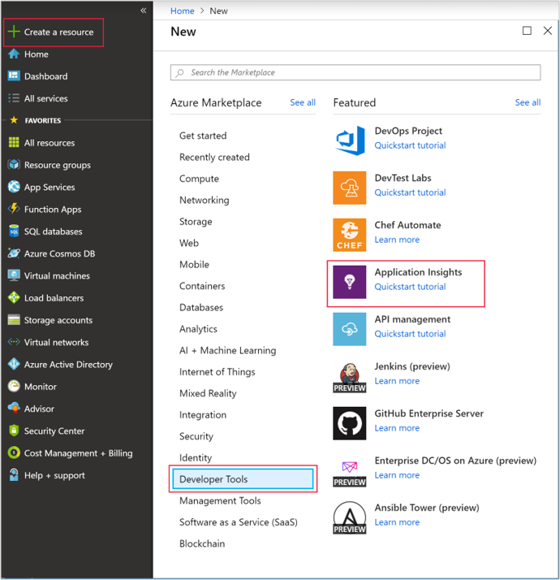
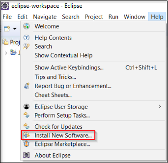
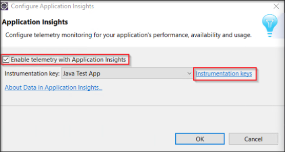
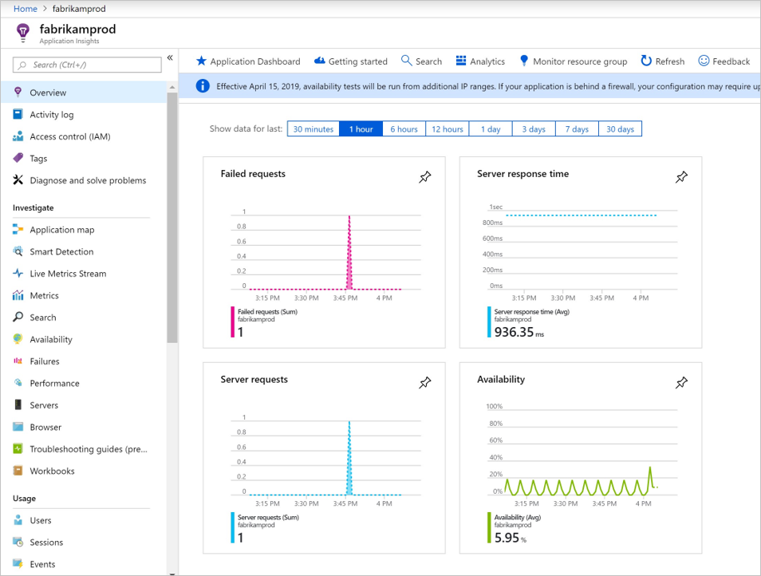
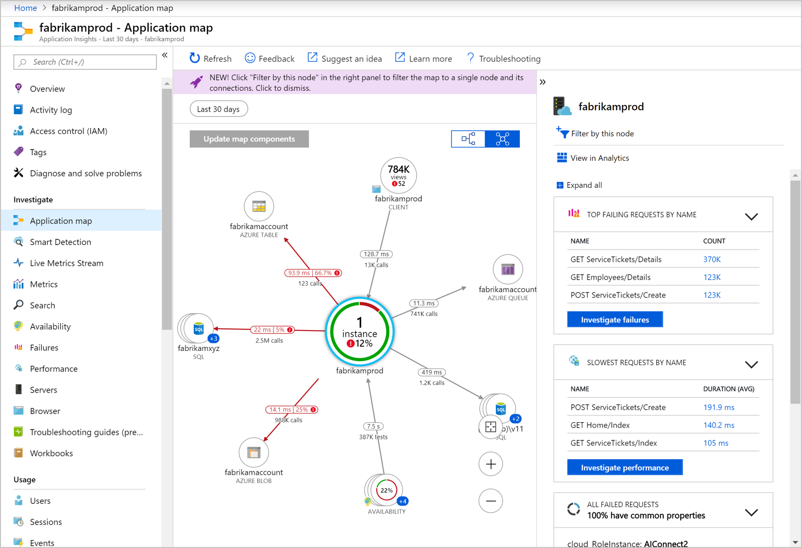
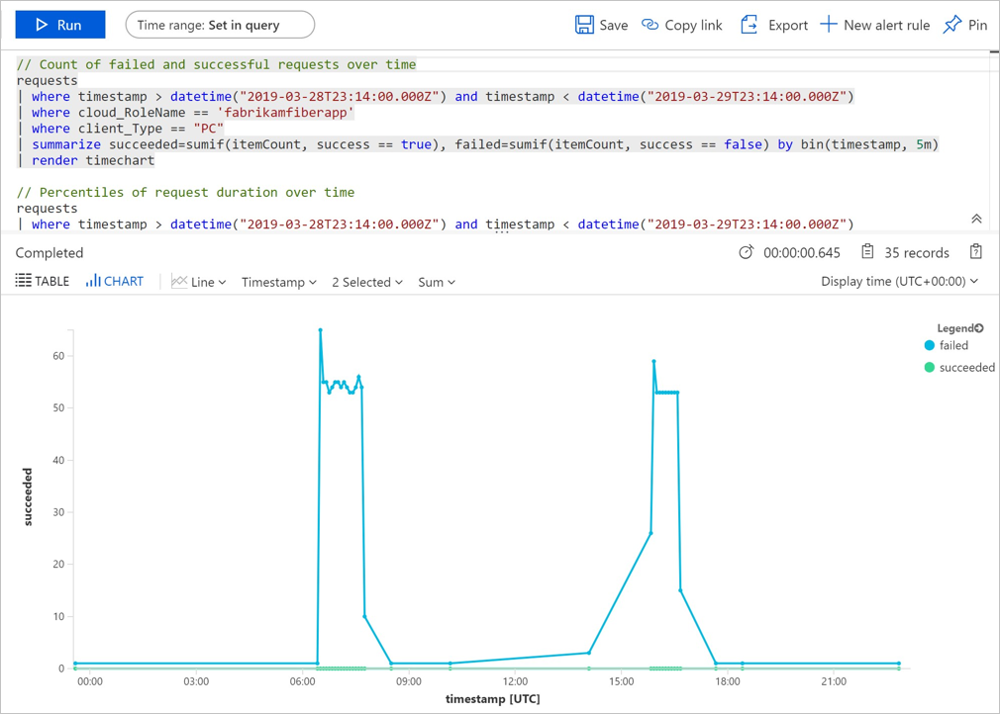
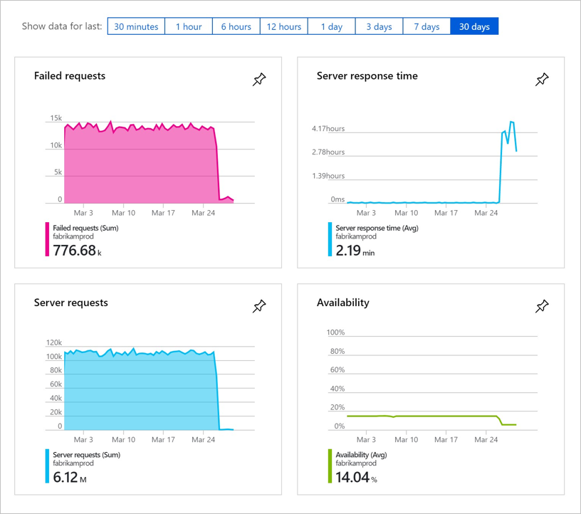
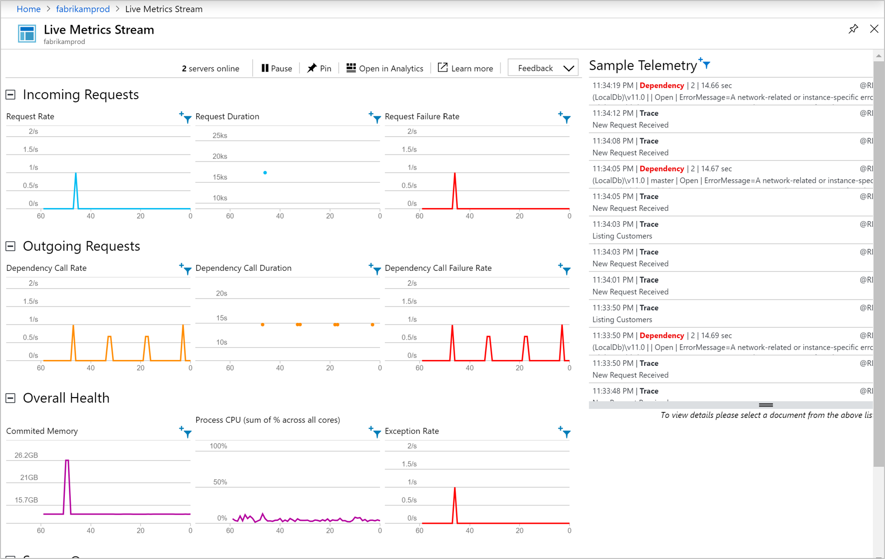

# Start Monitoring Your Java Web Application

With Azure Application Insights, you can easily monitor your web application for availability, performance, and usage. You can also quickly identify and diagnose errors in your application without waiting for a user to report them. With the Application Insights Java SDK, you can monitor common third-party packages including MongoDB, MySQL, and Redis.

This quickstart guides you through adding the Application Insights SDK to an existing Java Dynamic Web Project.

## Prerequisites

To complete this quickstart:

- Install JRE 1.7 or 1.8
- Install [Free Eclipse IDE for Java EE Developers](https://www.eclipse.org/downloads/). This quickstart uses Eclipse Oxygen (4.7)
- You will need an Azure Subscription and an existing Java Dynamic Web Project
 
If you don't have a Java Dynamic Web Project, you can create one with the [Create a Java web app quickstart](https://docs.microsoft.com/azure/app-service-web/app-service-web-get-started-java).

If you don't have an Azure subscription, create a [free](https://azure.microsoft.com/free/) account before you begin.

If you prefer the Spring framework, try the [configure a Spring Boot initializer app to use Application Insights guide](https://docs.microsoft.com/java/azure/spring-framework/configure-spring-boot-java-applicationinsights)

## Sign in to the Azure portal

Sign in to the [Azure portal](https://portal.azure.com/).

## Enable Application Insights

Application Insights can gather telemetry data from any internet-connected application, regardless of whether it's running on-premises or in the cloud. Use the following steps to start viewing this data.

1. Select **Create a resource** > **Developer tools** > **Application Insights**.

   

   

   A configuration box appears; use the following table to fill out the input fields.

    | Settings        | Value           | Description  |
   | ------------- |:-------------|:-----|
   | **Name**      | Globally Unique Value | Name that identifies the app you are monitoring |
   | **Application Type** | Java web application | Type of app you are monitoring |
   | **Resource Group**     | myResourceGroup      | Name for the new resource group to host App Insights data |
   | **Location** | East US | Choose a location near you, or near where your app is hosted |

2. Click **Create**.

## Install App Insights Plugin

1. Launch **Eclipse** > Click **Help** > Select **Install New Software**.

   

2. Copy ```https://dl.microsoft.com/eclipse``` into the "Work With" field > Check **Azure Toolkit for Java** > Select **Application Insights Plugin for Java** > **Uncheck** "Contact all update sites during install to find required software."

3. Once the installation is complete, you will be prompted to **Restart Eclipse**.

## Configure App Insights Plugin

1. Launch **Eclipse** > Open your **Project** > Right-click the project name in the **Project Explorer** > Select **Azure** > Click **Sign In**.

2. Select Authentication Method **Interactive** > Click **Sign In** > When prompted enter your **Azure credentials** > Select Your **Azure Subscription**.

3. Right-click your project name in **Project Explorer** > Select **Azure** > Click **Configure Application Insights**.

4. Check **Enable telemetry with Application Insights** > Select the App Insights resource and associated **Instrumentation Key** you want to link to your Java app.

   

5. After configuring the Application Insights plugin you need to [publish/republish](https://docs.microsoft.com/azure/app-service/app-service-web-get-started-java#publish-the-web-app-to-azure) your application again, before it will be able to start sending telemetry.

> [!NOTE]
> The Application Insights SDK for Java is capable of capturing and visualizing live metrics, but when you first enable telemetry collection it can take a few minutes before data begins appearing in the portal. If this app is a low-traffic test app, keep in mind that most metrics are only captured when there are active requests or operations.

## Start monitoring in the Azure portal

1. You can now reopen the Application Insights **Overview** page in the Azure portal to view details about your currently running application.

   

2. Click **Application map** for a visual layout of the dependency relationships between your application components. Each component shows KPIs such as load, performance, failures, and alerts.

   

3.  Click on the **App Analytics** icon  **View in Analytics**.  This opens **Application Insights Analytics**, which provides a rich query language for analyzing all data collected by Application Insights. In this case, a query is generated for you that renders the request count as a chart. You can write your own queries to analyze other data.

   

4. Return to the **Overview** page and examine the KPI graphs. This dashboard provides statistics about your application health, including the number of incoming requests, the duration of those requests, and any failures that occur.

   

   To enable the **Page View Load Time** chart to populate with **client-side telemetry** data, add this script to each page that you want to track:

   ```HTML
   <!-- 
   To collect user behavior analytics about your application, 
   insert the following script into each page you want to track.
   Place this code immediately before the closing </head> tag,
   and before any other scripts. Your first data will appear 
   automatically in just a few seconds.
   -->
   <script type="text/javascript">
     var appInsights=window.appInsights||function(config){
     function i(config){t[config]=function(){var i=arguments;t.queue.push(function(){t[config].apply(t,i)})}}var t={config:config},u=document,e=window,o="script",s="AuthenticatedUserContext",h="start",c="stop",l="Track",a=l+"Event",v=l+"Page",y=u.createElement(o),r,f;y.src=config.url||"https://az416426.vo.msecnd.net/scripts/a/ai.0.js";u.getElementsByTagName(o)[0].parentNode.appendChild(y);try{t.cookie=u.cookie}catch(p){}for(t.queue=[],t.version="1.0",r=["Event","Exception","Metric","PageView","Trace","Dependency"];r.length;)i("track"+r.pop());return i("set"+s),i("clear"+s),i(h+a),i(c+a),i(h+v),i(c+v),i("flush"),config.disableExceptionTracking||(r="onerror",i("_"+r),f=e[r],e[r]=function(config,i,u,e,o){var s=f&&f(config,i,u,e,o);return s!==!0&&t["_"+r](config,i,u,e,o),s}),t
    }({
        instrumentationKey:"<instrumentation key>"
    });

    window.appInsights=appInsights;
    appInsights.trackPageView();
   </script>
    ```

5. Click on **Live Stream**. Here you find live metrics related to the performance of your Java web app. **Live Metrics Stream** includes data regarding the number of incoming requests, the duration of those requests, and any failures that occur. You can also monitor critical performance metrics, such as processor and memory in real-time.

   

To learn more about monitoring Java, check out the [additional App Insights Java documentation](./../../azure-monitor/app/java-get-started.md).

## Clean up resources

When you are done testing, you can delete the resource group and all related resources. To do so follow the steps below.

1. From the left-hand menu in the Azure portal, click **Resource groups** and then click **myResourceGroup**.
2. On your resource group page, click **Delete**, type **myResourceGroup** in the text box, and then click **Delete**.

## Next steps

> [!div class="nextstepaction"]
> [Find and diagnose performance problems](https://docs.microsoft.com/azure/application-insights/app-insights-analytics)