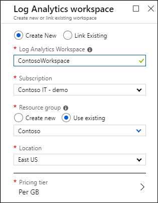

# Create a Log Analytics workspace in the Azure portal
Use the **Log Analytics workspaces** menu to create a Log Analytics workspace using the Azure portal. A Log Analytics workspace is a unique environment for Azure Monitor log data. Each workspace has its own data repository and configuration, and data sources and solutions are configured to store their data in a particular workspace. You require a Log Analytics workspace if you intend on collecting data from the following sources:

* Azure resources in your subscription
* On-premises computers monitored by System Center Operations Manager
* Device collections from System Center Configuration Manager 
* Diagnostics or log data from Azure storage

For other sources, such as Azure VMs and Windows or Linux VMs in your environment, see the following topics:

*  [Collect data from Azure virtual machines](../learn/quick-collect-azurevm.md) 
*  [Collect data from hybrid Linux computer](../learn/quick-collect-linux-computer.md)
*  [Collect data from hybrid Windows computer](quick-collect-windows-computer.md)

If you don't have an Azure subscription, create a [free account](https://azure.microsoft.com/free/?WT.mc_id=A261C142F) before you begin.

## Sign in to Azure portal
Sign in to the Azure portal at [https://portal.azure.com](https://portal.azure.com). 

## Create a workspace
1. In the Azure portal, click **All services**. In the list of resources, type **Log Analytics**. As you begin typing, the list filters based on your input. Select **Log Analytics workspaces**.

    
  
2. Click **Add**, and then select choices for the following items:

   * Provide a name for the new **Log Analytics workspace**, such as *DefaultLAWorkspace*. This name must be globally unique across all Azure Monitor subscriptions.
   * Select a **Subscription** to link to by selecting from the drop-down list if the default selected is not appropriate.
   * For **Resource Group**, choose to use an existing resource group already setup or create a new one.  
   * Select an available **Location**.  For more information, see which [regions Log Analytics is available in](https://azure.microsoft.com/regions/services/) and search for Azure Monitor from the **Search for a product** field.  
   * If you are creating a workspace in a new subscription created after April 2, 2018, it will automatically use the *Per GB* pricing plan and the option to select a pricing tier will not be available.  If you are creating a workspace for an existing subscription created before April 2, or to subscription that was tied to an existing Enterprise Agreement (EA) enrollment, select your preferred pricing tier.  For more information about the particular tiers, see [Log Analytics Pricing Details](https://azure.microsoft.com/pricing/details/log-analytics/).

          

3. After providing the required information on the **Log Analytics Workspace** pane, click **OK**.  

While the information is verified and the workspace is created, you can track its progress under **Notifications** from the menu. 

## Next steps
Now that you have a workspace available, you can configure collection of monitoring telemetry, run log searches to analyze that data, and add a management solution to provide additional data and analytic insights. 

* To enable data collection from Azure resources with Azure Diagnostics or Azure storage, see [Collect Azure service logs and metrics for use in Log Analytics](../platform/collect-azure-metrics-logs.md).  
* [Add System Center Operations Manager as a data source](../platform/om-agents.md) to collect data from agents reporting your Operations Manager management group and store it in your Log Analytics workspace. 
* Connect [Configuration Manager](../platform/collect-sccm.md) to import computers that are members of collections in the hierarchy.  
* Review the [monitoring solutions](../insights/solutions.md) available and how to add or remove a solution from your workspace.
