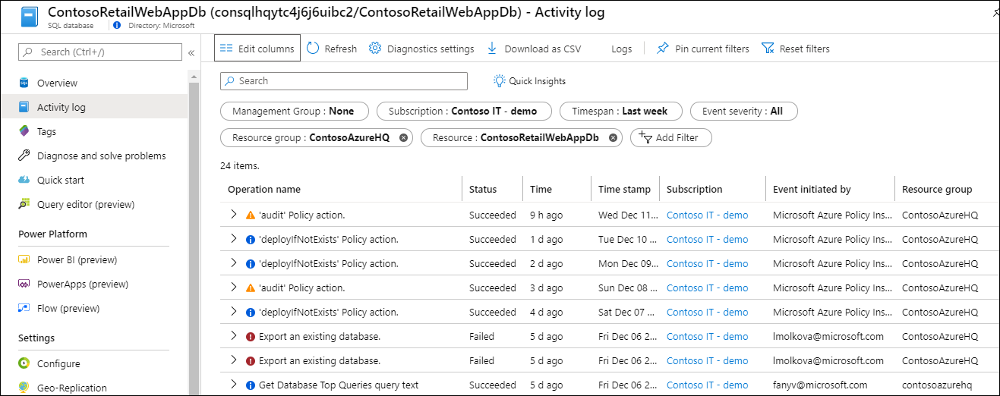

# Quickstart: Monitor an Azure resource with Azure Monitor
[Azure Monitor](../overview.md) starts collecting data from Azure resources the moment that they're created. This quickstart provides a brief walkthrough of the data that's automatically collected for a resource and how to view it in the Azure portal for a particular resource. Later, you can add configuration to collect additional data and can go to the Azure Monitor menu to use the same tools to access data collected for all the resources in your subscription.

For more detailed descriptions of monitoring data collected from Azure resources  see [Monitoring Azure resources with Azure Monitor](../insights/monitor-azure-resource.md).

## Sign in to Azure portal

Sign in to the Azure portal at [https://portal.azure.com](https://portal.azure.com). 

## Overview page
Many services will include monitoring data on their **Overview** page as a quick glance to their operation. This will typically be based on a subset of platform metrics stored in Azure Monitor Metrics.

1. Locate an Azure resource in your subscription.
2. Go to the **Overview** page and note if there's any performance data displayed. This data will be provided by Azure Monitor. The example below is the **Overview** page for an Azure storage account, and you can see that there are multiple metrics displayed.

    

3. You can click on any of the graphs to open the data in metrics explorer which is described below.

## View the Activity log
The Activity log provides insight into the operations on each Azure resource in the subscription. This will include such information as when a resource is created or modified, when a job is started, or when a particular operation occurs.

1. At the top of the menu for your resource, select **Activity log**.
2. The current filter is set to events related to your resource. If you don't see any events, try changing the **Timespan** to increase the time scope.

    

4. If you want to see events from other resources in your subscription, either change criteria in the filter or even remove filter properties.

    

## View metrics
Metrics are numerical values that describe some aspect of your resource at a particular time. Azure Monitor automatically collects platform metrics at one minute intervals from all Azure resources. You can view these metrics using metrics explorer.

1. Under the **Monitoring** section of your resource's menu, select **Metrics**. This opens metrics explorer with the scope set to your resource.
2. Click **Add metric** to add a metric to the chart.
   
   
   
4. Select a **Metric** from the dropdown list and then an **Aggregation**. This defines how the collected values will be sampled over each time interval.

    

5. Click **Add metric** to add additional metric and aggregation combinations to the chart.

    

## Next steps
In this quickstart, you viewed the Activity log and metrics for an Azure resource which are automatically collected by Azure Monitor. Resource logs provide insight into the detailed operation of the resource but must be configured in order to be collected. Continue to the tutorial for collecting resource logs into a Log Analytics workspace where they can be analyzed using log queries.

> [!div class="nextstepaction"]
> [Collect and analyze resource logs with Azure Monitor](tutorial-resource-logs.md)
