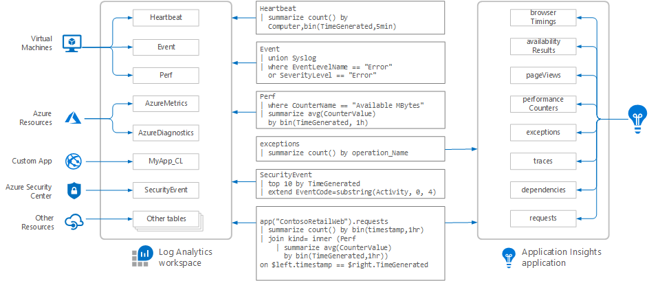
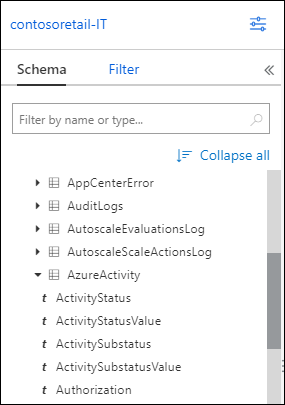
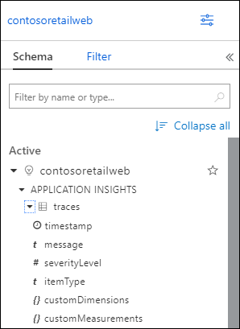

# Structure of Azure Monitor Logs
The ability to quickly gain insights into your data using a [log query](log-query-overview.md) is a powerful feature of Azure Monitor. To create efficient and useful queries, you should understand some basic concepts such as where the data you want is located and how it's structured. This article provides the basic concepts you need to get started.

## Overview
Data in Azure Monitor Logs is stored in either a Log Analytics workspace or an Application Insights application. Both are powered by [Azure Data Explorer](/azure/data-explorer/) meaning that they leverage its powerful data engine and query language.

> [!IMPORTANT]
> If you are using a [workspace-based Application Insights resource](../app/create-workspace-resource.md), telemetry is stored in a Log Analytics workspace with all other log data. The tables have been renamed and restructured but have the same information as the tables in the Application Insights application.

Data in both workspaces and applications is organized into tables, each of which stores different kinds of data and has its own unique set of properties. Most [data sources](../platform/data-sources.md) will write to their own tables in a Log Analytics workspace, while Application Insights will write to a predefined set of tables in an Application Insights application. Log queries are very flexible allowing you to easily combine data from multiple tables and even use a cross-resource query to combine data from tables in multiple workspaces or to write queries that combine workspace and application data.

The following image shows examples of data sources that write to different tables that are used in sample queries.



## Log Analytics workspace
All data collected by Azure Monitor Logs except for Application Insights is stored in a [Log Analytics workspace](../platform/manage-access.md). You can create one or more workspaces depending on your particular requirements. [Data Sources](../platform/data-sources.md) such as activity logs and resource logs from Azure resources, agents on virtual machines, and data from insights and monitoring solutions will write data to one or more workspaces that you configure as part of their onboarding. Other services such as [Azure Security Center](/azure/security-center/) and [Azure Sentinel](/azure/sentinel/) also use a Log Analytics workspace to store their data so it can be analyzed using log queries along with monitoring data from other sources.

Different kinds of data are stored in different tables in the workspace, and each table has a unique set of properties. A standard set of tables are added to a workspace when it's created, and new tables are added for different data sources, solutions, and services as they're onboarded. You can also create custom tables using the [Data Collector API](../platform/data-collector-api.md).

You can browse the tables in a workspace and their schema in the **Schema** tab in Log Analytics for the workspace.



Use the following query to list the tables in the workspace and the number of records collected into each over the previous day. 

```Kusto
union withsource = table * 
| where TimeGenerated > ago(1d)
| summarize count() by table
| sort by table asc
```
See documentation for each data source for details of the tables they create. Examples include articles for [agent data sources](../platform/agent-data-sources.md), [resource logs](../platform/diagnostic-logs-schema.md), and [monitoring solutions](../insights/solutions-inventory.md).

### Workspace permissions
See [Designing an Azure Monitor Logs deployment](../platform/design-logs-deployment.md) to understand the access control strategy and recommendations to provide access to data in a workspace. In addition to granting access to the workspace itself, you can limit access to individual tables using [Table Level RBAC](../platform/manage-access.md#table-level-rbac).

## Application Insights application

> [!IMPORTANT]
> If you are using a [workspace-based Application Insights resource](../app/create-workspace-resource.md) telemetry is stored in a Log Analytics workspace with all other log data. The tables have been renamed and restructured but have the same information as the tables in a classic Application Insights resource.

When you create an application in Application Insights, a corresponding application is automatically created in Azure Monitor Logs. No configuration is required to collect data, and the application will automatically write monitoring data such as page views, requests, and exceptions.

Unlike a Log Analytics workspace, an Application Insights application has a fixed set of tables. You can't configure other data sources to write to the application so no additional tables can be created. 

| Table | Description | 
|:---|:---|
| availabilityResults | Summary data from availability tests. |
| browserTimings      | Data about client performance, such as the time taken to process the incoming data. |
| customEvents        | Custom events created by your application. |
| customMetrics       | Custom metrics created by your application. |
| dependencies        | Calls from the application to other components (including external components) recorded via TrackDependency() – for example, calls to REST API, database or a file system. |
| exceptions          | Exceptions thrown by the application runtime, captures both server side and client-side (browsers) exceptions.|
| pageViews           | Data about each website view with browser information. |
| performanceCounters | Performance measurements from the compute resources supporting the application, for example, Windows performance counters. |
| requests            | Requests received by your application. For example, a separate request record is logged for each HTTP request that your web app receives.  |
| traces              | Detailed logs (traces) emitted through application code/logging frameworks recorded via TrackTrace(). |

You can view the schema for each table in the **Schema** tab in Log Analytics for the application.



## Standard properties
While each table in Azure Monitor Logs has its own schema, there are standard properties shared by all tables. See [Standard properties in Azure Monitor Logs](../platform/log-standard-properties.md) for details of each.

| Log Analytics workspace | Application Insights application | Description |
|:---|:---|:---|
| TimeGenerated | timestamp  | Date and time the record was created. |
| Type          | itemType   | Name of the table the record was retrieved from. |
| _ResourceId   |            | Unique identifier for the resource the record is associated with. |
| _IsBillable   |            | Specifies whether ingested data is billable. |
| _BilledSize   |            | Specifies the size in bytes of data that will be billed. |

## Next steps
- Learn about using [Log Analytics to create and edit log searches](../log-query/portals.md).
- Check out a [tutorial on writing queries](../log-query/get-started-queries.md) using the new query language.