# Use Azure Private Link to securely connect networks to Azure Monitor

[Azure Private Link](../../private-link/private-link-overview.md) allows you to securely link Azure PaaS services to your virtual network using private endpoints. For many services, you just set up an endpoint per resource. However, Azure Monitor is a constellation of different interconnected services that work together to monitor your workloads. As a result, we have built a resource called an Azure Monitor Private Link Scope (AMPLS). AMPLS allows you to define the boundaries of your monitoring network and connect to your virtual network. This article covers when to use and how to set up an Azure Monitor Private Link Scope.

## Advantages

With Private Link you can:

- Connect privately to Azure Monitor without opening up any public network access
- Ensure your monitoring data is only accessed through authorized private networks
- Prevent data exfiltration from your private networks by defining specific Azure Monitor resources that connect through your private endpoint
- Securely connect your private on-premises network to Azure Monitor using ExpressRoute and Private Link
- Keep all traffic inside the Microsoft Azure backbone network

For more information, see  [Key Benefits of Private Link](../../private-link/private-link-overview.md#key-benefits).

## How it works

Azure Monitor Private Link Scope (AMPLS) connects private endpoints (and the VNets they're contained in) to one or more Azure Monitor resources - Log Analytics workspaces and Application Insights components.

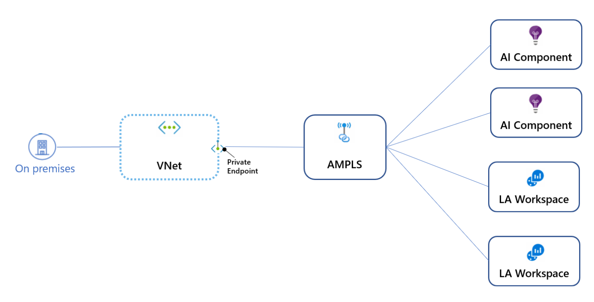

* The Private Endpoint on your VNet allows it to reach Azure Monitor endpoints through private IPs from your network's pool, instead of using to the public IPs of these endpoints. That allows you to keep using your Azure Monitor resources without opening your VNet to unrequired outbound traffic. 
* Traffic from the Private Endpoint to your Azure Monitor resources will go over the Microsoft Azure backbone, and not routed to public networks. 
* You can configure each of your workspaces or components to allow or deny ingestion and queries from public networks. That provides a resource-level protection, so that you can control traffic to specific resources.

> [!NOTE]
> A single Azure Monitor resource can belong to multiple AMPLSs, but you cannot connect a single VNet to more than one AMPLS. 

## Planning your Private Link setup

Before setting up your Azure Monitor Private Link setup, consider your network topology, and specifically your DNS routing topology. 

### The issue of DNS overrides
Some Azure Monitor services use global endpoints, meaning they serve requests targeting any workspace/component. A couple of examples are the Application Insights ingestion endpoint, and the query endpoint of both Application Insights and Log Analytics.

When you set up a Private Link connection, your DNS is updated to map Azure Monitor endpoints to private IP addresses from your VNet's IP range. This change overrides any previous mapping of these endpoints, which can have meaningful implications, reviewed below. 

### Azure Monitor Private Link applies to all Azure Monitor resources - it's All or Nothing
Since some Azure Monitor endpoints are global, it's impossible to create a Private Link connection for a specific component or workspace. Instead, when you set up a Private Link to a single Application Insights component or Log Analytics workspace, your DNS records are updated for **all** Application Insights components. Any attempt to ingest or query a component will go through the Private Link, and possibly fail. With regard to Log Analytics, ingestion and configuration endpoints are workspace-specific, meaning the Private-link setup will only apply for the specified workspaces. Ingestion and configuration of other workspaces will be directed to the default public Log Analytics endpoints.

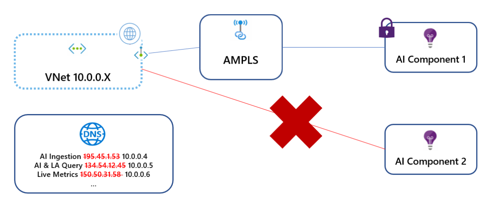

That's true not only for a specific VNet, but for all VNets that share the same DNS server (see [The issue of DNS overrides](#the-issue-of-dns-overrides)). So, for example, request to ingest logs to any Application Insights component will always be sent through the Private Link route. Components that aren't linked to the AMPLS will fail the Private Link validation and not go through.

> [!NOTE]
> To conclude: 
> Once your setup a Private Link connection to a single resource, it applies to Azure Monitor resources across your network. For Application Insights resources, that's 'All or Nothing'. That effectively means you should add all Application Insights resources in your network to your AMPLS, or none of them.
> 
> To handle data exfiltration risks, our recommendation is to add all Application Insights and Log Analytics resources to your AMPLS, and block your networks egress traffic as much as possible.

### Azure Monitor Private Link applies to your entire network
Some networks are composed of multiple VNets. If the VNets use the same DNS server, they will override each other's DNS mappings and possibly break each other's communication with Azure Monitor (see [The issue of DNS overrides](#the-issue-of-dns-overrides)). Ultimately, only the last VNet will be able to communicate with Azure Monitor, since the DNS will map Azure Monitor endpoints to private IPs from this VNets range (which may not be reachable from other VNets).


In the above diagram, VNet 10.0.1.x first connects to AMPLS1 and maps the Azure Monitor global endpoints to IPs from its range. Later, VNet 10.0.2.x connects to AMPLS2, and overrides the DNS mapping of the *same global endpoints* with IPs from its range. Since these VNets aren't peered, the first VNet now fails to reach these endpoints.

> [!NOTE]
> To conclude: 
> AMPLS setup affect all networks that share the same DNS zones. To avoid overriding each other's DNS endpoint mappings, it is best to setup a single Private Endpoint on a peered network (such as a Hub VNet), or separate the networks at the DNS level (foe example by using DNS forwarders or separate DNS servers entirely).

### Hub-spoke networks
Hub-spoke topologies can avoid the issue of DNS overrides by setting a Private Link on the hub (main) VNet, instead of setting up a Private Link for each VNet separately. This setup makes sense especially if the Azure Monitor resources used by the spoke VNets are shared. 

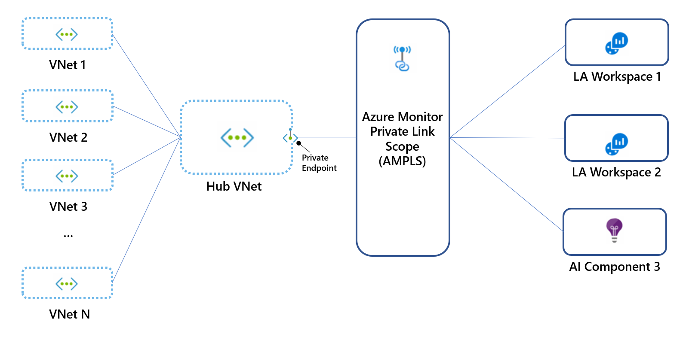

> [!NOTE]
> You may intentionally prefer to create separate Private Links for your spoke VNets, for example to allow each VNet to access a limited set of monitoring resources. In such cases, you can create a dedicated Private Endpoint and AMPLS for each VNet, but must also verify they don't share the same DNS zones in order to avoid DNS overrides.


### Consider limits

As listed in [Restrictions and limitations](#restrictions-and-limitations), the AMPLS object has a number of limits, shown in the below topology:
* Each VNet connects to only **1** AMPLS object.
* AMPLS B is connected to Private Endpoints of two VNets (VNet2 and VNet3), using 2 of the 10 possible Private Endpoint connections.
* AMPLS A connects to two workspaces and one Application Insight component, using 3 of the 50 possible Azure Monitor resources connections.
* Workspace2 connects to AMPLS A and AMPLS B, using 2 of the 5 possible AMPLS connections.

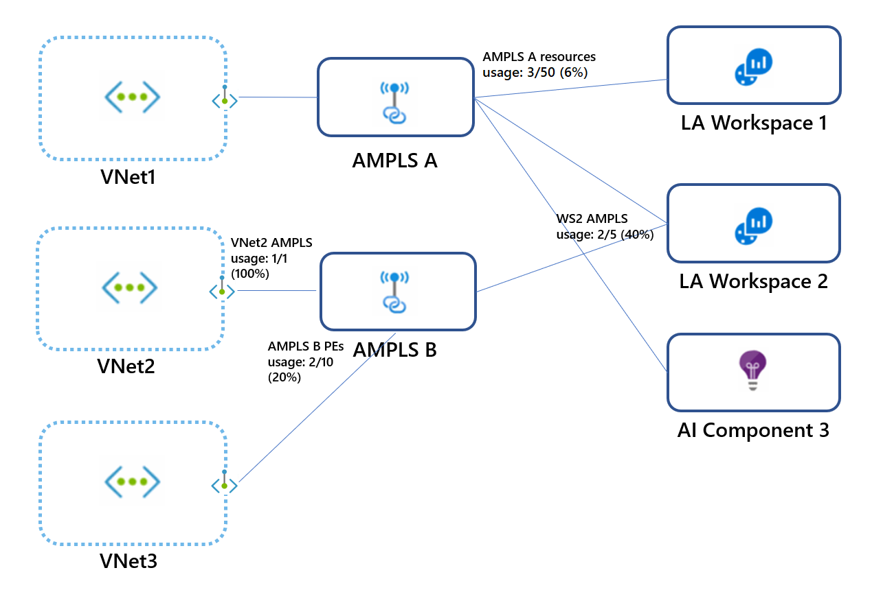


## Example connection

Start by creating an Azure Monitor Private Link Scope resource.

1. Go to **Create a resource** in the Azure portal and search for **Azure Monitor Private Link Scope**.

   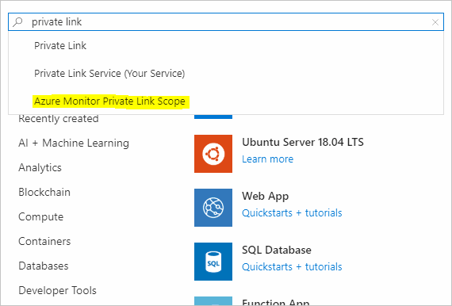

2. Select **create**.
3. Pick a Subscription and Resource Group.
4. Give the AMPLS a name. It's best to use a meaningful and clear name, such as "AppServerProdTelem".
5. Select **Review + Create**. 

   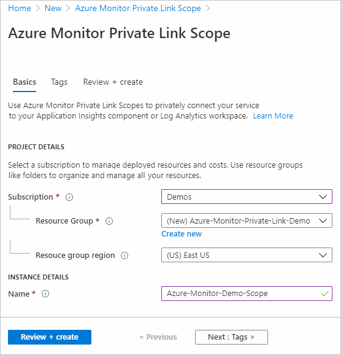

6. Let the validation pass, and then select **Create**.

### Connect Azure Monitor resources

Connect Azure Monitor resources (Log Analytics workspaces and Application Insights components) to your AMPLS.

1. In your Azure Monitor Private Link scope, select **Azure Monitor Resources** in the left-hand menu. Select the **Add** button.
2. Add the workspace or component. Selecting the **Add** button brings up a dialog where you can select Azure Monitor resources. You can browse through your subscriptions and resource groups, or you can type in their name to filter down to them. Select the workspace or component and select **Apply** to add them to your scope.

    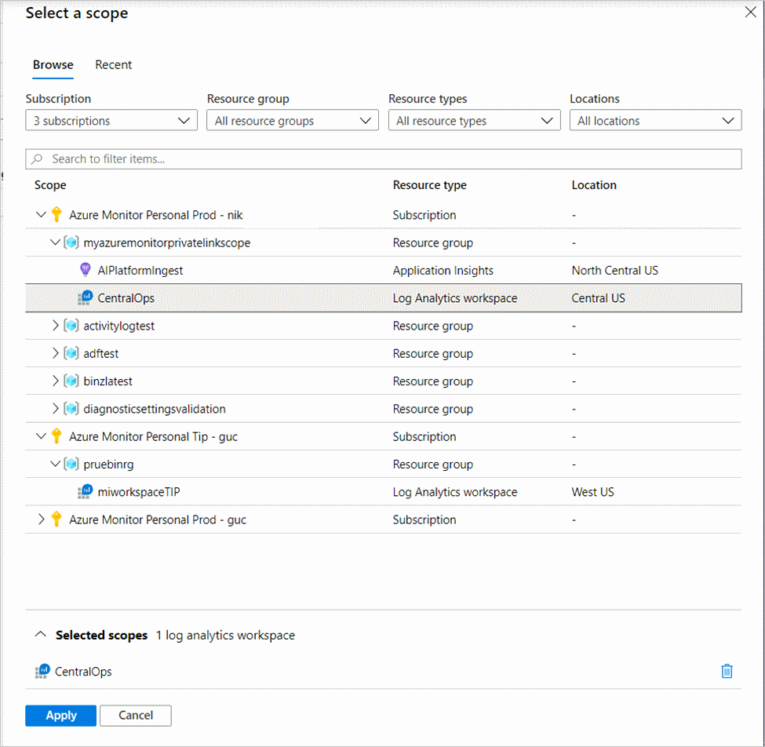

> [!NOTE]
> Deleting Azure Monitor resources requires that you first disconnect them from any AMPLS objects they are connected to. It's not possible to delete resources connected to an AMPLS.

### Connect to a private endpoint

Now that you have resources connected to your AMPLS, create a private endpoint to connect our network. You can do this task in the [Azure portal Private Link center](https://portal.azure.com/#blade/Microsoft_Azure_Network/PrivateLinkCenterBlade/privateendpoints), or inside your Azure Monitor Private Link Scope, as done in this example.

1. In your scope resource, select **Private Endpoint connections** in the left-hand resource menu. Select **Private Endpoint** to start the endpoint create process. You can also approve connections that were started in the Private Link center here by selecting them and selecting **Approve**.

    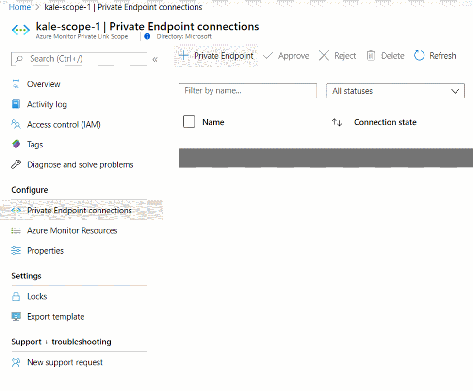

2. Pick the subscription, resource group, and name of the endpoint, and the region it should live in. The region needs to be the same region as the VNet you connect it to.

3. Select **Next: Resource**. 

4. In the Resource screen,

   a. Pick the **Subscription** that contains your Azure Monitor Private Scope resource. 

   b. For **resource type**, choose **Microsoft.insights/privateLinkScopes**. 

   c. From the **resource** drop-down, choose your Private Link scope you created earlier. 

   d. Select **Next: Configuration >**.
      

5. On the configuration pane,

   a.    Choose the **virtual network** and **subnet** that you want to connect to your Azure Monitor resources. 
 
   b.    Choose **Yes** for **Integrate with private DNS zone**, and let it automatically create a new Private DNS Zone. The actual DNS zones may be different from what is shown in the screenshot below. 
   > [!NOTE]
   > If you choose **No** and prefer to manage DNS records manually, first complete setting up your Private Link - including this Private Endpoint and the AMPLS configuration. Then, configure your DNS according to the instructions in [Azure Private Endpoint DNS configuration](../../private-link/private-endpoint-dns.md). Make sure not to create empty records as preparation for your Private Link setup. The DNS records you create can override existing settings and impact your connectivity with Azure Monitor.
 
   c.    Select **Review + create**.
 
   d.    Let validation pass. 
 
   e.    Select **Create**. 

    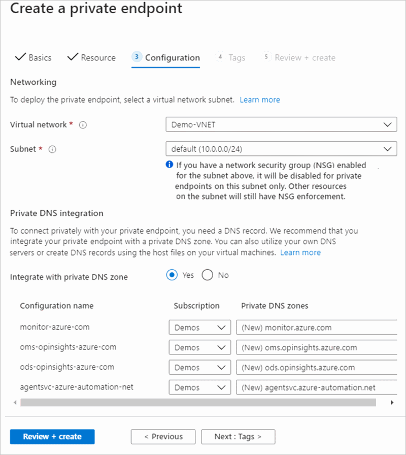

You've now created a new private endpoint that is connected to this AMPLS.

## Review and validate your Private Link setup

### Reviewing your Endpoint's DNS settings
The Private Endpoint you created should now have an four DNS zones configured:

[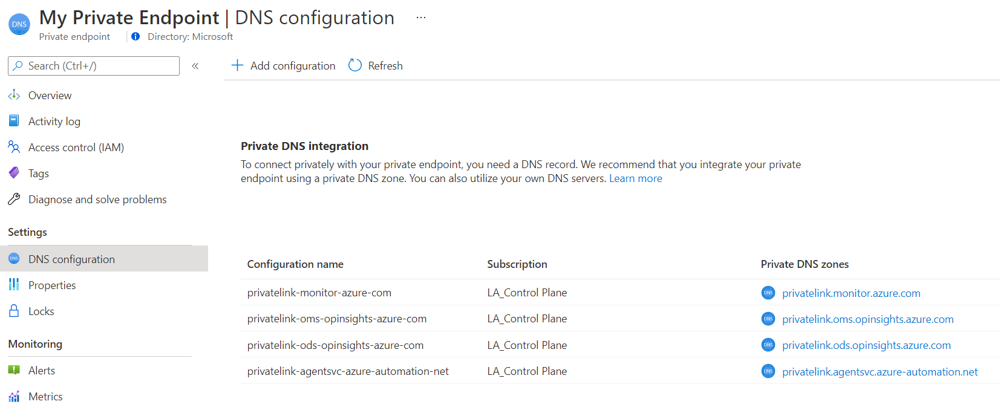](./media/private-link-security/private-endpoint-dns-zones-expanded.png#lightbox)

* privatelink-monitor-azure-com
* privatelink-oms-opinsights-azure-com
* privatelink-ods-opinsights-azure-com
* privatelink-agentsvc-azure-automation-net

> [!NOTE]
> Each of these zones maps specific Azure Monitor endpoints to private IPs from the VNet's pool of IPs. The IP addresses showns in the below images are only examples. Your configuration should instead show private IPs from your own network.

#### Privatelink-monitor-azure-com
This zone covers the global endpoints used by Azure Monitor, meaning these endpoints serve requests considering all resources, not a specific one. This zone should have endpoints mapped for:
* `in.ai` - (Application Insights ingestion endpoint, you will see a global and a regional entry
* `api` - Application Insights and Log Analytics API endpoint
* `live` - Application Insights live metrics endpoint
* `profiler` - Application Insights profiler endpoint
* `snapshot` - Application Insights snapshots endpoint
[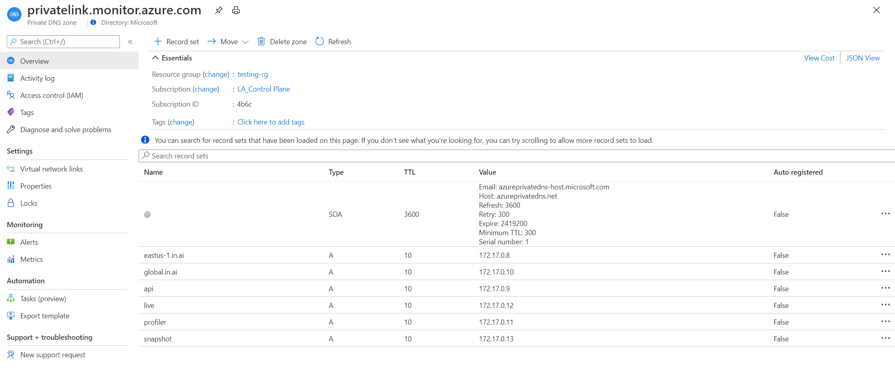](./media/private-link-security/dns-zone-privatelink-monitor-azure-com-expanded.png#lightbox)

#### privatelink-oms-opinsights-azure-com
This zone covers workspace-specific mapping to OMS endpoints. You should see an entry for each workspace linked to the AMPLS connected with this Private Endpoint.
[](./media/private-link-security/dns-zone-privatelink-oms-opinsights-azure-com-expanded.png#lightbox)

#### privatelink-ods-opinsights-azure-com
This zone covers workspace-specific mapping to ODS endpoints - the ingestion endpoint of Log Analytics. You should see an entry for each workspace linked to the AMPLS connected with this Private Endpoint.
[](./media/private-link-security/dns-zone-privatelink-ods-opinsights-azure-com-expanded.png#lightbox)

#### privatelink-agentsvc-azure-automation-net
This zone covers workspace-specific mapping to the agent service automation endpoints. You should see an entry for each workspace linked to the AMPLS connected with this Private Endpoint.
[](./media/private-link-security/dns-zone-privatelink-agentsvc-azure-automation-net-expanded.png#lightbox)

### Validating you are communicating over a Private Link
* To validate your requests are now sent through the Private Endpoint and to the private IP-mapped endpoints, you can review them with a network tracking to tools, or even your browser. For example, when attempting to query your workspace or application, make sure the request is sent to the private IP mapped to the API endpoint, in this example it's *172.17.0.9*.

    Note: Some browsers may use other DNS settings (see [Browser DNS settings](#browser-dns-settings)). Make sure your DNS settings apply.

* To make sure your workspace or component aren't receiving requests from public networks (not connected through AMPLS), set the resource's public ingestion and query flags to *No* as explained in [Manage access from outside of private links scopes](#manage-access-from-outside-of-private-links-scopes).

* From a client on your protected network, use `nslookup` to any of the endpoints listed in your DNS zones. It should be resolved by your DNS server to the mapped private IPs instead of the public IPs used by default.


## Configure Log Analytics

Go to the Azure portal. In your Log Analytics workspace resource menu, there's an item called **Network Isolation** on the left-hand side. You can control two different states from this menu.


### Connected Azure Monitor Private Link scopes
All scopes connected to the workspace show up in this screen. Connecting to scopes (AMPLSs) allows network traffic from the virtual network connected to each AMPLS to reach this workspace. Creating a connection through here has the same effect as setting it up on the scope, as we did in [Connecting Azure Monitor resources](#connect-azure-monitor-resources). To add a new connection, select **Add** and select the Azure Monitor Private Link Scope. Select **Apply** to connect it. Note that a workspace can connect to 5 AMPLS objects, as mentioned in [Restrictions and limitations](#restrictions-and-limitations). 

### Manage access from outside of private links scopes
The settings on the bottom part of this page control access from public networks, meaning networks not connected through the scopes listed above. Setting **Allow public network access for ingestion** to **No** blocks ingestion of logs from machines outside of the connected scopes. Setting **Allow public network access for queries** to **No** blocks queries coming from machines outside of the scopes. That includes queries run via workbooks, dashboards, API-based client experiences, insights in the Azure portal, and more. Experiences running outside the Azure portal, and that query Log Analytics data also have to be running within the private-linked VNET.

### Exceptions
Restricting access as explained above doesn't apply to the Azure Resource Manager and therefore has the following limitations:
* Access to data - while blocking/allowing queries from public networks applies to most Log Analytics experiences, some experiences query data through Azure Resource Manager and therefore won't be able to query data unless Private Link settings are applied to the Resource Manager as well (feature coming up soon). Examples are Azure Monitor solutions, Workbooks and Insights, and the LogicApp connector.
* Workspace management - Workspace setting and configuration changes (including turning these access settings on or off) are managed by Azure Resource Manager. Restrict access to workspace management using the appropriate roles, permissions, network controls, and auditing. For more information, see [Azure Monitor Roles, Permissions, and Security](../roles-permissions-security.md).

> [!NOTE]
> Logs and metrics uploaded to a workspace via [Diagnostic Settings](../essentials/diagnostic-settings.md) go over a secure private Microsoft channel, and are not controlled by these settings.

### Log Analytics solution packs download

To allow the Log Analytics Agent to download solution packs, add the appropriate fully qualified domain names to your firewall allow list. 


| Cloud environment | Agent Resource | Ports | Direction |
|:--|:--|:--|:--|
|Azure Public     | scadvisorcontent.blob.core.windows.net         | 443 | Outbound
|Azure Government | usbn1oicore.blob.core.usgovcloudapi.net | 443 |  Outbound
|Azure China 21Vianet      | mceast2oicore.blob.core.chinacloudapi.cn| 443 | Outbound

## Configure Application Insights

Go to the Azure portal. In your Azure Monitor Application Insights component resource, is a menu item **Network Isolation** on the left-hand side. You can control two different states from this menu.

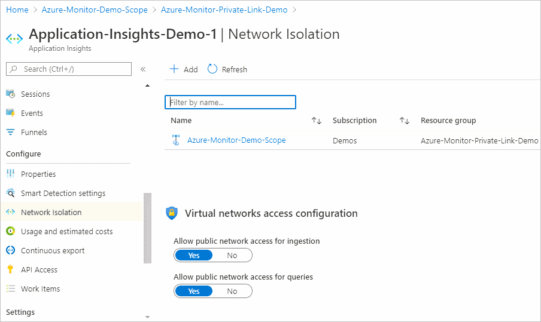

First, you can connect this Application Insights resource to Azure Monitor Private Link scopes that you have access to. Select **Add** and select the **Azure Monitor Private Link Scope**. Select Apply to connect it. All connected scopes show up in this screen. Making this connection allows network traffic in the connected virtual networks to reach this component, and has the same effect as connecting it from the scope as we did in [Connecting Azure Monitor resources](#connect-azure-monitor-resources). 

Second, you can control how this resource can be reached from outside of the private link scopes (AMPLS) listed previously. If you set **Allow public network access for ingestion** to **No**, then machines or SDKs outside of the connected scopes can't upload data to this component. If you set **Allow public network access for queries** to **No**, then machines outside of the scopes can't access data in this Application Insights resource. That data includes access to APM logs, metrics, and the live metrics stream, as well as experiences built on top such as workbooks, dashboards, query API-based client experiences, insights in the Azure portal, and more. 

> [!NOTE]
> Non-portal consumption experiences must also run on the private-linked VNET that includes the monitored workloads.

You’ll need to add resources hosting the monitored workloads to the private link. For example, see [Using Private Endpoints for Azure Web App](../../app-service/networking/private-endpoint.md).

Restricting access in this manner only applies to data in the Application Insights resource. However, configuration changes, including turning these access settings on or off, are managed by Azure Resource Manager. So, you should restrict access to Resource Manager using the appropriate roles, permissions, network controls, and auditing. For more information, see [Azure Monitor Roles, Permissions, and Security](../roles-permissions-security.md).

> [!NOTE]
> To fully secure workspace-based Application Insights, you need to lock down both access to Application Insights resource as well as the underlying Log Analytics workspace.
>
> Code-level diagnostics (profiler/debugger) need you to [provide your own storage account](../app/profiler-bring-your-own-storage.md) to support private link.

### Handling the All-or-Nothing nature of Private Links
As explained in [Planning your Private Link setup](#planning-your-private-link-setup), setting up a Private Link even for a single resource affects all Azure Monitor resources in that networks, and in other networks that share the same DNS. This behavior can make your onboarding process challenging. Consider the following options:

* All in - the simplest and most secure approach is to add all of your Application Insights components to the AMPLS. For components that you wish to still access from other networks as well, leave the “Allow public internet access for ingestion/query” flags set to Yes (the default).
* Isolate networks - if you are (or can align with) using spoke vnets, follow the guidance in [Hub-spoke network topology in Azure](/azure/architecture/reference-architectures/hybrid-networking/hub-spoke). Then, setup separate private link settings in the relevant spoke VNets. Make sure to separate DNS zones as well, since sharing DNS zones with other spoke networks will cause [DNS overrides](#the-issue-of-dns-overrides).
* Use custom DNS zones for specific apps - this solution allows you to access select Application Insights components over a Private Link, while keeping all other traffic over the public routes.
    - Set up a [custom private DNS zone](../../private-link/private-endpoint-dns.md), and give it a unique name, such as internal.monitor.azure.com
    - Create an AMPLS and a Private Endpoint, and choose **not** to auto-integrate with private DNS
    - Go to Private Endpoint -> DNS Configuration and review the suggested mapping of FQDNs.
    - Choose to Add Configuration and pick the internal.monitor.azure.com zone you just created
    - Add records for the above
    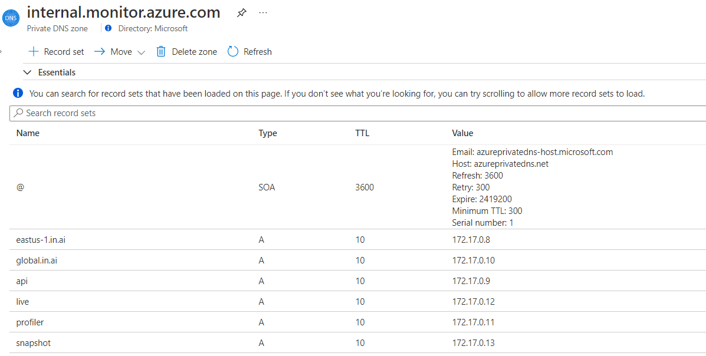
    - Go to your Application Insights component and copy its [Connection String](../app/sdk-connection-string.md).
    - Apps or scripts that wish to call this component over a Private Link should use the connection string with the EndpointSuffix=internal.monitor.azure.com
* Map endpoints through hosts files instead of DNS - to have a Private Link access only from a specific machine/VM in your network:
    - Set up an AMPLS and a Private Endpoint, and choose **not** to auto-integrate with private DNS 
    - Configure the above A records on a machine that runs the app in the hosts file


## Use APIs and command line

You can automate the process described earlier using Azure Resource Manager templates, REST, and command-line interfaces.

To create and manage private link scopes, use the [REST API](/rest/api/monitor/private%20link%20scopes%20(preview)) or [Azure CLI (az monitor private-link-scope)](/cli/azure/monitor/private-link-scope).

To manage network access, use the flags `[--ingestion-access {Disabled, Enabled}]` and `[--query-access {Disabled, Enabled}]`on [Log Analytics workspaces](/cli/azure/monitor/log-analytics/workspace) or [Application Insights components](/cli/azure/ext/application-insights/monitor/app-insights/component).

## Collect custom logs and IIS log over Private Link

Storage accounts are used in the ingestion process of custom logs. By default, service-managed storage accounts are used. However to ingest custom logs on private links, you must use your own storage accounts and associate them with Log Analytics workspace(s). See more details on how to set up such accounts using the [command line](/cli/azure/monitor/log-analytics/workspace/linked-storage).

For more information on bringing your own storage account, see [Customer-owned storage accounts for log ingestion](private-storage.md)

## Restrictions and limitations

### AMPLS
The AMPLS object has a number of limits you should consider when planning your Private Link setup:

* A VNet can only connect to 1 AMPLS object. That means the AMPLS object must provide access to all the Azure Monitor resources the VNet should have access to.
* An Azure Monitor resource (Workspace or Application Insights component) can connect to 5 AMPLSs at most.
* An AMPLS object can connect to 50 Azure Monitor resources at most.
* An AMPLS object can connect to 10 Private Endpoints at most.

See [Consider limits](#consider-limits) for a deeper review of these limits.

### Agents

The latest versions of the Windows and Linux agents must be used to support secure ingestion to Log Analytics workspaces. Older versions can't upload monitoring data over a private network.

**Log Analytics Windows agent**

Use the Log Analytics agent version 10.20.18038.0 or later.

**Log Analytics Linux agent**

Use agent version 1.12.25 or later. If you can't, run the following commands on your VM.

```cmd
$ sudo /opt/microsoft/omsagent/bin/omsadmin.sh -X
$ sudo /opt/microsoft/omsagent/bin/omsadmin.sh -w <workspace id> -s <workspace key>
```

### Azure portal

To use Azure Monitor portal experiences such as Application Insights and Log Analytics, you need to allow the Azure portal and Azure Monitor extensions to be accessible on the private networks. Add **AzureActiveDirectory**, **AzureResourceManager**, **AzureFrontDoor.FirstParty**, and **AzureFrontdoor.Frontend** [service tags](../../firewall/service-tags.md) to your Network Security Group.

### Querying data
The [`externaldata` operator](/azure/data-explorer/kusto/query/externaldata-operator?pivots=azuremonitor) isn't supported over a Private Link, as it reads data from storage accounts but doesn't guarantee the storage is accessed privately.

### Programmatic access

To use the REST API, [CLI](/cli/azure/monitor) or PowerShell with Azure Monitor on private networks, add the [service tags](../../virtual-network/service-tags-overview.md)  **AzureActiveDirectory** and **AzureResourceManager** to your firewall.

### Application Insights SDK downloads from a content delivery network

Bundle the JavaScript code in your script so that the browser doesn't attempt to download code from a CDN. An example is provided on [GitHub](https://github.com/microsoft/ApplicationInsights-JS#npm-setup-ignore-if-using-snippet-setup)

### Browser DNS settings

If you're connecting to your Azure Monitor resources over a Private Link, traffic to these resources must go through the private endpoint that is configured on your network. To enable the private endpoint, update your DNS settings as explained in [Connect to a private endpoint](#connect-to-a-private-endpoint). Some browsers use their own DNS settings instead of the ones you set. The browser might attempt to connect to Azure Monitor public endpoints and bypass the Private Link entirely. Verify that your browsers settings don't override or cache old DNS settings. 

## Next steps

- Learn about [private storage](private-storage.md)