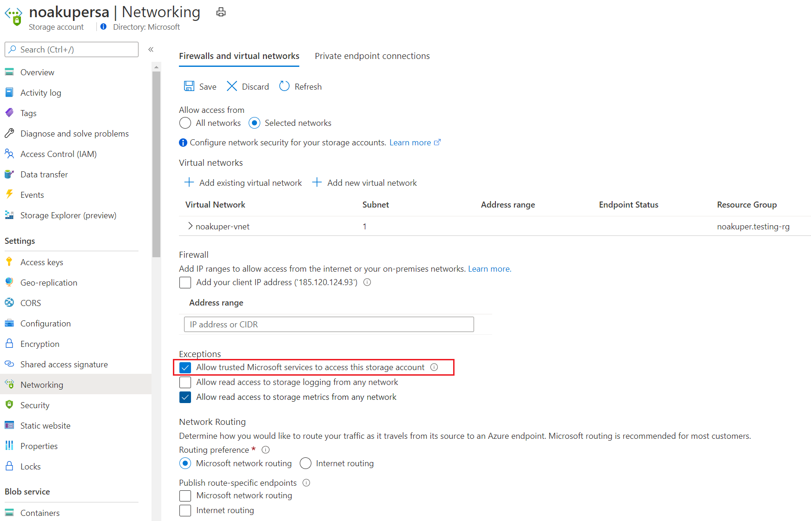
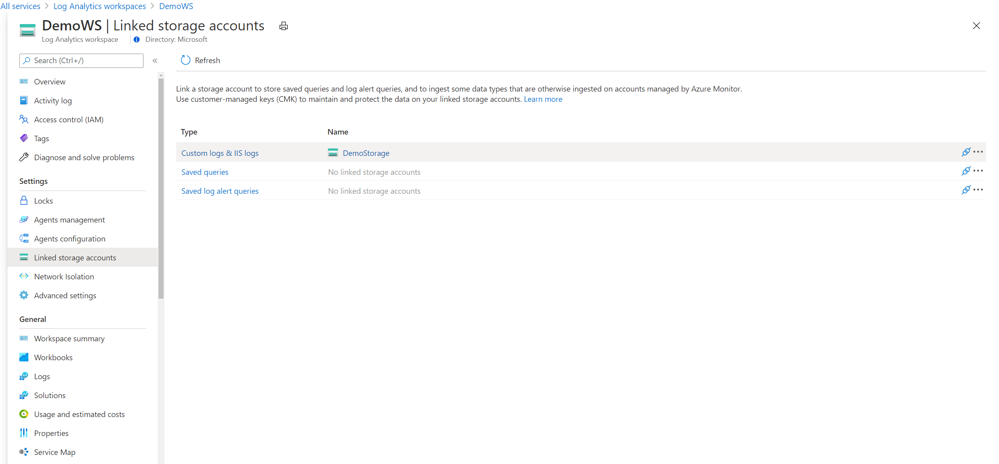
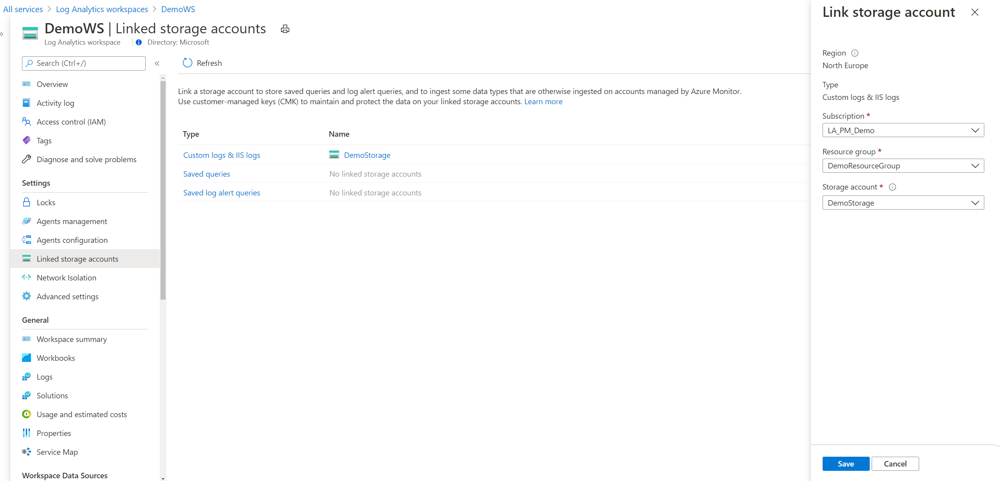

# Using customer-managed storage accounts in Azure Monitor Log Analytics

Log Analytics relies on Azure Storage in various scenarios. This use is typically managed automatically. However, some cases require you to provide and manage your own storage account, also referred to as a customer-managed storage account. This document covers the use of customer-managed storage for WAD/LAD logs, Private Link, and customer-managed key (CMK) encryption. 

> [!NOTE]
> We recommend that you don’t take a dependency on the contents Log Analytics uploads to customer-managed storage, given that formatting and content may change.

## Ingesting Azure Diagnostics extension logs (WAD/LAD)
The Azure Diagnostics extension agents (also called WAD and LAD for Windows and Linux agents respectively) collect various operating system logs and store them on a customer-managed storage account. You can then ingest these logs into Log Analytics to review and analyze them.
### How to collect Azure Diagnostics extension logs from your storage account
Connect the storage account to your Log Analytics workspace as a storage data source using [the Azure portal](../agents/diagnostics-extension-logs.md#collect-logs-from-azure-storage) or by calling the [Storage Insights API](/rest/api/loganalytics/storage%20insights/createorupdate).

Supported data types:
* Syslog
* Windows events
* Service Fabric
* ETW Events
* IIS Logs

## Using Private links
Customer-managed storage accounts are used to ingest Custom logs or IIS logs when private links are used to connect to Azure Monitor resources. The ingestion process of these data types first uploads logs to an intermediary Azure Storage account, and only then ingests them to a workspace. 

### Using a customer-managed storage account over a Private Link
#### Workspace requirements
When connecting to Azure Monitor over a private link, Log Analytics agents are only able to send logs to workspaces accessible over a private link. This requirement means you should:
* Configure an Azure Monitor Private Link Scope (AMPLS) object
* Connect it to your workspaces
* Connect the AMPLS to your network over a private link. 

For more information on the AMPLS configuration procedure, see [Use Azure Private Link to securely connect networks to Azure Monitor](./private-link-security.md). 

#### Storage account requirements
For the storage account to successfully connect to your private link, it must:
* Be located on your VNet or a peered network, and connected to your VNet over a private link.
* Be located on the same region as the workspace it’s linked to.
* Allow Azure Monitor to access the storage account. If you chose to allow only select networks to access your storage account, you should select the exception: “Allow trusted Microsoft services to access this storage account”.

* If your workspace handles traffic from other networks as well, you should configure the storage account to allow incoming traffic coming from the relevant networks/internet.
* Coordinate TLS version between the agents and the storage account - It's recommended that you send data to Log Analytics using TLS 1.2 or higher. Review [platform-specific guidance](./data-security.md#sending-data-securely-using-tls-12), and if required [configure your agents to use TLS 1.2](../agents/agent-windows.md#configure-agent-to-use-tls-12). If for some reason that's not possible, configure the storage account to accept TLS 1.0.

### Using a customer-managed storage account for CMK data encryption
Azure Storage encrypts all data at rest in a storage account. By default, it uses Microsoft-managed keys (MMK) to encrypt the data; However, Azure Storage also allows you to use CMK from Azure Key vault to encrypt your storage data. You can either import your own keys into Azure Key Vault, or you can use the Azure Key Vault APIs to generate keys.
#### CMK scenarios that require a customer-managed storage account
* Encrypting log-alert queries with CMK
* Encrypting saved queries with CMK

#### How to apply CMK to customer-managed storage accounts
##### Storage account requirements
The storage account and the key vault must be in the same region, but they can be in different subscriptions. For more information about Azure Storage encryption and key management, see [Azure Storage encryption for data at rest](../../storage/common/storage-service-encryption.md).

##### Apply CMK to your storage accounts
To configure your Azure Storage account to use CMK with Azure Key Vault, use the [Azure portal](../../storage/common/customer-managed-keys-configure-key-vault.md?toc=%252fazure%252fstorage%252fblobs%252ftoc.json), [PowerShell](../../storage/common/customer-managed-keys-configure-key-vault.md?toc=%252fazure%252fstorage%252fblobs%252ftoc.json), or the [CLI](../../storage/common/customer-managed-keys-configure-key-vault.md?toc=%252fazure%252fstorage%252fblobs%252ftoc.json). 

## Link storage accounts to your Log Analytics workspace
### Using the Azure portal
On the Azure portal, open your Workspace' menu and select *Linked storage accounts*. A blade will open, showing the linked storage accounts by the use cases mentioned above (Ingestion over Private Link, applying CMK to saved queries or to alerts).

Selecting an item on the table will open its storage account details, where you can set or update the linked storage account for this type. 

You can use the same account for different use cases if you prefer.

### Using the Azure CLI or REST API
You can also link a storage account to your workspace via the [Azure CLI](/cli/azure/monitor/log-analytics/workspace/linked-storage) or [REST API](/rest/api/loganalytics/linkedstorageaccounts).

The applicable dataSourceType values are:
* CustomLogs – to use the storage account for custom logs and IIS logs ingestion
* Query - to use the storage account to store saved queries (required for CMK encryption)
* Alerts - to use the storage account to store log-based alerts (required for CMK encryption)

## Managing linked storage accounts

### Create or modify a link
When you link a storage account to a workspace, Log Analytics will start using it instead of the storage account owned by the service. You can 
* Register multiple storage accounts to spread the load of logs between them
* Reuse the same storage account for multiple workspaces

### Unlink a storage account
To stop using a storage account, unlink the storage from the workspace. 
Unlinking all storage accounts from a workspace means Log Analytics will attempt to rely on service-managed storage accounts. If your network has limited access to the internet, these storages may not be available and any scenario that relies on storage will fail.

### Replace a storage account
To replace a storage account used for ingestion,
1.	**Create a link to a new storage account.** The logging agents will get the updated configuration and start sending data to the new storage as well. The process could take a few minutes.
2.	**Then unlink the old storage account so agents will stop writing to the removed account.** The ingestion process keeps reading data from this account until it’s all ingested. Don’t delete the storage account until you see all logs were ingested.

### Maintaining storage accounts
#### Manage log retention
When using your own storage account, retention is up to you. Log Analytics won't delete logs stored on your private storage. Instead, you should set up a policy to handle the load according to your preferences.

#### Consider load
Storage accounts can handle a certain load of read and write requests before they start throttling requests (For more information, see [Scalability and performance targets for Blob storage](../../storage/common/scalability-targets-standard-account.md)). Throttling affects the time it takes to ingest logs. If your storage account is overloaded, register an additional storage account to spread the load between them. To monitor your storage account’s capacity and performance review its [Insights in the Azure portal]( https://docs.microsoft.com/azure/azure-monitor/insights/storage-insights-overview).

### Related charges
Storage accounts are charged by the volume of stored data, the type of the storage, and the type of redundancy. For details see [Block blob pricing](https://azure.microsoft.com/pricing/details/storage/blobs) and [Table Storage pricing](https://azure.microsoft.com/pricing/details/storage/tables).

## Next steps

- Learn about [using Azure Private Link to securely connect networks to Azure Monitor](private-link-security.md)
- Learn about [Azure Monitor customer-managed keys](../logs/customer-managed-keys.md)