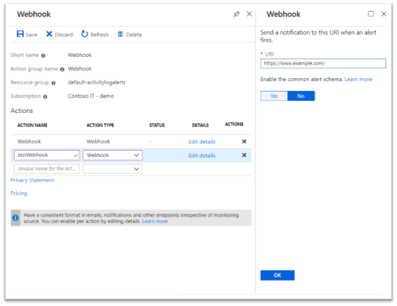

# Common alert schema

This article describes what the common alert schema is, the benefits of using it and how to enable it.

## What is the common alert schema?

The common alert schema standardizes the consumption experience for alert notifications in Azure today. Historically, the three alert types in Azure today (metric, log, and activity log) have had their own email templates, webhook schemas, etc. With the common alert schema, you can now receive alert notifications with a consistent schema.

Any alert instance describes **the resource that was affected** and **the cause of the alert**, and these instances are described in the common schema in the following sections:
* **Essentials**: A set of **standardized fields**, common across all alert types, which describe **what resource** the alert is on along with additional common alert metadata (for example, severity or description). 
* **Alert Context**: A set of fields which describe the **cause of the alert**, with fields that vary **based on the alert type**. For example, a metric alert would have fields like the metric name and metric value in the alert context, whereas an activity log alert would have information about the event that generated the alert. 

The typical integration scenarios we hear from customers involve the routing of the alert instance to the concerned team based on some pivot (for example, resource group), after which the responsible team starts working on it. With the common alert schema, you can have standardized routing logic across alert types by leveraging the essential fields, leaving the context fields as is for the concerned teams to investigate further.

This means that you can potentially have fewer integrations, making the process of managing and maintaining them a _much_ simpler task. Additionally, future alert payload enrichments (for example, customization, diagnostic enrichment, etc.) will only surface up in the common schema.

## What enhancements does the common alert schema bring?

The common alert schema will primarily manifest itself in your alert notifications. The enhancements that you will see are listed below:

| Action | Enhancements|
|:---|:---|
| SMS | A consistent SMS template for all alert types. |
| Email | A consistent and detailed email template, allowing you to easily diagnose issues at a glance. Embedded deep-links to the alert instance on the portal and the affected resource ensure that you can quickly jump into the remediation process. |
| Webhook/Logic App/Azure Function/Automation Runbook | A consistent JSON structure for all alert types, which allows you to easily build integrations across the different alert types. |

The new schema will also enable a richer alert consumption experience across both the Azure portal and the Azure mobile app in the immediate future. 

[Learn more about the schema definitions for Webhooks/Logic Apps/Azure Functions/Automation Runbooks.](https://aka.ms/commonAlertSchemaDefinitions)

> [!NOTE]
> The following actions do not support the common alert schema: ITSM Connector.

## How do I enable the common alert schema?

You can opt in or opt out to the common alert schema through Action Groups, on both the portal and through the REST API. The toggle to switch to the new schema exists at an action level. For example, you have to separately opt in for an email action and a webhook action.

> [!NOTE]
> 1. The following alert types support the common schema by default (no opt in required):
>     * Smart detection alerts
> 1. The following alert types currently do not support the common schema:
>     * Alerts generated by [Azure Monitor for VMs](../insights/vminsights-overview.md)
>     * Alerts generated by [Azure Cost Management](../../cost-management-billing/manage/cost-management-budget-scenario.md)

### Through the Azure portal



1. Open any existing or a new action in an action group. 
1. Select ‘Yes’ for the toggle to enable the common alert schema as shown.

### Through the Action Groups REST API

You can also use the [Action Groups API](/rest/api/monitor/actiongroups) to opt in to the common alert schema. While making the [create or update](/rest/api/monitor/actiongroups/createorupdate) REST API call, you can set the flag "useCommonAlertSchema" to 'true' (to opt in) or 'false' (to opt out) for any of the following actions - email/webhook/logic app/Azure Function/automation runbook.

For example, the following request body made to the [create or update](/rest/api/monitor/actiongroups/createorupdate) REST API will do the following:

* Enable the common alert schema for the email action "John Doe's email"
* Disable the common alert schema for the email action "Jane Smith's email"
* Enable the common alert schema for the webhook action "Sample webhook"

```json
{
  "properties": {
    "groupShortName": "sample",
    "enabled": true,
    "emailReceivers": [
      {
        "name": "John Doe's email",
        "emailAddress": "johndoe@email.com",
        "useCommonAlertSchema": true
      },
      {
        "name": "Jane Smith's email",
        "emailAddress": "janesmith@email.com",
        "useCommonAlertSchema": false
      }
    ],
    "smsReceivers": [
      {
        "name": "John Doe's mobile",
        "countryCode": "1",
        "phoneNumber": "1234567890"
      },
      {
        "name": "Jane Smith's mobile",
        "countryCode": "1",
        "phoneNumber": "0987654321"
      }
    ],
    "webhookReceivers": [
      {
        "name": "Sample webhook",
        "serviceUri": "http://www.example.com/webhook",
        "useCommonAlertSchema": true
      }
    ]
  },
  "location": "Global",
  "tags": {}
}
```


## Next steps

- [Common alert schema definitions for Webhooks/Logic Apps/Azure Functions/Automation Runbooks.](https://aka.ms/commonAlertSchemaDefinitions)
- [Learn how to create a logic app that leverages the common alert schema to handle all your alerts.](./alerts-common-schema-integrations.md) 
