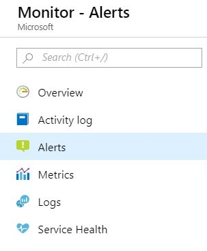
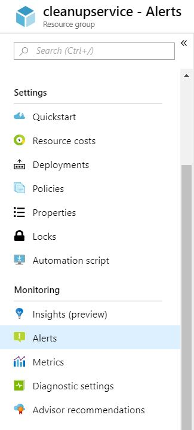
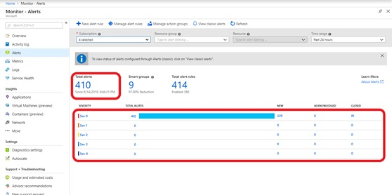
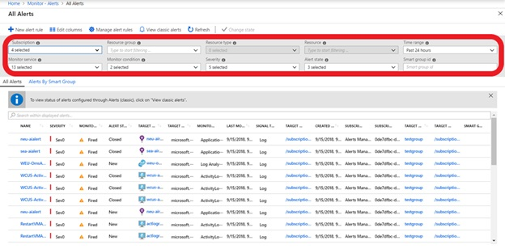
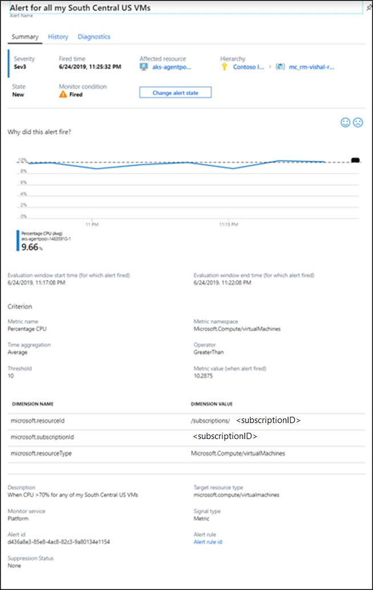

# Manage alert instances with unified alerts
With the [unified alerts experience](https://aka.ms/azure-alerts-overview) in Azure Monitor, you can see all your different types of alerts across Azure. This spans multiple subscriptions, in a single pane. This article shows how you can view your alert instances, and how to find specific alert instances for troubleshooting.

> [!NOTE]
   >  You can only access alerts generated in the last 30 days.

## Go to the alerts page

You can go to the alerts page in any of the following ways:

   + In the [Azure portal](https://portal.azure.com/), select **Monitor** > **Alerts**.  
     
  
   + Use the context of a specific resource. Open a resource, go to the **Monitoring** section, and choose **Alerts**. The landing page is pre-filtered for alerts on that specific resource.
   
     
    
   + Use the context of a specific resource group. Open a resource group, go to the **Monitoring** section, and choose **Alerts**. The landing page is pre-filtered for alerts on that specific resource group.    
   
     

## Find alert instances

The **Alerts Summary** page gives you an overview of all your alert instances across Azure. You can modify the summary view by selecting **multiple subscriptions** (up to a maximum of 5), or by filtering across **resource groups**, specific **resources**, or **time ranges**. Select **Total Alerts**, or any of the severity bands, to go to the list view for your alerts.     
   
 
On the **All Alerts** page, all the alert instances across Azure are listed. If you’re coming to the portal from an alert notification, you can use the filters available to narrow in on that specific alert instance.

> [!NOTE]
>  If you came to the page by selecting any of the severity bands, the list is pre-filtered for that severity.

Apart from the filters available on the previous page, you can also filter on the basis of monitor service (for example, platform for metrics), monitor condition (fired or resolved), severity, alert state (new/acknowledged/closed), or the smart group ID.

   

   > [!NOTE]
   >  If you came to the page by selecting any of the severity bands, the list is pre-filtered for that severity.
 
Selecting any alert instance opens the **Alert Details** page, allowing you to see more details about that specific alert instance.   
     

