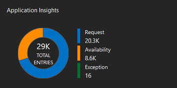
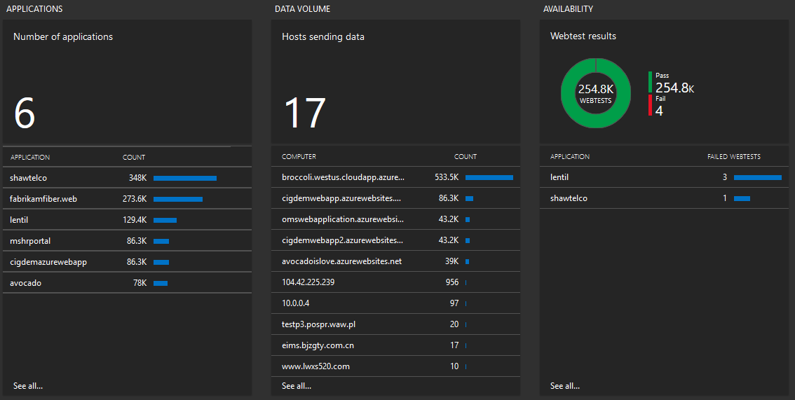
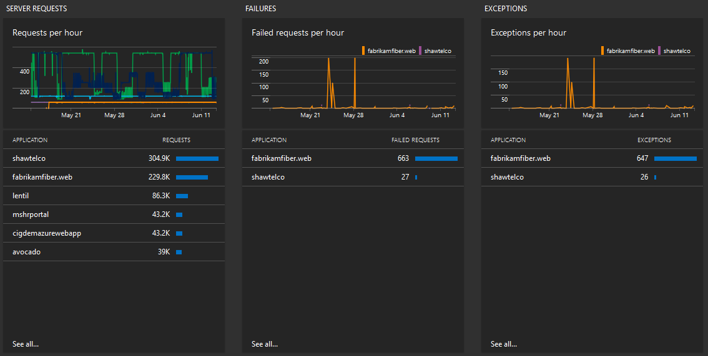
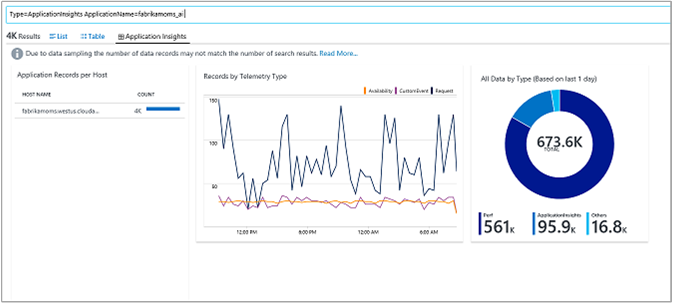
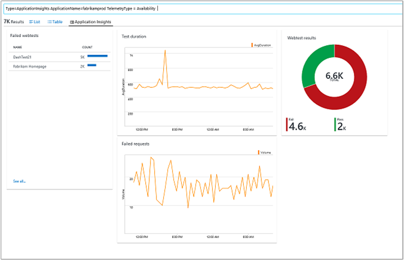
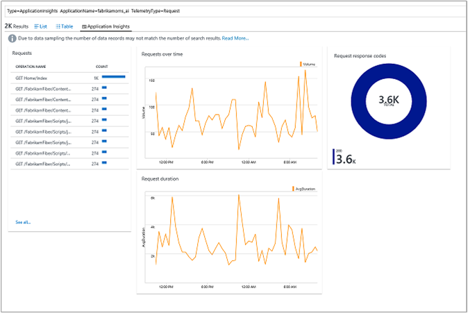
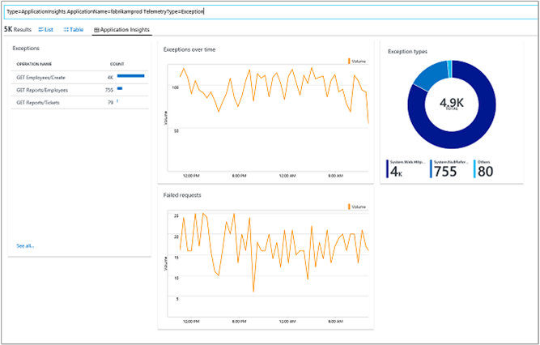
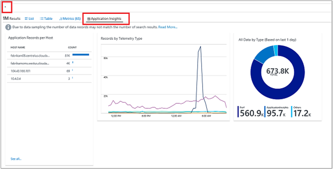
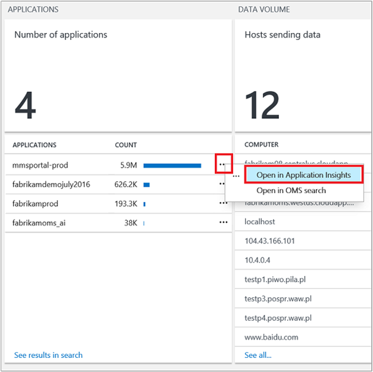
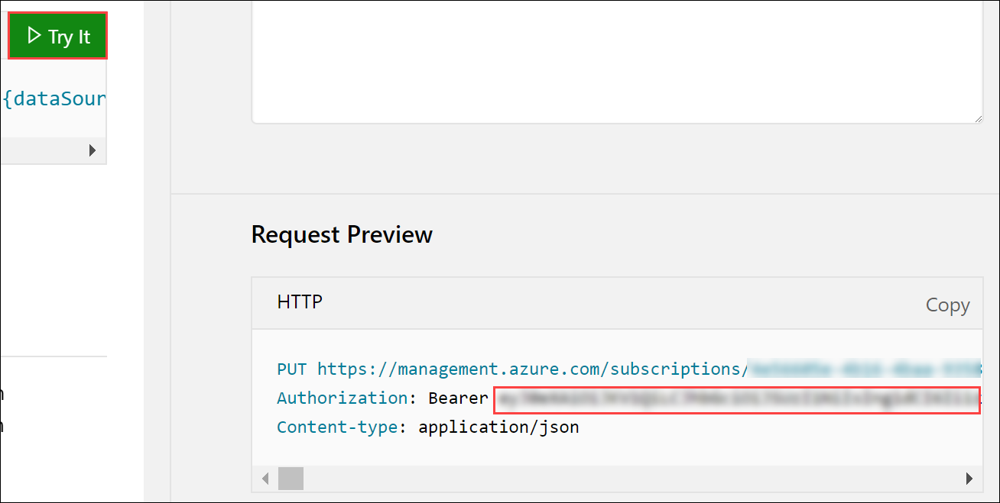

# Application Insights Connector management solution (Deprecated)


>[!NOTE]
> With the support of [cross-resource queries](../log-query/cross-workspace-query.md), the Application Insights Connector management solution is no longer required. It has been deprecated and removed from Azure Marketplace, along with the OMS portal that was officially deprecated on January 15, 2019 for Azure commercial cloud. It will be retired on March 30, 2019 for Azure US Government cloud.
>
>Existing connections will continue to work until June 30, 2019.  With OMS portal deprecation, there is no way to configure and remove existing connections from the portal. See [Removing the connector with PowerShell](#removing-the-connector-with-powershell) below for a script on using PowerShell to remove existing connections.
>
>For guidance on querying Application Insights log data for multiple applications, see [Unify multiple Azure Monitor Application Insights resources](../log-query/unify-app-resource-data.md). For more information on the OMS portal deprecation, see [OMS portal moving to Azure](./oms-portal-transition.md).
>
> 

The Applications Insights Connector solution helps you diagnose performance issues and understand what users do with your app when it is monitored with [Application Insights](../app/app-insights-overview.md). Views of the same application telemetry that developers see in Application Insights are available in Log Analytics. However, when you integrate your Application Insights apps with Log Analytics, visibility of your applications is increased by having operation and application data in one place. Having the same views helps you to collaborate with your app developers. The common views can help reduce the time to detect and resolve both application and platform issues.

When you use the solution, you can:

- View all your Application Insights apps in a one place, even when they are in different Azure subscriptions
- Correlate infrastructure data with application data
- Visualize application data with perspectives in log search
- Pivot from Log Analytics data to your Application Insights app in the Azure portal


[!INCLUDE [updated-for-az](../../../includes/updated-for-az.md)]

## Connected sources

Unlike most other Log Analytics solutions, data isn't collected for the Application Insights Connector by agents. All data used by the solution comes directly from Azure.

| Connected Source | Supported | Description |
| --- | --- | --- |
| [Windows agents](./agent-windows.md) | No | The solution does not collect information from Windows agents. |
| [Linux agents](../learn/quick-collect-linux-computer.md) | No | The solution does not collect information from Linux agents. |
| [SCOM management group](./om-agents.md) | No | The solution does not collect information from agents in a connected SCOM management group. |
| [Azure storage account](./resource-logs.md#send-to-log-analytics-workspace) | No | The solution does not collection information from Azure storage. |

## Prerequisites

- To access Application Insights Connector information, you must have an Azure subscription
- You must have at least one configured Application Insights resource.
- You must be the owner or contributor of the Application Insights resource.

## Configuration

1. Enable the Azure Web Apps Analytics solution from the [Azure marketplace](https://azuremarketplace.microsoft.com/marketplace/apps/Microsoft.AppInsights?tab=Overview) or by using the process described in [Add Log Analytics solutions from the Solutions Gallery](../insights/solutions.md).
2. Browse to the [Azure portal](https://portal.azure.com). Select **All services** to open Application Insights. Then, search for Application Insights. 
3. Under **Subscriptions**, select a subscription that has Application Insights resources and then under **Name**, select one or more applications.
4. Click **Save**.

In approximately 30 minutes, data becomes available and the Application Insights tile is updated with data, like the following image:



Other points to keep in mind:

- You can only link Application Insights apps to one Log Analytics workspace.
- You can only link [Basic or Enterprise Application Insights resources](https://azure.microsoft.com/pricing/details/application-insights) to Log Analytics. However, you can use the Free tier of Log Analytics.

## Management packs

This solution does not install any management packs in connected management groups.

## Use the solution

The following sections describe how you can use the blades shown in the Application Insights dashboard to view and interact with data from your apps.

### View Application Insights Connector information

Click the **Application Insights** tile to open the **Application Insights** dashboard to see the following blades.





The dashboard includes the blades shown in the table. Each blade lists up to 10 items matching that blade's criteria for the specified scope and time range. You can run a log search that returns all records when you click **See all** at the bottom of the blade or when you click the blade header.


| **Column** | **Description** |
| --- | --- |
| Applications - Number of applications | Shows the number of applications in Application resources. Also lists application names and for each, the count of application records. Click the number to run a log search for <code>ApplicationInsights &#124; summarize AggregatedValue = sum(SampledCount) by ApplicationName</code> <br><br>  Click an application name to run a log search for the application that shows application records per host, records by telemetry type, and all data by type (based on the last day). |
| Data Volume – Hosts sending data | Shows the number of computer hosts that are sending data. Also lists computer hosts and record count for each host. Click the number to run a log search for <code>ApplicationInsights &#124; summarize AggregatedValue = sum(SampledCount) by Host</code> <br><br> Click on a computer name to run a log search for the host that shows application records per host, records by telemetry type, and all data by type (based on the last day). |
| Availability – Webtest results | Shows a doughnut chart for web test results, indicating pass or fail. Click the chart to run a log search for <code>ApplicationInsights &#124; where TelemetryType == "Availability" &#124; summarize AggregatedValue = sum(SampledCount) by AvailabilityResult</code> <br><br> Results show the number of passes and failures for all tests. It shows all Web Apps with traffic for the last minute. Click an application name to view a log search showing details of failed web tests. |
| Server Requests – Requests per hour | Shows a line chart of the server requests per hour for various applications. Hover over a line in the chart to see the top 3 applications receiving requests for a point in time. Also shows a list of the applications receiving requests and the number of requests for the selected period. <br><br>Click the graph to run a log search for <code>ApplicationInsights &#124; where TelemetryType == "Request" &#124; summarize AggregatedValue = sum(SampledCount) by ApplicationName, bin(TimeGenerated, 1h)</code> that shows a more detailed line chart of the server requests per hour for various applications. <br><br> Click an application in the list to run a log search for <code>ApplicationInsights &#124; where ApplicationName == "yourapplicationname" and TelemetryType == "Request" and iff(isnotnull(toint(RequestSuccess)), RequestSuccess == false, RequestSuccess == "false") == true</code> that shows a list of requests, charts for requests over time and request duration and a list of request response codes.   |
| Failures – Failed requests per hour | Shows a line chart of failed application requests per hour. Hover over the chart to see the top 3 applications with failed requests for a point in time. Also shows a list of applications with the number of failed requests for each. Click the chart to run a log search for <code>ApplicationInsights &#124; where TelemetryType == "Request" and iff(isnotnull(toint(RequestSuccess)), RequestSuccess == false, RequestSuccess == "false") == true &#124; summarize AggregatedValue = sum(SampledCount) by ApplicationName, bin(TimeGenerated, 1h)</code> that shows a more detailed line chart of failed application requests. <br><br>Click an item in the list to run a log search for <code>ApplicationInsights &#124; where ApplicationName == "yourapplicationname" and TelemetryType == "Request" and iff(isnotnull(toint(RequestSuccess)), RequestSuccess == false, RequestSuccess == "false") == true</code>  that shows failed requests, charts for failed requests over time and request duration and a list of failed request response codes. |
| Exceptions – Exceptions per hour | Shows a line chart of exceptions per hour. Hover over the chart to see the top 3 applications with exceptions for a point in time. Also shows a list of applications with the number of exceptions for each. Click the chart to run a log search for <code>ApplicationInsights &#124; where TelemetryType == "Exception" &#124; summarize AggregatedValue = sum(SampledCount) by ApplicationName, bin(TimeGenerated, 1h)</code> that shows a more detailed link chart of exceptions. <br><br>Click an item in the list to run a log search for <code>ApplicationInsights &#124; where ApplicationName == "yourapplicationname" and TelemetryType == "Exception"</code> that shows a list of exceptions, charts for exceptions over time and failed requests, and a list of exception types.  |

### View the Application Insights perspective with log search

When you click any item in the dashboard, you see an Application Insights perspective shown in search. The perspective provides an extended visualization, based on the telemetry type that selected. So, visualization content changes for different telemetry types.

When you click anywhere in the Applications blade, you see the default **Applications** perspective.



The perspective shows an overview of the application that you selected.

The **Availability** blade shows a different perspective view where you can see web test results and related failed requests.



When you click anywhere in the **Server Requests** or **Failures** blades, the perspective components change to give you a visualization that related to requests.



When you click anywhere in the **Exceptions** blade, you see a visualization that's tailored to exceptions.



Regardless of whether you click something one the **Application Insights Connector** dashboard, within the **Search** page itself, any query returning Application Insights data shows the Application Insights perspective. For example, if you are viewing Application Insights data, a **&#42;** query also shows the perspective tab like the following image:



Perspective components are updated depending on the search query. This means that you can filter the results by using any search field that gives you the ability to see the data from:

- All your applications
- A single selected application
- A group of applications

### Pivot to an app in the Azure portal

Application Insights Connector blades are designed to enable you to pivot to the selected Application Insights app *when you use the Azure portal*. You can use the solution as a high-level monitoring platform that helps you troubleshoot an app. When you see a potential problem in any of your connected applications, you can either drill into it in Log Analytics search or you can pivot directly to the Application Insights app.

To pivot, click the ellipses (**…**) that appears at the end of each line, and select **Open in Application Insights**.

>[!NOTE]
>**Open in Application Insights** is not available in the Azure portal.



### Sample-corrected data

Application Insights provides *[sampling correction](../app/sampling.md)* to help reduce telemetry traffic. When you enable sampling on your Application Insights app, you get a reduced number of entries stored both in Application Insights and in Log Analytics. While data consistency is preserved in the **Application Insights Connector** page and perspectives, you should manually correct sampled data for your custom queries.

Here is an example of sampling correction in a log search query:

```
ApplicationInsights | summarize AggregatedValue = sum(SampledCount) by TelemetryType
```

The **Sampled Count** field is present in all entries and shows the number of data points that the entry represents. If you turn on sampling for your Application Insights app, **Sampled Count** is greater than 1. To count the actual number of entries that your application generates, sum the **Sampled Count** fields.

Sampling affects only the total number of entries that your application generates. You don't need to correct sampling for metric fields like **RequestDuration** or **AvailabilityDuration**  because those fields show the average for represented entries.

## Input data

The solution receives the following telemetry types of data from your connected Application Insights apps:

- Availability
- Exceptions
- Requests
- Page views – For your workspace to receive page views, you must configure your apps to collect that information. Fore more information, see [PageViews](../app/api-custom-events-metrics.md#page-views).
- Custom events – For your workspace to receive custom events, you must configure your apps to collect that information. Fore more information, see [TrackEvent](../app/api-custom-events-metrics.md#trackevent).

Data is received by Log Analytics from Application Insights as it becomes available.

## Output data

A record with a *type* of *ApplicationInsights* is created for each type of input data. ApplicationInsights records have properties shown in the following sections:

### Generic fields

| Property | Description |
| --- | --- |
| Type | ApplicationInsights |
| ClientIP |   |
| TimeGenerated | Time of the record |
| ApplicationId | Instrumentation key of the Application Insights app |
| ApplicationName | Name of the Application Insights app |
| RoleInstance | ID of server host |
| DeviceType | Client device |
| ScreenResolution |   |
| Continent | Continent where the request originated |
| Country | Country/region where the request originated |
| Province | Province, state, or locale where the request originated |
| City | City or town where the request originated |
| isSynthetic | Indicates whether the request was created by a user or by automated method. True = automated method or false = user generated |
| SamplingRate | Percentage of telemetry generated by the SDK that is sent to portal. Range 0.0-100.0. |
| SampledCount | 100/(SamplingRate). For example, 4 =&gt; 25% |
| IsAuthenticated | True or false |
| OperationID | Items that have the same operation ID are shown as Related Items in the portal. Usually the request ID |
| ParentOperationID | ID of the parent operation |
| OperationName |   |
| SessionId | GUID to uniquely identify the session where the request was created |
| SourceSystem | ApplicationInsights |

### Availability-specific fields

| Property | Description |
| --- | --- |
| TelemetryType | Availability |
| AvailabilityTestName | Name of the web test |
| AvailabilityRunLocation | Geographic source of http request |
| AvailabilityResult | Indicates the success result of the web test |
| AvailabilityMessage | The message attached to the web test |
| AvailabilityCount | 100/(Sampling Rate). For example, 4 =&gt; 25% |
| DataSizeMetricValue | 1.0 or 0.0 |
| DataSizeMetricCount | 100/(Sampling Rate). For example, 4 =&gt; 25% |
| AvailabilityDuration | Time, in milliseconds, of the web test duration |
| AvailabilityDurationCount | 100/(Sampling Rate). For example, 4 =&gt; 25% |
| AvailabilityValue |   |
| AvailabilityMetricCount |   |
| AvailabilityTestId | Unique GUID for the web test |
| AvailabilityTimestamp | Precise timestamp of the availability test |
| AvailabilityDurationMin | For sampled records, this field shows the minimum web test duration (milliseconds) for the represented data points |
| AvailabilityDurationMax | For sampled records, this field shows the maximum web test duration (milliseconds) for the represented data points |
| AvailabilityDurationStdDev | For sampled records, this field shows the standard deviation between all web test durations (milliseconds) for the represented data points |
| AvailabilityMin |   |
| AvailabilityMax |   |
| AvailabilityStdDev | &nbsp;  |

### Exception-specific fields

| Type | ApplicationInsights |
| --- | --- |
| TelemetryType | Exception |
| ExceptionType | Type of the exception |
| ExceptionMethod | The method that creates the exception |
| ExceptionAssembly | Assembly includes the framework and version as well as the public key token |
| ExceptionGroup | Type of the exception |
| ExceptionHandledAt | Indicates the level that handled the exception |
| ExceptionCount | 100/(Sampling Rate). For example, 4 =&gt; 25% |
| ExceptionMessage | Message of the exception |
| ExceptionStack | Full stack of the exception |
| ExceptionHasStack | True, if exception has a stack |


### Request-specific fields

| Property | Description |
| --- | --- |
| Type | ApplicationInsights |
| TelemetryType | Request |
| ResponseCode | HTTP response sent to client |
| RequestSuccess | Indicates success or failure. True or false. |
| RequestID | ID to uniquely identify the request |
| RequestName | GET/POST + URL base |
| RequestDuration | Time, in seconds, of the request duration |
| URL | URL of the request not including host |
| Host | Web server host |
| URLBase | Full URL of the request |
| ApplicationProtocol | Type of protocol used by the application |
| RequestCount | 100/(Sampling Rate). For example, 4 =&gt; 25% |
| RequestDurationCount | 100/(Sampling Rate). For example, 4 =&gt; 25% |
| RequestDurationMin | For sampled records, this field shows the minimum request duration (milliseconds) for the represented data points. |
| RequestDurationMax | For sampled records, this field shows the maximum request duration (milliseconds) for the represented data points |
| RequestDurationStdDev | For sampled records, this field shows the standard deviation between all request durations (milliseconds) for the represented data points |

## Sample log searches

This solution does not have a set of sample log searches shown on the dashboard. However, sample log search queries with descriptions are shown in the [View Application Insights Connector information](#view-application-insights-connector-information) section.

## Removing the connector with PowerShell
With OMS portal deprecation, there is no way to configure and remove existing connections from the portal. You can remove existing connections with the following PowerShell script. You must be the owner or contributor of the workspace and reader of Application Insights resource to perform this operation.

```powershell
$Subscription_app = "App Subscription Name"
$ResourceGroup_app = "App ResourceGroup"
$Application = "Application Name"
$Subscription_workspace = "Workspace Subscription Name"
$ResourceGroup_workspace = "Workspace ResourceGroup"
$Workspace = "Workspace Name"

Connect-AzAccount
Set-AzContext -SubscriptionId $Subscription_app
$AIApp = Get-AzApplicationInsights -ResourceGroupName $ResourceGroup_app -Name $Application 
Set-AzContext -SubscriptionId $Subscription_workspace
Remove-AzOperationalInsightsDataSource -WorkspaceName $Workspace -ResourceGroupName $ResourceGroup_workspace -Name $AIApp.Id
```

You can retrieve a list of applications using the following PowerShell script that invokes a REST API call. 

```powershell
Connect-AzAccount
$Tenant = "TenantId"
$Subscription_workspace = "Workspace Subscription Name"
$ResourceGroup_workspace = "Workspace ResourceGroup"
$Workspace = "Workspace Name"
$AccessToken = "AAD Authentication Token" 

Set-AzContext -SubscriptionId $Subscription_workspace
$LAWorkspace = Get-AzOperationalInsightsWorkspace -ResourceGroupName $ResourceGroup_workspace -Name $Workspace

$Headers = @{
    "Authorization" = "Bearer $($AccessToken)"
    "x-ms-client-tenant-id" = $Tenant
}

$Connections = Invoke-RestMethod -Method "GET" -Uri "https://management.azure.com$($LAWorkspace.ResourceId)/dataSources/?%24filter=kind%20eq%20'ApplicationInsights'&api-version=2015-11-01-preview" -Headers $Headers
$ConnectionsJson = $Connections | ConvertTo-Json
```
This script requires a bearer authentication token for authentication against Azure Active Directory. One way to retrieve this token is using an article in the [REST API documentation site](/rest/api/loganalytics/datasources/createorupdate). Click **Try It** and log into your Azure subscription. You can copy the bearer token from the **Request Preview** as shown in the following image.





You can also retrieve a list of applications use a log query:

```Kusto
ApplicationInsights | summarize by ApplicationName
```

## Next steps

- Use [Log Search](../log-query/log-query-overview.md) to view detailed information for your Application Insights apps.

