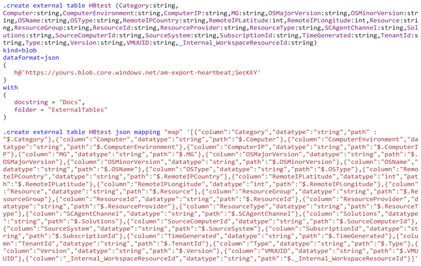

# Query exported data from Azure Monitor using Azure Data Explorer (preview)
Exporting data from Azure Monitor to an Azure storage account enables low-cost retention and the ability to reallocate logs to different regions. Use Azure Data Explorer to query data that was exported from your Log Analytics workspaces. Once configured, supported tables that are sent from your workspaces to an Azure storage account will be available as a data source for Azure Data Explorer.

The process flow is as follows: 

1.	Export data from Log Analytics workspace to Azure storage account.
2.	Create external table in your Azure Data Explorer Cluster and mapping for the data types.
3.	Query data from Azure Data Explorer.

:::image type="content" source="media/azure-data-explorer-query-storage/exported-data-query.png" alt-text="Azure Data Explorer exported data querying flow.":::


## Send data to Azure storage
Azure Monitor logs can be exported to an Azure Storage Account using any of the following options.

- To export all data from your Log Analytics workspace to an Azure storage account or event hub, use the Log Analytics workspace data export feature of Azure Monitor Logs. See [Log Analytics workspace data export in Azure Monitor (preview)](logs-data-export.md)
- Scheduled export from a log query using a Logic App. This is similar to the data export feature but allows you to send filtered or aggregated data to Azure storage. This method though is subject to [log query limits](../service-limits.md#log-analytics-workspaces)  See [Archive data from Log Analytics workspace to Azure storage using Logic App](logs-export-logic-app.md).
- One time export using a Logic App. See [Azure Monitor Logs connector for Logic Apps and Power Automate](logicapp-flow-connector.md).
- One time export to local machine using PowerShell script. See [Invoke-AzOperationalInsightsQueryExport](https://www.powershellgallery.com/packages/Invoke-AzOperationalInsightsQueryExport).

> [!TIP]
> You can use an existing Azure Data Explorer cluster or creating a new dedicated cluster with the needed configurations.

## Create an external table located in Azure blob storage
Use [external tables](/azure/data-explorer/kusto/query/schema-entities/externaltables) to link Azure Data Explorer to an Azure storage account. An external table is a Kusto schema entity that references data stored outside a Kusto database. Like tables, an external table has a well-defined schema. Unlike tables, data is stored and managed outside of a Kusto cluster. The exported data from the previous section is saved in JSON lines.

To create a reference, you require the schema of the exported table. Use the [getschema](/azure/data-explorer/kusto/query/getschemaoperator) operator from Log Analytics to retrieve this information which includes the table's columns and their data types.

:::image type="content" source="media\azure-data-explorer-query-storage\exported-data-map-schema.jpg" alt-text="Log Analytics table schema.":::

You can now use the output to create the Kusto query for building the external table.
Following the guidance in [Create and alter external tables in Azure Storage or Azure Data Lake](/azure/data-explorer/kusto/management/external-tables-azurestorage-azuredatalake), create an external table in a JSON format and then run the query from your Azure Data Explorer database.

>[!NOTE]
>The external table creation is built from two processes. The first is creating the external table, while the second is creating the mapping.

The following PowerShell script will create the [create](/azure/data-explorer/kusto/management/external-tables-azurestorage-azuredatalake#create-external-table-mapping) commands for the table and the mapping.

```powershell
PARAM(
    $resourcegroupname, #The name of the Azure resource group
    $TableName, # The log lanlyics table you wish to convert to external table
    $MapName, # The name of the map
    $subscriptionId, #The ID of the subscription
    $WorkspaceId, # The log lanlyics WorkspaceId
    $WorkspaceName, # The log lanlyics workspace name
    $BlobURL, # The Blob URL where to save
    $ContainerAccessKey, # The blob container Access Key (Option to add a SAS url)
    $ExternalTableName = $null # The External Table name, null to use the same name
)

if($null -eq $ExternalTableName) {
    $ExternalTableName = $TableName
}

$query = $TableName + ' | getschema | project ColumnName, DataType'

$output = (Invoke-AzOperationalInsightsQuery -WorkspaceId $WorkspaceId -Query $query).Results

$FirstCommand = @()
$SecondCommand = @()

foreach ($record in $output) {
    if ($record.DataType -eq 'System.DateTime') {
        $dataType = 'datetime'
    } else {
        $dataType = 'string'
    }
    $FirstCommand += $record.ColumnName + ":" + "$dataType" + ","
    $SecondCommand += "{`"column`":" + "`"" + $record.ColumnName + "`"," + "`"datatype`":`"$dataType`",`"path`":`"$." + $record.ColumnName + "`"},"
}
$schema = ($FirstCommand -join '') -replace ',$'
$mapping = ($SecondCommand -join '') -replace ',$'

$CreateExternal = @'
.create external table {0} ({1})
kind=blob
partition by (TimeGeneratedPartition:datetime = bin(TimeGenerated, 1min))
pathformat = (datetime_pattern("'y='yyyy'/m='MM'/d='dd'/h='HH'/m='mm", TimeGeneratedPartition))
dataformat=multijson
(
   h@'{2}/WorkspaceResourceId=/subscriptions/{4}/resourcegroups/{6}/providers/microsoft.operationalinsights/workspaces/{5};{3}'
)
with
(
   docstring = "Docs",
   folder = "ExternalTables"
)
'@ -f $TableName, $schema, $BlobURL, $ContainerAccessKey, $subscriptionId, $WorkspaceName, $resourcegroupname,$WorkspaceId

$createMapping = @'
.create external table {0} json mapping "{1}" '[{2}]'
'@ -f $ExternalTableName, $MapName, $mapping

Write-Host -ForegroundColor Red 'Copy and run the following commands (one by one), on your Azure Data Explorer cluster query window to create the external table and mappings:'
write-host -ForegroundColor Green $CreateExternal
Write-Host -ForegroundColor Green $createMapping
```

The following image shows and example of the output.

:::image type="content" source="media/azure-data-explorer-query-storage/external-table-create-command-output.png" alt-text="ExternalTable create command output.":::

[](media/azure-data-explorer-query-storage/external-table-create-command-output.png#lightbox)

>[!TIP]
>Copy, paste, and then run the output of the script in your Azure Data Explorer client tool to create the table and mapping.

## Query the exported data from Azure Data Explorer 

After configuring the mapping, you can query the exported data from Azure Data Explorer. Your query requires the [external_table](/azure/data-explorer/kusto/query/externaltablefunction) function such as in the following example.

```kusto
external_table("HBTest","map") | take 10000
```

[](media/azure-data-explorer-query-storage/external-table-query.png#lightbox)

## Next steps

- Learn to [write queries in Azure Data Explorer](https://docs.microsoft.com/azure/data-explorer/write-queries)