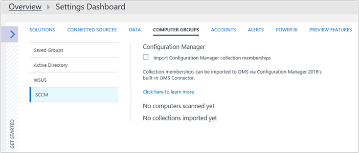
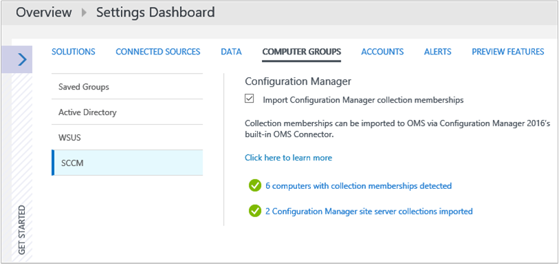

# Connect Configuration Manager to Azure Monitor
You can connect your System Center Configuration Manager environment to Azure Monitor to sync device collection data and reference these collections in Azure Monitor and Azure Automation.  

## Prerequisites

Azure Monitor supports System Center Configuration Manager current branch, version 1606 and higher.

>[!NOTE]
>The feature to connect Configuration Manager with a Log Analytics workspace is optional and not enabled by default. You must enable this feature before using it. For more information, see [Enable optional features from updates](https://docs.microsoft.com/sccm/core/servers/manage/install-in-console-updates#bkmk_options).

## Configuration overview

The following steps summarize the steps to configure Configuration Manager integration with Azure Monitor.  

1. In Azure Active Directory, register Configuration Manager as a Web Application and/or Web API app, and ensure that you have the client ID and client secret key from the registration from Azure Active Directory. See [Use portal to create Active Directory application and service principal that can access resources](../../active-directory/develop/howto-create-service-principal-portal.md) for detailed information about how to accomplish this step.

2. In Azure Active Directory, [grant Configuration Manager (the registered web app) with permission to access Azure Monitor](#grant-configuration-manager-with-permissions-to-log-analytics).

3. In Configuration Manager, add a connection using the **Azure Services** wizard.

4. [Download and install the Log Analytics agent for Windows](#download-and-install-the-agent) on the computer running the Configuration Manager service connection point site system role. The agent sends Configuration Manager data to the Log Analytics workspace in Azure Monitor.

5. In Azure Monitor, [import collections from Configuration Manager](#import-collections) as computer groups.

6. In Azure Monitor, view data from Configuration Manager as [computer groups](computer-groups.md).

## Grant Configuration Manager with permissions to Log Analytics

In the following procedure, you grant the *Contributor* role in your Log Analytics workspace to the AD application and service principal you created earlier for Configuration Manager. If you do not already have a workspace, see [Create a workspace in Azure Monitor](../../azure-monitor/learn/quick-create-workspace.md) before proceeding. This allows Configuration Manager to authenticate and connect to your Log Analytics workspace.  

> [!NOTE]
> You must specify permissions in the Log Analytics workspace for Configuration Manager. Otherwise, you receive an error message when you use the configuration wizard in Configuration Manager.
>

1. In the Azure portal, click **All services** found in the upper left-hand corner. In the list of resources, type **Log Analytics**. As you begin typing, the list filters based on your input. Select **Log Analytics**.

2. In your list of Log Analytics workspaces, select the workspace to modify.

3. From the left pane, select **Access control (IAM)**.

4. In the Access control (IAM) page, click **Add role assignment** and the **Add role assignment** pane appears.

5. In the **Add role assignment** pane, under the **Role** drop-down list select the **Contributor** role.  

6. Under the **Assign access to** drop-down list, select the Configuration Manager application created in AD earlier, and then click **OK**.  

## Download and install the agent

Review the article [Connect Windows computers to Azure Monitor in Azure](agent-windows.md) to understand the methods available for installing the Log Analytics agent for Windows on the computer hosting the Configuration Manager service connection point site system role.  

## Connect Configuration Manager to Log Analytics workspace

>[!NOTE]
> In order to add a Log Analytics connection, your Configuration Manager environment must have a [service connection point](https://docs.microsoft.com/sccm/core/servers/deploy/configure/about-the-service-connection-point) configured for online mode.

> [!NOTE]
> You must connect the top-tier site in your hierarchy to Azure Monitor. If you connect a standalone primary site to Azure Monitor and then add a central administration site to your environment, you have to delete and recreate the connection within the new hierarchy.

1. In the **Administration** workspace of Configuration Manager, select **Clouds Services** and then select **Azure Services**. 

2. Right-click **Azure Services** and then select **Configure Azure Services**. The **Configure Azure Services** page appears. 
   
3. On the **General** screen, confirm that you have done the following actions and that you have details for each item, then select **Next**.

4. On the Azure Services page of the Azure Services Wizard:

    1. Specify a **Name** for the object in Configuration Manager.
    2. Specify an optional **Description** to help you identify the service.
    3. Select the Azure service **OMS Connector**.

    >[!NOTE]
    >OMS is now referred to as Log Analytics which is a feature of Azure Monitor.

5. Select **Next** to continue to the Azure app properties page of the Azure Services Wizard.

6. On the **App** page of the Azure Services Wizard, first select the Azure environment from the list and then click **Import**.

7. On the **Import Apps** page, specify the following information:

    1. Specify the **Azure AD Tenant Name** for the app.

    2. Specify for **Azure AD Tenant ID** the Azure AD tenant. You can find this information on the Azure Active Directory **Properties** page. 

    3. Specify for **Application Name** the application name.

    4. Specify for **Client ID**, the Application ID of the created Azure AD app created earlier.

    5. Specify for **Secret key**, the Client secret key of the created Azure AD app.

    6. Specify for **Secret Key Expiry**, the expiration date of your key.

    7. Specify for **App ID URI**, the App ID URI of the created Azure AD app created earlier.

    8. Select **Verify** and to the right the results should show **Successfully verified!**.

8. On the **Configuration** page, review the information to verify the **Azure subscriptions**, **Azure resource group**, and **Operations Management Suite workspace** fields are pre-populated indicating the Azure AD application has sufficient permissions in the resource group. If the fields are empty, it indicates your application does not have the rights required. Select the device collections to collect and forward to the workspace and then select **Add**.

9. Review the options on the **Confirm the settings** page, and select **Next** to begin creating and configuring the connection.

10. When configuration is finished, the **Completion** page appears. Select **Close**. 

After you have linked Configuration Manager to Azure Monitor, you can add or remove collections, and view the properties of the connection.

## Update Log Analytics workspace connection properties

If a password or client secret key expires or is lost, you'll need to manually update the Log Analytics connection properties.

1. In the **Administration** workspace of Configuration Manager, select **Cloud Services** and then select **OMS Connector** to open the **OMS Connection Properties** page.
2. On this page, click the **Azure Active Directory** tab to view your **Tenant**, **Client ID**, **Client secret key expiration**. **Verify** your **Client secret key** if it has expired.

## Import collections

After you've added a Log Analytics connection to Configuration Manager and installed the agent on the computer running the Configuration Manager service connection point site system role, the next step is to import collections from Configuration Manager in Azure Monitor as computer groups.

After you have completed initial configuration to import device collections from your hierarchy, the collection information is retrieved every 3 hours to keep the membership current. You can choose to disable this at any time.

1. In the Azure portal, click **All services** found in the upper left-hand corner. In the list of resources, type **Log Analytics**. As you begin typing, the list filters based on your input. Select **Log Analytics workspaces**.
2. In your list of Log Analytics workspaces, select the workspace Configuration Manager is registered with.  
3. Select **Advanced settings**.
4. Select **Computer Groups** and then select **SCCM**.  
5. Select **Import Configuration Manager collection memberships** and then click **Save**.  
   
    

## View data from Configuration Manager

After you've added a Log Analytics connection to Configuration Manager and installed the agent on the computer running the Configuration Manager service connection point site system role, data from the agent is sent to the Log Analytics workspace in Azure Monitor. In Azure Monitor, your Configuration Manager collections appear as [computer groups](../../azure-monitor/platform/computer-groups.md). You can view the groups from the **Configuration Manager** page under **Settings\Computer Groups**.

After the collections are imported, you can see how many computers with collection memberships have been detected. You can also see the number of collections that have been imported.

When you click either one, log query editor opens displaying either all of the imported groups or all computers that belong to each group. Using [Log Search](../../azure-monitor/log-query/log-query-overview.md), you can perform further in-depth analysis the collection membership data.

## Next steps

Use [Log Search](../../azure-monitor/log-query/log-query-overview.md) to view detailed information about your Configuration Manager data.
