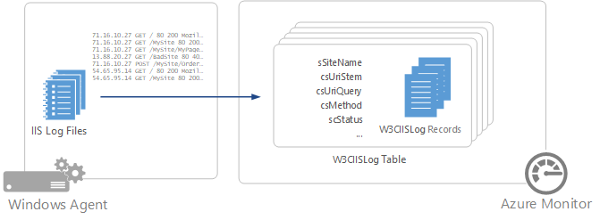

# Collect IIS logs in Azure Monitor
Internet Information Services (IIS) stores user activity in log files that can be collected by Azure Monitor and stored as [log data](data-platform.md).

## Configuring IIS logs
Azure Monitor collects entries from log files created by IIS, so you must [configure IIS for logging](https://technet.microsoft.com/library/hh831775.aspx).

Azure Monitor only supports IIS log files stored in W3C format and does not support custom fields or IIS Advanced Logging. It does not collect logs in NCSA or IIS native format.

Configure IIS logs in Azure Monitor from the [Advanced Settings menu](agent-data-sources.md#configuring-data-sources).  There is no configuration required other than selecting **Collect W3C format IIS log files**.

## Data collection
Azure Monitor collects IIS log entries from each agent each time the log timestamp changes. The log is read every **5 minutes**. If for any reason IIS doesn't update the timestamp before the rollover time when a new file is created, entries will be collected following creation of the new file. The frequency of new file creation is controlled by the **Log File Rollover Schedule** setting for the IIS site, which is once a day by default. If the setting is **Hourly**, Azure Monitor collects the log each hour. If the setting is **Daily**, Azure Monitor collects the log every 24 hours.

## IIS log record properties
IIS log records have a type of **W3CIISLog** and have the properties in the following table:

| Property | Description |
|:--- |:--- |
| Computer |Name of the computer that the event was collected from. |
| cIP |IP address of the client. |
| csMethod |Method of the request such as GET or POST. |
| csReferer |Site that the user followed a link from to the current site. |
| csUserAgent |Browser type of the client. |
| csUserName |Name of the authenticated user that accessed the server. Anonymous users are indicated by a hyphen. |
| csUriStem |Target of the request such as a web page. |
| csUriQuery |Query, if any, that the client was trying to perform. |
| ManagementGroupName |Name of the management group for Operations Manager agents.  For other agents, this is AOI-\<workspace ID\> |
| RemoteIPCountry |Country/region of the IP address of the client. |
| RemoteIPLatitude |Latitude of the client IP address. |
| RemoteIPLongitude |Longitude of the client IP address. |
| scStatus |HTTP status code. |
| scSubStatus |Substatus error code. |
| scWin32Status |Windows status code. |
| sIP |IP address of the web server. |
| SourceSystem |OpsMgr |
| sPort |Port on the server the client connected to. |
| sSiteName |Name of the IIS site. |
| TimeGenerated |Date and time the entry was logged. |
| TimeTaken |Length of time to process the request in milliseconds. |

## Log queries with IIS logs
The following table provides different examples of log queries that retrieve IIS log records.

| Query | Description |
|:--- |:--- |
| W3CIISLog |All IIS log records. |
| W3CIISLog &#124; where scStatus==500 |All IIS log records with a return status of 500. |
| W3CIISLog &#124; summarize count() by cIP |Count of IIS log entries by client IP address. |
| W3CIISLog &#124; where csHost=="www\.contoso.com" &#124; summarize count() by csUriStem |Count of IIS log entries by URL for the host www\.contoso.com. |
| W3CIISLog &#124; summarize sum(csBytes) by Computer &#124; take 500000 |Total bytes received by each IIS computer. |

## Next steps
* Configure Azure Monitor to collect other [data sources](agent-data-sources.md) for analysis.
* Learn about [log queries](../log-query/log-query-overview.md) to analyze the data collected from data sources and solutions.
