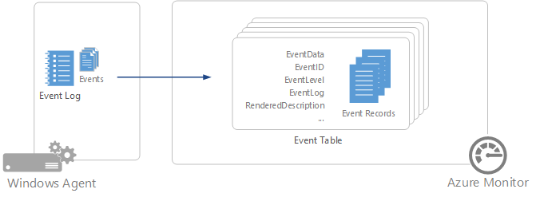

# Windows event log data sources in Azure Monitor
Windows Event logs are one of the most common [data sources](agent-data-sources.md) for collecting data using Windows agents since many applications write to the Windows event log.  You can collect events from standard logs such as System and Application in addition to specifying any custom logs created by applications you need to monitor.

     

## Configuring Windows Event logs
Configure Windows Event logs from the [Data menu in Advanced Settings](agent-data-sources.md#configuring-data-sources).

Azure Monitor only collects events from the Windows event logs that are specified in the settings.  You can add an event log by typing in the name of the log and clicking **+**.  For each log, only the events with the selected severities are collected.  Check the severities for the particular log that you want to collect.  You cannot provide any additional criteria to filter events.

As you type the name of an event log, Azure Monitor provides suggestions of common event log names. If the log you want to add does not appear in the list, you can still add it by typing in the full name of the log. You can find the full name of the log by using event viewer. In event viewer, open the *Properties* page for the log and copy the string from the *Full Name* field.

> [!NOTE]
> Critical events from the Windows event log will have a severity of "Error" in Azure Monitor Logs.

## Data collection
Azure Monitor collects each event that matches a selected severity from a monitored event log as the event is created.  The agent records its place in each event log that it collects from.  If the agent goes offline for a period of time, then it collects events from where it last left off, even if those events were created while the agent was offline.  There is a potential for these events to not be collected if the event log wraps with uncollected events being overwritten while the agent is offline.

>[!NOTE]
>Azure Monitor does not collect audit events created by SQL Server from source *MSSQLSERVER* with event ID 18453 that contains keywords - *Classic* or *Audit Success* and keyword *0xa0000000000000*.
>

## Windows event records properties
Windows event records have a type of **Event** and have the properties in the following table:

| Property | Description |
|:--- |:--- |
| Computer |Name of the computer that the event was collected from. |
| EventCategory |Category of the event. |
| EventData |All event data in raw format. |
| EventID |Number of the event. |
| EventLevel |Severity of the event in numeric form. |
| EventLevelName |Severity of the event in text form. |
| EventLog |Name of the event log that the event was collected from. |
| ParameterXml |Event parameter values in XML format. |
| ManagementGroupName |Name of the management group for System Center Operations Manager agents.  For other agents, this value is `AOI-<workspace ID>` |
| RenderedDescription |Event description with parameter values |
| Source |Source of the event. |
| SourceSystem |Type of agent the event was collected from.   OpsManager – Windows agent, either direct connect or Operations Manager managed   Linux – All Linux agents    AzureStorage – Azure Diagnostics |
| TimeGenerated |Date and time the event was created in Windows. |
| UserName |User name of the account that logged the event. |

## Log queries with Windows Events
The following table provides different examples of log queries that retrieve Windows Event records.

| Query | Description |
|:---|:---|
| Event |All Windows events. |
| Event &#124; where EventLevelName == "error" |All Windows events with severity of error. |
| Event &#124; summarize count() by Source |Count of Windows events by source. |
| Event &#124; where EventLevelName == "error" &#124; summarize count() by Source |Count of Windows error events by source. |

## Next steps
* Configure Log Analytics to collect other [data sources](agent-data-sources.md) for analysis.
* Learn about [log queries](../log-query/log-query-overview.md) to analyze the data collected from data sources and solutions.  
* Configure [collection of performance counters](data-sources-performance-counters.md) from your Windows agents.
