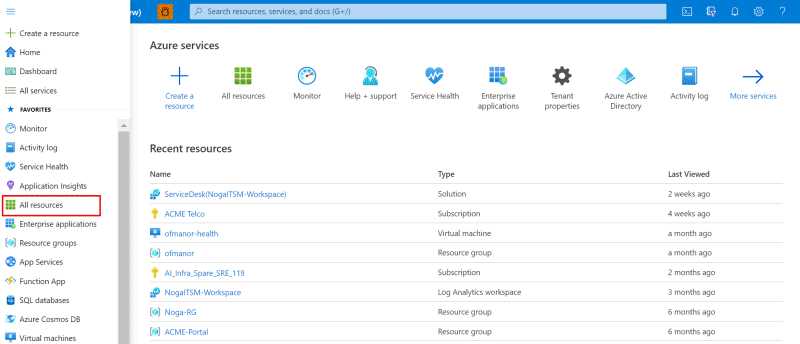
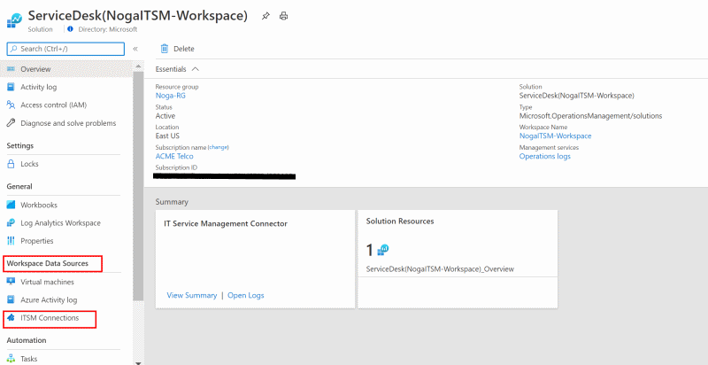
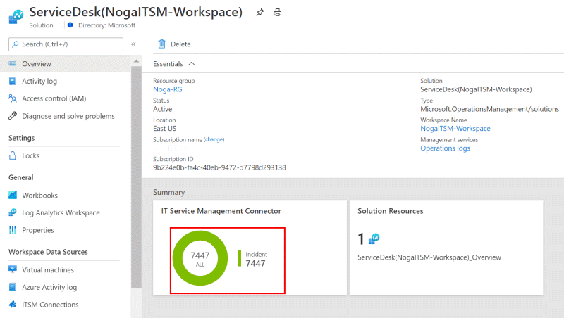
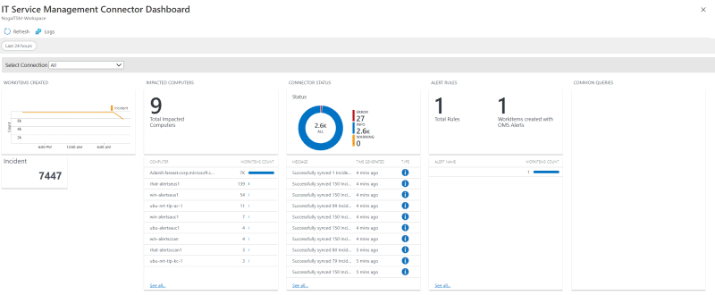

# Error Investigation using the dashboard

This page contains information about the ITSM connector dashboard. This dashboard will help you to investigate the status of your ITSM connector.

## How to view the dashboard

In order to view the errors in the dashboard, you should follow the next steps:

1. In **All resources**, look for **ServiceDesk(*your workspace name*)**:

   

2. Under **Workspace Data Sources** in the left pane, select **ITSM Connections**:

   

3. Under **Summary** in the left box **IT Service Management Connector**, select **View Summary**:

    

4. Under **Summary** in the left box **IT Service Management Connector**, click on the graph:

    

5. Using this dashboard you will be able to review the status and the errors in your connector.
    

## Dashboard Elements

The dashboard contains information on the alerts that were sent into the ITSM tool using this connector.
The dashboard is split into four parts:

1. Work Item Created: The graph and the table below contain the count of the work item per type. If you click on the graph or on the table, you can see more details about the work items.
    
2. Impacted computers: The tables contain details about the configuration items that created configuration items.
    By clicking on rows in the tables, you can get further details on the configuration items.
    The table contains limited number of rows if you would like to see all the list you can click on "See all".
    
3. Connector status: The graph and the table below contain messages about the status of the connector. By clicking on the graph on rows in the table, you can get further details on the messages of the connector status.
    The table contains limited number of rows if you would like to see all the list you can click on "See all".
    
4. Alert rules: The tables contain the information on the number of alert rules that were detected.
    By clicking on rows in the tables, you can get further details on the rules that were detected.
    The table contains limited number of rows if you would like to see all the list you can click on "See all".
    