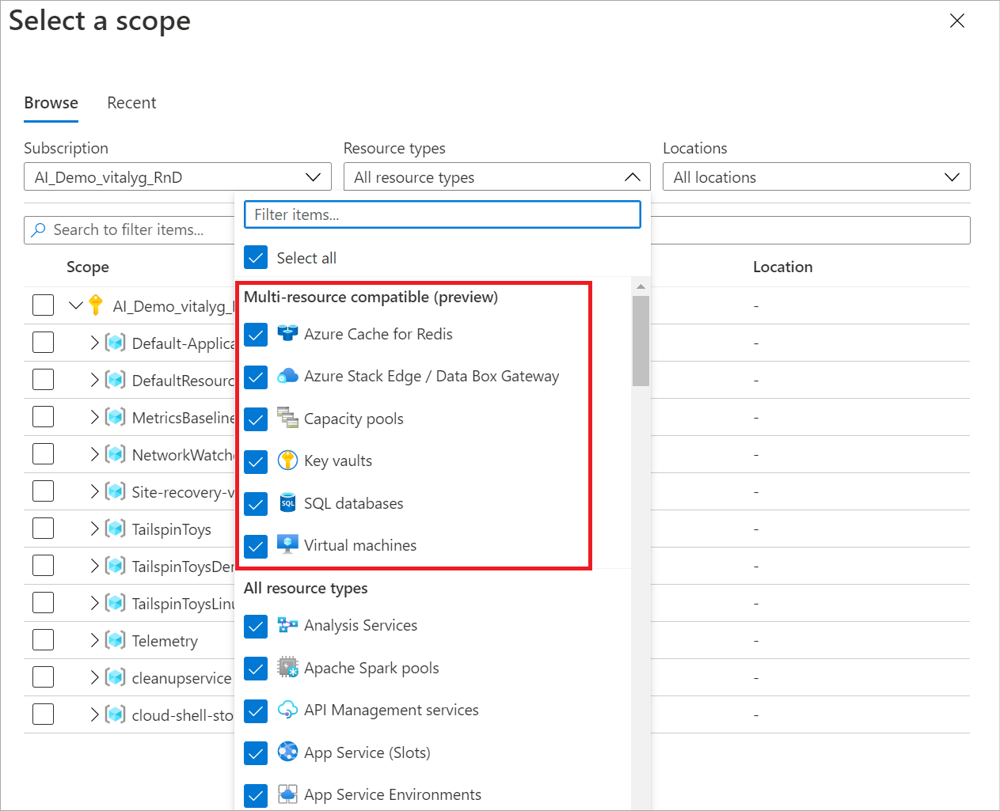
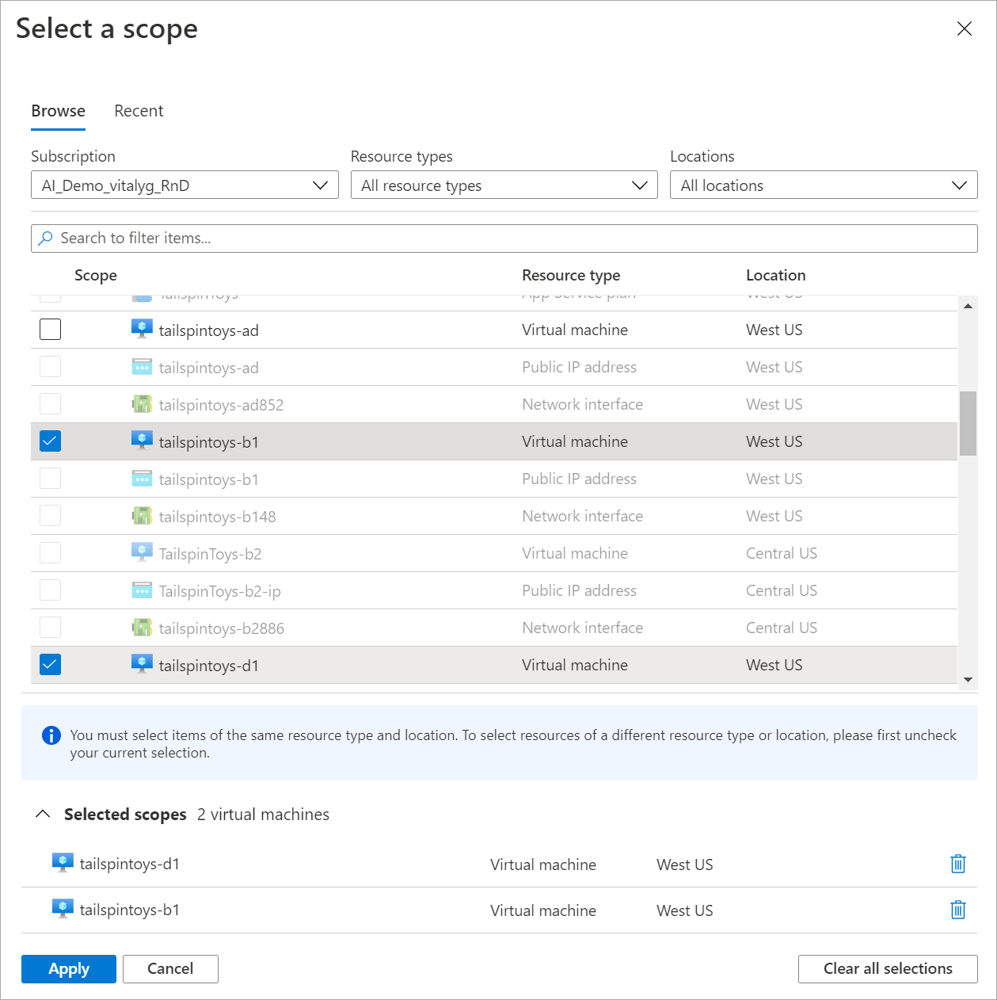
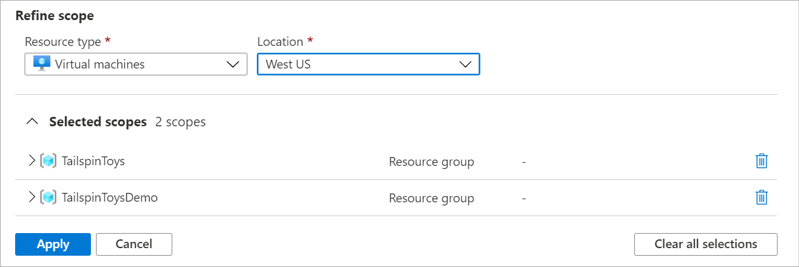
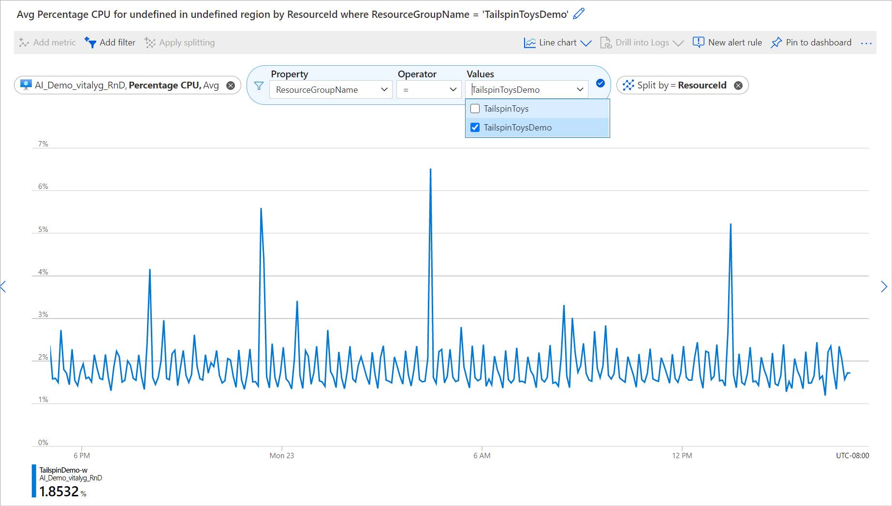

# Viewing multiple resources in Metrics Explorer

The resource scope picker allows you to view metrics across multiple resources that are within the same subscription and region. Below are instructions on how to view multiple resources in Azure Monitor Metrics Explorer. 

## Selecting a resource 

Select **Metrics** from the **Azure Monitor** menu or from the **Monitoring** section of a resource's menu. Click on the "Select a scope" button to open the resource scope picker, which will allow you to select the resource(s) you want to see metrics for. This should already be populated if you opened metrics explorer from a resource's menu. 

## Selecting multiple resources 

Some resource types have enabled the ability to query for metrics over multiple resources, as long as they are within the same subscription and location. These resource types can be found at the top of the “Resource Types” dropdown. 

> [!WARNING] 
> You must have Monitoring Reader permission at the subscription level to visualize metrics across multiple resources, resource groups or a subscription. In order to do this, please follow the instructions in [this document](https://docs.microsoft.com/azure/role-based-access-control/role-assignments-portal).

In order to visualize metrics over multiple resources, start by selecting multiple resources within the resource scope picker. 

> [!NOTE]
> You are only able to select multiple resources within the same resource type, location and subscription. Resources outside of this criteria will not be selectable. 

When you are done selecting, click on the “Apply” button to save your selection. 

## Selecting a resource group or subscription 

> [!WARNING]
> You must have Monitoring Reader permission at the subscription level to visualize metrics across multiple resources, resource groups or a subscription. 

For multi-resource compatible types, you can also query for metrics across a subscription or multiple resource groups. Start by selecting a subscription or one or more resource groups: 

You will then need to select a resource type and location before you can continue applying your new scope. 

You are also able to expand the selected scopes to verify which resources this will apply to.

Once you are finished selecting your scopes, click “Apply” to save your selections. 

## Splitting and filtering by resource group or resources

After plotting your resources, you can use the splitting and filtering tool to gain more insight into your data. 

Splitting allows you to visualize how different segments of the metric compare with each other. For instance, when you are plotting a metric for multiple resources you can use the “Apply splitting” tool to split by resource id or resource group. This will allow you to easily compare a single metric across multiple resources or resource groups.  

For example, below is a chart of the percentage CPU across 9VMs. By splitting by resource id, you can easily see how percentage CPU differs per VM. 

In addition to splitting, you can use the filtering feature to only display the resource groups that you want to see.  For instance, if you want to view the percentage CPU for VMs for a certain resource group, you can use the "Add filter” tool to filter by resource group. In this example we filter by TailspinToysDemo, which removes metrics associated with resources in TailspinToys. 

## Pinning your multi-resource charts 

> [!WARNING] 
> You must have Monitoring Reader permission at the subscription level to visualize metrics across multiple resources, resource groups or a subscription. In order to do this, please follow the instructions in [this document](https://docs.microsoft.com/azure/role-based-access-control/role-assignments-portal). 

To pin your multi-resource chart, please follow the instructions [here](https://docs.microsoft.com/azure/azure-monitor/platform/metrics-charts#pin-charts-to-dashboards). 

## Next steps

* [Troubleshooting Metrics Explorer](metrics-troubleshoot.md)
* [See a list of available metrics for Azure services](metrics-supported.md)
* [See examples of configured charts](metric-chart-samples.md)

