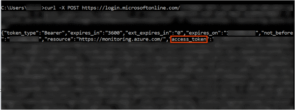

# Send custom metrics for an Azure resource to the Azure Monitor metric store by using a REST API

This article shows you how to send custom metrics for Azure resources to the Azure Monitor metrics store via a REST API. After the metrics are in Azure Monitor, you can do all the things with them that you do with standard metrics. Examples are charting, alerting, and routing them to other external tools.  

>[!NOTE]  
>The REST API only permits sending custom metrics for Azure resources. To send metrics for resources in different environments or on-premises, you can use [Application Insights](../../azure-monitor/app/api-custom-events-metrics.md).    


## Create and authorize a service principal to emit metrics 

Create a service principal in your Azure Active Directory tenant by using the instructions found at [Create a service principal](../../active-directory/develop/howto-create-service-principal-portal.md). 

Note the following while you go through this process: 

- You can enter any URL for the sign-in URL.  
- Create a new client secret for this app.  
- Save the key and the client ID for use in later steps.  

Give the app created as part of step 1, Monitoring Metrics Publisher, permissions to the resource you wish to emit metrics against. If you plan to use the app to emit custom metrics against many resources, you can grant these permissions at the resource group or subscription level. 

## Get an authorization token
Open a command prompt and run the following command:

```shell
curl -X POST https://login.microsoftonline.com/<yourtenantid>/oauth2/token -F "grant_type=client_credentials" -F "client_id=<insert clientId from earlier step>" -F "client_secret=<insert client secret from earlier step>" -F "resource=https://monitoring.azure.com/"
```
Save the access token from the response.



## Emit the metric via the REST API 

1. Paste the following JSON into a file, and save it as **custommetric.json** on your local computer. Update the time parameter in the JSON file: 
    
    ```json
    { 
        "time": "2018-09-13T16:34:20", 
        "data": { 
            "baseData": { 
                "metric": "QueueDepth", 
                "namespace": "QueueProcessing", 
                "dimNames": [ 
                  "QueueName", 
                  "MessageType" 
                ], 
                "series": [ 
                  { 
                    "dimValues": [ 
                      "ImagesToProcess", 
                      "JPEG" 
                    ], 
                    "min": 3, 
                    "max": 20, 
                    "sum": 28, 
                    "count": 3 
                  } 
                ] 
            } 
        } 
    } 
    ``` 

1. In your command prompt window, post the metric data: 
   - **azureRegion**. Must match the deployment region of the resource you're emitting metrics for. 
   - **resourceID**.  Resource ID of the Azure resource you're tracking the metric against.  
   - **AccessToken**. Paste the token that you acquired previously.

     ```Shell 
     curl -X POST https://<azureRegion>.monitoring.azure.com/<resourceId>/metrics -H "Content-Type: application/json" -H "Authorization: Bearer <AccessToken>" -d @custommetric.json 
     ```
1. Change the timestamp and values in the JSON file. 
1. Repeat the previous two steps a few times, so you have data for several minutes.

## Troubleshooting 
If you receive an error message with some part of the process, consider the following troubleshooting information:

1. You can't issue metrics against a subscription or resource group as your Azure resource. 
1. You can't put a metric into the store that's over 20 minutes old. The metric store is optimized for alerting and real-time charting. 
2. The number of dimension names should match the values and vice versa. Check the values. 
2. You might be emitting metrics against a region that doesn’t support custom metrics. See [supported regions](../../azure-monitor/platform/metrics-custom-overview.md#supported-regions). 


## View your metrics 

1. Sign in to the Azure portal. 

1. In the left-hand menu, select **Monitor**. 

1. On the **Monitor** page, select **Metrics**. 

    

1. Change the aggregation period to **Last 30 minutes**.  

1. In the **resource** drop-down menu, select the resource you emitted the metric against.  

1. In the **namespaces** drop-down menu, select **QueueProcessing**. 

1. In the **metrics** drop-down menu, select **QueueDepth**.  

 
## Next steps
- Learn more about [custom metrics](../../azure-monitor/platform/metrics-custom-overview.md).

